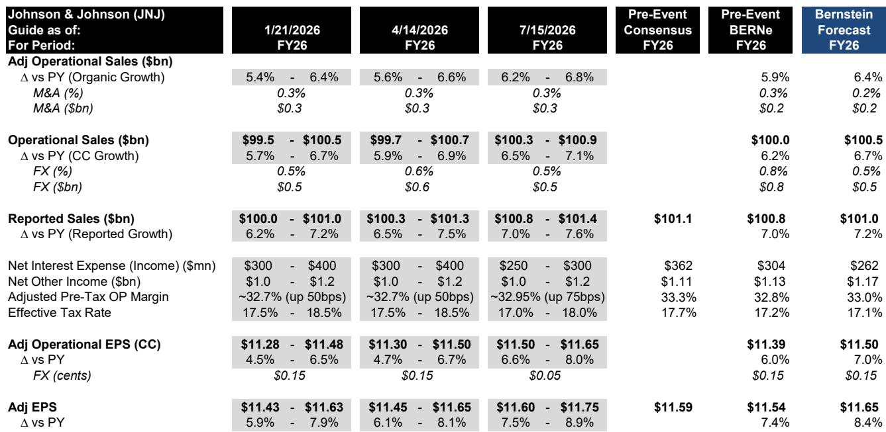
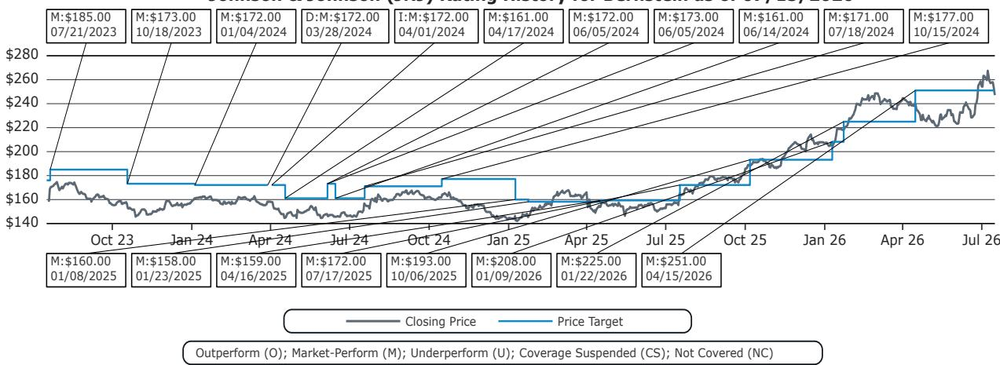
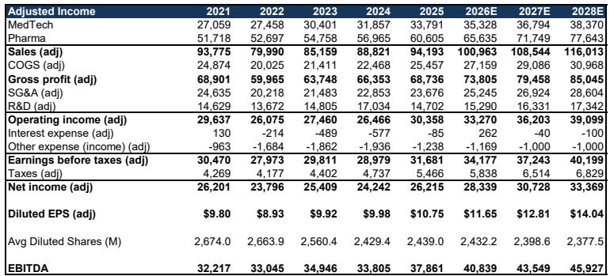

# Johnson & Johnson's 2Q26 Results Expose a False Divide Between Hospital Headlines and MedTech Reality

The most important signal from Johnson & Johnson's 2Q26 earnings is not the 5.7% organic growth or the 1.1% revenue beat. It is the company's categorical rejection of the narrative that U.S. hospital procedure volumes are decelerating. When HCA pre-released second-quarter revenue the day before JNJ's report, highlighting a 2.3% decline in same-facility inpatient surgery volumes and a 3.4% decline in outpatient surgery volumes, the market braced for confirmation of a utilization slowdown. JNJ provided the opposite. Management stated plainly that it sees no sign of a slowdown in underlying procedure markets, no impact from declining ACA enrollment or Medicaid cuts, and in fact forecasts acceleration from the first half to the second half of 2026 across all four of its MedTech businesses. This divergence between hospital operator commentary and medical device manufacturer data is the central strategic tension observers must resolve.

The stakes are high. JNJ is on track to surpass $100 billion in annual revenue for the first time in 2026, and management expressed confidence in its line of sight to double-digit revenue growth by the end of the decade. The company raised full-year 2026 adjusted operational sales growth guidance by 40 basis points at the midpoint to 6.2%-6.8%, and adjusted EPS guidance by roughly 13 cents to $11.60-$11.75. These are not defensive moves from a company bracing for headwinds. They are deliberate signals that JNJ sees its own portfolio momentum, and the underlying market, as stronger than consensus believed.

Yet the quarter contained a real MedTech blemish. Abiomed sales declined 2% year-over-year, missing consensus by 14%, driven by a drop in U.S. procedure volumes following the March readout of the CHIP-BCIS3 trial. This single miss dragged Cardiovascular segment performance 5.4% below consensus and offset small beats in Orthopaedics, Surgery, and Vision. The question for observers is whether Abiomed represents a company-specific setback or a canary for broader elective procedure softness. JNJ's answer was unambiguous: the Abiomed miss is a clinical-data event, not a demand signal. The company expects Abiomed to rebound toward the end of 2026 as PROTECT IV data becomes available, and it characterized the rest of its MedTech portfolio as performing in line with healthy market trends.

## The MedTech procedure narrative is being driven by hospital mix, not patient demand

The apparent contradiction between HCA's falling surgery volumes and JNJ's confident outlook is resolvable when one examines whose procedures are being counted. HCA operates a large portfolio of community hospitals where elective, discretionary procedures dominate the surgical mix. JNJ's MedTech business spans Orthopaedics, Surgery, Vision, and Cardiovascular, with significant exposure to higher-acuity, less discretionary categories such as trauma, spine, and cardiac intervention. When JNJ management states that its business is "diversified across a broad range of categories, many of which are less dependent on discretionary elective procedures," it is making a structural argument about portfolio composition, not a tactical one about quarterly timing.

This distinction matters because it implies that hospital-level utilization data may be misleading observers about the true health of medical device end-markets. A decline in same-facility outpatient surgery volumes at a hospital chain dominated by elective orthopaedic and general surgery cases does not necessarily signal weakness in interventional cardiology, cardiac rhythm management, or trauma reconstruction. JNJ's guidance for second-half acceleration in all four MedTech segments suggests that the company expects its own product cycles and market positions to overcome whatever macro softness may exist in the most discretionary corners of the procedure universe.

The data supports this interpretation. JNJ's Orthopaedics segment beat consensus by 1.4% in the quarter, Surgery beat by 1.3%, and Vision beat by 1.5%. The U.S. Knees miss of 3% and U.S. Spine miss of 1% that JNJ disclosed were attributed not to utilization pressure but to specific market dynamics: a softening trend in JNJ's higher-value revision knees business and competitive pressures in U.S. Spine. These are company-specific and segment-specific issues, not evidence of a systemic demand problem. Observers who aggregate hospital operator commentary with MedTech earnings risk conflating two different data sets that measure different things.

## Innovative Medicine is carrying the earnings story, and its growth drivers are becoming more concentrated

Pharma remains the engine of JNJ's earnings power, and 2Q26 reinforced that the segment's trajectory is increasingly defined by a small number of high-growth assets. Innovative Medicine grew 6.9% organic to $16.4 billion, beating consensus by approximately 2%, despite a 760-basis-point headwind from declining Stelara sales. TREMFYA delivered 71% growth, supported by the inflammatory bowel disease indication that has expanded its addressable market. Oncology sales grew 16.1% worldwide to $7.41 billion, led by DARZALEX at $4.2 billion with 17.6% year-over-year growth.

The most strategically significant data point, however, is the early trajectory of ICOTYDE and INLEXZO. ICOTYDE, approved by the FDA in March 2026, has already reached 18,000 prescriptions written for 11,000 patients, with 6,000 unique prescribers. More than 50% of those prescribers are advanced practice providers, indicating that ICOTYDE is expanding the prescriber base beyond traditional dermatology specialists into primary care. INLEXZO, approved for bladder-sparing therapy in BCG-unresponsive non-muscle invasive bladder cancer, more than doubled sales sequentially from first quarter to second quarter, and one in three eligible new patients are now starting on the regimen, up from one in four in the prior quarter.

These numbers matter because they address the single largest question hanging over JNJ's pharma segment: what replaces Stelara? The answer is not any single drug but a portfolio of assets that are earlier in their life cycles, addressing larger markets, and benefiting from first-in-class or best-in-class positioning. JNJ's ambition to become the number one oncology company by 2030, with oncology sales projected to exceed $50 billion against current consensus of $48.2 billion, is contingent on these launches sustaining their momentum. The second-quarter data suggests they are on track, but the concentration risk is real. If ICOTYDE or INLEXZO stumble on safety, access, or competition, the pharma growth story narrows considerably.

## The guidance raise reflects operational confidence, but the phasing details reveal where risk resides

JNJ raised full-year 2026 adjusted operational sales growth guidance by 40 basis points at the midpoint, from a prior range of 5.6%-6.6% to 6.2%-6.8%. Adjusted EPS guidance moved from $11.45-$11.65 to $11.60-$11.75. The raise is modest in absolute terms but significant in its implications. It signals that management sees the first-half performance as sustainable and the second-half setup as favorable.

The phasing details are instructive. JNJ explicitly expects second-half growth to be stronger than first-half growth in both Innovative Medicine and MedTech. For pharma, the second-half acceleration is driven by emerging growth in ICOTYDE, INLEXZO, and TREMFYA with the IBD indication, partially offset by generic competition for OPSUMIT in the second half in the U.S. and SIMPONI in the first half in the EU, with potential U.S. generic entry in the second half. For MedTech, the second-half acceleration is expected from continued strength in Orthopaedics, Surgery, and Vision, along with a recovery in Cardiovascular as Abiomed rebounds and China inventory-related headwinds in electrophysiology subside.

The risk in this phasing is that it assumes a relatively smooth execution path across multiple moving parts. Abiomed must recover from its CHIP-BCIS3-related procedure volume decline. The China volume-based procurement rounds, which JNJ expects to be heavier in the second half, must not cut deeper than anticipated. The competitive dynamics in U.S. Spine and U.S. Knees must not deteriorate further. And the generic erosion of OPSUMIT and SIMPONI must remain within the bounds JNJ has modeled. Any one of these variables could create a second-half miss that would make the guidance raise look premature.

There is also a more subtle risk embedded in the calendar. JNJ benefits from a 53rd week in fiscal 2026, worth approximately 100 basis points to full-year sales growth and impacting the fourth quarter. This is a genuine tailwind, but it creates a comparison base that will be difficult to replicate in 2027. Observers who extrapolate the 2026 growth rate forward without adjusting for the extra week risk overestimating the underlying trend.

## A decision framework for evaluating JNJ's risk-reward at current valuation

JNJ trades at 21.2 times forward adjusted EPS on fiscal 2026 estimates, with a dividend yield of 2.2% and a 52-week return of 59.2% versus the S&P 500's 21.3%. The stock has already repriced significantly, and the question is whether the current valuation adequately reflects the opportunities and risks embedded in the second-half outlook.

A structured decision framework requires evaluating three independent dimensions: the pharma growth trajectory, the MedTech procedure narrative, and the earnings quality and capital allocation story. On pharma, the bull case depends on ICOTYDE and INLEXZO continuing their early adoption curves and on TREMFYA sustaining its IBD-driven momentum. The bear case depends on generic erosion of Stelara accelerating beyond the modeled 760-basis-point headwind, or on competitive launches in oncology or immunology that erode market share for DARZALEX or TREMFYA. The current data supports the bull case but does not prove it. The next two quarters of prescription data will be decisive.

On MedTech, the bull case depends on JNJ being correct that the hospital operator data is misleading and that underlying procedure demand remains healthy. The bear case depends on HCA being the leading indicator and JNJ's portfolio being insufficiently diversified to avoid the same utilization pressure once it broadens. The resolution of this debate will come not from JNJ's own earnings calls but from the cumulative data across the entire MedTech sector over the next two quarters. If competitors such as Medtronic, Boston Scientific, and Stryker report similar confidence in procedure trends, the hospital narrative will be discredited. If they confirm a slowdown, JNJ's second-half guidance will be at risk.

On earnings quality, the bull case rests on margin expansion from 32.5% adjusted operating margin in fiscal 2025 to 32.7% in fiscal 2026 and 33.3% in fiscal 2027, with return on invested capital rising from 20.5% to 22.3% over the same period. The bear case notes that adjusted pre-tax operating margin declined from 34.5% to 34.2% in the second quarter, with SG&A deleveraging 60 basis points on new product launch investment and MedTech margins compressing on tariffs and R&D spending. The margin trajectory is positive but fragile, and any revenue miss would create operating deleverage that could compress earnings more than proportionally.

7.02, based on a target P/E multiple of 19.5 times against forward Q5-Q8 EPS of $13.38. This is a reasonable but not compelling risk-reward for a stock that has already rerated substantially. The market appears to be pricing in a favorable resolution of the procedure narrative and continued pharma momentum, but leaving limited room for error. For observers who share JNJ's confidence in the second-half setup, the stock offers steady total return with below-average downside risk. For those who see the hospital operator data as a more reliable signal, the risk-reward is unattractive at current levels.

The most important analytical task for observers over the next six months is not to parse JNJ's own guidance but to triangulate procedure volume data across hospital operators, MedTech companies, and third-party claims databases. JNJ's second-quarter results have drawn a clear line in the sand. The company is betting that its portfolio, its product cycles, and its market position will deliver accelerating growth in the second half regardless of what hospital operators report. That bet will either be validated or refuted by the data, and the stakes for the stock are higher than the

*For informational purposes only. Portions may be generated, translated, summarized, or edited with AI assistance based on source materials and may contain omissions or errors. Please verify independently. This is not professional advice.*

For informational purposes only. Portions may be generated, translated, summarized, or edited with AI assistance based on source materials and may contain omissions or errors. Please verify independently. This is not professional advice.

