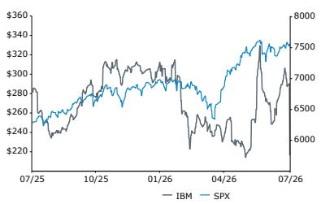
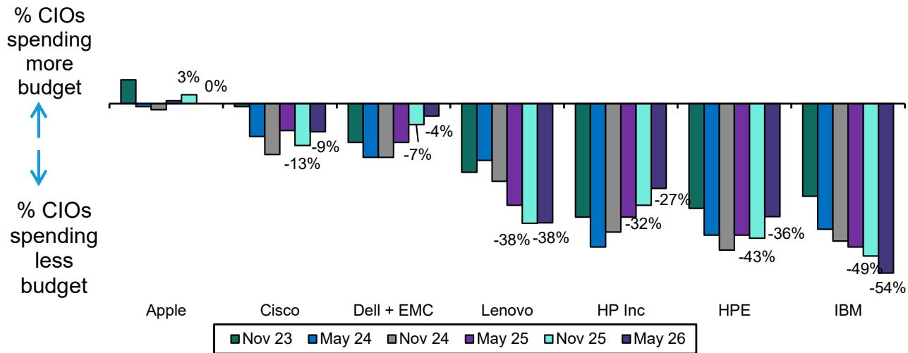
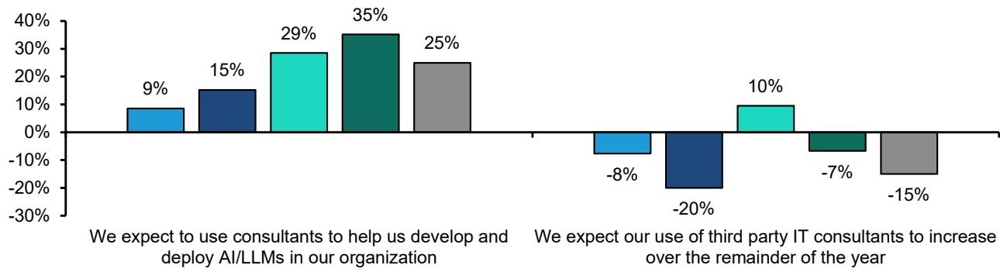
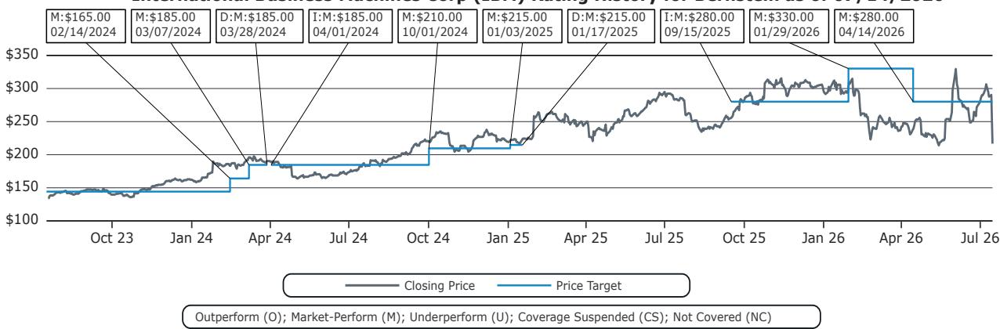

# U.S. IT Hardware

## International Business Machines Corp

Rating

Market-Perform

Price Target

IBM

280.00 USD

Mark C. Newman
+1 212 845 7822
mark.newman@bernsteinsg.com

April Li
+1 917 344 8339
april.li@bernsteinsg.com

Phoebe Sun
+1 917 344 8481
phoebe.sun@bernsteinsg.com

## IBM: What do CIOs say about Mainframes?

Yesterday before market open IBM pre-announced its FQ2'26 revenue and EPS below guidance, consensus and our expectations. We analyze selected results from our recent CIO survey published last night and what this means for IBM.

FQ2'26 preliminary revenue came in at \$17.2 billion, significantly below us and consensus at \$17.96 bn and \$17.86 bn respectively. The main drivers for the miss were unexpected weakness in mainframe (infrastructure revenue down 7% YoY) and transaction processing (dragging software growth to only +5% YoY). Preliminary EPS also came in light at \$2.93 vs. us and consensus at \$3.09 and \$3.03 respectively.

Mainframes and the associated software stack including Transaction Processing were the drivers of the miss. In the letter to investors, IBM cited changing buying patterns from clients toward servers, storage, and memory to secure supply-constrained infrastructure ahead of expected price increases. Our recent CIO survey shows 33% of CIOs planning to decrease MIPS capacity, a significant increase from 23% in Nov 25.

While IBM's preliminary software growth of \~5% YoY is below expectations, we view the software miss as largely concentrated in Transaction Processing rather than indicative of a meaningful slowdown across IBM's broader software portfolio.

According to our May 2026 CIO survey, the CIO spending intention at IBM shifted, with a survey-worst net 54% of CIOs planning to spend less with the company, compared to 49% in Nov 2025. This suggests further headwinds for IBM.  
Investment Implications  
We rate IBM Market-Perform, TP unchanged at \$280 (20x FY27 EPS of \$13.93)

<table><tr><td>Adjusted EPS</td><td>F25A</td><td>F26E</td><td>F27E</td><td>Financials</td><td>F25A</td><td>F26E</td><td>F27E</td><td>CAGR</td></tr><tr><td>IBM (USD)</td><td>11.58</td><td>12.35</td><td>13.93</td><td>Revenues (M)</td><td>67,527</td><td>71,975</td><td>75,604</td><td>--</td></tr><tr><td></td><td></td><td></td><td></td><td>Operating Margin (%)</td><td>--</td><td>--</td><td>--</td><td>--</td></tr><tr><td></td><td></td><td></td><td></td><td>Cost of Goods Sold (M)</td><td>(27,343)</td><td>(28,771)</td><td>(29,280)</td><td>--</td></tr></table>

<table><tr><td>Close Date</td><td>14 Jul 2026</td></tr><tr><td>IBM Close Price (USD)</td><td>217.07</td></tr><tr><td>Price Target (USD)</td><td>280.00</td></tr><tr><td>Upside/(Downside)</td><td>29%</td></tr><tr><td>52-Week Range</td><td>332.46/212.34</td></tr><tr><td>SPX</td><td>7,543.59</td></tr><tr><td>FYE</td><td>Dec</td></tr><tr><td>Div Yield</td><td>3.1%</td></tr><tr><td>Market Cap (USD) (M)</td><td>204,021</td></tr><tr><td>EV (USD) (M)</td><td>262,121</td></tr></table>

<table><tr><td>Performance</td><td>YTD</td><td>1M</td><td>6M</td><td>12M</td></tr><tr><td>Absolute (%)</td><td>(26.7)</td><td>(19.2)</td><td>(27.1)</td><td>(23.2)</td></tr><tr><td>SPX (%)</td><td>10.2</td><td>1.5</td><td>8.9</td><td>20.3</td></tr><tr><td>Relative (%)</td><td>(36.9)</td><td>(20.7)</td><td>(36.1)</td><td>(43.6)</td></tr></table>

Source: Bloomberg, Bernstein estimates and analysis.

Price Performance, 1YR  

<table><tr><td>Valuation Metrics</td><td>F25A</td><td>F26E</td><td>F27E</td></tr><tr><td>Adjusted P/E (x)</td><td>18.8</td><td>17.6</td><td>15.6</td></tr><tr><td>REL P/E Adjusted (x)</td><td>NA</td><td>NA</td><td>NA</td></tr><tr><td>PEG Reported (x)</td><td>1.5</td><td>2.6</td><td>1.2</td></tr><tr><td>Reported P/E (x)</td><td>18.8</td><td>17.6</td><td>15.6</td></tr><tr><td>REL P/E Reported (x)</td><td>NA</td><td>NA</td><td>NA</td></tr><tr><td>EV/FCF (x)</td><td>17.1</td><td>16.7</td><td>12.9</td></tr><tr><td>EV/EBITDA (x)</td><td>13.3</td><td>12.8</td><td>11.8</td></tr><tr><td>EV/EBIT (x)</td><td>17.9</td><td>16.5</td><td>14.7</td></tr></table>

## DETAILS

Yesterday before market open IBM pre-announced its FQ2'26 revenue and EPS below guidance, consensus and our expectations. We analyze selected results from our recent CIO survey published last night and what this means for IBM.

FQ2'26 preliminary revenue came in at \$17.2billion, significantly below us and consensus at \$17.96bn and \$17.86bn respectively. The main drivers for the miss were unexpected weakness in mainframe (infrastructure revenue down 7% YoY) and transaction processing (dragging software growth to only +5% YoY), which are both directly related. Preliminary EPS also came in light at \$2.93 vs. us and consensus at \$3.09 and \$3.03 respectively.

Mainframes and the associated software stack including Transaction Processing were the drivers of the miss. In the letter to investors, IBM cited changing buying patterns from clients toward servers, storage, and memory to secure supply-constrained infrastructure ahead of expected price increases. Our recent CIO survey shows 33% of CIOs planning to decrease MIPS capacity over the next five years, a significant increase from 23% in Nov 25.

For consulting, the preliminary revenue came in at roughly \$5.3bn, flat YoY. Based on the May 26 CIO survey, there could be further headwinds in consulting, since a net - 15% of CIOs expect the use of third party IT consultants to increase in the remainder of the year, so it appears that CIOs are pivoting away from consultants.

While IBM's preliminary software growth of \~5% appears below expectations versus expectations, management made it clear that the shortfall was driven primarily by Transaction Processing associated with weaker-than-expected Z17 performance rather than broad-based software deterioration. In contrast, Red Hat is still expected to deliver approximately 11% growth, which remains healthy. As a result, we view the software miss as largely concentrated in the more cyclical Transaction Processing business rather than indicative of a meaningful slowdown across IBM's broader software portfolio.

According to our May 2026 CIO survey, the CIO spending intention at IBM shifted, with a survey-worst net 54% of CIOs planning to spend less with the company, compared to 49% in Nov 2025. This suggests further headwind for IBM as investors move away from traditional IT spending such as mainframe as well as consulting, and towards Gen AI products as well as cybersecurity.

EXHIBIT 1: IBM prelim Q2 FY26 vs Bernstein vs Consensus vs Q2 FY25

<table><tr><td></td><td>FY25 Q2</td><td>FY26 Q2 (Prelim)</td><td>YoY%</td><td>Bernstein</td><td>Delta</td><td>Consensus</td><td>Delta</td></tr><tr><td>Total Revenue</td><td>$16,970</td><td>$17,200</td><td>1%</td><td>$17,961</td><td>-4%</td><td>$17,858</td><td>-4%</td></tr><tr><td>Software Revenue</td><td>$7,386</td><td>$7,785</td><td>5%</td><td>$8,142</td><td>-4%</td><td>$8,152</td><td>-5%</td></tr><tr><td>Consulting Revenue</td><td>$5,322</td><td>$5,338</td><td>0%</td><td>$5,508</td><td>-3%</td><td>$5,433</td><td>-2%</td></tr><tr><td>Infrastructure Revenue</td><td>$4,128</td><td>$3,843</td><td>-7%</td><td>$4,118</td><td>-7%</td><td>$4,021</td><td>-4%</td></tr><tr><td>Non-GAAP GPM</td><td>60.1%</td><td>59.4%</td><td>-72bps</td><td>60.0%</td><td>-61bps</td><td>60.1%</td><td>-71bps</td></tr><tr><td>Non-GAAP PTI margin</td><td>18.8%</td><td>19.2%</td><td>37bps</td><td>19.3%</td><td>-9bps</td><td>19.1%</td><td>12bps</td></tr><tr><td>Non-GAAP EPS</td><td>$2.80</td><td>$2.93</td><td>5%</td><td>$3.09</td><td>-5%</td><td>$3.03</td><td>-3%</td></tr></table>

Source: Bernstein estimates and analysis, Bloomberg, Company reports

EXHIBIT 2: Net % of CIOs Planning to Spend More/Less with Each Hardware Vendor (Over the Next 5 Years)  
  
Source: Bernstein CIO Surveys

EXHIBIT 3: CIO Perceptions of Mainframes (% Agreeing)  
  
Source: Bernstein CIO Surveys

EXHIBIT 4: CIO Perspectives on 3rd Party IT Consulting/SI Firms Over Time (% agreeing minus % disagreeing)  
  
■ May 2024 ■ Nov 2024 ■ May 2025 ■ Nov 2025 ■ May 2026

Source: Bernstein CIO Surveys  
EXHIBIT 5: Weighted % of CIOs Planning Increase/Decrease in IT spending by Category  
  
Source: Bernstein CIO Surveys

## APPENDIX - FINANCIAL FORECASTS

## EXHIBIT 6: IBM Income Statement

<table><tr><td>Unit: $, MillionsIBM Income Statement</td><td>FY2024</td><td>FY2025</td><td>FY2026</td><td>FY2027</td><td>FY2028</td><td>FY25 Q4</td><td>FY26 Q1</td><td>FY26 Q2E</td><td>FY26 Q3E</td><td>FY26 Q4E</td></tr><tr><td colspan="11">Pro Forma Non-GAAP Income Statement</td></tr><tr><td>Revenue</td><td>62,754</td><td>67,527</td><td>71,975</td><td>75,604</td><td>80,769</td><td>19,686</td><td>15,917</td><td>17,961</td><td>17,240</td><td>20,858</td></tr><tr><td>COGS</td><td>26,479</td><td>27,343</td><td>28,771</td><td>29,280</td><td>30,524</td><td>7,527</td><td>6,730</td><td>7,182</td><td>6,929</td><td>7,930</td></tr><tr><td>Gross Profit</td><td>36,275</td><td>40,184</td><td>43,204</td><td>46,324</td><td>50,245</td><td>12,159</td><td>9,187</td><td>10,778</td><td>10,311</td><td>12,928</td></tr><tr><td>Margin %</td><td>57.8%</td><td>59.5%</td><td>60.0%</td><td>61.3%</td><td>62.2%</td><td>61.8%</td><td>57.7%</td><td>60.0%</td><td>59.8%</td><td>62.0%</td></tr><tr><td>SG&amp;A</td><td>18,529</td><td>18,706</td><td>18,919</td><td>19,805</td><td>21,158</td><td>5,100</td><td>4,682</td><td>4,746</td><td>4,746</td><td>4,746</td></tr><tr><td>RD&amp;E</td><td>7,479</td><td>8,312</td><td>8,683</td><td>9,056</td><td>9,675</td><td>2,187</td><td>2,173</td><td>2,170</td><td>2,170</td><td>2,170</td></tr><tr><td>I/P &amp; Custom Development Income</td><td>(996)</td><td>(964)</td><td>(928)</td><td>(1,052)</td><td>(1,124)</td><td>(277)</td><td>(172)</td><td>(252)</td><td>(252)</td><td>(252)</td></tr><tr><td>Other (Income) / Expense</td><td>(1,656)</td><td>(517)</td><td>672</td><td>670</td><td>853</td><td>(74)</td><td>(98)</td><td>142</td><td>(391)</td><td>1,019</td></tr><tr><td>Interest Expense</td><td>1,712</td><td>1,935</td><td>2,000</td><td>2,123</td><td>2,268</td><td>478</td><td>473</td><td>509</td><td>509</td><td>509</td></tr><tr><td>Pre-tax Income</td><td>11,207</td><td>12,712</td><td>13,859</td><td>15,722</td><td>17,415</td><td>4,745</td><td>2,129</td><td>3,464</td><td>3,529</td><td>4,737</td></tr><tr><td>Margin %</td><td>17.9%</td><td>18.8%</td><td>19.3%</td><td>20.8%</td><td>21.6%</td><td>24.1%</td><td>13.4%</td><td>19.3%</td><td>20.5%</td><td>22.7%</td></tr><tr><td>Tax</td><td>1,523</td><td>1,719</td><td>2,067</td><td>2,358</td><td>2,612</td><td>438</td><td>308</td><td>520</td><td>529</td><td>711</td></tr><tr><td>Net Income from Continuing Ops</td><td>9,684</td><td>10,993</td><td>11,791</td><td>13,364</td><td>14,803</td><td>4,307</td><td>1,821</td><td>2,944</td><td>3,000</td><td>4,026</td></tr><tr><td>Margin %</td><td>15.4%</td><td>16.3%</td><td>16.4%</td><td>17.7%</td><td>18.3%</td><td>21.9%</td><td>11.4%</td><td>16.4%</td><td>17.4%</td><td>19.4%</td></tr><tr><td>Diluted EPS</td><td>$ 10.32</td><td>$ 11.58</td><td>$ 12.35</td><td>$ 13.93</td><td>$ 15.35</td><td>$ 4.52</td><td>$ 1.91</td><td>$ 3.09</td><td>$ 3.14</td><td>$ 4.21</td></tr><tr><td>Dividend per share</td><td>$ 6.67</td><td>$ 6.71</td><td>$ 6.75</td><td>$ 6.79</td><td>$ 6.83</td><td>$ 1.68</td><td>$ 1.68</td><td>$ 1.69</td><td>$ 1.69</td><td>$ 1.69</td></tr><tr><td>Average Share (Diluted)</td><td>938.2</td><td>949.6</td><td>954.4</td><td>959.5</td><td>964.6</td><td>952.4</td><td>952.1</td><td>953.4</td><td>954.7</td><td>956.0</td></tr><tr><td colspan="11">Growth %</td></tr><tr><td>Revenue</td><td>1.4%</td><td>7.6%</td><td>6.6%</td><td>5.0%</td><td>6.8%</td><td>12.1%</td><td>9.5%</td><td>5.8%</td><td>5.6%</td><td>6.0%</td></tr><tr><td>Gross Profit</td><td>3.8%</td><td>10.8%</td><td>7.5%</td><td>7.2%</td><td>8.5%</td><td>14.4%</td><td>11.6%</td><td>5.6%</td><td>7.5%</td><td>6.3%</td></tr><tr><td>SG&amp;A</td><td>3.2%</td><td>1.0%</td><td>1.1%</td><td>4.7%</td><td>6.8%</td><td>11.8%</td><td>3.3%</td><td>1.4%</td><td>8.0%</td><td>(7.0%)</td></tr><tr><td>R&amp;D</td><td>10.4%</td><td>11.1%</td><td>4.5%</td><td>4.3%</td><td>6.8%</td><td>11.2%</td><td>11.7%</td><td>3.5%</td><td>4.2%</td><td>(0.8%)</td></tr><tr><td>Opex</td><td>1.8%</td><td>9.6%</td><td>6.8%</td><td>4.3%</td><td>7.3%</td><td>16.6%</td><td>8.7%</td><td>4.4%</td><td>3.4%</td><td>10.5%</td></tr><tr><td>Pre-tax Income</td><td>8.7%</td><td>13.4%</td><td>9.0%</td><td>13.4%</td><td>10.8%</td><td>11.1%</td><td>22.5%</td><td>8.4%</td><td>16.4%</td><td>(0.2%)</td></tr><tr><td>Net Income</td><td>9.2%</td><td>13.5%</td><td>7.3%</td><td>13.3%</td><td>10.8%</td><td>16.7%</td><td>20.0%</td><td>11.0%</td><td>19.2%</td><td>(6.5%)</td></tr><tr><td>Diluted EPS</td><td>7.5%</td><td>12.2%</td><td>6.7%</td><td>12.7%</td><td>10.2%</td><td>15.5%</td><td>19.2%</td><td>10.4%</td><td>18.5%</td><td>(6.9%)</td></tr><tr><td>Estimated Currency Impact</td><td>(1.1%)</td><td>1.2%</td><td>0.7%</td><td>-</td><td>-</td><td>1.8%</td><td>3.0%</td><td>-</td><td>-</td><td>-</td></tr><tr><td>Implied CC Growth</td><td>2.5%</td><td>6.4%</td><td>5.9%</td><td>5.0%</td><td>6.8%</td><td>10.3%</td><td>6.5%</td><td>5.8%</td><td>5.6%</td><td>6.0%</td></tr></table>

Source: Company reports, Bernstein estimates and analysis

## BERNSTEIN TICKER TABLE

<table><tr><td rowspan="2"></td><td colspan="4">14 Jul 2026</td><td>TTM</td><td colspan="4">Adjusted EPS</td><td colspan="3">Adjusted P/E (x)</td></tr><tr><td>Rating</td><td>Cur</td><td>Closing Price</td><td>Price Target</td><td>Rel. Perf.</td><td>Cur</td><td>2025A</td><td>2026E</td><td>2027E</td><td>2025A</td><td>2026E</td><td>2027E</td></tr><tr><td>IBM (IBM)</td><td>M</td><td>USD</td><td>217.07</td><td>280.00</td><td>(43.6)%</td><td>USD</td><td>11.58</td><td>12.35</td><td>13.93</td><td>18.8</td><td>17.6</td><td>15.6</td></tr><tr><td>SPX</td><td></td><td></td><td>7,543.59</td><td></td><td></td><td></td><td></td><td></td><td></td><td></td><td></td><td></td></tr></table>

O - Outperform, M - Market-Perform, U - Underperform, NR - Not Rated, CS - Coverage Suspended  
Source: Bloomberg, Bernstein estimates and analysis.

## I. REQUIRED DISCLOSURES

References to "Bernstein" or the "Firm" in these disclosures relate to the following entities: Bernstein Institutional Services LLC (April 1, 2024 onwards), Bernstein & Co., LLC (pre April 1, 2024), Bernstein Autonomous LLP, BSG France S.A. (April 1, 2024 onwards), Bernstein (Hong Kong) Limited 盛博香港有限公司, Bernstein (Canada) Limited, Bernstein (India) Private Limited (SEBI registration no. INH000006378), Bernstein (Singapore) Private Limited, Bernstein Japan KK (サンフォード・C・バーンスタイン株式会社) and analysts employed by SG Africa Technologies & Services to produce Bernstein under a Global Services Agreement in place between Bernstein and SG.

Bernstein is part of a joint venture between SG (SG) and AllianceBernstein, L.P. (AB). Unless specifically noted otherwise, for purposes of these disclosures, references to Bernstein's “affiliates” relate to both SG and AB and their respective affiliates.

## VALUATION METHODOLOGY

## International Business Machines Corp

We value IBM at 20x 2027E EPS of \$13.93, which gives our target price of \$280/share.

## RISKS

## International Business Machines Corp

Two of the biggest risks on IBM and to our price target could be risks to both the upside and downside: 1) The quantum pureplays have historically been very newsflow driven - as quantum becomes a bigger part of IBM's story, there is risk that IBM could similarly become more newsflow driven, and 2) IBM's small-model approach to AI is a key uncertainty, and could drive either upside or downside as IBM navigates the AI wave. A further downside risk is that 3) Weak consulting bookings presage broader weakness in the consulting business.

## RATINGS DEFINITIONS, BENCHMARKS AND DISTRIBUTION

## EQUITY RATINGS DEFINITIONS

## Bernstein brand

The Bernstein brand rates stocks based on forecasts of relative performance for the next 12 months versus the S&P 500 for stocks listed on the U.S. and Canadian exchanges, versus the Bloomberg Europe Developed Markets Large and Mid Cap Price Return Index EUR (EDME) for stocks listed on the European exchanges and emerging markets exchanges outside of the Asia Pacific region, versus the Bloomberg Japan Large and Mid Cap Price Return Index USD (JPL) for stocks listed on the Japanese exchanges, and versus the Bloomberg Asia ex-Japan Large and Mid Cap Price Return Index (ASIAX) for stocks listed on the Asian (ex-Japan) exchanges -unless otherwise specified.

The Bernstein brand has three categories of ratings:

\- Outperform: Stock will outpace the market index by more than 15 pp

• Market-Perform: Stock will perform in line with the market index to within +/-15 pp

• Underperform: Stock will trail the performance of the market index by more than 15 pp

Coverage Suspended: Coverage of a company under the Bernstein brand has been suspended. Ratings and price targets are suspended temporarily, are no longer current, and should therefore not be relied upon.

Not Rated: A rating assigned when the stock cannot be accurately valued, or the performance of the company accurately predicted, at the present time. The covering analyst may continue to publish research reports on the company to update investors on events and developments.

Not Covered (NC) denotes companies that are not under coverage.

Bernstein brand stock ratings are based on a 12-month time horizon.

## Autonomous brand – common stocks

The Autonomous brand rates common stocks as indicated below. As our benchmarks we use the Bloomberg Europe 600 Financials Price Return Index (E600BK) and Bloomberg Europe Dev Mkt Financials Large and Mid Cap Price Ret Index EUR (EDMFI) index for developed European banks and Payments, the Bloomberg Europe 600 Insurance Price Return Index (E600IN) for European insurers, the S&P 500 and S&P Financials for US banks and Payments coverage, S5LIFE for US Insurance, the S&P Insurance Select Industry (SPSIINS) for US Non-Life Insurers coverage, and the Bloomberg Emerging Markets Financials Large, Mid and Small Cap Price Return Index (EMLSF) for emerging market banks and insurers and Payments. Ratings are stated relative to the sector (not the market).

The Autonomous brand has three categories of common stock ratings:

\- Outperform (OP): Stock will outpace the relevant index by more than 10 pp

\- Neutral (N): Stock will perform in line with the market index to within +/-10 pp

\- Underperform (UP): Stock will trail the performance of the relevant index by more than 10 pp

Coverage Suspended: Coverage of a company under the Autonomous research brand has been suspended. Ratings and price targets are suspended temporarily, are no longer current, and should therefore not be relied upon.

Not Rated: A rating assigned when the stock cannot be accurately valued, or the performance of the company accurately predicted, at the present time. The covering analyst may continue to publish research reports on the company to update investors on events and developments.

Those denoted as ‘Feature’ (e.g., Feature Outperform FOP, Feature Under Outperform FUP) are our core ideas.

Not Covered (NC) denotes companies that are not under coverage.

Autonomous brand common stock ratings are based on a 12-month time horizon.

## Autonomous brand – preferred stocks

The Autonomous brand has three categories of preferred stock ratings:

\- Outperform (OP): The total return of the preferred instrument is expected to outperform preferred securities of other issuers operating in similar sectors or rating categories over the next six months.

\- Neutral (N): The total return of the preferred instrument is expected to perform in line with preferred securities of other issuers operating in similar sectors or rating categories over the next six months.

\- Underperform (UP): The total return of the preferred instrument is expected to underperform preferred securities of other issuers operating in similar sectors or rating categories over the next six months.

Autonomous preferred stock ratings are based on a 6-month time horizon.

## AUTONOMOUS CREDIT RESEARCH

Where this report contains investment recommendations for credit instruments, as defined in article 3(1)(35) of the Market Abuse Regulation, the information below is presented to comply with its disclosure requirements.

The report may also include reference(s) to published opinions by other Autonomous or Bernstein analysts covering the equity securities of the issuer(s) referenced herein. Please note an investment recommendation for credit instruments published by the author(s) of this report may differ from the published view of the analyst covering equity securities for the issuer(s) contained in this report and vice versa.

## CREDIT RATINGS DEFINITIONS

The Autonomous brand has three categories of credit ratings:

\- Credit Outperform (C-OP): The total return of the Reference Credit Instrument is expected to outperform the credit spread of bonds of other issuers operating in similar sectors or rating categories over the next six months.

\- Credit Neutral (C-N): The total return of the Reference Credit Instrument is expected to perform in line with the credit spread of bonds of other issuers operating in similar sectors or rating categories over the next six months.

\- Credit Underperform (C-UP): The total return of the Reference Credit Instrument is expected to underperform the credit spread of bonds of other issuers operating in similar sectors or rating categories over the next six months.

Autonomous credit ratings are based on a 6-month time horizon.

A list of all investment recommendations produced by the author(s) of this report alongside credit ratings history are available upon request.

It is at the sole discretion of the Firm as to when to initiate, update and cease research coverage. The Firm has established, maintains and relies on information barriers to control the flow of information contained in one or more areas (i.e. the private side) within the Firm, and into other areas, units, groups or affiliates (i.e. public side) of the Firm

## DISTRIBUTION OF EQUITY RATINGS/INVESTMENT BANKING SERVICES

<table><tr><td>Equity Rating</td><td>Market Abuse Regulation (MAR) and FINRA Rating Category</td><td>Global Rating Distribution</td><td>Investment Banking Relationships*</td></tr><tr><td>Outperform</td><td>BUY</td><td>51.2%</td><td>15.3%</td></tr><tr><td>Market-Perform (Bernstein Brand) Neutral (Autonomous Brand)</td><td>HOLD</td><td>35.8%</td><td>16.2%</td></tr><tr><td>Underperform</td><td>SELL</td><td>13.1%</td><td>13.6%</td></tr></table>

\* These figures represent the percentage of companies within each equity rating category for which affiliates of Bernstein have provided investment banking services within the previous 12 months.
As of June 30, 2026. All figures are updated quarterly.

## PRICE CHARTS / RATINGS AND PRICE TARGET HISTORY

Prior to April 1, 2024, Bernstein & Co., LLC. issued the ratings and price target information in the graph(s) below for the following companies: International Business Machines Corp.

International Business Machines Corp (IBM) Rating History for Bernstein as of 07/14/2026  
  
All price target and closing price data in the chart(s) above are denominated in the currency noted in the Ticker Table of this report.

## CONFLICTS OF INTEREST

Bernstein and/or
