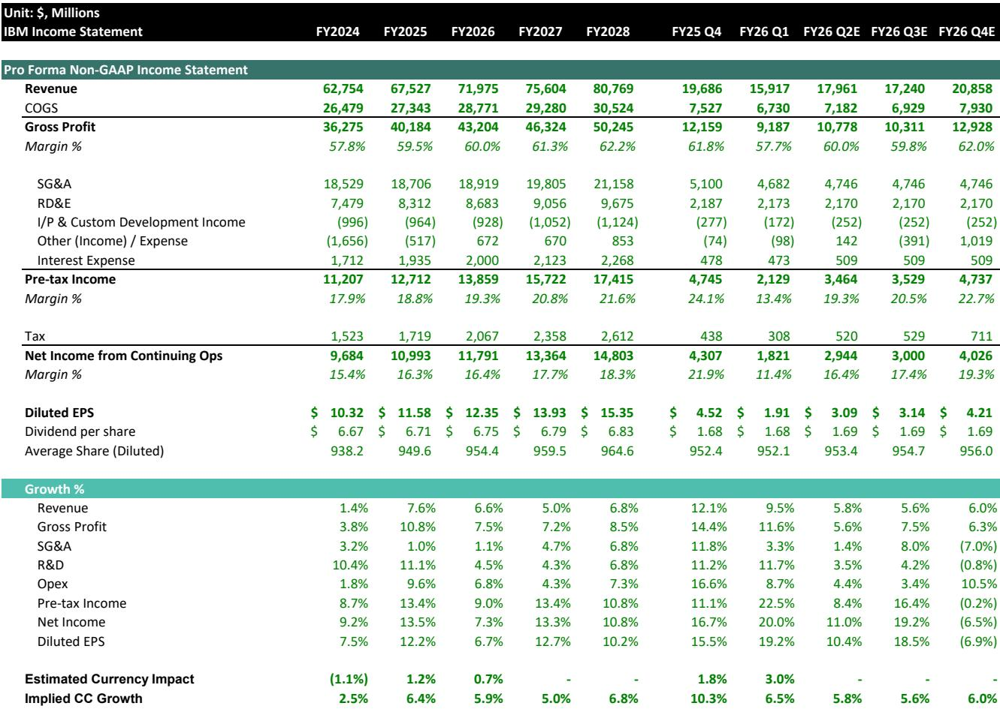
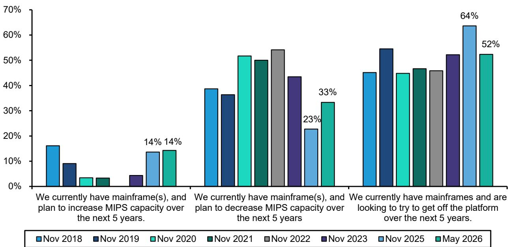
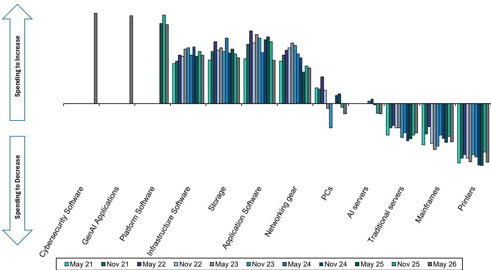

# IBM的主机业务下滑并非短期波动——这是一个结构性信号，值得研究人士关注

IBM 2026财年第二季度初步业绩低于预期——营收172亿美元，低于市场预期的178.6亿美元；每股收益2.93美元，低于预期的3.03美元。直接原因清晰：基础设施收入同比下降7%，相关的事务处理软件拖累整体软件增长仅达5%。但更重要的发现，隐藏在同期CIO调查数据中：这不是一个季度的库存调整。净54%的CIO计划在未来五年减少对IBM的支出，这是该调查历史上最差读数，且较六个月前的49%进一步恶化。业绩下滑是症状，CIO调查才是诊断。

时机很重要，因为市场此前愿意为IBM的软件和AI转型给予认可，将其估值定在约18.8倍历史盈利。这一倍数现在面临根本性考验。如果主机周期确实进入长期性下降而非暂时消化期，支撑该倍数的盈利基础将面临风险。问题不在于IBM下季度能否恢复——而在于公司核心客户基础是否正在结构性流失。

本文探讨为何主机疲软不仅仅是周期性的暂停，CIO调查如何揭示支出正从IBM传统优势领域转移，以及严谨的研究人士应如何利用这些信息。目标不是预测公司报价，而是为评估IBM在企业IT格局变化中的风险回报特征提供一个分析框架。

## 主机疲软反映买家行为转变，而不仅仅是供应约束

IBM管理层将基础设施收入下降归因于客户为应对预期价格上涨而提前采购服务器、存储和内存以锁定供应紧张的硬件。这一解释将业绩下滑定性为时间问题——客户在前期提前购买，造成暂时性空档。CIO调查数据与此解读相矛盾。2026年5月，33%的CIO报告计划在未来五年减少MIPS容量，较2025年11月的23%大幅上升。这不是采购周期的正常波动，而是对主机架构投入的有意缩减。

这一区别很重要。如果客户只是提前采购，减少容量的意愿不会加速——它会在供应约束缓解后稳定或逆转。六个月内有计划削减的CIO比例上升10个百分点，表明市场正在重新评估主机在数据中心中的角色。原本应重振客户基础的Z17周期，似乎未能引发预期的升级浪潮。基础设施收入下降7%，与客户群体不仅推迟采购、而且积极缩小主机规模的趋势一致。

对于研究人士而言，这意味着IBM的基础设施部门（上一财年约占总营收22%）可能进入多年收缩期。与之紧密关联的事务处理软件也将随之下降。管理层指出，软件业绩不及预期集中在事务处理领域而非广泛性问题，红帽继续以约11%的速度增长。这对软件研究者来说是一个有意义的区分，但并未改变算术：事务处理业务是高利润、经常性收入，且直接与主机客户基础挂钩。该领域的结构性下降将给整体软件利润率和增长率带来压力，即使红帽和其他混合云产品表现良好。

## CIO支出意向揭示资金正从IBM核心业务领域转移

2026年5月CIO调查的核心数据清晰：净54%的CIO计划在未来五年减少对IBM的支出。这是调查中所有供应商中最差读数，较2025年11月恶化5个百分点。背景来看，IBM历来是企业IT预算中的常客，尤其是在依赖主机可靠性的受监管行业。如此规模的净负值读数表明，CIO正在积极将预算从IBM传统产品类别转移。

调查还捕捉到咨询业务的相关趋势。初步咨询收入同比基本持平，为53亿美元，而前瞻展望更弱。净15%的CIO预计今年剩余时间内第三方IT咨询使用量将减少。这并非IBM特有的问题——咨询行业整体面临客户将更多工作内部化、优先考虑AI和网络安全实施而非传统系统集成的趋势。但对于将咨询定位为战略增长引擎和软件交叉销售载体的IBM而言，收入持平及负面情绪加剧了主机问题。咨询本应是通向新工作负载的桥梁；如果桥梁流量减少，软件迁移的故事就更难实现。

CIO调查还显示了资金的流向。计划增加IT支出的CIO加权比例集中在生成式AI产品和网络安全领域，而非传统基础设施或传统外包。IBM已通过Watsonx平台和专注于小型企业级AI模型做出回应，但调查数据表明，CIO尚未将这种兴趣转化为对IBM的增量支出。净支出意向读数捕捉了总体效应：即使IBM在AI领域获得份额，它在更大、更成熟的业务组合部分正在失去份额。

## 软件增长故事真实但狭窄，狭窄性带来集中风险

IBM 2026财年第二季度软件收入同比增长约5%，低于市场预期的约10%增长。管理层将缺口归因于事务处理业务，而红帽继续实现约11%的增长。对于关注软件叙事的研究人士来说，这是一个关键区分。业绩不及预期并非来自战略组合——而是来自传统、依赖主机的层面。

但这种区分是双向的。红帽约占IBM总软件收入的三分之一。剩余三分之二包括自动化、数据和AI、安全，以及事务处理业务。如果事务处理进入结构性下降——CIO关于主机容量的调查强烈表明如此——那么整体软件增长率将面临持续阻力。要抵消事务处理5%的下降，软件组合的其他部分需要以加速的速度增长。红帽11%的增长是健康的，但并未加速。自动化和AI领域需要实现中十几或更高的增长率，才能将整体软件增长维持在较高个位数。

风险不在于IBM的软件战略失败——而在于战略在狭窄范围内有效，而传统基础拖累整体表现。将IBM软件增长建模为高增长和低增长部分的简单加权平均的研究人士，必须考虑到低增长部分不仅仅是增长缓慢——它可能正在主动收缩。这改变了整个软件部门的终值假设。

## 评估IBM风险回报特征的分析框架

对于严谨的研究人士而言，问题不在于IBM是否是一家好公司，或它的AI战略最终是否会成功。问题在于当前估值是否补偿了2026财年第二季度业绩和CIO调查数据所揭示的结构性风险。一个严谨的框架需要三项评估。

首先，评估基准情景和下行情景下的收入轨迹。基准情景假设主机收入在Z17周期后稳定，事务处理以低个位数速度下降，红帽和其他战略软件以10-12%增长。在此情景下，总收入年增长4-6%，当前约17.6倍前瞻盈利的调整后市盈率对于一家成熟科技公司（股息率超过3%）是合理的。下行情景假设CIO调查具有预测性：主机容量下降加速，事务处理收入以中个位数速度下降，咨询收入因客户减少第三方支出而转为负值。在此情景下，总收入增长可能降至1-3%，盈利基础将因高利润传统收入被较低利润的软件订阅和咨询取代而压缩。

其次，评估利润率结构。IBM 2026财年第二季度非GAAP毛利率为59.4%，同比下降72个基点。利润率压缩部分源于组合变化：基础设施收入减少降低了高利润主机硬件和软件的贡献。如果组合变化加速，毛利率可能趋向57-58%，即使成本控制保持严格，也将对运营利润率构成压力。当前利润率结构假设一定水平的高利润事务处理收入，这可能不可持续。

第三，从相对角度考虑估值。IBM交易于15.6倍预计2027财年每股收益13.93美元，低于标普500倍数但高于许多传统IT同行。该倍数只有在市场相信软件故事完整且主机下降是周期性的情况下才能实现。CIO调查数据挑战了这一信念。在较低盈利基础上的15倍倍数将意味着报价更接近180美元，较当前水平存在显著下行空间。

## 企业IT支出的结构性转变是真正的故事，IBM站在了错误的一边

2026财年第二季度业绩不是恐慌的理由，但它们是重新评估的理由。CIO调查提供了一个比任何单季度盈利更可靠的前瞻信号。CIO正在减少主机容量、减少咨询参与、将预算重新分配给生成式AI和网络安全。IBM参与了这些增长领域，但其参与度尚不足以抵消核心业务的侵蚀。公司的小型模型AI战略和红帽组合是真正的资产，但不足以在短期内逆转支出意向趋势。

对于将IBM作为收益和价值持有的研究人士而言，3.1%的股息率提供了一个底线，但总回报将取决于盈利稳定性。盈利稳定性现在受到质疑。对于考虑新头寸的研究人士而言，风险回报偏向下行，直到CIO调查数据改善或IBM证明主机下降已触底。这两个条件目前都不存在。

最严谨的应对是将CIO调查视为领先指标，将业绩不及预期视为确认信号。如果数据继续恶化，市场最终会为结构性转变定价。调整定位的时机是在重新定价之前，而非之后。

*仅供参考。部分内容可能基于源材料通过AI辅助生成、翻译、总结或编辑，可能存在遗漏或错误。请独立核实。这不构成专业建议。*
