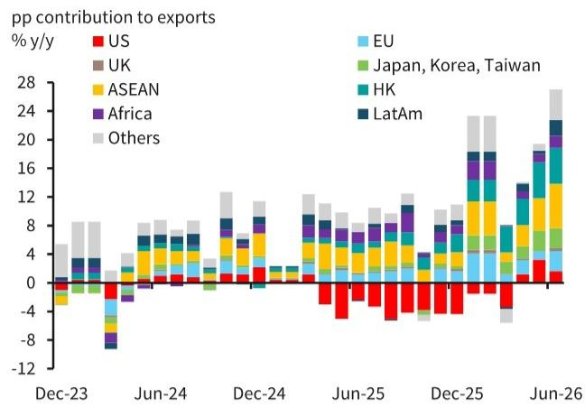
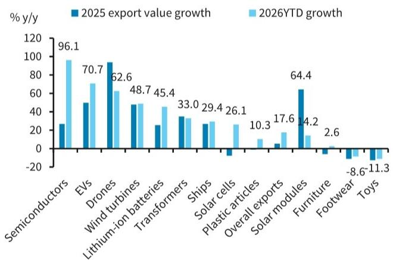
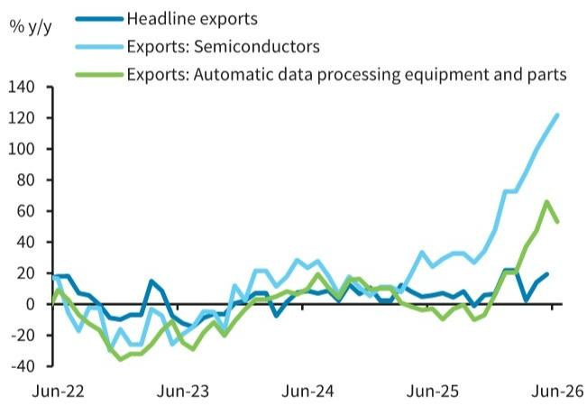
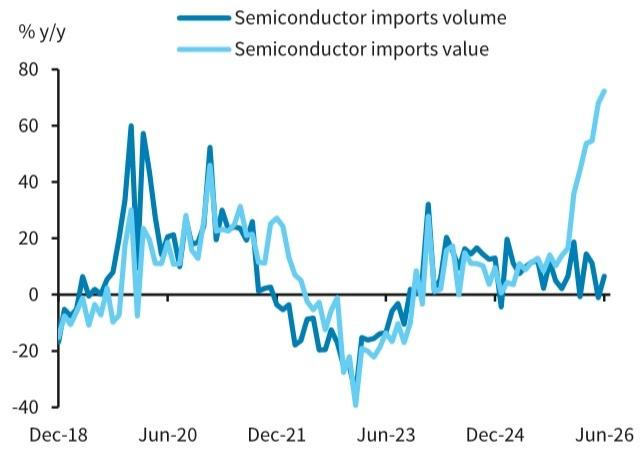
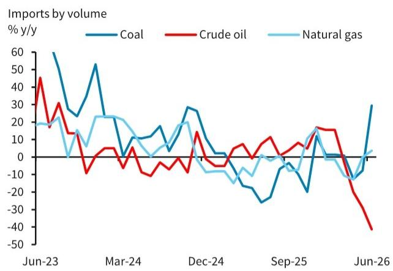
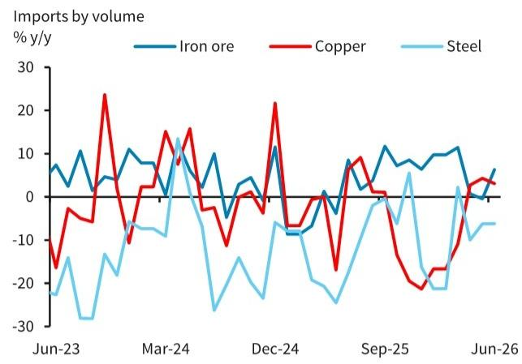

## 宏观观察

## 出口表现强劲但呈现分化

出口作为增长的重要引擎，表现超出预期，主要由人工智能相关和绿色科技产品带动。然而，低技术和劳动密集型产品则相对落后。这加剧了不同行业之间的分化。出口对劳动力市场的正向溢出效应有限。

感谢您在2026年Extel全球固定收益研究调查（除日本外亚洲经济类别）中的支持。

2026年EXTEL调查现已开启

请支持我们行业领先的分析师

立即投票

查看分析师

\- 6月：出口同比增长27%，进口同比增长36%（均以美元计）

\- 彭博共识：出口同比增长19%，进口同比增长26%

\- 5月：出口同比增长19.4%，进口同比增长27.4%（均以美元计）

6月出口增长升至27%，远超预期（彭博：19%），且较5月的19%有所加速。强劲的出口部分抵消了内需的减弱。我们预计出口将继续受益于全球人工智能资本支出投资周期和持续的全球能源转型，为增长提供重要缓冲。

然而，与宏观经济的整体分化类似，出口数据也指向K型复苏。出口的强劲势头继续由高科技产品，特别是人工智能相关和绿色科技产品驱动，而低技术和劳动密集型行业（约占出口总额的15%）则相对落后，鞋类和玩具的出口仍处于收缩状态。

周英科  
+852 2903 2653  
yingke.zhou@BARC.com  
BARC Bank, 香港

张颖  
+852 2903 2652  
ying.zhang3@BARC.com  
BARC Bank, 香港

常健  
+852 2903 2654  
jian.chang@BARC.com  
BARC Bank, 香港

我们认为，这种K型出口复苏正在加剧行业间的分化：半导体和电子等高科技行业利润上升、定价能力增强，而纺织和家用消费品等传统行业利润下降、价格压力持续。这一趋势已清晰反映在近期的制造业采购经理人指数数据中（参见：中国：温和改善伴随行业分化，2026年6月30日）。

此外，由于整体出口的强劲主要集中在资本密集型行业，我们认为出口对国内劳动力市场的正向溢出效应有限。因此，出口繁荣不太可能迅速转化为家庭收入或消费的复苏，这解释了内需持续偏弱的原因。

\- 在人工智能相关产品方面，半导体（年初至今约占中国出口总额的8%）出口6月同比增长122%，自动数据处理设备及相关部件（年初至今约占中国出口总额的7%）出口增长66%。我们估计，这两个类别合计为整体出口增长贡献了约8个百分点，占年初至今17.6%出口增长总额的40%以上。作为背景，中国在关键人工智能相关产品（包括电子芯片、计算机、半导体元件、电路板和芯片制造设备）的全球出口价值中占比超过30%，远高于韩国（约6%）。

\- 在绿色科技方面，持续的中东局势和新的能源供应变化，通过提振对其可再生能源技术出口的需求，推动了中国增长。年初至今的出口数据显示，这些领域均实现了两位数的强劲增长，包括电动汽车（同比增长71%）、风力涡轮机（同比增长49%）、锂电池（同比增长45%）、变压器（同比增长33%）和太阳能电池（同比增长26%）。我们认为，地缘政治局势的持续将加速全球绿色转型，鉴于中国作为世界领先的绿色技术强国，拥有低成本、高质量的绿色产品和技术，这将最终使中国受益。

## 6月出口数据详情

\- 按目的地划分：对大多数主要贸易伙伴的出口增长均有所加强。区域贸易依然特别强劲，对东盟的出口同比增长34.5%，为五年来最快增速，月度出口额达到创纪录的783亿美元，为整体出口增长贡献了6.2个百分点。对日本、韩国和台湾的出口也小幅上升（6月：同比增长28.1%，5月：同比增长27.5%）。对非洲和拉丁美洲的出货量从5月起明显加速，同比增长约28%，而对欧盟（6月：18.5%，5月：7.6%）和英国（6月：16.6%，5月：1.7%）的出口也有所加强。中美之间的贸易流动继续正常化。尽管对美出口增速从之前的35.4%放缓至14%，但出口额达到435亿美元，为2月以来的最高水平。环比来看，6月对美出口较5月增长11.4%，5月增幅为6.2%。

\- 按产品划分：6月主要出口类别均有所加速。半导体出口额继5月显著增长111%后，6月飙升122%。汽车出口保持韧性，同比增长70%，高于5月的39%。机电产品出口同比增长34%，高于之前的27%，而家电出口继续扩张（6月：15%，5月：9%）。家具、通用设备和机械的出口在6月也有所加速。

图1. 6月出口进一步加速...  
  
来源：Wind, BARC  
图2. ...对东盟的出货量创五年来最大增幅

  
来源：Wind, BARC

图3. 强劲出口由人工智能相关和绿色科技产品引领...  
  
来源：Wind, BARC

图4. ...尤其是6月半导体出口增长122%  
  
来源：Wind, BARC

## 6月进口再次录得强劲增长

在全球人工智能投资热潮的背景下，进口继续超出预期。6月整体进口同比增长36%，远高于26%的共识预期，且较5月的27%有所加速。增长主要由机电产品驱动，其进口同比增长47.5%，为16年多来最快增速。农产品进口也有所恢复，大豆进口恢复增长，而大宗商品进口明显放缓，在4-5月平均增长15%后，6月仅增长约5%。

按数量计算，能源相关进口表现不一。尽管当月油价较为有利，但原油进口量同比下降41%至2930万吨，为2016年10月以来最低水平。这一下降伴随着持续的库存消耗，根据Kpler的数据，中国原油库存从4月底的12.5亿桶降至6月底的12亿桶。展望未来，有迹象显示原油需求正在复苏。彭博社报道，一些中国炼油厂在7月初重返市场购买折扣的中东原油，因为生产商试图清理积压的货物，采购来自沙特阿拉伯、伊拉克和阿联酋。此外，当局已放宽燃料出口限制，并据报道指示主要炼油厂在中东局势持续的情况下维持高燃料产出，这些因素可能在未来几个月支撑原油进口。

相比之下，煤炭进口量同比增长29.5%至4280万吨，创五个月新高，此前近期煤矿安全检查导致国内煤炭供应趋紧。天然气进口也有所改善，6月同比增长3.7%，而5月为持平。

工业材料进口表现不一。铁矿石进口量增长反弹，而铜进口增速从之前的4.3%放缓至3%。大豆进口在5月下降15%后，6月同比增长10.5%，月度到货量达到1350万公吨，为2025年5月以来的第二高水平。对美国大豆的需求似乎正在改善。媒体报道称，中国在7月8日自11月以来进行了最大单日美国大豆采购。这是在5月中旬峰会达成的扩大农产品贸易协议之后，美国表示中国将在2026-28年间每年至少购买170亿美元的美国农产品，此前的豆类承诺除外。

图5. 机电产品进口加速...  
  
来源：Wind, BARC

图6. ...半导体进口价值显著增加  
  
来源：Wind, BARC

图7. 原油进口显著下降  
  
来源：Wind, BARC

图8. 工业材料进口表现不一  
  
来源：Wind, BARC

## 分析师声明：

我们，周英科、常健和张颖，特此证明（1）本研究报告中所表达的观点准确反映了我们对本研究报告提及的任何或所有标的证券或发行人的个人观点；（2）我们的薪酬中没有任何部分过去、现在或将来直接或间接与本研究报告中的具体建议或观点相关。

## 重要披露：

BARC由BARC Bank PLC及其附属公司（统称及各自单独称为“BARC”）的投资银行部门制作。

除非另有说明，所有为本研究报告撰稿的作者均为研究分析师。报告顶部的发布日期反映了报告制作地的当地时间，可能与GMT提供的发布日期不同。

## 披露的可用性：

有关本研究报告所涉任何发行人的当前重要披露，请参阅https://publicresearch.BARC.com，或通过书面请求发送至：BARC Compliance, 745 Seventh Avenue, 13th Floor, New York, NY 10019，或致电+1-212-526-1072。

BARC Capital Inc.和/或其一家附属公司确实并寻求与其研究报告所涵盖的公司开展业务。因此，读者应注意，BARC可能存在影响本报告客观性的利益冲突。BARC Capital Inc.和/或其一家附属公司定期交易、通常作为自营商交易，并通常为作为本研究报告标的的债务证券（及其相关衍生品）提供流动性（作为做市商或其他方式）。BARC交易台可能持有此类证券、其他金融工具和/或衍生品的多头和/或空头头寸，这可能与投资客户的利益产生冲突。在允许且受适当信息隔离限制的情况下，BARC固定收益研究分析师定期与其交易台人员就当前市场状况和价格进行互动。BARC固定收益研究分析师的薪酬基于多种因素，包括但不限于其工作质量、公司整体业绩（包括投资银行部门的盈利能力）、市场业务的盈利能力和收入，以及公司投资客户对分析师所覆盖资产类别研究的潜在兴趣。如果任何历史定价信息来自BARC交易台，公司不保证其准确性或完整性。所有水平、价格和价差均为历史数据，不一定代表当前市场水平、价格或价差，其中部分或全部可能自本文件发布以来已发生变化。BARC部门制作多种类型的研究，包括但不限于基本面分析、股权关联分析、定量分析和交易思路。一种BARC类型中包含的建议和交易思路可能与其他BARC类型中的不同，无论是由于不同的时间范围、方法论或其他原因。

如需访问BARC关于研究传播政策和程序的声明，请参阅https://publicresearch.BARC.com/S/RD.htm。如需访问BARC冲突管理政策声明，请参阅：https://publicresearch.BARC.com/S/CM.htm。

## 关于信息来源的披露

Bloomberg®是Bloomberg Finance L.P.及其附属公司（统称“Bloomberg”）的商标和服务标志，Bloomberg指数是Bloomberg的商标。Bloomberg或Bloomberg的许可方拥有Bloomberg指数的所有专有权利。Bloomberg不认可或担风险自担材料，也不保证其中任何信息的准确性或完整性，也不对从中获得的结果作出任何明示或暗示的保证，并且在法律允许的最大范围内，Bloomberg对与此相关的任何伤害或损害不承担任何责任或义务。

所有定价信息仅供参考。除非另有说明，价格来源于LSEG Data & Analytics，并反映相关交易市场的收盘价，该价格可能不是发布时的最新可用价格。

## BARC FICC研究制作的研究交流类型：

除了根据BARC正式评级系统分配的任何评级外，本出版物可能包含由FICC研究分析师以交易思路、主题筛选、评分卡或投资组合建议形式制作的研究交流。由非信用研究团队（包括可持续投资）制作的任何此类研究交流将保持开放，直至在未来的研究报告中随后修订、再平衡或关闭。信用因子观点保持开放，直至在未来的研究报告中定期修订或随后关闭。由信用研究团队制作的任何其他研究交流在当前市场条件下有效，否则不得依赖。

## 关于BARC FICC研究制作的其他研究交流的披露：

BARC FICC研究可能在本研究报告之前的12个月内就本研究报告推荐的相同证券/工具发布了其他研究交流。要查看BARC FICC研究在过去12个月内发布的所有研究交流，请参阅https://live.barcap.com/go/research/Recommendations。

BARC不对资产支持证券分配评级。BARC Capital Inc.和/或其一家附属公司可能曾担任其证券化研究报告中交易思路所推荐的任何资产支持证券公开发行的承销商。

## 参与制作BARC的法律实体：

BARC Bank PLC (BARC, 英国)

BARC Capital Inc. (BCI, 美国)

BARC Bank Ireland PLC, 法兰克福分行 (BBI, 法兰克福)

BARC Bank Ireland PLC, 巴黎分行 (BBI, 巴黎)

BARC Bank Ireland PLC, 米兰分行 (BBI, 米兰)

BARC Securities Japan Limited (BSJL, 日本)

BARC | 中国

BARC Bank PLC, 香港分行 (BARC Bank, 香港)

BARC Bank Mexico, S.A. (BBMX, 墨西哥)

BARC Capital Casa de Bolsa, S.A. de C.V. (BCCB, 墨西哥)

BARC Securities (India) Private Limited (BSIPL, 印度)

BARC Bank PLC, 新加坡分行 (BARC Bank, 新加坡)

BARC Bank PLC, DIFC分行 (BARC Bank, DIFC)

## 免责声明：

本出版物由BARC Bank PLC和/或其一家或多家附属公司（统称及各自单独称为“BARC”）投资银行部门的BARC部门制作。

本出版物是为机构读者而非零售读者准备的。它已由下述一家或多家BARC关联法律实体或独立且非关联的第三方实体（如该第三方实体在与您的沟通中可能告知您）分发。本出版物仅供参考，BARC不作任何明示或暗示的保证，并明确否认对其中包含的任何数据的适销性或特定用途适用性的所有保证。BARC可向某些不使用其进行投资目的的接收者类别提供研究，包括所覆盖行业的公共和私营公司、媒体机构、监管机构和学术机构，这些机构将此类研究用于其自身的内部信息、新闻收集、监管或学术目的。如果本出版物在首页声明其面向机构读者且不受适用于美国FINRA规则2242下为零售读者准备的债务研究报告的独立性和披露标准约束，则其为“机构债务研究报告”，严禁分发给零售读者。禁止媒体机构重新发布任何BARC机构债务研究报告中包含的关于债务发行人或债务证券的任何意见或建议。任何不希望继续接收BARC机构债务研究报告的接收者应联系debtresearch@BARC.com。除非客户已同意按照美国FINRA规则2242的要求接收“机构债务研究报告”，否则他们将不会收到任何可能由非债务研究分析师合著的此类报告。符合条件的客户可通过联系debtresearch@BARC.com获取此类跨资产报告。BARC不会将本报告的未经授权接收者视为其客户，并且不对其使用可能不适合其个人用途的内容承担任何责任。所示价格为指示性价格，BARC不提供买卖任何金融工具的要约，也不招揽买卖任何金融工具的要约。

在不限制前述规定并在法律允许的范围内，BARC、任何附属公司或其各自的高级职员、董事、合伙人或员工均不对以下情况承担任何责任：(a) 任何特殊、惩罚性、间接或后果性损害；或 (b) 任何利润损失、收入损失、预期储蓄损失或机会损失或其他财务损失，即使已被告知发生此类损害的可能性，因使用本出版物或其内容而产生。

除与BARC相关的披露外，本出版物中包含的信息（包括第三方数据）来自BARC认为可靠的来源，但BARC不声明或保证其准确或完整。第三方数据，包括第三方预测和预估，仅供参考，未经BARC采纳或认可，也不代表BARC的观点或意见。第三方演讲者演示：第三方演讲者在BARC主办的活动期间表达的任何观点或意见仅代表演讲者本人，不代表BARC的观点或意见。BARC不对任何第三方演讲者的任何书面、电子、音频或视频演示中包含的信息或意见负责，也不就此作出任何保证，此类演示未经BARC采纳或认可，不代表BARC的观点或意见。第三方演示内容仅供参考，未经BARC独立验证其准确性或完整性。

本出版物中的观点仅为作者分析师的个人观点，可能发生变化，BARC没有义务更新其意见或本出版物中的信息。除非本文另有披露，撰写本报告的分析师在过去12个月内未从标的公司获得任何报酬。如果本出版物包含建议，这些建议是一般性建议，独立于任何其他利益（包括BARC和/或其附属公司以及/或标的公司的利益）而准备。本出版物不包含个人研究交流或投资意见，也未考虑接收客户的个人财务状况或投资目标。BARC不是本出版物任何接收者的受托人。本文讨论的证券和其他投资可能不适合所有读者，并且可能无法在所有司法管辖区购买。美国对某些中国公司实施了制裁（https://ofac.treasury.gov/sanctions-programs-and-country-information/chinese-military-companies-sanctions），这可能限制美国人购买这些公司发行的证券。读者必须独立评估本文讨论的投资的优点和风险，包括可能适用的任何制裁限制，咨询其认为必要的任何独立顾问，并就任何投资决策行使独立判断。任何投资的价值和收入可能因相关经济市场的变化（包括市场流动性的变化）而逐日波动。本文信息不旨在预测实际结果，实际结果可能与反映的结果存在重大差异。过往表现并不一定预示未来结果。所提供的信息不构成金融基准，也不应用作确定金融基准的提交或输入数据贡献。

本出版物不属于1940年美国投资公司法第270.24(b)条定义的投资公司销售文献，也不旨在构成要约、推广或推荐，并且不应被视为营销（包括但不限于2013年英国另类投资基金管理人条例（SI 2013/1773）或AIFMD（指令2011/61）的目的）或预营销（包括但不限于指令(EU) 2019/1160的目的）本报告标的的证券、产品或发行人。

第三方分发：本通讯中表达的任何观点仅为BARC的观点，未经任何第三方分发人采纳或认可。

英国：本文件仅由授权人士（BARC Bank PLC）分发或经其批准分发，或面向并针对 (a) 在英国具有投资相关事务专业经验且属于2005年金融服务和市场法案（金融促销）命令第19(5)条定义的“投资专业人士”的人士；或 (b) 该命令第49(2)条定义的高净值公司、非法人协会和合伙企业以及高价值信托的受托人；或 (c) 其他可以合法接收此通讯的人士（所有此类人士均为“相关人士”）。本通讯所涉及的任何投资或投资活动仅面向相关人士，且仅与相关人士进行。任何其他收到本通讯的人士不应依赖或据此行事。BARC Bank PLC由审慎监管局授权，并受金融行为监管局和审慎监管局监管，是伦敦证券交易所成员。

欧洲经济区：本材料正在由BARC Bank Ireland PLC分发给位于受限EEA国家的任何“授权用户”。受限EEA国家包括奥地利、保加利亚、爱沙尼亚、芬兰、匈牙利、冰岛、列支敦士登、立陶宛、卢森堡、马耳他、葡萄牙、罗马尼亚、斯洛伐克和斯洛文尼亚。对于位于欧洲经济区任何其他国家的任何“授权用户”，本材料由BARC Bank PLC分发。BARC Bank Ireland PLC是一家由爱尔兰中央银行授权的银行，其注册办事处位于爱尔兰都柏林2区Molesworth街1号。BARC Bank PLC未在法国金融市场管理局或审慎监管局注册。授权用户指客户通知BARC并授权使用研究服务的与客户相关的每个个人。受限EEA国家将根据需要修订。

芬兰：尽管芬兰是受限EEA国家，但在其跨境许可条款允许的情况下，研究服务也可由BARC Bank PLC提供。

美洲：BARC Bank PLC的投资银行以其全资子公司BARC Capital Inc.（FINRA和SIPC成员）的名义开展美国证券业务。BARC Capital Inc.是一家在美国注册的经纪交易商，正在美国分发本材料，并就此承担其内容的全部责任。任何希望就本文讨论的任何证券进行交易的美国人士应仅通过联系BARC Capital Inc.在美国的代表进行，地址为745 Seventh Avenue, New York, New York 10019。

非美国人士应联系并通过其所在司法管辖区的BARC Bank PLC分行或附属公司执行交易，除非当地法规另有规定。

本材料在加拿大由BARC Capital Canada Inc.分发，该公司是一家注册投资交易商，是加拿大投资监管组织（www.ciro.ca）的交易商成员，也是加拿大读者保护基金的成员。

本材料在墨西哥由BARC Bank Mexico, S.A.和/或BARC Capital Casa de Bolsa, S.A. de C.V.分发。本材料在开曼群岛和巴哈马由BARC Capital Inc.分发，该公司未在这些司法管辖区获得许可或注册以开展业务，也未在这些司法管辖区开展业务，并且未向这些司法管辖区的任何监管机构提交本材料。

日本：本材料正在由BARC Securities Japan Limited分发给日本的机构读者。BARC Securities Japan Limited是一家在日本注册的股份公司，注册办事处位于日本东京都港区六本木6-10-1，邮编106-6131。它是BARC Bank PLC的子公司，是一家受日本金融厅监管的注册金融工具公司。注册号：关东财务局长（金商）第143号。

亚太地区（不包括日本）：BARC Bank PLC香港分行作为受香港金融管理局监管的授权机构在香港分发本材料。注册办事处：香港皇后大道中2号长江集团中心41楼。

所有印度证券相关研究和BARC投资银行制作的其他股权研究由BARC Securities (India) Private Limited在印度分发。BSIPL是根据1956年公司法注册的公司，CIN为U67120MH2006PTC161063。BSIPL在印度证券交易委员会注册并受其监管，作为研究分析师：INH000001519；投资组合经理：INP000002585；股票经纪人：INZ000269539（NSE和BSE成员）；与国家证券存管有限公司的存管参与者：DP ID: IN-DP-NSDL-478-2020；投资顾问：INA000000391。BSIPL也注册为共同基金顾问，AMFI ARN号为53308。BSIPL的注册办事处位于印度孟买Goregaon（东）Western Express Highway旁Nirlon Knowledge Park 9楼B-6座，邮编400063。电话：+91 22 61754000 传真：+91 22 61754099。BARC投资银行制作的任何其他报告由BARC Bank PLC印度分行在印度分发，该分行是BSIPL在印度的关联公司，根据1949年银行监管法在印度储备银行注册为银行公司（注册号BOM43），并在SEBI注册为商人银行家（注册号INM000002129）和发行银行家（注册号INBI00000950）。BARC Investments and Loans (India) Limited，在RBI注册为非银行金融公司（注册号RBI CoR-07-00258），以及BARC Wealth Trustees (India) Private Limited，在公司注册处注册（CIN U93000MH2008PTC188438），是BSIPL在印度的关联公司，未被授权分发BARC投资银行制作的任何报告。

本材料由BARC Bank PLC新加坡分行在新加坡分发，该分行是新加坡金融管理局许可的银行。有关本材料的事项，新加坡的接收者可联系BARC Bank PLC新加坡分行，其注册地址为10 Marina Boulevard, #23-01 Marina Bay Financial Centre Tower 2, Singapore 018983。

本材料在澳大利亚分发给人士时，由BARC Bank PLC制作或提供。

本通讯面向属于2001年澳大利亚公司法定义的“批发客户”的人士。

请注意，澳大利亚证券和投资委员会已根据2001年公司法第911A(2)(I)段向BARC Bank PLC授予某些豁免，免于持有澳大利亚金融服务许可证的要求，前提是BBPLC根据英国法律受英国审慎监管局授权和英国金融行为监管局及PRA监管。英国的法律与澳大利亚法律不同。如果本通讯涉及BBPLC向澳大利亚批发客户提供金融服务，BBPLC依赖相关豁免而无需持有AFSL。因此，BBPLC不持有AFSL。

本通讯可能由以下方向您分发：(i) BARC Bank PLC直接分发，(ii) Barrenjoey Markets Pty Limited（ACN 636 976 059，“Barrenjoey”），澳大利亚金融服务许可证（AFSL）521800的持有人，一家非关联第三方分发人，当Barrenjoey明确向您指明时，或(iii) 可能向您明确指明的其他非关联第三方分发人。此类非关联第三方分发人不是BARC Bank PLC的代理人。

本材料在新西兰分发时，由BARC Bank PLC制作或提供。BARC Bank PLC未在新西兰任何监管机构注册、备案或获得批准。本材料并非根据2013年金融市场行为法提供，也不是FMCA下的披露文件或“金融建议”。本材料由以下方向您分发：(i) BARC Bank PLC直接分发，或(ii) Barrenjoey Markets Pty Limited（“Barrenjoey”），一家非关联第三方分发人，当Barrenjoey明确向您指明时。Barrenjoey不是BARC Bank PLC的代理人。本材料仅可分发给符合FMCA附表1中“投资业务”、“投资活动”、“大型”或“政府机构”标准的“批发读者”。

中东：本文中的任何内容均不应被视为以色列投资咨询、投资营销和投资组合管理法（1995年）定义的“研究交流”。本文件仅面向符合咨询法定义的合格客户。BARC以色列分行此前持有以色列证券管理局的投资营销许可证，但于2014年11月30日取消了该许可证，因为它仅根据咨询法下的可用豁免向合格客户提供服务，因此无需持有以色列证券管理局的许可证。因此，BARC不维持根据咨询法要求的保险覆盖。

本材料由BARC Bank PLC在阿拉伯联合酋长国（包括迪拜国际金融中心）和卡塔尔分发。BARC Bank PLC在迪拜国际金融中心（注册号0060）受迪拜金融服务管理局监管。在迪拜国际金融中心的主要营业地点：The Gate Village, Building 4, Level 4, PO Box 506504, Dubai, United Arab Emirates。BARC Bank PLC-DIFC分行仅可从事其现有DFSA许可证范围内的金融服务活动。相关金融产品或服务仅面向DFSA定义的“专业客户”。BARC Bank PLC在阿联酋受阿联酋中央银行监管，并获许可在迪拜（许可证号：13/1844/2008，注册办事处：Building No. 6, Burj Dubai Business Hub, Sheikh Zayed Road, Dubai City）和阿布扎比（许可证号：13/952/2008，注册办事处：Al Jazira Towers, Hamdan Street, PO Box 2734, Abu Dhabi）作为在阿联酋境外注册的商业银行分行开展业务活动。本材料不构成或形成在阿联酋（包括迪拜国际金融中心）发行或出售任何证券或投资产品的要约或招揽认购或购买任何此类证券或投资产品的要约的任何部分，因此不应被解释为如此。此外，提供此信息的前提是接收者承认并理解，其所涉及的实体和证券尚未获得阿联酋中央银行、迪拜金融服务管理局或阿联酋任何其他相关许可机构或政府机构的批准、许可或注册。本报告的内容未经阿联酋中央银行或迪拜金融服务管理局批准或备案。BARC Bank PLC在卡塔尔金融中心（注册号00018）受卡塔尔金融中心监管局授权。BARC Bank PLC-QFC分行仅可从事其现有QFCRA许可证范围内的受监管活动。在卡塔尔的主要营业地点：Qatar Financial Centre, Office 1002, 10th Floor, QFC Tower, Diplomatic Area, West Bay, PO Box 15891, Doha, Qatar。相关金融产品或服务仅面向QFCRA定义的“商业客户”。

俄罗斯：本材料不适用于非俄罗斯联邦法律定义的合格读者的读者，因为它可能包含关于未获准在俄罗斯联邦公开发行和/或流通的金融工具特征的信息或描述，因此不符合非合格读者的资格。如果您不是俄罗斯联邦法律定义的合格读者，请处理掉您手中的任何本材料副本。

可持续投资相关研究：目前对于何为“可持续”、“ESG”、“绿色”、“气候友好”或同等公司、投资、策略或考虑因素，或需要具备何种精确属性才有资格被此类术语分类，尚无全球公认的框架或定义（法律、监管或其他方面），也无市场共识。这意味着评估公司或投资的方式不同，因此对某些可持续性资质以及公司的不利ESG相关影响和ESG争议可能赋予不同的价值。可持续投资考虑因素、模型和方法论的不断演变意味着，难以明确和普遍地将公司或投资归类于可持续投资标签下，并且可能存在此类公司或投资可以改进的领域，或存在不利ESG相关影响或ESG争议。可持续金融相关法规的不断演变以及特定司法管辖区监管标准的发展也意味着，市场上对此类术语的解释很可能存在一定程度的分歧。我们预计该领域的行业指导、市场实践和法规将继续演变。

任何信息、数据、图像或其他内容，包括其中包含、引用或BARC或第三方出于任何目的使用的第三方来源内容，涉及任何实际或潜在的“ESG”、“可持续”或同等目标、问题、因素或考虑因素，除非另有说明，否则不旨在用于ESG或可持续性分类、监管制度或行业倡议目的。这些材料中的任何内容，包括其中包含的任何图像，均不旨在传达、暗示或表明BARC认为或表示这些材料中提及的任何产品、服务、个人或机构符合或具备ESG制度下可能存在的任何ESG或可持续性分类、标签或类似标准的资格。BARC未进行任何ESG制度合规性评估。各方应自行进行此类评估。

IRS通230准备材料免责声明：BARC不提供税务建议，本文中的任何内容均不应被解释为税务建议。请注意，本文中（包括任何附件）对美国税务事项的任何讨论 (i) 并非旨在或书面用于，也不能由您用于避免美国税务相关处罚的目的；以及 (ii) 是为支持本文所述交易或其他事项的推广或营销而编写的。因此，您应就您的具体情况向独立税务顾问寻求建议。

© 版权所有 BARC Bank PLC (2026)。保留所有权利。未经BARC事先书面许可，不得以任何方式复制或重新分发本出版物的任何部分。BARC Bank PLC在英格兰注册，编号1026167。注册办事处：1 Churchill Place, London, E14 5HP。将根据要求提供有关本出版物的更多信息。
