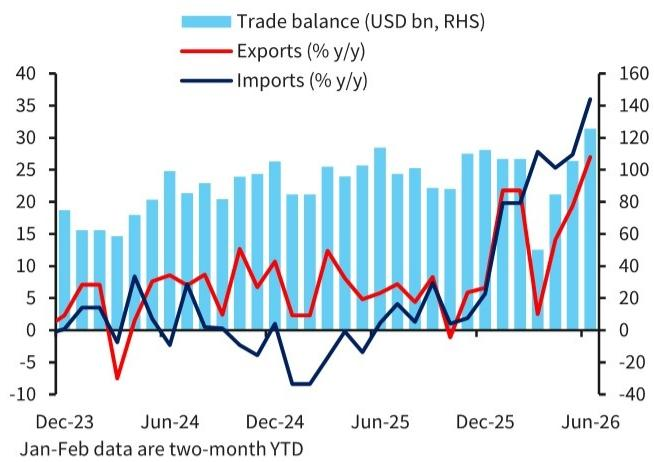
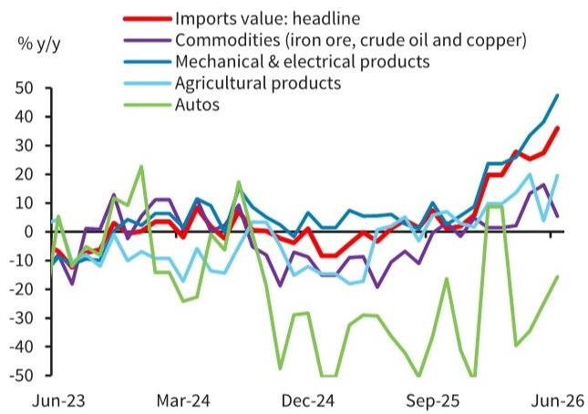

# BARC：中国出口强劲但K型分化加深

6月中国出口同比增速达到27%，远超市场预期的19%至20%。这份BARC研报的核心判断并非“出口超预期”本身，而是出口的结构正在制造新的分化——AI和绿色科技产品贡献了超过四成的出口增量，但低技术、劳动密集型行业仍在调整。出口的繁荣并未有效传导至就业市场，这意味着国内需求的修复节奏可能比数字看起来更慢。

## 1. 出口的K型复苏：高技术与低技术行业差距正在拉大

6月出口数据中最值得关注的不是总量，而是行业间的分化程度。半导体出口同比飙升122%，自动数据处理设备增长66%，这两类产品合计贡献了约8个百分点的出口增速，占YTD总出口增长的40%以上。与此同时，鞋类、玩具等劳动密集型产品（约占出口总额15%）仍处于调整区间。

报告明确指出，这种K型复苏正在加剧行业间的利润分化：半导体和电子行业利润上升、定价权增强，而纺织和家用消费品等传统行业利润下降、价格不确定性持续。这一趋势已在近期的制造业PMI数据中得到印证。

> **KC评论：** 出口总量超预期容易让市场误以为整体宏观环境在加速。但BARC的拆解显示，增长高度集中在资本密集型行业，传统制造和就业密集型行业并未受益。这解释了为何出口数据亮眼，但居民收入和消费修复依然偏慢。

## 2. 全球AI研究周期和能源转型是出口的两大引擎

报告将出口超预期的驱动力归结为两个结构性因素：全球AI资本开支周期和能源转型。中国在关键AI相关产品（包括电子芯片、计算机、半导体组件、电路板和芯片制造设备）的全球出口中占比超过30%，远高于韩国的约6%。中东局势持续紧张带来的能源供应冲击，反而加速了全球绿色转型，推动了中国电动车（+71%）、风力涡轮机（+49%）、锂电池（+45%）等绿色科技产品的出口增长。

这意味着，只要全球AI研究和能源转型趋势不变，中国的高技术出口就有持续支撑。但报告也暗示，这种增长模式对就业的拉动有限，因为资本密集型行业对劳动力的吸纳能力远低于劳动密集型行业。

## 3. 出口对就业的溢出效应有限，国内需求修复仍需时间

这是整份报告最容易被忽略的判断。BARC认为，出口增长集中在资本密集型行业，意味着其对国内劳动力市场的正向溢出有限。出口繁荣难以快速转化为居民收入和消费的修复，这解释了为何国内需求持续偏弱。

从进口数据也能看到类似的分化：机械和电子产品进口增长47.5%，创16年最快增速，这与AI研究周期高度相关；但原油进口量同比下降41%，降至2016年10月以来最低，反映出国内工业活动并未全面回暖。煤炭进口增长29.5%则更多是供给端因素——国内煤矿安全检查导致供应收紧。

> **KC评论：** 出口数据亮眼时，市场容易对国内消费修复过于乐观。BARC的逻辑链条很清楚：出口结构决定就业传导，就业传导决定消费修复节奏。当前出口的“含金量”很高，但“含就业量”不高。

## 4. 贸易流向也在分化：东盟成为最大亮点，中美贸易正常化

6月出口数据中另一个值得关注的结构性变化是贸易伙伴的分化。对东盟出口同比增长34.5%，创五年最快增速，月度出口额达到783亿美元的历史新高，贡献了6.2个百分点的出口增速。对非洲和拉丁美洲的出口也明显加速。

对美出口增速从5月的35.4%节奏变化至14%，但出口相对值达到435亿美元，是2月以来的最高水平。环比来看，对美出口在5月增长6.2%的基础上，6月继续增长11.4%。报告认为，中美贸易流动正在正常化，但并未给出更激进的判断。

这份研报的价值不在于告诉你出口超预期，而在于帮你理解“超预期”背后的结构性分化——哪些行业在受益、哪些行业被落下、以及这种分化对国内宏观环境的传导路径。对于关注宏观和产业决策的读者来说，K型复苏的深度和边界，才是真正需要持续追踪的变量。

For informational purposes only. Portions may be generated,translated,summarized,or edited with AI assistance based on source materials and may contain omissions or errors. Please verify independently. This is not investment,legal,tax,accounting,or other professional advice.

For informational purposes only. Portions may be generated,translated,summarized,or edited with AI assistance based on source materials and may contain omissions or errors. Please verify independently. This is not investment,legal,tax,accounting,or other professional advice.

