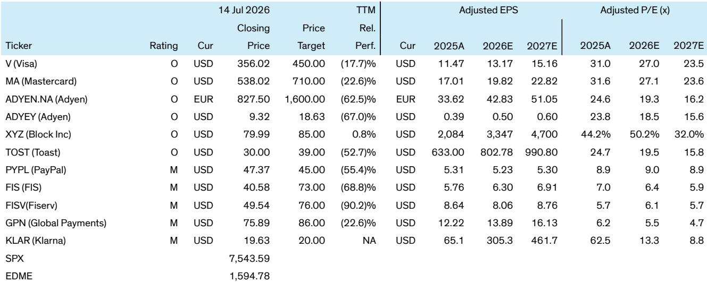

# Stripe与PayPal的潜在整合：全球支付格局的可能重塑

一个由Stripe和私募股权公司Advent International支持的财团已提交每股60.50美元的报价收购PayPal，对该公司的估值约为530亿美元，较此前收盘价溢价28%。该报价获得了500亿美元的承诺融资支持，此前数月市场已有多方对PayPal的战略兴趣传闻。对于一家年处理支付额达1.8万亿美元、覆盖约90%在线商户、拥有2.31亿月活跃用户（其中仅Venmo就有6700万）的公司而言，在股价经历大幅调整后出现收购方并不令人意外。令人意外的是报价本身。60.50美元的出价接近PayPal自首次公开募股以来的最低估值水平，一家拥有稳健资产负债表、年自由现金流60亿美元、自由现金流回报表现达15%且刚刚完成重组的公司，不太可能轻易接受这一价格。

Stripe与PayPal合并的战略逻辑在多维度上具有吸引力，但结构性障碍同样显著。这笔交易将创建一个年处理支付额达3.2万亿美元、净收入超过200亿美元、年自由现金流合计超过90亿美元的支付巨头。合并后的实体将控制全球电子商务超过30%的份额，以及美国电子商务超过40%的份额。然而，融资结构、监管审查、整合复杂性以及现代基础设施公司与传统消费者平台之间的文化冲突，都对该交易能否按当前条款完成提出了严肃质疑。其影响远不止这两家公司，可能重塑整个支付生态系统的竞争格局。

## Stripe的战略考量多层次，但价格与融资构成根本性矛盾

Stripe对PayPal的兴趣并非以折扣价收购困境资产，而是执行横向与纵向整合策略，以获得Stripe无法通过有机增长在规模上实现的能力。最直接的逻辑是通过捆绑实现市场份额扩张——这正是PayPal收购Braintree时执行的策略。通过同时拥有PayPal品牌钱包和Braintree处理基础设施，Stripe可以为商户提供更优的价值主张：通过钱包所有权提高转化率，通过整合消费者数据降低欺诈风险，以及将Stripe的开发者友好平台与PayPal庞大的消费者基础相结合的统一结账体验。

交叉销售机会同样显著。Stripe的业务主要服务于开发者和早期公司，而PayPal的优势在于中小企业和企业级商户关系。Stripe可以将其产品（包括高级欺诈检测、计费和平台工具）嵌入PayPal现有的商户基础，在不获取新客户的情况下推动收入增长。闭环选项可能是最被低估的角度。通过同时拥有消费者钱包和商户处理器，Stripe可以在每笔交易中获得更好的经济回报，并在市场两端获得更丰富的数据，从而实现更精细的风险管理和个性化服务。

代理商务的角度增加了前瞻性维度。随着人工智能驱动的商务代理开始自主执行交易，PayPal庞大的消费者基础设施（包括先买后付产品、借记卡和消费者数据）与Stripe的商户分销相结合，可能具有战略价值。稳定币则提供了另一层选项。Stripe通过收购Bridge和推出Stablecoins as a Service，在稳定币基础设施方面进行了重大投入。PayPal拥有市值30亿美元的PYUSD稳定币。合并后的实体可以利用稳定币进行跨境B2B支付和结算，创建绕过传统卡网络的专有结算层。

然而，融资结构削弱了战略逻辑。在530亿美元收购提案中承诺的500亿美元融资，意味着收购方打算积极利用PayPal的资产负债表。PayPal目前拥有净现金头寸，年自由现金流为60亿美元。利用这些资金为收购融资，可能将合并后实体的杠杆率推高至EBITDA的5-6倍。对于自由现金流可能因品牌结账业务竞争压力而下降的业务而言，这种债务水平带来了显著的财务风险。如果交易价格上涨（考虑到报价与PayPal董事会合理接受水平之间的差距，这很可能发生），融资挑战将更加严峻。Stripe对上市没有表现出兴趣，这限制了其发行股权作为交易货币的能力，并引发了关于如何长期偿还债务的问题。

## 交易面临严格监管审查，但行业分散性提供了反驳论据

Stripe和PayPal合并后的规模将不可避免地引发多个司法管辖区的反垄断审查。一个控制美国电子商务处理超过40%、全球电子商务超过30%的合并实体，将面临对大型科技收购日益持怀疑态度的监管机构的严格审查。数字支付领域仍然高度竞争（拥有众多收单机构、数字钱包和先买后付选项）的论点提供了合理的辩护，但并非获得批准的保证。

监管考量因地区而异。在美国，两家共同主导在线支付处理公司的合并，很可能面临《克莱顿法案》第7条的挑战，该条款禁止可能实质性减少竞争的收购。辩护将依赖于市场定义：如果相关市场被广义定义为包括所有数字支付（包括卡网络、数字钱包和替代支付方式），合并后的市场份额看起来不那么占主导地位。如果狭义定义为电子商务的在线支付处理，则集中度更难合理化。

在欧洲，监管机构在审查科技收购方面尤为积极，门槛更高。《数字市场法案》为监管机构提供了额外工具来审查可能巩固平台权力的合并。Stripe与欧洲商户的现有关系以及PayPal在欧洲电子商务中的重要地位，将使合并后的实体成为监管干预的目标。

复杂性因Stripe的现有客户关系而加剧。Stripe是包括Klarna在内的先买后付提供商的关键分销合作伙伴，Klarna依赖Stripe的商户网络。如果Stripe拥有PayPal（后者通过自己的BNPL产品与Klarna直接竞争），这些合作关系将面临直接紧张。同样，Shopify（Stripe的最大客户之一）运营的Shop Pay是PayPal的竞争对手。将PayPal视为竞争对手的银行合作伙伴，如果其处理合作伙伴Stripe也控制消费者钱包，将面临更强大的对手。

## 交易可能分拆为资产出售，引发对PayPal最有价值资产的竞购

考虑到全公司收购的庞大规模，更可能的结果是部分交易，即Stripe追求特定资产而非整个公司。PayPal的三个主要业务线——品牌结账业务、Braintree和Venmo——具有不同的战略特征，将吸引不同的买家。品牌业务处理PayPal的传统在线结账，由于来自Apple Pay、Google Pay和其他数字钱包的竞争压力，面临最大挑战。Braintree是为大型商户处理交易的支付处理平台，是处理业务中的皇冠明珠。Venmo拥有6700万月活跃用户，在Z世代中具有强大影响力，约占美国人口的20%，是最有价值的消费者资产。

部分出售将比全公司交易释放更多价值。即使市场低迷，仅Braintree一项，基于可比公开估值，其估值可能在100-200亿美元之间。Venmo可能获得类似价格，特别是对于将点对点支付视为战略价值客户获取和保留工具的买家。Braintree的潜在追求者包括寻求横向整合的大型收单机构，但交易规模限制了候选范围。对于Venmo，潜在买家名单更广，包括寻求保护客户关系的银行、寻求规模扩张的数字钱包提供商，甚至探索新用例的加密领域公司。

竞购战的可能性增加了另一个维度。如果Stripe只追求特定资产，其他战略买家和私募股权公司可能对剩余部分出现。2月份多方表达的兴趣，加上当前的报价，表明市场已经在定价竞争性报价的可能性。私募股权公司可以采取更长期的视角，受横向整合监管担忧的限制较小，是最有可能竞购整个公司的买家。科技巨头面临重大监管障碍，但可能将PayPal的消费者基础和商户网络视为战略价值。像沃尔玛这样的黑马——历史上在金融服务领域布局不足，其现任首席财务官是PayPal的前首席财务官——可能作为特定资产或整个公司的竞购者出现。

## 对更广泛支付生态系统的影响深远，重塑多层竞争格局

Stripe和PayPal合并后的规模将对支付领域的每个主要参与者产生直接和持久的影响。对于Adyen，影响可能是负面的。Adyen在大型商户处理领域与Stripe和Braintree直接竞争。Stripe-PayPal合并带来的横向和纵向整合，将使合并后的实体拥有更优的规模、更好的数据和更全面的产品套件，使Adyen更难在成本或功能上竞争。

对于传统电子商务收单机构，包括大型金融科技公司旗下的商户处理业务，威胁是生存性的。这些业务在现代化技术平台和与Stripe的开发者友好方法竞争方面一直面临困难。合并后的Stripe-PayPal实体将加速向现代基础设施的转变，使传统参与者面临交易量下降和利润率压缩。

对于Visa和Mastercard，影响更为微妙，但长期来看是负面的。Stripe历来是卡网络的关键分销合作伙伴，处理产生网络费用的交易。一个同时拥有处理基础设施和拥有2.31亿用户的消费者钱包的合并实体，在费用谈判中将拥有更多杠杆，并有更大动力开发替代支付轨道。稳定币的角度尤其具有威胁性：如果合并后的实体可以使用自己的稳定币结算交易，它将完全减少对卡网络的依赖。虽然这一情景还需数年时间，不会影响中期财务数据，但战略方向是明确的。

对于银行，这笔交易将验证Jamie Dimon关于金融科技竞争的反复警告。合并后的Stripe-PayPal实体将拥有与银行在支付、贷款和存款领域直接竞争的规模、数据和消费者关系。Venmo的面向消费者能力与Stripe的商户分销相结合，创建了一个最终可能绕过银行账户和卡网络的闭环。

## 读者的分析框架：通过三个视角评估交易

对于试图评估这笔交易概率和影响的读者，三个分析视角是有用的。第一个视角是价格和融资。当前60.50美元的报价不太可能被PayPal董事会接受，因为它仅比接近历史低点的股价溢价28%。PayPal的新任首席执行官最近围绕结账解决方案、Venmo和Braintree对公司进行了重组，并计划在两到三年内实现15亿美元的成本节约。接受估值区间低端的报价，将表明对转型计划缺乏信心。一个现实的交易价格可能需要达到70-80美元才能获得董事会批准，这将使总企业价值达到600-700亿美元，使融资挑战更加严峻。

第二个视角是监管和整合风险。即使价格合适，监管路径也不确定，整合挑战巨大。Stripe建立在现代云原生基础设施之上，而PayPal运营着现代和遗留系统的混合体。整合两个技术栈将是复杂且耗时的。将B2B基础设施公司与B2C消费者平台结合的文化挑战不应被低估。Stripe与PayPal竞争对手的现有客户关系将立即产生冲突，可能在整合期间引发商户流失。

第三个视角是替代交易的期权价值。即使全公司交易失败，这一过程已经表明PayPal的资产相对于其战略价值被低估。Venmo或Braintree的部分出售可能为股东释放比全公司交易以适度溢价更多的价值。竞争性报价的出现可能推高价格，无论任何交易是否完成，都为PayPal的股价提供了底部。对于读者，关键问题不是这笔特定交易是否发生，而是对PayPal资产的战略兴趣是否验证了比公开市场一直给予的更高的估值。

支付行业正处于转折点。估值低迷、稳健的资产负债表和战略紧迫性的结合，正在创造两年前难以想象的整合条件。无论Stripe-PayPal交易是否完成，这一过程已经通过揭示战略买家在公开市场一直低估的资产中看到的价值，改变了竞争格局。这笔交易嵌入的金融科技估值底部，可能是其最持久的影响。

*仅供参考。部分内容可能基于源材料通过AI辅助生成、翻译、总结或编辑，可能存在遗漏或错误。请独立核实。本文不构成专业建议。*
