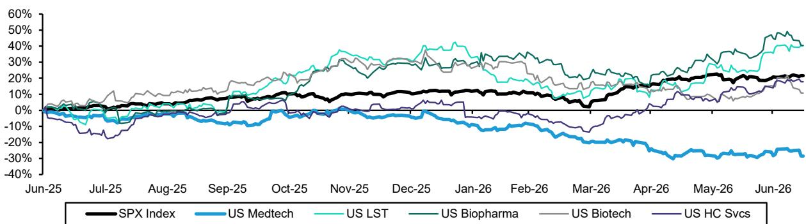
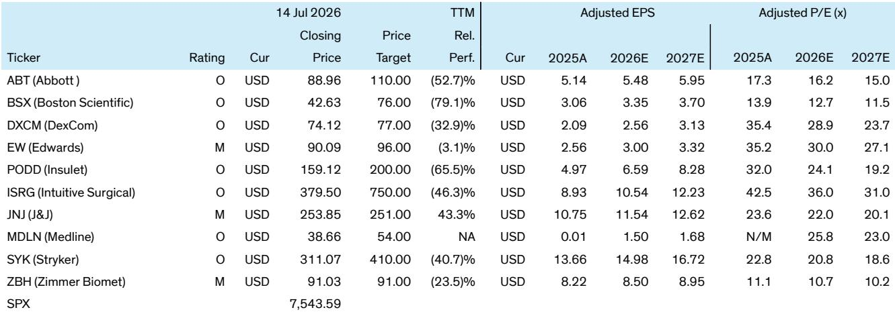
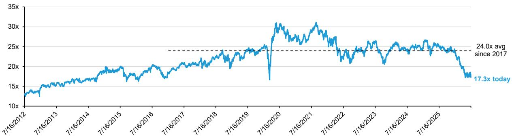

# Bernstein：美国医疗器械板块在HCA预披露后再度调整——行业是否有观察窗口

美国医疗器械板块正在经历一轮估值压缩。自2024年11月以来，板块整体市盈率已下降超过30%，回到2017年之前的水平。Bernstein在最新研报中记录了一个关键现象：市场定价反映的是对行业基本面的谨慎预期，但与管理层沟通得到的信号却有所不同。

触发这轮调整的直接事件是HCA在7月发布的二季度预披露。这家医院运营商报告同院住院手术量同比下降2.3%，门诊手术量下降3.4%，当天报价下跌7%，并影响整个器械板块。强生同日公布的二季度器械业务美国销售额45.5亿美元，低于市场预期约1.7%，主要来自Abiomed美国销售的缺口。这些数字叠加在一起，让读者很难不关注手术量增长的节奏变化。

但Bernstein与多家器械公司管理层沟通后，得到的是另一幅图景。Zimmer Biomet明确表示，ACA和Medicaid合计仅占美国手术量的低个位数百分比，且这些项目不会归零，因此市场对HCA消息的反应可能过度。一家私立骨科公司称未观察到市场量趋势变化。美敦力认为终端市场健康，并预期医院在财务不确定性下会推动更多择期手术。

> **KC评论：** 这里的关键不是谁对谁错，而是信息源的结构差异。医院运营商看到的是支付方结构变化带来的短期波动，器械公司看到的是终端需求的长期趋势。两者可能同时成立，但市场目前只定价了前者。

Bernstein认为，器械板块的仍在调整更多来自公司层面的复杂性，而非宏观环境出现变化。过去12个月，该板块跑输标普500指数约5000个基点，在所有医疗子板块中表现最差。在AI主题持续吸引资金的环境下，读者对需要逐一拆解公司故事的器械板块缺乏耐心。

从估值角度看，Bernstein覆盖的主要公司市盈率已较2024年底压缩20%至60%不等。Intuitive Surgical从67.7倍降至34.1倍，Boston Scientific从31.9倍降至12.0倍，Insulet从7.5倍降至3.0倍。这些数字意味着，即使基本面出现温和变化，当前估值也已隐含了大量谨慎预期。

## 1. 医院数据与器械公司反馈的差异，本质是支付方结构与终端需求的时间差

HCA的数据反映的是支付方结构变化带来的短期影响——ACA注册人数下降和Medicaid削减正在影响医院的手术量。但器械公司管理层反复强调，这些支付方在美国整体手术量中的占比有限。ZBH的测算显示，ACA和Medicaid合计约占美国手术量的4%左右，且不会归零。这意味着，即使这部分量出现波动，对器械公司整体收入的影响也相对可控。

更值得关注的是，医院在财务不确定性下反而可能增加择期手术量。美敦力的判断提供了另一个视角：当医院收入端承压时，它们有动力通过增加手术量来弥补缺口。这与HCA数据反映的调整趋势形成对照，但两者并不必然矛盾——不同医院、不同地区的策略可能分化。

## 2. 公司层面的复杂性正在取代宏观关注，成为板块估值的主要压制因素

Bernstein在研报中反复强调一个判断：器械板块的仍在调整更多来自公司故事的复杂化，而非宏观环境出现变化。Boston Scientific面临Watchman和EP增长节奏变化的疑问，Stryker受网络攻击影响后需要重建信心，Intuitive Surgical虽然产品线丰富但估值已大幅压缩。这些公司各自的问题叠加在一起，使得板块整体失去了吸引力。

但Bernstein也指出，随着这些公司不确定性逐一消退，板块存在渐进修复的可能。Intuitive Surgical的dV5、Ion、SP、XiR和AI产品组合仍在推动强劲的季度表现，Stryker若能交出健康的二季度业绩，有望恢复市场对执行力的信心。Boston Scientific的增长底部若能明确，估值修复空间可能最大。

## 3. 十年低点的估值意味着，即使基本面出现变化，当前价格也已隐含了相当程度的谨慎预期

Bernstein的估值表格显示，截至7月14日，覆盖公司中多数市盈率已低于过去十年和五年的平均水平。Zimmer Biomet当前10.4倍，较十年均值折价31%；Boston Scientific 12.0倍，折价50%；Intuitive Surgical 34.1倍，折价30%。这些数字本身并不构成信号，但它们提供了一个观察框架：当估值压缩到这种程度时，市场对负面消息的定价已经相当充分。

> **KC评论：** 估值低不等于不会更低，但它改变了赔率结构。对于愿意接受短期不确定性的读者来说，当前水平意味着好消息的弹性可能大于坏消息的冲击。关键在于能否区分哪些公司的公司问题是可以解决的，哪些是结构性的。

Bernstein的结论是，器械板块的修复需要时间，且不会来自强生或雅培的短期业绩。真正可能触发重新定价的，是Intuitive Surgical持续超预期的季度表现、Stryker恢复执行力的信号，以及Boston Scientific增长底部的明确。这些事件逐一兑现的过程，可能就是板块从“关注度较低”回到“值得观察”的路径。

For informational purposes only. Portions may be generated,translated,summarized,or edited with AI assistance based on source materials and may contain omissions or errors. Please verify independently. This is not investment,legal,tax,accounting,or other professional advice.

For informational purposes only. Portions may be generated,translated,summarized,or edited with AI assistance based on source materials and may contain omissions or errors. Please verify independently. This is not investment,legal,tax,accounting,or other professional advice.

