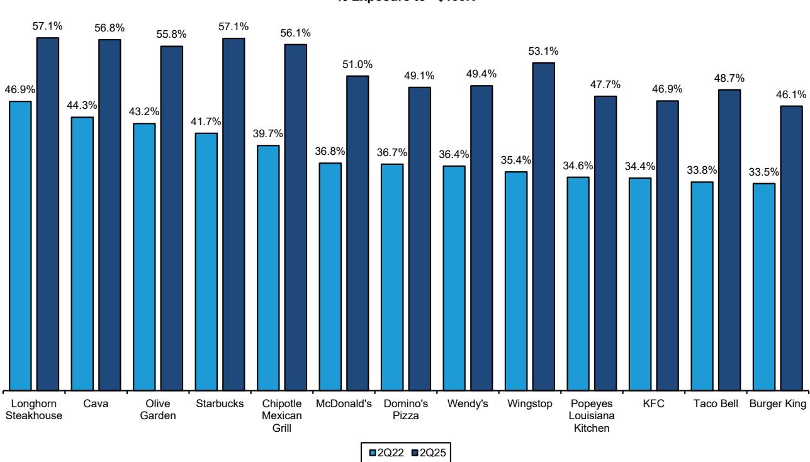
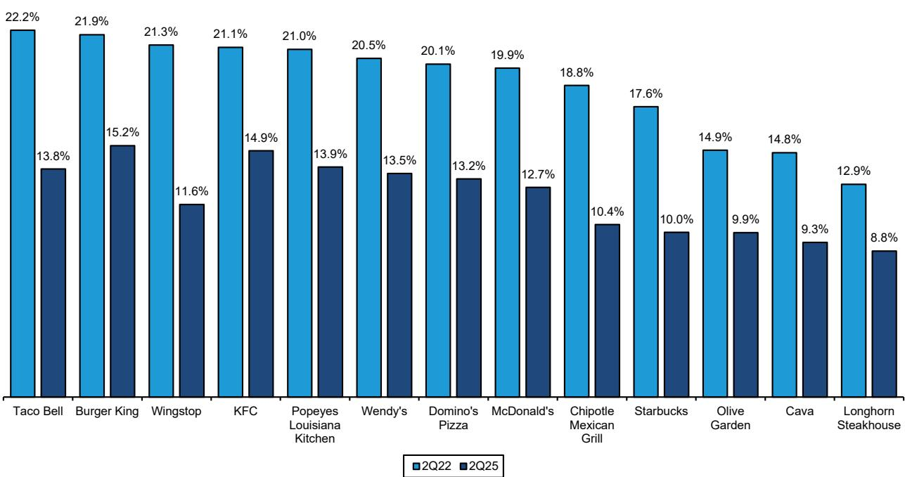
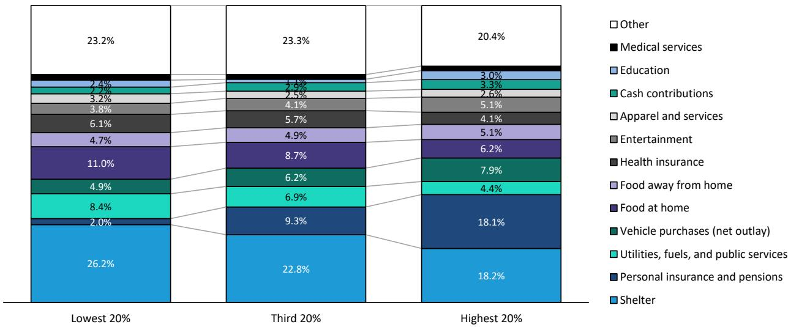

# 美国餐饮市场的K型分化已成为结构性现实：观察者需在高收入敞口与价值复苏之间做出选择

美国餐饮行业不再经历周期性波动，而是正沿着收入线发生永久性的结构性调整。覆盖2022年第二季度至2025年第二季度13家主要连锁店的信用卡交易数据显示，分化程度以令人警惕的持续性扩大：年收入超过10万美元的高收入家庭在此期间餐饮总支出增长约70%，到店频率增长55%；而年收入低于4.5万美元的消费者，其交易次数和总支出较2022年基准均下降25%至35%。这两个群体之间的差距目前约为95个指数点，且自2023年初以来持续扩大。

这不是对通胀的暂时反应，不会随着价格压力缓解而逆转。外出就餐价格与整体CPI之间的累计通胀差距已达到前所未有的水平。自2019年以来，餐饮价格上涨35%，而整体CPI上涨25%。从1960年到2019年，餐饮通胀相对于CPI的历史溢价平均每年约60个基点。自2020年以来，这一溢价几乎弹性较高，达到每年超过110个基点。价格弹性较高的低收入消费者并未在该品类内降级消费，而是完全退出，将支出重新分配到相对通胀温和得多的食品杂货领域。

这对组合构建的影响是明确的。对高收入消费者敞口较大的公司已占据行业增长的更大份额，且这一优势可能持续。Cava、Chipotle、星巴克和LongHorn Steakhouse等品牌目前来自年收入超过10万美元家庭的交易占比，较三年前显著提高。相反，分析中的所有主要连锁店在2022年第二季度至2025年第二季度期间，均失去了对年收入低于4.5万美元消费者的敞口，其中Wingstop、Chipotle、Taco Bell和星巴克的下降幅度最大。观察者面临的问题不是这种分化是否会持续，而是哪些公司在结构上处于受益位置，哪些公司在等待可能永远不会到来的低收入消费者复苏。

## 分化的驱动力是到店频率，而非平均消费额，这使得转变更难逆转

交易数据中最关键的发现是，与收入相关的支出差异主要由到店频率驱动，而非单次消费额。在几乎所有被分析的品牌中，不同收入群体的平均交易价值相对接近。高收入顾客和低收入顾客每次到店的消费金额大致相同。区别在于高收入顾客到店的频率高得多。每位用户的支出随收入增加而显著上升，但这种增长来自重复到店，而非更大订单。

这一区别之所以重要，是因为由到店频率驱动的分化在结构上比由消费额驱动的分化更具粘性。如果低收入消费者只是每次到店消费减少，那么可支配收入的恢复或一波价值促销活动可以相对快速地恢复平均消费额。但当消费者完全停止到店时，习惯的丧失就成为一个更深层次的问题。将餐饮支出转移到食品杂货的消费者已经围绕家庭烹饪重建了每周习惯。赢回这些消费者不仅需要价格促销，还需要行为改变，而行为改变的逆转成本更高、耗时更长。

数据证实了这一模式。低收入消费者的单次交易支出在整个期间保持相当稳定。全部下降集中在交易次数上，较2022年基准下降了25%至35%。行业内的价值促销活动，包括2024年推出的一波套餐优惠，在重建低收入群体到店频率方面充其量只是偶有成功。这与以下假设一致：问题不在于购买时的价格敏感度，而在于低收入群体的支出从餐饮领域整体结构性转移。

## K型分化指数揭示哪些品牌从分化中受益最多

为量化每家连锁店顾客结构的变化程度，可以计算K型分化指数，即2022年第二季度至2025年第二季度期间，来自年收入超过10万美元家庭的交易份额变化减去来自年收入低于4.5万美元家庭的交易份额变化。这一单一指标同时捕捉了分化的两个方面。高指数可能源于有机吸引高收入顾客、不成比例地失去低收入顾客，或两者兼有。

排名结果具有启示性。Wingstop以95.1%的K型分化指数领先，意味着其顾客结构在过去三年中几乎完全转向高收入消费者。Chipotle以85.9%紧随其后。星巴克和Taco Bell也排名靠前。在光谱的另一端，麦当劳、达美乐和百胜餐饮集团等概念经历了较为温和的结构变化，反映出它们更广泛的顾客基础和更高的低收入家庭敞口。

值得注意的是，高K型分化指数本身并不代表品牌健康。对于Wingstop，高指数既反映了高收入顾客到店量的强劲增长，也反映了低收入支出的近乎完全停滞——尽管经历了三年的积极扩张和品牌建设，低收入支出几乎未从2022年指数水平移动。该品牌通过提升顾客结构实现增长，而非扩大其总可寻址市场。这种动态创造了结构性脆弱性：如果高收入消费者周期转向或针对该群体的竞争加剧，该品牌没有低收入基础可以依赖。

相反，Cava是分析中相对少见一个所有三个收入群体均显著高于2022年基准的品牌。Cava的高收入支出增长超过四倍，但中低收入支出也有所增加。Cava的K型分化指数高并非因为它失去了低收入顾客，而是因为它吸引了异常多的高收入顾客。这是K型敞口的理想形式：品牌在享受高收入顺风的同时，没有牺牲其更广泛的顾客基础。

## 杠铃式菜单策略是对K型市场的相对少见可行回应

如果K型分化是结构性的，那么适当的战略回应不是单一的定价或定位策略，而是同时应对收入光谱两端的杠铃式方法。试图只服务中间市场的公司将发现自身受到双向挤压：低收入顾客流向食品杂货，高收入顾客流向高端概念。

杠铃式菜单策略在上端需要三种独特能力。首先，创造真正差异化并证明更高价格点合理性的高端创新。其次，通过限时优惠和商品创造稀缺价值，为高收入消费者提供超越日常需求的频繁到店理由。第三，通过数字订购、忠诚度计划以及免下车或取货优化提升便利性，减少时间紧张的高收入家庭的摩擦。

在下端，要求同样具体。避免全面涨价的陷阱，进行有纪律的定价至关重要。针对流失的低收入顾客进行精准促销，而非侵蚀整个顾客群利润率的全面折扣。最重要的是，提供清晰、一致的入门价格点，为价格敏感消费者提供明确的回归理由。过去两年行业在价值菜单方面的经验表明，间歇性促销是不够的。入门价格点必须永久且可靠，足以成为消费者对品牌认知的一部分。

星巴克提供了一个有用的案例研究。该品牌在分析中拥有最高的K型分化指数之一，部分由其强大的忠诚度计划和数字生态系统驱动，这些系统倾向于高收入、高频率用户。然而，星巴克也通过其滴滤咖啡和核心浓缩咖啡饮品保持了清晰的入门价格点。该品牌在同一门店、同一柜台、同一咖啡师处同时提供7美元的定制饮品和3美元的普通咖啡的能力，正是杠铃策略的操作定义。挑战在于执行纪律：当高端创新被过度强调或入门价格上移时，低收入顾客群就会流失，数据已显示这一点。

## 观察者的决策框架：基于收入敞口和复苏情景的三个篮子

观察者的分析任务不是按菜系类型或服务形式对餐饮公司进行分类，而是按其顾客群的收入特征和低收入复苏的可能性进行分类。从数据中可以得出三个不同的篮子。

第一个篮子由对高收入消费者敞口高且不断增长的公司组成，其K型分化指数为正，且主要由高收入顾客的有机吸引驱动。Cava、Chipotle、星巴克和LongHorn Steakhouse属于这一类别。无论宏观环境如何，这些公司都可能继续表现优异，因为其核心顾客群相对不受通胀和劳动力市场疲软的影响。这一篮子的主要风险是增长放缓时的估值压缩，但潜在需求轨迹是有利的。

第二个篮子包括那些似乎相对不受K型动态影响的公司，因为其商业模式较少直接依赖消费者到店频率。达登餐饮凭借其多元化的休闲餐饮概念组合，受益于偏向中高收入的顾客群，同时也受益于包括自有品牌食品服务分销在内的非可自由支配收入流。同样，Sysco、US Foods和Performance Food Group等食品分销商的收入来自餐饮客户和机构客户的组合，为任何单一消费者群体的波动提供了缓冲。

第三个篮子包括对低收入消费者敞口较大的公司，该群体的复苏将产生不成比例的上行空间。麦当劳、达美乐、餐饮品牌国际、百胜餐饮集团和Wingstop的顾客群相对于行业平均水平更偏向低收入。对于这些公司，当前环境在结构上具有挑战性，其表现本质上是对低收入消费者复苏时机和力度的押注。如果K型分化持续，这些公司将继续面临到店频率的逆风。如果工资增长、通胀缓解和改善的价值认知将低收入消费者带回餐饮场所，这些将是受益最大的公司。

关键洞察在于，这三个篮子实现的概率并不相同。数据表明，低收入消费者退出餐饮场所是由结构性因素而非周期性因素驱动的。餐饮与食品杂货之间的累计价格差距、向家庭烹饪的行为转变，以及低收入群体在外出就餐方面支出份额的持续侵蚀，都指向一个新的均衡：行业服务于一个更小、更富裕的顾客群。押注这一趋势迅速逆转的观察者，正在对消费者行为做出数据并不支持的乐观假设。

## K型经济不会逆转，组合策略必须反映这一点

美国财富集中度几十年来一直朝着一个方向发展。收入最高的1%家庭目前控制着约25%的家庭财富，高于1990年的17%。中产阶级占国民财富的份额正在缩小。收入增长不成比例地流向高收入家庭。消费者信心在低收入群体中仍然最弱。这些趋势在可预见的未来均无逆转迹象。

对于餐饮行业，这意味着当前的分化不是通胀正常化后会愈合的暂时性错位。这是一个新的结构性现实。该行业历史上通过经济周期的韧性基于一个假设：餐饮支出在不同收入水平的消费者钱包中占比稳定。这一假设不再成立。餐饮支出已成为收入偏差最大的消费类别之一，2024年最高收入家庭的支出是最低收入家庭的4.6倍，且这一比率一直在扩大。

对运营者的战略启示是，试图面面俱到越来越不可行。公司必须选择是竞争频繁到店且相对价格不敏感的高收入消费者，还是竞争需要令人信服的经济理由来选择餐饮而非食品杂货的价值导向消费者。中间地带——以中等定价和中等便利服务中等收入消费者——正从两个方向被掏空。

投资启示随之而来。在K型市场中，组合构建应倾向于那些已证明对高收入消费者有敞口且具备盈利服务该群体运营能力的公司。依赖低收入复苏作为研究逻辑的公司并非不可投资，但它们需要一个观察者必须愿意明确持有的特定宏观观点。将高收入敞口增长型公司与食品分销商等受保护商业模式相结合的杠铃式组合，可能提供在当前结构性配置下对餐饮行业的最佳风险调整敞口。

*仅供参考。部分内容可能基于源材料通过AI辅助生成、翻译、总结或编辑，可能存在遗漏或错误。请独立核实。这不构成研究、法律、税务、会计或其他专业建议。*

仅供参考。部分内容可能基于源材料通过AI辅助生成、翻译、总结或编辑，可能存在遗漏或错误。请独立核实。这不构成研究、法律、税务、会计或其他专业建议。

