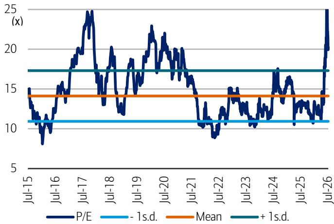

Largan Precision

# 研究观点调整：关注CPO驱动的长期增长潜力

观点调整：正面 | 目标价：5,600新台币 | 现价：4,345新台币

## 观点调整：CPO带来更强劲的长期增长前景

我们将对Largan的观点从中性调整为正面，主要基于其2028年起在FA/FAU领域CPO交换机相关业务中可能获得的份额增长，预计将带来可观的收入与利润增长。我们上调了Largan 2026-2028年的盈利预测1-13%，并将目标价从2,900新台币（基于16倍2026下半年-2027上半年预期市盈率）提升至5,600新台币（基于25倍2028年预期市盈率）。我们采用2028年作为基准，以反映CPO业务的规模放量，而25倍的目标估值倍数处于其历史市盈率峰值水平，与上一轮盈利上升周期相匹配。鉴于CPO仍处于早期阶段，而光互连是一个长期上升周期，我们注意到市场愿意将目光投向2028年之后。因此，我们采用分部估值法对CPO业务在2030年的价值进行合理性检验，通过对CPO业务应用30倍市盈率（基准情景：在FA领域占据30%份额，详见附录9和附录4），得出每股价值为5,641新台币。

## CPO有望在2028年带来5-10%的每股盈利增长，在2030年带来60%以上的增长

我们对Largan进入Nvidia CPO供应链的信心有所增强。根据管理层信息，Largan正在与多家客户接洽，推进认证流程（未来数月内），并规划产能扩张（试点产线预计于2026年第三季度末完成）。尽管Largan在数据通信领域缺乏过往记录，但我们认为其优势在于通过自动化实现的高精度光学对准能力，以及与CPO生态系统的合作关系。我们的分析显示，假设Largan在FA领域占据20-30%的份额，净利率为30-40%，则2028年的每股盈利相较于2026年可能实现5-10%的增长。展望2030年，在悲观/基准/乐观情景分析下，盈利相较于2028年可能分别增长24%/63%/184%。

## 智能手机业务稳健，受益于iPhone规格升级

尽管整体智能手机供应链面临一定挑战，但我们认为Largan凭借iPhone多年的规格升级周期及其领先地位，表现将更具韧性。我们预计Pro系列的可变光圈设计将在2026年下半年推动主摄像头平均售价提升30-50%，而Largan在2027-2028年期间应能持续受益于主摄像头和潜望式摄像头的像素提升或镜片数量增加。

<table><tr><td>财务预测（12月，新台币）</td><td>2024A</td><td>2025A</td><td>2026E</td><td>2027E</td><td>2028E</td></tr><tr><td>净利润（调整后，百万）</td><td>25,915</td><td>21,275</td><td>25,049</td><td>26,929</td><td>30,226</td></tr><tr><td>每股盈利</td><td>191.2</td><td>156.9</td><td>184.8</td><td>198.6</td><td>223.0</td></tr><tr><td>每股盈利变化（同比）</td><td>44.8%</td><td>-17.9%</td><td>17.7%</td><td>7.5%</td><td>12.2%</td></tr><tr><td>市场一致预期每股盈利</td><td></td><td></td><td>186.93</td><td>205.34</td><td>220.05</td></tr><tr><td>每股股息</td><td>97.5</td><td>80.0</td><td>94.2</td><td>101.3</td><td>113.7</td></tr><tr><td>每股自由现金流</td><td>153.2</td><td>103.0</td><td>179.2</td><td>214.4</td><td>244.6</td></tr><tr><td>估值（12月）</td><td></td><td></td><td></td><td></td><td></td></tr><tr><td>市盈率</td><td>22.7倍</td><td>27.7倍</td><td>23.5倍</td><td>21.9倍</td><td>19.5倍</td></tr><tr><td>股息率</td><td>2.2%</td><td>1.8%</td><td>2.2%</td><td>2.3%</td><td>2.6%</td></tr><tr><td>企业价值/EBITDA*</td><td>14.7倍</td><td>14.2倍</td><td>13.0倍</td><td>11.7倍</td><td>10.5倍</td></tr><tr><td>自由现金流回报表现*</td><td>3.5%</td><td>2.3%</td><td>4.1%</td><td>4.9%</td><td>5.5%</td></tr></table>

\* 关于iQmethod $^{SM}$ 指标的完整定义，请参见第10页。

本研究报告仅提供一般性信息。未经BofA明确书面同意，台湾媒体或其他人士不得以任何形式使用、复制或引用本报告的任何部分。

>> 受雇于BofAS的非美国关联公司，未根据FINRA规则注册/取得研究分析师资格。

有关承担特定司法管辖区信息责任的BofA实体的信息，请参阅"其他重要披露"。

BofA从事并寻求与其研究报告所覆盖的发行人开展业务。因此，读者应注意，该公司可能存在影响本报告客观性的利益冲突。读者应将本报告视为做出投资决策的单一因素。

请参阅第11至13页的重要披露。第8页的分析师认证。第8页的目标价依据/风险。12993351

## 2026年7月14日

股票

## 主要变化

<table><tr><td>（新台币）</td><td>此前</td><td>当前</td></tr><tr><td>投资观点</td><td>B-2-7</td><td>B-1-7</td></tr><tr><td>投资评级</td><td>中性</td><td>正面</td></tr><tr><td>目标价</td><td>2,900.00</td><td>5,600.00</td></tr><tr><td>2026E营收（百万）</td><td>64,699.9</td><td>67,599.2</td></tr><tr><td>2027E营收（百万）</td><td>67,560.1</td><td>73,749.0</td></tr><tr><td>2028E营收（百万）</td><td>68,798.3</td><td>79,192.9</td></tr><tr><td>2026E每股盈利</td><td>183.80</td><td>184.77</td></tr><tr><td>2027E每股盈利</td><td>194.32</td><td>198.64</td></tr><tr><td>2028E每股盈利</td><td>196.54</td><td>222.96</td></tr></table>

Robert Cheng >>
研究分析师
BofA (台湾)
robert.cheng@bofa.com

Katherine Zhu >>
研究分析师
BofA (香港)
kexin.zhu@bofa.com

Doris Kao >>
研究分析师
BofA (台湾)
doris.kao@bofa.com

## 股票数据

<table><tr><td>现价</td><td>4,345新台币</td></tr><tr><td>目标价</td><td>5,600新台币</td></tr><tr><td>建立日期</td><td>2026年7月14日</td></tr><tr><td>投资观点</td><td>B-1-7</td></tr><tr><td>52周范围</td><td>2,020新台币 - 5,360新台币</td></tr><tr><td>市值/流通股数（百万）</td><td>18,308美元 / 135.6</td></tr><tr><td>市值（百万）</td><td>589,039新台币</td></tr><tr><td>日均交易额（百万）</td><td>374.45美元</td></tr><tr><td>自由流通量</td><td>58.1%</td></tr><tr><td>BofA代码/交易所</td><td>LGANF / TAI</td></tr><tr><td>彭博/路透</td><td>3008 TT / 3008.TW</td></tr><tr><td>净资产回报表现（2026E）</td><td>12.6%</td></tr><tr><td>净债务股权比（2025A年12月）</td><td>-68.8%</td></tr></table>

有关缩写，请参阅附录11

关键现金流量表数据  
iQprofile $^{SM}$ Largan Precision

<table><tr><td>关键利润表数据（12月）</td><td>2024A</td><td>2025A</td><td>2026E</td><td>2027E</td><td>2028E</td></tr><tr><td colspan="6">（百万新台币）</td></tr><tr><td>营收</td><td>59,458</td><td>61,148</td><td>67,599</td><td>73,749</td><td>79,193</td></tr><tr><td>毛利润</td><td>31,209</td><td>30,837</td><td>33,434</td><td>36,862</td><td>41,180</td></tr><tr><td>销售、一般及管理费用</td><td>(1,930)</td><td>(1,985)</td><td>(2,050)</td><td>(2,185)</td><td>(2,304)</td></tr><tr><td>营业利润</td><td>24,033</td><td>23,558</td><td>25,663</td><td>28,646</td><td>32,563</td></tr><tr><td>净利息及其他收入</td><td>8,142</td><td>2,342</td><td>4,426</td><td>3,998</td><td>3,998</td></tr><tr><td>联营公司</td><td>NA</td><td>NA</td><td>NA</td><td>NA</td><td>NA</td></tr><tr><td>税前利润</td><td>32,174</td><td>25,900</td><td>30,088</td><td>32,644</td><td>36,561</td></tr><tr><td>税项（费用）/收益</td><td>(5,963)</td><td>(4,340)</td><td>(4,829)</td><td>(5,504)</td><td>(6,124)</td></tr><tr><td>净利润（调整后）</td><td>25,915</td><td>21,275</td><td>25,049</td><td>26,929</td><td>30,226</td></tr><tr><td>平均完全摊薄流通股数</td><td>136</td><td>136</td><td>136</td><td>136</td><td>136</td></tr></table>

<table><tr><td>净利润</td><td>25,915</td><td>21,275</td><td>25,049</td><td>26,929</td><td>30,226</td></tr><tr><td>折旧与摊销</td><td>6,230</td><td>7,732</td><td>8,577</td><td>9,217</td><td>9,697</td></tr><tr><td>营运资本变动</td><td>(943)</td><td>(1,208)</td><td>(1,709)</td><td>(1,534)</td><td>(1,270)</td></tr><tr><td>递延税项费用</td><td>NA</td><td>NA</td><td>NA</td><td>NA</td><td>NA</td></tr><tr><td>其他调整，净额</td><td>376</td><td>(1,719)</td><td>0</td><td>0</td><td>0</td></tr><tr><td>经营活动现金流</td><td>31,579</td><td>26,080</td><td>31,916</td><td>34,612</td><td>38,653</td></tr><tr><td>资本支出</td><td>(11,126)</td><td>(12,338)</td><td>(8,000)</td><td>(6,000)</td><td>(6,000)</td></tr><tr><td>（收购）/处置投资</td><td>(7,374)</td><td>(1,704)</td><td>0</td><td>0</td><td>0</td></tr><tr><td>其他现金流入/（流出）</td><td>2,434</td><td>4,805</td><td>0</td><td>0</td><td>0</td></tr><tr><td>投资活动现金流</td><td>(16,066)</td><td>(9,236)</td><td>(8,000)</td><td>(6,000)</td><td>(6,000)</td></tr><tr><td>股份发行/（回购）</td><td>0</td><td>0</td><td>0</td><td>0</td><td>0</td></tr><tr><td>股息支付成本</td><td>(10,811)</td><td>(11,412)</td><td>(10,677)</td><td>(12,577)</td><td>(13,521)</td></tr><tr><td>融资活动现金流</td><td>(10,764)</td><td>(13,458)</td><td>(10,677)</td><td>(12,650)</td><td>(13,524)</td></tr><tr><td>自由现金流</td><td>20,453</td><td>13,743</td><td>23,916</td><td>28,612</td><td>32,653</td></tr><tr><td>净债务</td><td>(123,416)</td><td>(131,295)</td><td>(144,534)</td><td>(160,568)</td><td>(179,700)</td></tr><tr><td>净债务变动</td><td>(5,956)</td><td>(2,496)</td><td>(13,239)</td><td>(15,963)</td><td>(19,132)</td></tr></table>

<table><tr><td>物业、厂房及设备</td><td>46,936</td><td>51,472</td><td>51,117</td><td>48,121</td><td>44,646</td></tr><tr><td>其他非流动资产</td><td>23,827</td><td>15,029</td><td>14,808</td><td>14,586</td><td>14,365</td></tr><tr><td>应收账款</td><td>10,360</td><td>10,462</td><td>14,816</td><td>16,164</td><td>17,357</td></tr><tr><td>现金及等价物</td><td>123,620</td><td>131,295</td><td>144,534</td><td>160,568</td><td>179,700</td></tr><tr><td>其他流动资产</td><td>11,784</td><td>12,529</td><td>11,432</td><td>11,879</td><td>12,064</td></tr><tr><td>总资产</td><td>216,527</td><td>220,787</td><td>236,706</td><td>251,319</td><td>268,132</td></tr><tr><td>长期债务</td><td>0</td><td>0</td><td>0</td><td>0</td><td>0</td></tr><tr><td>其他非流动负债</td><td>561</td><td>171</td><td>171</td><td>171</td><td>171</td></tr><tr><td>短期债务</td><td>203</td><td>0</td><td>0</td><td>0</td><td>0</td></tr><tr><td>其他流动负债</td><td>30,375</td><td>29,749</td><td>31,297</td><td>31,558</td><td>31,666</td></tr><tr><td>总负债</td><td>31,139</td><td>29,919</td><td>31,467</td><td>31,728</td><td>31,836</td></tr><tr><td>总权益</td><td>185,388</td><td>190,868</td><td>205,239</td><td>219,591</td><td>236,296</td></tr><tr><td>总权益及负债</td><td>216,527</td><td>220,787</td><td>236,706</td><td>251,319</td><td>268,132</td></tr></table>

<table><tr><td colspan="6">iQmethodSM - 业务表现*</td></tr><tr><td>已动用资本回报率</td><td>13.2%</td><td>12.3%</td><td>12.6%</td><td>12.8%</td><td>13.3%</td></tr><tr><td>净资产回报表现</td><td>14.8%</td><td>11.3%</td><td>12.6%</td><td>12.7%</td><td>13.3%</td></tr><tr><td>营业利润率</td><td>40.4%</td><td>38.5%</td><td>38.0%</td><td>38.8%</td><td>41.1%</td></tr><tr><td>EBITDA利润率</td><td>50.9%</td><td>51.2%</td><td>50.7%</td><td>51.3%</td><td>53.4%</td></tr></table>

<table><tr><td>现金实现比率</td><td>1.2倍</td><td>1.2倍</td><td>1.3倍</td><td>1.3倍</td><td>1.3倍</td></tr><tr><td>资产重置比率</td><td>1.8倍</td><td>1.6倍</td><td>0.9倍</td><td>0.7倍</td><td>0.6倍</td></tr><tr><td>税率（报告）</td><td>18.5%</td><td>16.8%</td><td>16.0%</td><td>16.9%</td><td>16.8%</td></tr><tr><td>净债务权益比</td><td>-66.6%</td><td>-68.8%</td><td>-70.4%</td><td>-73.1%</td><td>-76.0%</td></tr><tr><td>利息覆盖倍数</td><td>NM</td><td>NM</td><td>NM</td><td>NM</td><td>NM</td></tr></table>

## 关键指标

\* 关于iQmethod $^{SM}$ 指标的完整定义，请参见第10页。

## 公司行业

工业/多行业

## 公司描述

Largan成立于1987年，总部位于台湾台中。该公司是台湾领先的数字成像产品光学镜头制造商。产品包括数码相机、手机摄像头、投影仪和多功能一体机。

## 投资理由

我们对Largan给予正面评级，看好其在潜在CPO项目上日益清晰的增长前景。我们认为CPO将从2028年起推动估值重估和盈利增长潜力。此外，得益于iPhone多年的规格升级周期，传统业务应能保持稳健。

## 股票数据

市净率 2.9倍

## 观点调整：CPO带来更强劲的长期增长前景

我们将对Largan的观点从中性调整为正面，主要基于其2028年起在FA/FAU领域CPO交换机相关业务中可能获得的份额增长，预计将带来可观的收入与利润增长。同时，得益于iPhone多年的摄像头升级周期，传统业务应能保持韧性。我们上调了Largan 2026-2028年的盈利预测1-13%，以反映CPO的潜在增长和稳健的苹果业务。

我们将目标价从2,900新台币（基于16倍2026下半年-2027上半年预期市盈率）提升至5,600新台币（基于25倍2028年预期市盈率）。我们采用2028年作为基准，以反映CPO业务的规模放量，而25倍的目标估值倍数处于其历史市盈率峰值水平，与上一轮盈利上升周期相匹配。

我们注意到，市场对光互连将是一个长期上升周期抱有信心，并且我们认为读者倾向于将目光投向2028年之后，以看到CPO的长期增长潜力。如果CPO交换机在2028-2030年能够达到一定规模，我们的分析显示，与2016-18年的智能手机摄像头升级周期相比，Largan将迎来更强劲的盈利上升周期。因此，大中华地区新兴的CPO/FAU供应商平均交易在29倍2028年预期市盈率的高位。我们还使用分部估值法对CPO的长期价值进行合理性检验，通过对CPO业务应用30倍2030年预期市盈率（基准情景：在FA领域占据30%份额），得出每股价值为5,641新台币。

附录1：我们上调2026-28年盈利预测1-13%
盈利预测变化，2026-28年

<table><tr><td rowspan="2">（百万新台币）</td><td colspan="3">2026E</td><td colspan="3">2027E</td><td colspan="3">2028E</td></tr><tr><td>新</td><td>旧</td><td>差异 (%)</td><td>新</td><td>旧</td><td>差异 (%)</td><td>新</td><td>旧</td><td>差异 (%)</td></tr><tr><td>总营收</td><td>67,599</td><td>64,700</td><td>4.5</td><td>73,749</td><td>67,560</td><td>9.2</td><td>79,193</td><td>68,798</td><td>15.1</td></tr><tr><td>毛利润</td><td>33,434</td><td>32,878</td><td>1.7</td><td>36,862</td><td>35,211</td><td>4.7</td><td>41,180</td><td>35,748</td><td>15.2</td></tr><tr><td>毛利率</td><td>49.5%</td><td>50.8%</td><td>-1.4</td><td>50.0%</td><td>52.1%</td><td>-2.1</td><td>52.0%</td><td>52.0%</td><td>0.0</td></tr><tr><td>营业利润</td><td>25,663</td><td>25,468</td><td>0.8</td><td>28,646</td><td>27,646</td><td>3.6</td><td>32,563</td><td>27,997</td><td>16.3</td></tr><tr><td>营业利润率</td><td>38.0%</td><td>39.4%</td><td>-1.4</td><td>38.8%</td><td>40.9%</td><td>-2.1</td><td>41.1%</td><td>40.7%</td><td>0.4</td></tr><tr><td>税前利润</td><td>30,088</td><td>29,943</td><td>0.5</td><td>32,644</td><td>31,645</td><td>3.2</td><td>36,561</td><td>31,995</td><td>14.3</td></tr><tr><td>税前利润率</td><td>44.5%</td><td>46.3%</td><td>-1.8</td><td>44.3%</td><td>46.8%</td><td>-2.6</td><td>46.2%</td><td>46.5%</td><td>-0.3</td></tr><tr><td>净利润</td><td>25,049</td><td>24,917</td><td>0.5</td><td>26,929</td><td>26,343</td><td>2.2</td><td>30,226</td><td>26,645</td><td>13.4</td></tr><tr><td>净利率</td><td>37.1%</td><td>38.5%</td><td>-1.5</td><td>36.5%</td><td>39.0%</td><td>-2.5</td><td>38.2%</td><td>38.7%</td><td>-0.6</td></tr><tr><td>每股盈利（新台币）</td><td>184.8</td><td>183.8</td><td>0.5</td><td>198.6</td><td>194.3</td><td>2.2</td><td>223.0</td><td>196.5</td><td>13.4</td></tr></table>

来源：BofA全球研究估计  
BofA全球研究

附录2：我们2026-28年的盈利预测与市场共识基本一致
BofA估计 vs. 市场共识，2026-28年

<table><tr><td rowspan="2">（百万新台币）</td><td colspan="3">2026E</td><td colspan="3">2027E</td><td colspan="3">2028E</td></tr><tr><td>BofA估计</td><td>市场共识</td><td>差异 (%)</td><td>BofA估计</td><td>市场共识</td><td>差异 (%)</td><td>BofA估计</td><td>市场共识</td><td>差异 (%)</td></tr><tr><td>总营收</td><td>67,599</td><td>66,318</td><td>1.9</td><td>73,749</td><td>71,653</td><td>2.9</td><td>79,193</td><td>79,957</td><td>-1.0</td></tr><tr><td>毛利润</td><td>33,434</td><td>33,427</td><td>0.0</td><td>36,862</td><td>37,120</td><td>-0.7</td><td>41,180</td><td>42,145</td><td>-2.3</td></tr><tr><td>毛利率</td><td>49.5%</td><td>50.4%</td><td>-0.9</td><td>50.0%</td><td>51.8%</td><td>-1.8</td><td>52.0%</td><td>52.7%</td><td>-0.7</td></tr><tr><td>营业利润</td><td>25,663</td><td>25,814</td><td>-0.6</td><td>28,646</td><td>28,962</td><td>-1.1</td><td>32,563</td><td>32,687</td><td>-0.4</td></tr><tr><td>营业利润率</td><td>38.0%</td><td>38.9%</td><td>-1.0</td><td>38.8%</td><td>40.4%</td><td>-1.6</td><td>41.1%</td><td>40.9%</td><td>0.2</td></tr><tr><td>税前利润</td><td>30,088</td><td>30,414</td><td>-1.1</td><td>32,644</td><td>33,574</td><td>-2.8</td><td>36,561</td><td>37,731</td><td>-3.1</td></tr><tr><td>税前利润率</td><td>44.5%</td><td>45.9%</td><td>-1.4</td><td>44.3%</td><td>46.9%</td><td>-2.6</td><td>46.2%</td><td>47.2%</td><td>-1.0</td></tr><tr><td>净利润</td><td>25,049</td><td>24,811</td><td>1.0</td><td>26,929</td><td>27,102</td><td>-0.6</td><td>30,226</td><td>30,219</td><td>0.0</td></tr><tr><td>净利率</td><td>37.1%</td><td>37.4%</td><td>-0.4</td><td>36.5%</td><td>37.8%</td><td>-1.3</td><td>38.2%</td><td>37.8%</td><td>0.4</td></tr><tr><td>每股盈利（新台币）</td><td>184.8</td><td>183.0</td><td>1.0</td><td>198.6</td><td>199.9</td><td>-0.6</td><td>223.0</td><td>222.9</td><td>0.0</td></tr></table>

来源：BofA全球研究估计，彭博共识  
BofA全球研究

附录3：该股票交易在20倍一年远期市盈率，高于+1倍标准差
Largan的一年远期市盈率及-1/+1倍标准差  
  
来源：BofA全球研究  
BofA全球研究

## 附录4：通过对CPO业务2030年每股盈利应用30倍市盈率，我们得出每股价值为5,641新台币

CPO长期贡献的分部估值法合理性检验

<table><tr><td colspan="2">分部估值法合理性检验</td></tr><tr><td>传统业务</td><td>2026E</td></tr><tr><td>每股盈利</td><td>185</td></tr><tr><td>市盈率</td><td>13</td></tr><tr><td>每股价值</td><td>2,402</td></tr><tr><td>CPO</td><td>2030E</td></tr><tr><td>每股盈利</td><td>140</td></tr><tr><td>市盈率</td><td>30</td></tr><tr><td>每股价值</td><td>4,210</td></tr><tr><td>折现回2028E的每股价值</td><td>3,239</td></tr><tr><td>总每股价值</td><td>5,641</td></tr><tr><td>隐含2028E每股盈利市盈率</td><td>25</td></tr></table>

来源：BofA全球研究估计；注：对CPO业务折现回2028E时应用14%的权益成本，14%为Largan历史中位权益成本  
BofA全球研究

附录5：CPO供应链交易在28倍2028E每股盈利市盈率
估值比较

<table><tr><td colspan="2"></td><td>股价</td><td>市值</td><td colspan="3">每股盈利（本币）</td><td>每股盈利年复合增长率</td><td colspan="3">市盈率（倍）</td><td rowspan="2">PEG 27E/26-28E 每股盈利</td><td colspan="2">市净率（倍）</td><td colspan="2">股息率 (%)</td><td colspan="2">净资产回报表现 (%)</td><td colspan="2">企业价值/EBITDA</td></tr><tr><td>代码</td><td>公司</td><td>（本币）</td><td>（百万美元）</td><td>26E</td><td>27E</td><td>28E</td><td>26-28E</td><td>26E</td><td>27E</td><td>28E</td><td>26E</td><td>27E</td><td>26E</td><td>27E</td><td>26E</td><td>27E</td><td>26E</td><td>27E</td></tr><tr><td>3008 TT</td><td>Largan</td><td>4,345</td><td>18,007</td><td>188</td><td>202</td><td>226</td><td>10%</td><td>23.1</td><td>21.5</td><td>19.2</td><td>2.2</td><td>2.8</td><td>2.6</td><td>2.2</td><td>2.3</td><td>12.9</td><td>12.9</td><td>13.0</td><td>11.7</td></tr><tr><td colspan="20">智能手机光学供应链</td></tr><tr><td>3406 TT</td><td>Genius</td><td>609</td><td>2,132</td><td>32.
