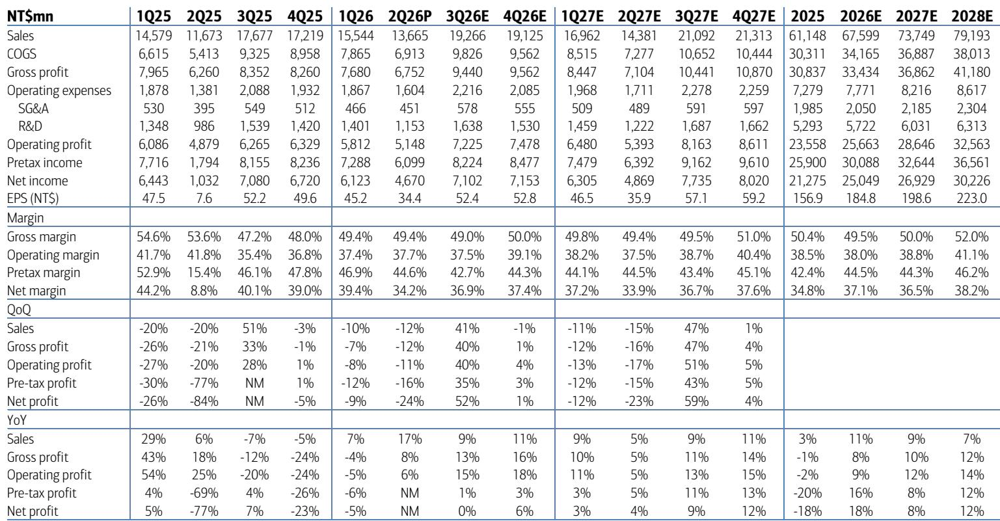
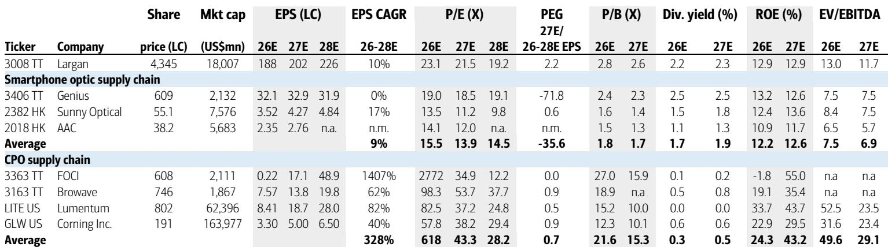
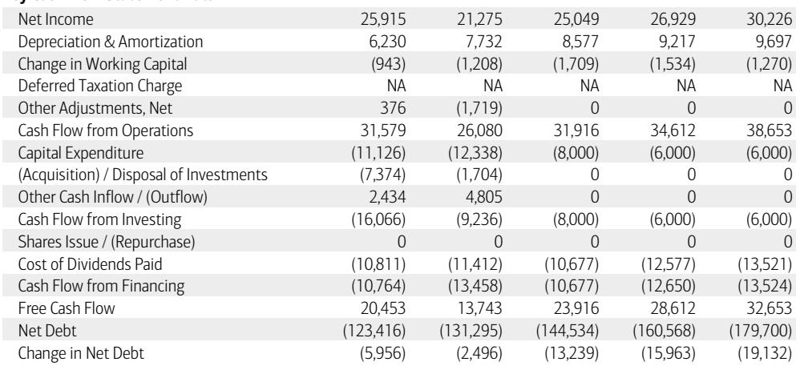

# BofA：TT与CPOSecuritiesLarganPrecision3

这家台湾光学镜头龙头正在经历一次根本性的业务重构。BofA在2026年7月发布的研究报告中，将大立光的评级从中性上调至观点偏积极。驱动这一变化的，不是苹果手机的镜头升级，而是一个全新的市场——共封装光学（CPO）交换机中的光纤阵列单元（FAU）。

报告的核心判断是：大立光有望在2028年之后，凭借在CPO供应链中的份额获取，开启一轮比2016-2018年手机镜头升级周期更强劲的盈利增长。这不是一个渐进式的改善，而是一个结构性拐点。

## 1. CPO业务在2028年就能贡献5-10%的EPS增量，到2030年可能超过60%

BofA的测算显示，如果大立光在FA/FAU市场获得20-30%的份额，且净利率达到30-40%，那么2028年的每股收益将比2026年高出5-10%。这还只是起点。在三种不同情景下，2030年的盈利相比2028年分别有24%、63%和184%的扩张空间。

报告特别指出，大立光在数据中心领域没有历史记录，但其优势在于高精度光学对准的自动化能力，以及已经与CPO生态系统建立的合作关系。公司管理层透露，目前正在与多家客户接洽，认证工作将在未来几个月内推进，试点产线预计在2026年第三季度末完成。

> **KC评论：** 这份报告最值得关注的是它对CPO业务的分阶段量化。2028年的5-10%是“验证期”，2030年的60%以上才是“爆发期”。市场愿意给大立光历史最高25倍市盈率，本质上是在为这个远期爆发提前定价。

## 2. 智能手机业务并未被抛弃，iPhone的规格升级提供了安全垫

在CPO业务尚未放量的过渡期，大立光的传统手机镜头业务依然有支撑。BofA认为，尽管整个智能手机供应链面临内存涨价不确定性，但大立光因iPhone的多镜头升级周期而更具韧性。

具体来看，Pro系列的可变光圈设计将在2026年下半年推动主摄像头单价提升30-50%。而到2027-2028年，主摄和潜望式镜头的高像素化、高镜片数趋势，将继续为大立光带来结构性利好。这份研报将2026-2028年的营收预测分别上调了4.5%、9.2%和15.1%，其中相当一部分来自手机业务的贡献。

## 3. 估值框架的切换：从手机周期到CPO长周期，市场愿意看到2028年之后

估值倍数从16倍（基于2026下半年-2027上半年盈利）提升至25倍（基于2028年盈利）。这个25倍市盈率是大立光历史峰值，与上一轮盈利周期的高点一致。

更关键的是，报告认为市场愿意“看穿”2028年。由于CPO仍处于早期阶段，而光互连是一个长期上行周期，读者倾向于用更长远的视角来评估大立光的价值。BofA用SOTP方法做了交叉验证：假设CPO业务在2030年实现每股收益140新台币，按30倍市盈率估值，折现回2028年，加上传统业务的13倍市盈率估值，合计每报价值为5,641新台币。

这个估值框架的切换，意味着大立光正在从一家“手机镜头周期股”向“光互连成长股”过渡。对于跟踪这家公司的读者而言，需要关注的指标不再是iPhone出货量或镜头单价，而是CPO供应链的认证进度、客户数量和产能扩张节奏。

For informational purposes only. Portions may be generated,translated,summarized,or edited with AI assistance based on source materials and may contain omissions or errors. Please verify independently. This is not investment,legal,tax,accounting,or other professional advice.

For informational purposes only. Portions may be generated,translated,summarized,or edited with AI assistance based on source materials and may contain omissions or errors. Please verify independently. This is not investment,legal,tax,accounting,or other professional advice.

