# Electronics - Thailand

# Thailand and the 800VDC AI Trend

Industry Overview

## AI Infrastructure Enters Its Next Upgrade Cycle

The AI buildout is moving beyond chips. As systems become larger and rack power rises from tens of kilowatts toward 600kW and eventually 1MW-class systems, the bottlenecks are shifting to the infrastructure around the compute. Power delivery, cooling and data movement now need to scale at the same pace as the chips themselves.

## 800VDC and Optical Connectivity Become the Next Enablers

We see two major technology shifts. 800VDC addresses the power problem by reducing current, copper use and conversion losses as rack power rises. Optical connectivity addresses the data problem as copper becomes harder to scale at higher speeds and longer distances. Together, these changes expand the opportunity beyond GPUs into analog ICs, power semiconductors, power racks, cooling, facility infrastructure and photonics.

## Benefits Begin Before Full 800VDC Adoption

Data centers are expected to upgrade gradually, since replacing everything at once would be too costly and disruptive. They start with the most urgent step, improving power equipment around AI racks so these can handle more electricity, then use 800VDC more widely as a more efficient way to deliver power and redesign the facility later. Thailand can benefit throughout this transition, as each stage requires more power electronics, cooling systems, semiconductor assembly, complex PCBs and other supporting hardware already linked to the country's manufacturing base.

## Thailand is Better-Positioned Than It First Appears

Thailand is not a leading-edge chip-design or wafer-fabrication hub, but it has a meaningful role in the downstream supply chain. The country already has manufacturing exposure across power electronics, semiconductor assembly and testing, complex PCBs, optical products, storage, transformers and cooling fluids. As more value shifts into the hardware around AI chips, this manufacturing base becomes increasingly relevant.

## Stock Implications Extend Across Thai and Foreign Equities

For stock implications, we look at all Thai-listed companies that could gain benefit from 800VDC AI wave. Thai names include DELTA, HANA, KCE, SMT, CCET, AMATA, WHA PSP and TRT.

## 14 July 2026

Equity
ASEAN | Thailand
Electronics

Suppapong lemkongaek, CFA, CMT ^^^
Research Analyst
Kiatnakin Phatra Securities
+66 2 305 9925
suppapong.iemk@kkpfg.com

## Narumon Ekasamut ^^^^

Research Analyst
Kiatnakin Phatra Securities
+66 2 305 9086
narumon.ekas@kkpfg.com

## AI: Artificial Intelligence

AC: Alternating Current

DC: Direct Current

AC/DC: Alternating Current to Direct Current

PSU: Power Supply Unit

VRM: Voltage Regulator Module

PDU: Power Distribution Unit

UPS: Uninterruptible Power Supply

ESS: Energy Storage System

BESS: Battery Energy Storage System

SST: Solid-State Transformer

MV: Medium Voltage

LV: Low Voltage

HVDC: High-Voltage Direct Current

800VDC: 800-Volt Direct Current

IBC: Intermediate Bus Converter

BBU: Battery Backup Unit

PCS: Power Conversion System

CDU: Coolant Distribution Unit

DLC: Direct Liquid Cooling

GPU: Graphics Processing Unit

CPU: Central Processing Unit

DPU: Data Processing Unit

NIC: Network Interface Card

HBM: High Bandwidth Memory

PCB: Printed Circuit Board

EMS: Electronics Manufacturing

Services

Si: Silicon

SiC: Silicon Carbide

GaN: Gallium Nitride

Source: KKPS

## Executive summary

Exhibit 1: AI's Two Bottlenecks: 800VDC Power and Optical Connectivity
AI compute growth is pushing demand into power and connectivity, creating new opportunities for Thailand's electronics

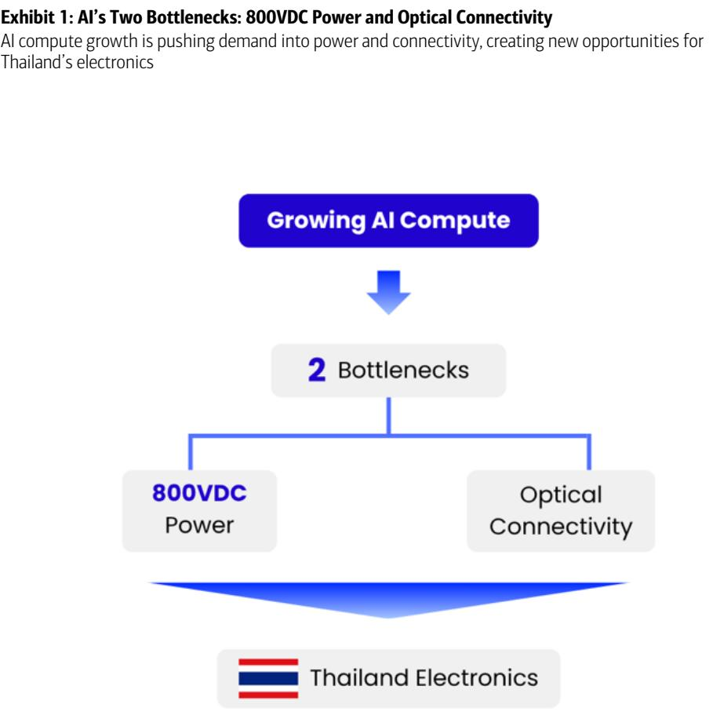

BofA GLOBAL RESEARCH

## AI Infrastructure is Moving Into Its Next Bottleneck

AI investment has moved from GPUs to memory and is now reaching a new constraint: the infrastructure around the chips. As AI systems become larger, rack power is rising from tens of kilowatts toward 600kW and eventually 1MW-class systems. At the same time, more chips need to exchange much larger amounts of data. In our view, this creates two parallel upgrade cycles in data centers: 800VDC for power delivery and optical connectivity for data movement.

## 800VDC Expands the Opportunity Across the Whole Power Chain

Traditional data-center power systems were built for much lower rack power. As power rises, pushing more current through the system requires more copper and creates more heat loss. 800VDC addresses this by using higher voltage and lower current, while gradually moving power conversion away from the compute rack toward dedicated power racks and, longer term, facility-level infrastructure. The transition should therefore increase demand across server-board power, PSUs, power racks, cooling, energy storage, protection systems and new technologies such as SSTs and SSCBs. BofA estimates the AI analog semiconductor market will likely grow from US\$7.9bn in CY25 to around US\$28bn by CY30.

## Optics Address the Second Constraint as Copper Reaches Its Limits

Power is only one part of the problem. Larger AI systems also require much more data to move between chips and racks. Copper remains suitable for short distances but becomes harder to scale as data rates rise because of signal loss, reach and power constraints. This is driving greater use of optical transceivers, silicon photonics and other optical networking technologies. BofA estimates optical connectivity TAM could reach around US\$88bn by 2030, or roughly 80% of AI connectivity spending.

## Thailand Could Benefit Through Downstream Manufacturing

Thailand does not need to manufacture the leading AI chip to participate in this cycle. Its opportunity sits in the hardware around the chip, including power electronics, semiconductor assembly and testing, complex PCBs, optical products, storage, transformers and cooling fluids. This gives the Thai electronics sector exposure to both the power and connectivity upgrades discussed in this report.

For stock implications, Thai-listed equities include HANA, DELTA, KCE, SMT, CCET, WHA, AMATA, PSP and TRT.

## AI's Insatiable Appetite for Power

AI investment has moved through distinct waves, each defined by a different bottleneck. The first was the GPU, the engine of AI computation. Attention then shifted to memory, as high-bandwidth memory (HBM) became the constraint on how fast those GPUs could be fed. With each bottleneck addressed, the next has come into view. Today it is the electricity these systems consume, and the heat that comes with it.

A single rack of Nvidia's newest AI servers will soon draw more electricity than a thousand American homes. A standard server rack draws 10 to 15 kilowatts, closer to what a dozen homes use. The gap is nearly a hundredfold, and it points to where the AI race is really headed. It is not a contest for chips so much as a contest for power.

Exhibit 2: Rack power across Nvidia generations

Power capacity per rack (kilowatts) across various generations of Nvidia platforms vs. a traditional server rack

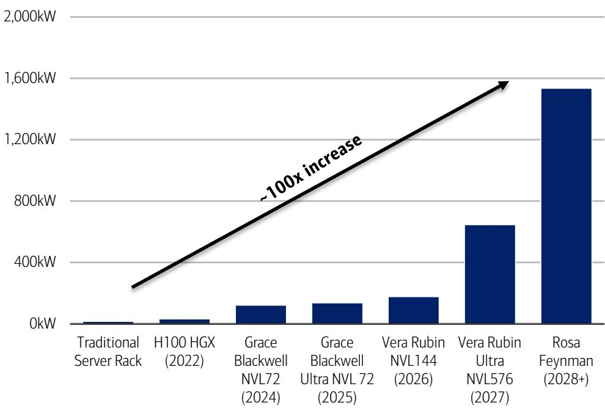  
Source: BofA Global Research estimates, Nvidia, Company reports  
BofA GLOBAL RESEARCH

The power demand is no longer just about the GPU. As AI evolves, it needs more types of work to be done. First, AI is trained (this means building the model). Then it is used to answer questions (this is called inference). Now, AI is also starting to handle more complex tasks, where it breaks a problem into steps and uses tools to solve it.

Because of this, the system needs more supporting parts. These include CPUs (which manage and control the system), switches (which move data between chips), network cards (which connect the system to other machines), and memory (which stores data close to where it is used).

The GPU remains the main compute engine, but it cannot work efficiently without this surrounding hardware. In the densest configurations, networking switches alone can account for close to one-fifth of total rack power. The implication is that AI power demand is becoming a full-rack issue, not just a GPU issue.

Exhibit 3: Nvidia power budget analysis
Power budget broadens across the rack

<table><tr><td>Component (in kW)</td><td>H100(2022)</td><td>GB200Blackwell(2024)</td><td>Vera Rubin(2026)</td><td>Rubin Ultra(2027)</td><td>Feynman (2028+)</td></tr><tr><td>GPU</td><td>22.4</td><td>86.4</td><td>129.6</td><td>518.4</td><td>1036.8</td></tr><tr><td>CPU</td><td>2.4</td><td>10.8</td><td>12.6</td><td>25.2</td><td>100.8</td></tr><tr><td>Switch</td><td>3</td><td>14.4</td><td>19.8</td><td>54.5</td><td>288</td></tr><tr><td>NIC</td><td>0.8</td><td>1.8</td><td>2.2</td><td>4.3</td><td>28.8</td></tr><tr><td>DPU</td><td>0.2</td><td>1.4</td><td>2.7</td><td>5.4</td><td>28.8</td></tr><tr><td>Overhead</td><td>2.7</td><td>6</td><td>9.7</td><td>37.8</td><td>51.4</td></tr><tr><td>Total Rack Power</td><td>32</td><td>121</td><td>177</td><td>646</td><td>1535</td></tr></table>

Source: BofA Global Research estimates, Nvidia  
BofA GLOBAL RESEARCH

At a basic level, the constraint comes from physics. AI chips need to exchange data at very high speed, but copper links can only carry that data over short distances. To make the system work as one large compute engine, vendors have to place more AI accelerators, CPUs, networking chips and memory closer together. Performance therefore comes from higher rack density, and higher rack density comes with more power and heat.

Nvidia's move from Hopper (old generation chip model) to Blackwell (new generation chip model) shows the trade-off. Rack power density increased by more than 3x, while system performance improved by roughly 50x. The performance gain is large, but it is achieved by packing more compute and networking hardware into the same rack.

This trend is not limited to Nvidia. AMD's latest accelerators are also moving toward 1,400-1,800W per chip, pushing rack power above 100kW. In-house ASICs from Google and Amazon may be more efficient for specific workloads, but their total rack power is also rising as systems scale. Higher power density is therefore an industry trend, not an Nvidia-specific issue.

Exhibit 4: Power consumption of other merchant GPUs and custom ASIC platforms Rising power is industry-wide, not just Nvidia

<table><tr><td>Company</td><td>Platform</td><td>Chip</td><td>Per-Chip Power (W)</td><td>Total Rack Power (kW)</td></tr><tr><td>Nvidia</td><td>Vera Rubin NVL144</td><td>Rubin</td><td>1800</td><td>177</td></tr><tr><td>AMD</td><td>Helios</td><td>MI400X/MI455X</td><td>2000</td><td>173</td></tr><tr><td>AMD</td><td>MI350X rack</td><td>MI355X</td><td>1400</td><td>107</td></tr><tr><td>AWS</td><td>Trainium 3 UltraServer</td><td>Trainium 3</td><td>1000</td><td>100</td></tr><tr><td>Google</td><td>Ironwood Cube</td><td>TPU v7</td><td>1000</td><td>79</td></tr><tr><td>Intel</td><td>Gaudi rack</td><td>Gaudi 3</td><td>1000</td><td>51</td></tr></table>

Source: BofA Global Research estimates, AMD, Intel, AWS, Google, Nvidia  
BofA GLOBAL RESEARCH

The implication for data centers is that buying more chips is no longer enough. Each rack must receive far more power than before, and the traditional power-delivery chain is reaching its practical limits. This is where the case for 800VDC begins.

## Why Does the World Need 800VDC?

The case for 800VDC starts with a simple equation: power equals voltage times current, or $P = V \times I$ .

Power is what the rack needs. Voltage is the pressure that pushes electricity through the system. Current (or intensity) is the amount of electricity flowing through the conductor. When rack power rises, either voltage or current must rise with it.

For many years, data centers could rely on the existing low-voltage architecture and simply push more current through the system. That worked when racks consumed tens of kilowatts. It becomes much harder when AI racks move toward hundreds of kilowatts and eventually megawatt-class power.

## Exhibit 5: Power equation

Higher power consumption will end with higher voltage

Power = Voltage x Intensity

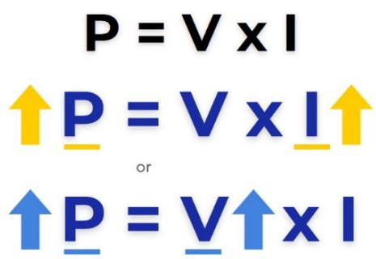

More Power = More Current

Problems: ① Copper Mass ② Heat Loss

That's why V needs to increase and the world wants 800VDC

## Source: KKPS

BofA GLOBAL RESEARCH

The first problem is copper. Higher current needs larger conductors, busbars and connectors. At 600kW, a legacy 48V architecture would require around 12,500 amps of current. At that level, the copper busbar can become extremely large and heavy. This is difficult to fit inside the rack and expensive to scale across a large data center.

The second problem is heat loss. Electrical losses rise with the square of current. In simple terms, doubling current can increase heat loss by around four times. This wasted energy does not create compute output. It becomes heat that the data center must remove.

800VDC solves this by raising the voltage. For the same amount of power, higher voltage means lower current. A 600kW rack at 800V requires only around 750 amps, compared with around 12,500 amps at 48V.

## Exhibit 6: Benefits of 800VDC for the system

800VDC results in less copper and less heat

<table><tr><td></td><td>Old way (54V)</td><td>New way (800VDC)</td><td>What this means?</td></tr><tr><td>Voltage sent through the data center</td><td>Low (54 volts)</td><td>High (800 volts)</td><td>Higher voltage moves the same power with less current</td></tr><tr><td>Electrical current (flow through the wire)</td><td>Very high</td><td>Much lower</td><td>Current is what creates copper bulk and heat, so less current fixes both</td></tr><tr><td>Copper wiring needed</td><td>Heavy, up to 200kg per rack</td><td>About 45% less</td><td>Thinner wires, less copper</td></tr><tr><td>Energy wasted as heat</td><td>High</td><td>Over 10x lower</td><td>Less wasted power</td></tr><tr><td>Bottom line</td><td>Breaks down past a few hundred kilowatts</td><td>Scales to 1MW racks and beyond</td><td>The only practical way to power today&#x27;s racks</td></tr></table>

Source: BofA Global Research, Nvidia white paper  
BofA GLOBAL RESEARCH

## The Benefits of 800VDC Can Be Explained in a Simple Sequence

First, lower current means smaller conductors, lighter busbars and easier rack design. This reduces material usage and makes large-scale deployment more practical.

Second, electrical losses rise with the square of current. By reducing current, 800VDC significantly cuts power loss and waste heat in the power-delivery chain.

Third, this architecture is built for the next phase of AI scaling, where racks move from around 100kW today toward 600kW, 1MW and beyond, providing a clear path to expand infrastructure without hitting physical limits.

Fourth, today's power chain includes several conversion stages before electricity reaches the GPU. By reducing redundant conversion steps, 800VDC can improve end-to-end efficiency.

A simpler power chain also means fewer components and fewer failure points, which can reduce maintenance cost and improve total cost of ownership.

This is why 800VDC is not just a new electrical standard. It is the practical response to rising AI rack power. It does not make GPUs consume less energy. It makes that energy easier to deliver, with less copper, less heat loss and a power architecture that can scale with future AI racks.

## The Path to 800VDC: A Three-Stage Transition

Today's AI data centers are not expected to switch directly to facility-wide 800VDC. Instead, the industry is likely to transition through three stages, with the key change being that power conversion gradually moves further upstream as rack power continues to increase.

## Phase 1: Traditional AC Architecture (Today)

Today's data centers still follow conventional power architecture. Electricity enters the facility as AC power, passes through transformers, backup systems and power distribution equipment before reaching the compute rack. Inside the rack, AC is converted into DC and then stepped down multiple times to supply the low voltages required by GPUs.

This architecture was designed for much lower rack power. As AI racks approach hundreds of kilowatts, concentrating power conversion inside or near the compute rack consumes valuable rack space, generates additional heat and increases conversion losses. According to BofA, this architecture delivers end-to-end power efficiency of around 87.6%. See our report: Technology - Asia Pacific: HVDC for Rubin Ultra; Delta's solid R&D & position to enjoy content/shipment growth 24 November 2025.

## Phase 2: Power-Rack Architecture (Expected Next Step)

The first step toward 800VDC does not require rebuilding the entire data center. Instead, the main AC/DC conversion is relocated from the compute rack to a dedicated power rack positioned nearby. The existing facility infrastructure remains largely unchanged, while the power rack converts 480V AC into 800VDC before distributing power to the compute racks.

This intermediate architecture is attractive because it removes bulky conversion equipment from the compute rack, freeing up space for AI hardware while reducing heat generation close to GPUs. Since most of the upstream electrical infrastructure can remain intact, it is considerably easier to retrofit into existing facilities. BofA estimates that end-to-end efficiency improves to approximately 89.1%.

## Phase 3: Full Facility-Level 800VDC Architecture (Longer Term)

The final stage shifts power conversion even further upstream. Rather than distributing 480V or 415V AC throughout the facility, medium-voltage AC is converted directly into 800VDC and distributed across the entire data center with fewer conversion stages.

This architecture relies on Solid-State Transformers (SSTs), which combine wide-bandgap power semiconductors with high-frequency transformers to convert medium-voltage AC into regulated DC while improving efficiency, power quality and system control.

Although this delivers the cleanest and most efficient power architecture, it also requires the greatest redesign. Existing data centers would need new protection systems, safety standards and facility-level power equipment capable of handling high-voltage DC. SSTs themselves must also meet stringent requirements for high power, reliability and cost, making this a longer-term transition. BofA estimates end-to-end efficiency improves further to around 92.1%.

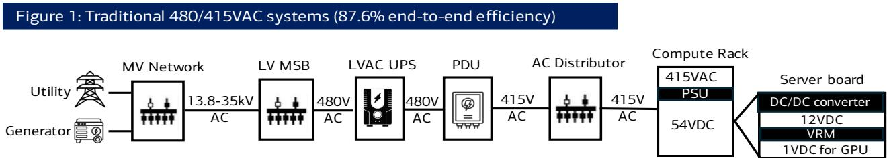

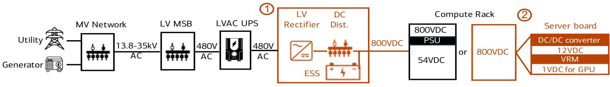

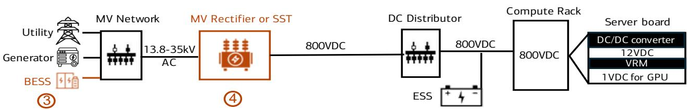  
Key differences between the 800VDC architecture and traditional systems:
1. AC/DC conversions shifting to the power rack or the facility level
2. Less DC-DC conversions within the compute rack
3. Integration of energy storage systems to replace UPS
4. Introduction of high-frequency SSTs

Source: BofA Global Research, Nvidia white paper. AC: alternating current. BESS: battery energy storage system. DC: direct current. Dist.: Distribution. ESS: energy storage system. GPU: Graphics Processing Unit. LV: low voltage. MSB: main switchboard. MV: medium voltage. PDU: power distribution unit. PSU: power supply unit. SST: solid state transformer. UPS: uninterruptible power supply. V: voltage. VRM: voltage regulator module

BofA GLOBAL RESEARCH

## Industry Roadmap

According to BofA, the industry remains firmly in Phase 1, with traditional 480/415V AC architectures still dominating today's data centers. The transition is expected to begin around 2027, when Nvidia's Rubin Ultra Kyber platform may introduce 800VDC primarily through power-rack architectures, allowing operators to improve efficiency without redesigning the entire facility.

The subsequent transition toward facility-wide 800VDC is expected to occur later. While BofA does not provide a precise timeline, its industry model introduces SST content from CY28, alongside 1MW-class AI racks and hybrid microgrid architectures, suggesting that power conversion will progressively migrate upstream as AI power density continues to increase.

Overall, the evolution toward 800VDC is expected to be gradual rather than disruptive. The industry is likely to move first from in-rack conversion, to power-rack conversion, and ultimately to facility-level conversion, with each stage improving efficiency while requiring progressively greater infrastructure changes.

## SST is the Key Enabler of Next-Generation AI-Power System

SST stands for solid-state transformer. It is an electronic transformer that uses power semiconductors instead of relying mainly on copper coils and magnetic cores.

A traditional transformer is large, heavy and mostly passive. It can step voltage up or down, but it does not actively manage power flow. SST works differently. It uses advanced power semiconductors, such as SiC and GaN, together with a high-frequency transformer. This allows the transformer to be smaller, more controllable and better suited for high-voltage DC power systems.

Exhibit 8: SST structure using SiC/GaN power semiconductors and high-frequency transformer Illustration of solid-state transformer (SST) structure  
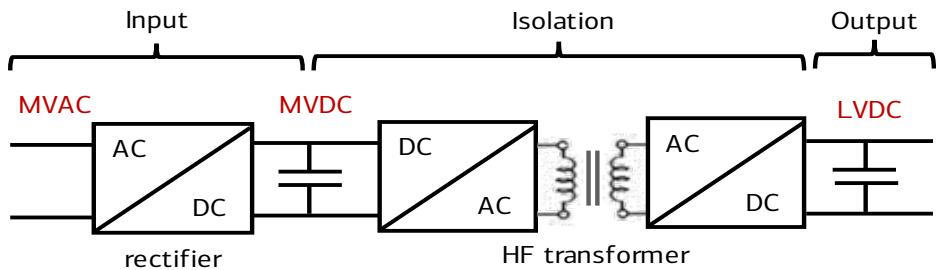  
Source: BofA Global Research. AC: alternating current. DC: direct current. GaN: Gallium Nitride. LV: low voltage. MV: medium voltage. SiC: Silicon Carbide

BofA GLOBAL RESEARCH

SST matters because the final 800VDC architecture wants to move power conversion closer to where electricity first enters the data center, at the facility level. Instead of relying on multiple older conversion steps before power reaches the AI racks, SST can help convert incoming high-voltage AC power directly into an 800VDC bus that can be distributed across the facility.

## This Creates Three Key Benefits

First, SST simplifies the power chain. By reducing the number of conversion stages, the data center can reduce power loss and remove some of the complexity of the old low-voltage architecture.

Second, SST improves control. Unlike a traditional transformer, SST is an electronic system. It can help manage voltage conversion, isolation, protection and power quality. This becomes more important as AI racks create larger and faster-changing power loads.

Third, SST supports a more DC-based data center. Once the facility has an 800VDC bus, energy storage and backup power can connect more directly to the DC system. This can reduce redundant conversion steps and make the overall power architecture cleaner.

The reason SST is not the first step is that it is technically difficult. It must handle high voltage, high power, strict safety requirements and data-center-level reliability. It also depends on advanced SiC/GaN power semiconductors, protection systems and customer qualification at scale.

The investment point is that SST pushes value further upstream in the power chain. In the old design, much of the value was concentrated in in-rack PSUs and lower-voltage conversion. In the full 800VDC architecture, more value shifts to facility-level power equipment, SSTs, protection devices, sensors, controllers and high-voltage power semiconductors. SST is therefore important because it turns 800VDC from a rack-level upgrade into a facility-level power architecture.

## Key Beneficiary Sectors from the 800VDC Transition

The transition to 800VDC expands the AI power opportunity well beyond server boards, creating new value pools across the entire power chain—from compute racks to facility-level infrastructure.

BofA estimates the AI analog semiconductor market will likely increase from US\$7.9bn in CY25 to around US\$27bn by CY30, representing a CAGR of approximately 28%. Growth is driven by both higher AI rack shipments and increasing semiconductor content per rack as power architecture becomes more sophisticated.

## Exhibit 9: Analog semi TAM

The AI analog semi market should grow from US\$7.9bn in CY25 to around US\$27bn by CY30

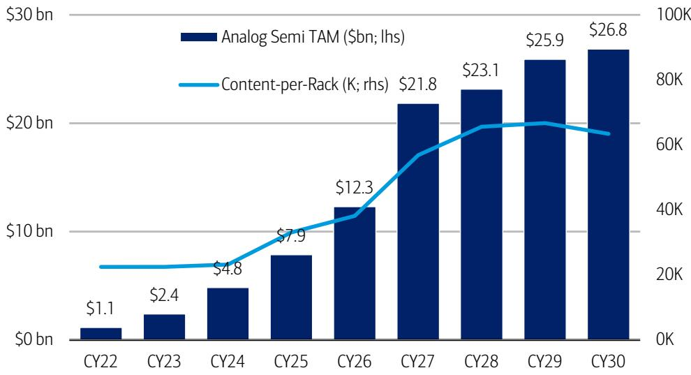  
Source: BofA Global Research estimates, Company reports, Gartner, Omdia, Infineon, Nvidia  
BofA GLOBAL RESEARCH

To better understand where this growth is captured, we examine the same US\$27bn opportunity through two complementary lenses.

\- Component view — shows where spending occurs across the AI power architecture, including server-board power, PSUs, power racks, cooling systems and facility infrastructure.

\- Semiconductor view — shows which semiconductor technologies capture that spending, including analog ICs, silicon power devices, SiC, GaN, MCUs and sensors.

These are two perspectives on the same market. For example, a power rack appears in the component view, while the semiconductor view breaks that same power rack into its underlying chip content.

Source: BofA Global Research estimates, Company reports, Gartner, Omdia, Infineon, Nvidia

# Perspective 1 — By Component: Where Value is Created Across the AI Power Chain

Viewed through a component lens, the key investment themes are summarized below.

Exhibit 10: Summarize table of perspective 1
Key components and why they benefit

<table><tr><td>Area/component</td><td>What it does</td><td>Why it benefits</td><td>Key number</td></tr><tr><td>Server-board power</td><td>Steps power down before it reaches the GPU</td><td>Higher rack power requires more board-level conversion</td><td>HV IBC content rises from US$3,000/rack at &lt;160kW to US$216,000 at 1MW class</td></tr><tr><td>PSU and power racks</td><td>Convert and distribute power to the compute rack</td><td>Higher-power racks need larger and more centralized power systems</td><td>PSU analog semi TAM rises from US$1.2bn in CY25 to US$2.6bn by CY30</td></tr><tr><td>Cooling</td><td>Removes heat from chips, racks and facilities</td><td>More powerful racks generate much more heat</td><td>Cooling TAM rises from US$89mn in CY25 to US$477mn by CY30</td></tr><tr><td>Facility infrastructure</td><td>Converts, stores and protects power at facility level</td><td>800VDC adds new infrastructure such as ESS, SST and SSCB</td><td>TAM rises from US$245mn in CY25 to around US$1.8bn by CY30</td></tr></table>

The following sections examine each component and the key drivers behind its growth.

Component 1: Server-board power — VRMs and HV IBCs remain the foundation Although the transition to 800VDC shifts part of the power architecture upstream, it does not eliminate the need for power conversion inside the compute rack. GPUs still operate at very low voltages, meaning power must ultimately be stepped down from the 800VDC bus to chip-level voltages through multiple conversion stages.

This is where Voltage Regulator Modules (VRMs) and High-Voltage Intermediate Bus Converters (HV IBCs) play a critical role. As rack power increases, these components must process substantially higher power while maintaining efficiency, thermal performance and power integrity. Consequently, server-board power remains one of the largest beneficiaries of AI infrastructure investment.

Exhibit 11: Evolution of HV IBC component content as racks increase in power capacity
HV IBC could reach US\$216,000/rack

<table><tr><td>Component</td><td>What it means</td><td>&lt;100kW rack</td><td>&lt;160kW rack</td><td>600+kW rack</td><td>1MW-class rack</td></tr><tr><td>48V bus converter/HV IBC</td><td>Intermediate converter that steps down bus voltage before final chip-level conversion</td><td>US$1,000/rack</td><td>US$3,000/rack</td><td>US$43,000/rack</td><td>US$216,000/rack</td></tr><tr><td>Total rack-to-core analog content</td><td>Total analog semi content from rack input to chip-level power conversion</td><td>US$17,000/rack</td><td>US$36,000/rack</td><td>US$291,000/rack</td><td>US$917,000/rack</td></tr><tr><td colspan="6">Source: BofA Global Research estimates, Company reports, Gartner, Omdia, Infineon, Nvidia</td></tr></table>

BofA's estimates show how rapidly board-level power content expands alongside rack power. Total rack-to-core analog semiconductor content increases from approximately US\$36,000 per rack in today's high-performance systems to US\$291,000 for 600kW racks and US\$917,000 for future 1MW-class racks.

Within this, HV IBCs represent one of the fastest-growing content opportunities. Their value increases from around US\$1,000 per rack in conventional systems to US\$43,000 at 600kW and US\$216,000 in 1MW-class architectures.

Investment takeaway: 800VDC changes where high-voltage power enters the rack, but it does not change the GPU's low-voltage power requirements. Regardless of whether

power originates from a traditional AC architecture or a future 800VDC system, every GPU still requires highly efficient board-level power conversion immediately before the chip. As AI racks become more power-dense, the complexity and semiconductor content of these final conversion stages continue to increase, making server-board power one of the largest and most durable beneficiaries of AI infrastructure spending.

Exhibit 12: IBC TAM
IBC TAM could reach US\$3642mn in CY30  
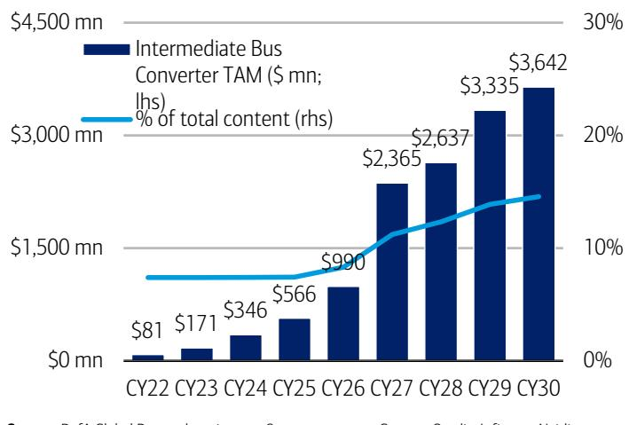  
Source: BofA Global Research estimates, Company reports, Gartner, Omdia, Infineon, Nvidia
BofA GLOBAL RESEARCH  
Exhibit 13: Voltage Regulator Module (VRM) roadmap $1A/mm^{2} \rightarrow 3A/mm^{2}$

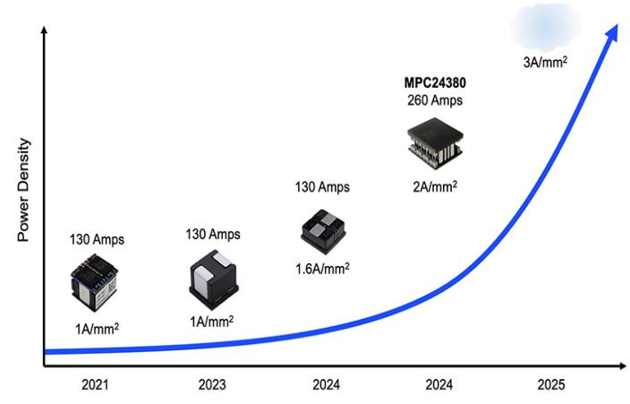  
BofA GLOBAL RESEARCH

## Component 2: PSU and Power Racks- Value Shifts from Rack-Level to System-Level Power Conversion

The second major beneficiary is the power supply system. As AI rack power continues to increase, the industry is moving away from traditional rack-level power conversion toward centralized power racks capable of handling much higher power loads.

Under conventional architecture, Power Supply Units (PSUs) are located within or adjacent to the compute rack, converting incoming AC power into DC before supplying the server boards. This approach was adequate for lower-power racks but has become increasingly inefficient as rack power reaches hundreds of kilowatts, consuming valuable rack space, generating additional heat and increasing conversion losses.

The transition to 800VDC addresses these limitations by relocating front-end AC/DC conversion from the compute rack to dedicated power racks. By centralizing high-power conversion, operators can free up compute-rack space for AI hardware, improve thermal management and increase overall power efficiency.

According to BofA, the PSU-related analog semiconductor market is expected to grow from approximately US\$1.2bn in CY25 to US\$2.6bn by CY30. While PSUs remain an important market, the composition of spending is expected to evolve as power architecture becomes increasingly centralized.

Investment takeaway: Value is shifting from standalone rack-level PSUs toward higher-power, more integrated power racks, power shelves and system-level power management solutions. As 800VDC adoption increases, these upstream power systems should capture an expanding share of the AI power value chain.

Exhibit 14: PSU TAM
PSU total content could grow from \~US\$1.2bn today to US\$2.6bn by CY30  
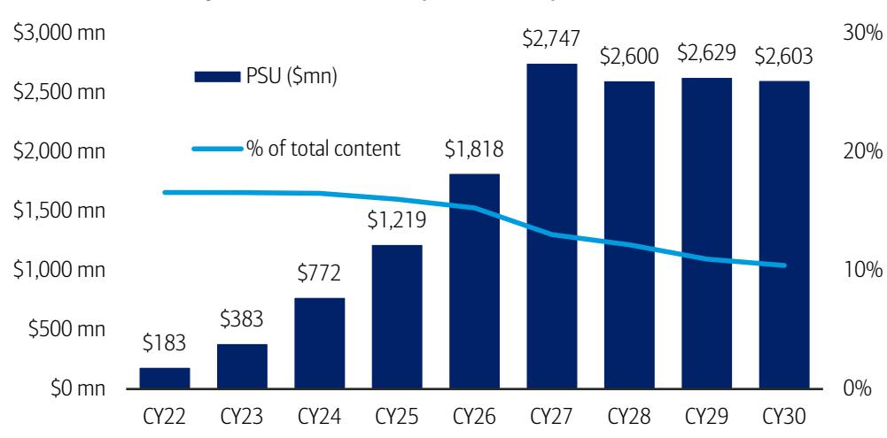  
Source: BofA Global Research estimates, Company reports, Gartner, Omdia, Infineon,  
BofA GLOBAL RESEARCH

## Exhibit 15: In-server PSU vs. in-rack power shelf vs. power rack sidecar Transition phases of PSU

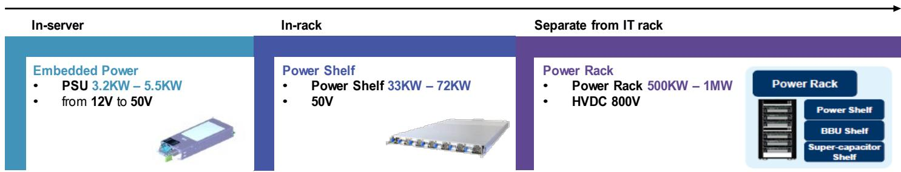  
Source: BofA Global Research

## Component 3: Cooling and Thermal Management- Higher Power Density Drives Greater Cooling Demand

Cooling and thermal management represent another key beneficiary of AI infrastructure upgrades. As rack power increases from tens of kilowatts today toward hundreds of kilowatts and eventually 1MW-class systems, removing heat becomes just as critical as delivering power.

Cooling requirements can be viewed across three layers. Chip-level cooling removes heat directly from GPUs and other processors, rack-level cooling manages heat within the server rack, while facility-level cooling rejects heat from the data hall through pumps, heat exchangers, chillers and control systems.

Traditional data centers relied primarily on air cooling because rack power was relatively modest. However, as AI racks become substantially more power dense, air cooling alone becomes increasingly inadequate. This is driving a structural shift toward liquid cooling, which can dissipate heat more efficiently and support much higher thermal loads.

800VDC and advanced cooling are complementary technologies. While 800VDC improves the efficiency of power delivery by reducing conversion losses, it does not eliminate the heat generated by increasingly powerful AI chips. As a result, advances in power delivery and cooling must occur in parallel to enable the next generation of AI infrastructure.

BofA estimates that facility cooling infrastructure content increases from approximately US\$4,500/MW under traditional low-voltage architectures to around US\$9,000/MW in high-voltage systems, implying that cooling content per megawatt roughly doubles as AI power density rises.

In addition, BofA projects the analog semiconductor TAM for facility cooling infrastructure to expand from approximately US\$89mn in CY25 to US\$477mn by CY30, reflecting growing demand for sensors, controllers, power management ICs and monitoring solutions embedded throughout modern cooling systems.

Investment takeaway: Higher rack power increases both power-delivery and thermal-management requirements. While 800VDC improves electrical efficiency, it also accelerates the adoption of more sophisticated cooling architectures, creating additional opportunities across the AI infrastructure ecosystem.

## Exhibit 16: Facility cooling infrastructure value per MW table

Facility cooling content doubles in the high-voltage era

<table><tr><td></td><td>Per MW(Low Voltage Era)</td><td>Per MW(High Voltage Era)</td></tr><tr><td>Components</td><td>Sales</td><td>Sales</td></tr><tr><td>Facility Cooling Infrastructure</td><td>US$4,500</td><td>US$9,000</td
