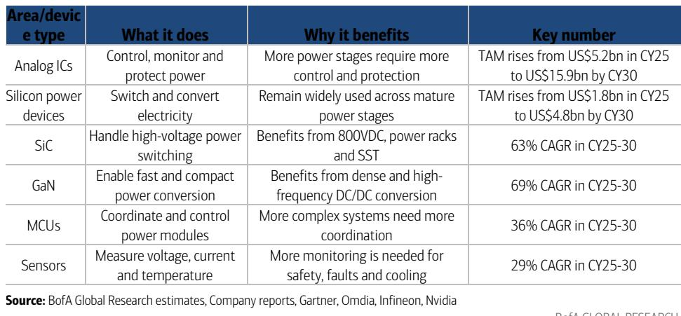
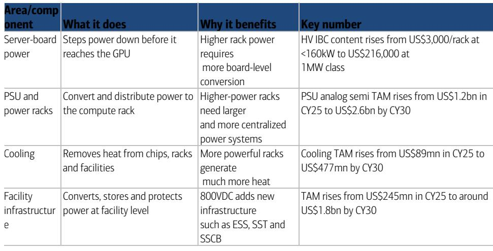
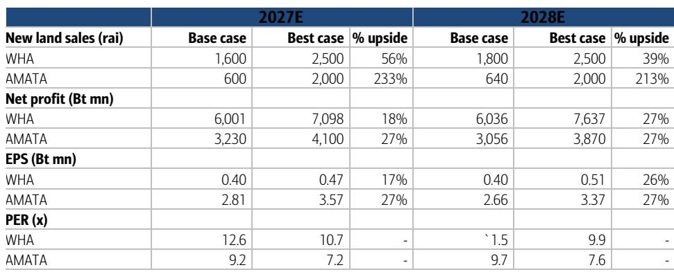

# BofA：泰国乘上800VDC AI浪潮-机架功率跃迁催生供电拐点

AI研究已经走过了GPU和HBM两轮瓶颈。现在，第三个约束正在浮现：电力本身。BofA这份报告的核心判断是，AI机架功率正从几十千瓦冲向600千瓦乃至1兆瓦级别，传统低压供电架构已经走到物理极限。下一个技术拐点，是800V直流供电和光互联。这不是一个远期概念——从Nvidia的Hopper到Blackwell，单机架功率已增长超过3倍，而下一代Rubin Ultra将逼近650千瓦。供电不再只是配套问题，它正在成为AI规模化的主约束。

## 1. 机架功率的跃迁让铜和热成为不可忽视的物理成本

BofA的测算显示，一个传统服务器机架功率约10-15千瓦，而Nvidia最新的AI机架已超过120千瓦。到2027年的Rubin Ultra，这一数字将接近650千瓦。问题出在基础物理上：功率等于电压乘以电流。如果维持现有48V低压架构，600千瓦的机架需要约12,500安培电流。这带来的后果是铜排体积巨大、重量超过200公斤，同时电流损耗随平方上升，废热激增。

800VDC的解决方案并不复杂——将电压提升至800V，电流降至约750安培。铜用量减少约45%，热损耗降低超过10倍。这不是一个渐进优化，而是让兆瓦级机架在物理上变得可行的必要条件。

> **KC评论：** 这里容易被忽略的是，800VDC的收益并非只在大规模新建数据中心才成立。BofA指出，过渡可以从“功率机架”开始——只把AC/DC转换从计算机架移到专用功率机架，现有设施基础设施基本不变。这意味着存量数据中心也有改造路径，不是非推倒重来不可。

## 2. 供电升级分三阶段推进，每个阶段都扩大硬件需求

BofA将过渡路径拆解为三个阶段。第一阶段是当前的传统AC架构，端到端效率约87.6%。第二阶段引入功率机架，将主AC/DC转换移出计算机架，效率提升至89.1%，且改造难度较低。第三阶段是设施级800VDC，依赖固态变压器（SST）将中压AC直接转为800VDC，效率达到92.1%，但需要全新的保护系统和安全标准。

对供应链而言，每个阶段都意味着增量需求。从服务器板级电源、PSU、功率机架，到冷却系统、储能、保护设备以及SST和固态断路器，整个功率链的组件种类和单价都在上升。BofA估算，AI模拟半导体市场将从2025年的79亿美元增长至2030年的约280亿美元。

## 3. 泰国在下游制造环节的定位比表面看起来更扎实

这份报告最值得产业观察者注意的部分，是它对泰国角色的重新评估。泰国并非芯片设计或晶圆制造的前沿，但在功率电子、半导体封装测试、复杂PCB、光学产品、存储、变压器和冷却液等领域已有制造基础。随着AI价值从芯片本身向周边硬件转移，这个制造基座的价值正在上升。

报告列出的泰国上市公司包括DELTA、HANA、KCE、SMT、CCET、AMATA、WHA、PSP和TRT。这些公司覆盖了从电源管理、PCB到工业地产和冷却液的多个环节。BofA的逻辑是，泰国不需要制造GPU就能参与AI基建周期——它需要的是在功率和互联两个升级方向上提供配套硬件的能力。

## 4. 光互联是另一个被低估的规模变量，TAM或达880亿美元

供电只是AI基础设施的一个约束。另一个是数据移动。随着机架内芯片数量增加，铜缆在更高数据速率下的信号损耗、距离和功耗限制越来越明显。BofA估计，光互联的潜在市场规模到2030年可达约880亿美元，约占AI互联总支出的80%。这包括光收发器、硅光子和其它光网络技术。

对泰国而言，光学产品的制造基础是一个可被激活的增量。报告没有给出具体收入贡献预测，但将光学产品列为泰国电子制造业的既有能力之一，暗示这一环节可能随着AI互联升级而获得更多订单分配。

---

这份报告的核心价值不在于预测哪家公司会涨，而在于提供了一个可复用的观察框架：当AI规模化的瓶颈从芯片转向供电和互联时，哪些环节的硬件需求会结构性增长，以及哪些地区的制造能力恰好卡在这些环节上。对于关注东南亚电子产业链的读者，这是一个值得持续跟踪的变量。

For informational purposes only. Portions may be generated,translated,summarized,or edited with AI assistance based on source materials and may contain omissions or errors. Please verify independently. This is not investment,legal,tax,accounting,or other professional advice.

For informational purposes only. Portions may be generated,translated,summarized,or edited with AI assistance based on source materials and may contain omissions or errors. Please verify independently. This is not investment,legal,tax,accounting,or other professional advice.

