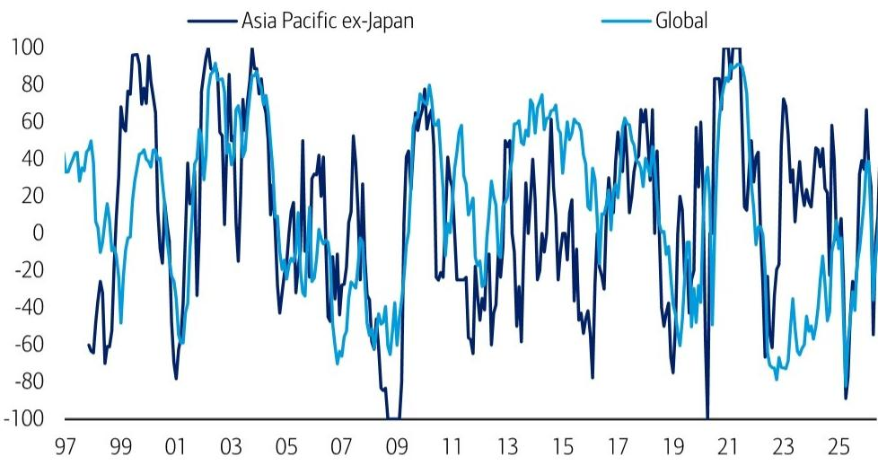
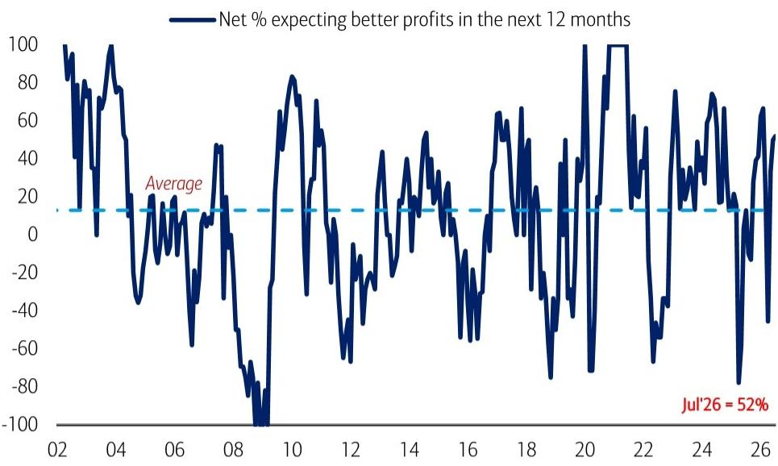
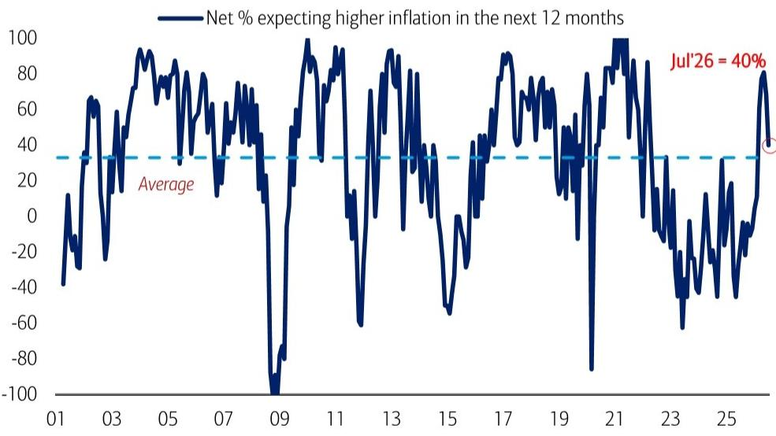

# BofA：BofA亚洲组合负责人调查，宏观环境变化与AI趋势观察

BofA7月亚洲组合负责人调查释放了一个清晰信号：市场对AI的定价逻辑正在从“谁生产芯片”转向“谁为芯片供电”。日本和美国取代台湾，成为受访者眼中下一阶段AI周期最明确的受益地区。与此同时，台湾超越日本成为最受偏好的单一市场，印度和印尼则继续垫底。

这份覆盖210位管理5550亿美元资产的组合负责人的调查，在BofA美国宏观环境团队预期年内加息75个基点的背景下展开。调查显示，近半数受访者在美联储加息后会维持亚洲敞口，另有相近比例会选择减仓——市场并未形成一致方向，但AI叙事正在重塑资金流向的底层结构。

> **KC评论：** BofA美国团队预期9月开始加息，而亚洲组合负责人对加息的反应是“观望为主、调整为辅”。这意味着，在加息落地前，AI主题的吸引力可能比利率预期更能决定资金在亚洲内部的分配方向。

## 1. AI定价远未充分，但受益地区已从台湾切换至日本和美国

56%的受访者认为AI对报价的正面影响仅被部分定价，另有4%认为完全没有被定价。这意味着市场仍为AI叙事留出了上行空间，但资金对“谁是最大赢家”的判断正在发生变化。

当被问及“下一阶段AI周期哪个市场最受益”时，日本和美国各获28%的票数，并列第一；台湾仅获11%，从上一阶段的领先位置大幅滑落。报告认为，这一切换反映的是AI产业链价值从硬件制造向基础设施和软件应用迁移的趋势。

## 2. 电力与能源成为AI价值链中最受关注的环节

在AI价值链的不确定性回报评估中，电力与能源（Power & Energy）以28%的票数跃居第一，较6月的9%大幅提升。这一变化与日本和美国受益度上升的判断高度一致——AI算力扩张的核心瓶颈正在从芯片产能转向电力供给。

报告同时显示，亚太（除日本）受访者对科技硬件与半导体的偏好仍居首位，但工业板块的排名从靠后位置跃升至第三。资金正在从纯粹的硬件叙事向更广泛的AI基础设施链条扩散。

## 3. 中国与日本增长预期继续分化，日本央行加息时点预期集中在四季度

调查显示，亚太（除日本）宏观环境增长预期已恢复至中东冲突前水平，但中国与日本之间的增长预期分化仍在加剧。日本增长情绪保持强劲，中国则持续仍在调整。这种分化并非短期波动——它已经持续了多个季度，并成为资金在亚洲内部配置的核心参照系。

关于日本央行，60%的受访者预计下一次加息将发生在2026年四季度（10月或12月），这与BofA日本宏观环境学家的基准判断（2026年10月加息）基本吻合。这一预期意味着，日元套利交易的成本环境在未来12个月内不会出现剧烈变化。

## 4. 台湾取代日本成为最受偏好市场，印度和印尼持续垫底

从持仓数据看，台湾超越日本成为亚洲最受偏好的市场，印度和印尼则继续处于受访者偏好底部。在行业层面，科技硬件与半导体在亚太（除日本）保持领先，工业板块排名显著上升；在日本市场内部，半导体仍居首位，银行板块获得更多青睐，科技硬件则较6月有所降温。

> **KC评论：** 台湾成为最受偏好市场，与AI受益地区切换至日本和美国并不矛盾。前者反映的是当前持仓偏好，后者反映的是对未来12个月边际变化的判断。两者叠加看，资金正在做两件事：继续持有台湾半导体仓位，同时将新增配置向日本和美国的AI基础设施方向倾斜。

这份调查提供了一个观察框架：当AI叙事从“硬件稀缺”进入“基础设施扩张”阶段时，资金在亚洲内部的流动方向可能从单一供应链转向多极受益结构。电力、工业、银行等传统板块正在被AI需求重新定价，而这一过程才刚刚开始。

For informational purposes only. Portions may be generated,translated,summarized,or edited with AI assistance based on source materials and may contain omissions or errors. Please verify independently. This is not investment,legal,tax,accounting,or other professional advice.

For informational purposes only. Portions may be generated,translated,summarized,or edited with AI assistance based on source materials and may contain omissions or errors. Please verify independently. This is not investment,legal,tax,accounting,or other professional advice.

