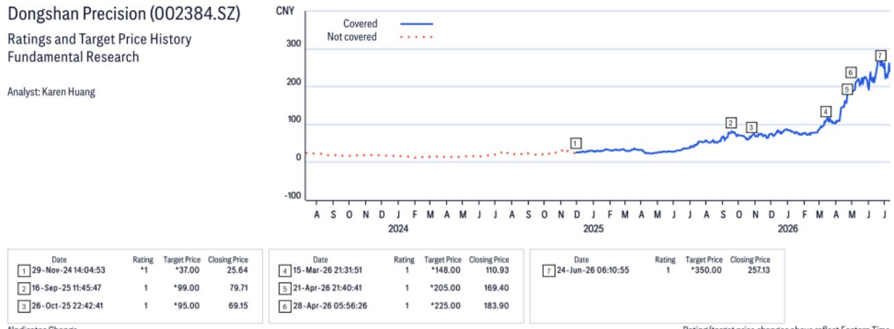
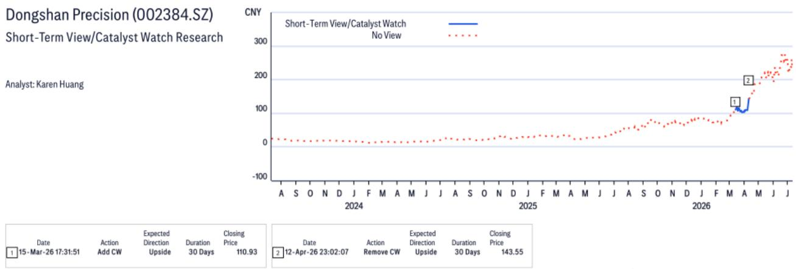
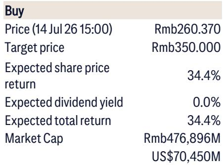

# Citi：东山精密 2026年第二季度调整后净利润观察

这份Citi研究报告的核心判断，并非东山精密第二季度业绩指引符合预期本身，而是其背后盈利结构的切换。二季度调整后净利润指引中值约13.9亿元人民币，环比增长31%，与市场预期基本吻合。但真正值得关注的，是这家公司正从依靠出货量扩张，转向依赖良率提升和客户拓展来驱动利润增长。Citi预计，其2026至2028年AI光模块净利润将从约54亿元跃升至约527亿元，而支撑这一变化的，是800G和1.6T光模块的出货结构升级，以及激光器芯片自给率的爬坡。

## 1. 二季度业绩指引的“含金量”在于环比增速和结构

研报显示，东山精密第二季度净利润指引中值为18.4亿元，环比增长66%；但剔除一次性项目后的调整后净利润中值为13.9亿元，环比增长31%。这个差异本身就是一个信号：一次性收益占比在下降，主营业务的盈利能力正在成为主导。

Citi估算，公司在第二季度将实现约35亿元（约5亿美元）的光模块收入，对应约70万只400G和100万只800G光模块出货。这个出货量级本身并不算意外，但结合其激光器芯片产能的爬坡节奏，意味着单位成本正在被摊薄。报告特别提到“laser capacity ramp-up, yield improvement and client expansion”三个驱动因素，其中良率提升是利润率改善最直接的杠杆。

> **KC评论：** 市场往往盯着出货量，但Citi这份报告提醒，真正影响利润弹性的，是良率和客户结构。当800G出货量从百万只级别向千万只级别跨越时，良率每提升一个百分点，对净利润的边际贡献会显著放大。

## 2. 光模块利润的“三级跳”依赖产品代际切换

Citi给出了一个清晰的利润预测路径：2026年AI光模块净利润约54亿元，2027年约257亿元，2028年约527亿元。这个跳跃式增长并非线性外推，而是建立在产品代际切换的假设之上。

从出货量假设看，400G光模块在2026年达到约160万只后，2027年归零；800G从2026年的500万只跃升至2027年的2100万只；1.6T则从2026年的20万只起步，2027年达到500万只，2028年进一步增至2300万只。每一代产品的单价和利润率都不同：800G平均售价从约401美元降至2028年的258美元，1.6T则从约801美元降至578美元。这意味着，利润增长的核心驱动力不是单价维持，而是更高速率产品出货占比的提升，以及规模效应带来的成本下降。

报告还隐含了一个关键判断：光模块业务的净利润率将从2026年的约23%提升至2028年的约33%。这个利润率改善，很大程度上取决于激光器芯片自供比例的提升——Citi预计，芯片业务净利润将从2027年的约24亿元增至2028年的约61亿元。

## 3. 估值框架的锚点已从传统业务转向AI业务

其核心逻辑是：传统业务（PCB、FPC等）按15倍2026年预期市盈率估值，而光模块业务按20倍2027年预期市盈率，光芯片业务按50倍，AI-PCB业务按25倍。这个估值结构本身就在说明，公司价值的重心已经转移。

从不确定性角度看，报告列出了五个主要节奏变化因素：模块FPC业务进展慢于预期、特斯拉业务竞争加剧、光电业务持续亏损、原材料成本上升、以及中美地缘政治不确定性。其中，光电业务能否持续减亏，直接关系到整体利润的兑现节奏。

这份报告没有回避不确定性，但它提供了一个清晰的观察框架：当一家公司的利润结构从“量增”转向“良率+客户+产品代际”驱动时，市场对其定价的逻辑也需要随之调整。对于关注这一产业链的读者而言，真正需要跟踪的，不是单季度出货量是否超预期，而是800G和1.6T的良率曲线，以及激光器芯片的自供比例是否在按计划爬升。

For informational purposes only. Portions may be generated, translated, summarized, or edited with AI assistance based on source materials and may contain omissions or errors. Please verify independently. This is not investment, legal, tax, accounting, or other professional advice.

For informational purposes only. Portions may be generated, translated, summarized, or edited with AI assistance based on source materials and may contain omissions or errors. Please verify independently. This is not investment, legal, tax, accounting, or other professional advice.

