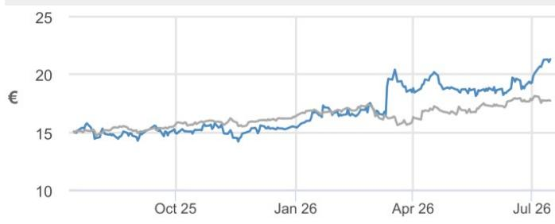
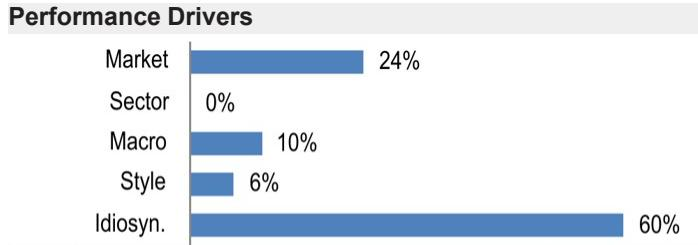

# JCDecaux

## 欧洲业务稳健，中东地区趋于稳定，世界杯带来增量收入——为后续上调预期奠定基础；在第二季度业绩公布前将其列入积极催化剂观察名单。

我们对JCDecaux第二季度业绩持积极看法，原因是欧洲业务表现稳健，中东地区趋势好于预期，世界杯带来增量收入，以及持续的利润率改善，这印证了公司的转型故事。正如我们在2026年3月关于欧洲户外广告市场的深度研究中所阐述的，并相应上调了该子行业的评级（"时机已到"，见此处），我们认为该行业正处于一个转折点，多重结构性利好因素持续累积（见下文），户外广告在广告组合中的份额不断提升，这得益于广告牌的持续数字化。尽管该股年初至今表现优异（上涨38%，而CAC40指数上涨3%），但近几个月来，读者情绪和近期广告势头有所减弱，这主要反映了地缘政治因素对客流量的影响，尤其是在中东地区（占JCDecaux收入的5%）。然而，关键的广告数据点似乎正在企稳并呈现逐步改善的趋势，表明需求环境正在好转。我们在第二季度业绩（预计于7月30日公布）之前预览了对JCDecaux的预测，总体而言，我们预计该季度业绩表现稳健，公司可能超额完成约3%的有机增长指引（JPM预测为+3.4%，Visible Alpha一致预期为+3.2%），这主要得益于街道家具和交通业务的推动，以及世界杯带来的增量收入（分布在第二和第三季度）。我们预测的上半年营业利润为3.29亿欧元，比市场一致预期高出约3%，这可能会引发进一步的预期上调，因此我们将该股列入积极催化剂观察名单。除了第二季度业绩可能好于预期外，我们预计第三季度业务势头也将持续，并预期公司在公布业绩时给出的第三季度指引将为远高于5%的有机增长（JPM预测为5.7%，Visible Alpha一致预期为4.9%）。我们继续认为该股被低估，德高未来几年自由现金流可能接近4亿欧元，而当前市值为45亿欧元，我们重申对该股的"增持"评级。

- **第二季度预期——我们在营业利润方面领先市场3%；将该股列入积极催化剂观察名单。** 我们预计大多数地区的业绩表现强劲，中东地区的负面影响小于此前预期，但我们预计中国地区将略有负面——在第一季度恢复增长后——受消费水平偏弱影响。我们预计集团有机收入增长为+3.4%（Visible Alpha一致预期为+3.2%），略高于公司约3%的有机增长指引，其中街道家具（+5.4%）和交通（+2.0%）表现强劲，也受益于世界杯带来的增量收入。我们预计中东地区（约占收入的5%）的交易情况好于预期，美国和英国的两位数增长也将提振市场情绪，但这将被中国地区的表现略微抵消。我们还预计成本控制执行有力，上半年营业利润为3.29亿欧元（利润率为17.0%），比Visible Alpha一致预期的3.2亿欧元（利润率为16.6%）高出3%。

- **预测调整。** 由于对交通业务的增长预期略有提高，我们将2026/2027财年的集团销售预测分别上调1%/1%。因此，2026/2027财年的营业利润率也分别上调1%/1%。我们的目标价

## 增持

JCDX.PA, DEC FP
价格（2026年7月15日）：21.32欧元

▲ 目标价（2027年12月）：30.00欧元

此前（2027年12月）：29.00欧元

## 欧洲互联网

Marcus Diebel AC
(44-20) 7742-4447
marcus.diebel@JPM.com
JPM Securities plc

Lara Simpson
(44-20) 7134-3637
lara.simpson@JPM.com
JPM Securities plc

Carmen Graves
(44-20) 3493 0506
carmen.graves@JPM.com
JPM Securities plc

Thyagarajan J
(91-22) 6157-5005
thyagarajan.j@jpmchase.com
JPM India Private Limited

专业销售联系方式：

Scott Silver - 专业销售 - 欧洲TMT
(44-20) 7134-0412
scott.silver@JPM.com

<table><tr><td colspan="4">主要变化（财年截至12月）</td></tr><tr><td></td><td>此前</td><td>当前</td><td>变化</td></tr><tr><td>调整后EBITDA - 2026E（百万欧元）</td><td>840</td><td>844</td><td>0.5%</td></tr><tr><td>调整后EBITDA - 2027E（百万欧元）</td><td>904</td><td>915</td><td>1.2%</td></tr></table>

## 风格暴露

<table><tr><td rowspan="2">量化因子</td><td rowspan="2">当前%排名</td><td colspan="4">历史%排名（1=最高）</td></tr><tr><td>6个月</td><td>1年</td><td>3年</td><td>5年</td></tr><tr><td>价值</td><td>37</td><td>22</td><td>25</td><td>69</td><td>92</td></tr><tr><td>成长</td><td>57</td><td>61</td><td>63</td><td></td><td></td></tr><tr><td>动量</td><td>68</td><td>40</td><td>65</td><td>50</td><td>100</td></tr><tr><td>质量</td><td>50</td><td>72</td><td>75</td><td>75</td><td>98</td></tr><tr><td>低波动</td><td>62</td><td>75</td><td>66</td><td>72</td><td>100</td></tr><tr><td>ESGQ</td><td>44</td><td>19</td><td>42</td><td>90</td><td>47</td></tr></table>

## 目录

欧洲户外 - 关键估值指标 6
JCDecaux – 公司概况 9
JCDecaux - 公司财务数据 18

价格表现  

— JCDX.PA 价格（欧元） — SXXE（重新基准）

<table><tr><td></td><td>年初至今</td><td>1个月</td><td>3个月</td><td>12个月</td></tr><tr><td>相对</td><td>37.7%</td><td>13.4%</td><td>6.9%</td><td>41.4%</td></tr><tr><td>相对</td><td>29.0%</td><td>13.4%</td><td>2.4%</td><td>23.7%</td></tr></table>

公司数据

<table><tr><td>流通股数（百万）</td><td>214</td></tr><tr><td>52周价格区间（欧元）</td><td>21.48-14.12</td></tr><tr><td>市值（百万美元）</td><td>5,213.24</td></tr><tr><td>汇率</td><td>0.88</td></tr><tr><td>自由流通比例（%）</td><td>31.4%</td></tr><tr><td>3个月日均成交量（百万股）</td><td>0.17</td></tr><tr><td>3个月日均成交额（百万美元）</td><td>3.7</td></tr><tr><td>波动率（90天）</td><td>35</td></tr><tr><td>指数</td><td>ESTX € Pr</td></tr><tr><td>彭博分析师评级（买入 | 持有 | 卖出）</td><td>10|4|0</td></tr></table>

关键指标（财年截至12月）

<table><tr><td>百万欧元</td><td>2025财年实际</td><td>2026财年预期</td><td>2027财年预期</td><td>2028财年预期</td></tr><tr><td colspan="5">财务预测</td></tr><tr><td>收入</td><td>3,967</td><td>4,212</td><td>4,421</td><td>4,559</td></tr><tr><td>调整后EBIT</td><td>431</td><td>461</td><td>534</td><td>582</td></tr><tr><td>调整后EBITDA</td><td>781</td><td>844</td><td>915</td><td>970</td></tr><tr><td>调整后净利润</td><td>267</td><td>260</td><td>320</td><td>362</td></tr><tr><td>调整后每股收益</td><td>1.25</td><td>1.22</td><td>1.51</td><td>1.71</td></tr><tr><td>彭博每股收益</td><td>1.18</td><td>1.34</td><td>1.44</td><td>1.54</td></tr><tr><td>经营活动现金流</td><td>1,182</td><td>1,071</td><td>1,045</td><td>880</td></tr><tr><td>公司自由现金流</td><td>343</td><td>322</td><td>359</td><td>391</td></tr><tr><td colspan="5">利润率与增长</td></tr><tr><td>收入同比增长（%）</td><td>0.8%</td><td>6.2%</td><td>5.0%</td><td>3.1%</td></tr><tr><td>EBIT利润率</td><td>10.9%</td><td>10.9%</td><td>12.1%</td><td>12.8%</td></tr><tr><td>EBIT同比增长（%）</td><td>5.5%</td><td>7.0%</td><td>15.9%</td><td>8.9%</td></tr><tr><td>EBITDA利润率</td><td>19.7%</td><td>20.0%</td><td>20.7%</td><td>21.3%</td></tr><tr><td>EBITDA同比增长（%）</td><td>8.9%</td><td>8.1%</td><td>8.3%</td><td>6.0%</td></tr><tr><td>净利润率</td><td>6.7%</td><td>6.2%</td><td>7.2%</td><td>7.9%</td></tr><tr><td>调整后每股收益增长</td><td>6.7%</td><td>(2.2%)</td><td>23.1%</td><td>13.2%</td></tr><tr><td colspan="5">比率</td></tr><tr><td>调整后税率</td><td>24.8%</td><td>28.0%</td><td>28.0%</td><td>28.0%</td></tr><tr><td>利息覆盖倍数</td><td>6.8</td><td>6.7</td><td>7.8</td><td>9.0</td></tr><tr><td>净债务/权益</td><td>0.2</td><td>0.1</td><td>0.0</td><td>NM</td></tr><tr><td>净债务/EBITDA</td><td>0.8</td><td>0.4</td><td>0.2</td><td>(0.1)</td></tr><tr><td>净资产回报表现</td><td>12.0%</td><td>11.1%</td><td>12.6%</td><td>13.0%</td></tr><tr><td colspan="5">估值</td></tr><tr><td>公司自由现金流回报表现</td><td>7.5%</td><td>7.1%</td><td>7.9%</td><td>8.7%</td></tr><tr><td>股息率</td><td>3.0%</td><td>3.2%</td><td>3.9%</td><td>4.4%</td></tr><tr><td>企业价值/收入</td><td>1.4</td><td>1.3</td><td>1.2</td><td>1.1</td></tr><tr><td>企业价值/EBITDA</td><td>7.2</td><td>6.4</td><td>5.7</td><td>5.2</td></tr><tr><td>调整后市盈率</td><td>17.0</td><td>17.4</td><td>14.1</td><td>12.5</td></tr></table>

## 投资主题与估值总结

## 投资主题

在对JCDecaux持中性/低配评级4年后，我们近期（此处）放弃了谨慎看法，因为我们看到了一个明确的转折点：1）数字化收入在2025年已接近总收入的50%，成为利润率改善的关键驱动力，多年来首次实现转折；2）随着管理层终于在营运资本和资本支出（用于屏幕）方面执行良好，且资本支出已过峰值，自由现金流动态正在快速改善；3）大多数地区的广告环境正在改善，尤其是在中国；4）近期在斯德哥尔摩、丹佛和巴塞罗那赢得的合同，以及法国与家乐福/卡米拉签订的零售合同，为2026年增加了收入可见性；5）JCDecaux的程序化平台持续扩大规模。

## 估值

我们设定基于DCF的2027年12月目标价为30欧元（此前为29欧元）。我们假设加权平均资本成本为9.5%，终值增长率为2.0%。

<table><tr><td>因子</td><td>6个月相关性</td><td>1年相关性</td></tr><tr><td>市场：MSCI欧洲（除英国）</td><td>0.36</td><td>0.49</td></tr><tr><td>行业：电信服务</td><td>-0.17</td><td>0.00</td></tr><tr><td>宏观：</td><td></td><td></td></tr><tr><td>德国10年期国债回报表现</td><td>0.26</td><td>0.27</td></tr><tr><td>Citi欧元区经济惊喜指数</td><td>-0.25</td><td>-0.19</td></tr><tr><td>欧元</td><td>-0.16</td><td>-0.08</td></tr><tr><td>量化风格：</td><td></td><td></td></tr><tr><td>规模</td><td>-0.08</td><td>-0.19</td></tr><tr><td>低波动</td><td>-0.16</td><td>-0.13</td></tr><tr><td>成长</td><td>0.01</td><td>0.09</td></tr></table>

上调至30欧元/股（此前为29欧元/股）。

- **投资主题。** 在对JCDecaux持中性/低配评级4年后，今年早些时候，我们在对该公司的深度研究中（此处）放弃了谨慎看法，因为我们看到了一个明确的转折点：1）数字化收入在2025年已接近总收入的50%，成为利润率改善的关键驱动力，多年来首次实现转折；2）随着管理层终于在营运资本和资本支出（用于屏幕）方面执行良好，且资本支出已过峰值，自由现金流动态正在快速改善；3）大多数地区的广告环境正在改善，尤其是在中国；4）近期在斯德哥尔摩、丹佛（现略有推迟至2026年）和巴塞罗那赢得的合同，以及法国与家乐福/卡米拉签订的零售合同，为2026年增加了收入可见性；5）JCDecaux的程序化平台持续扩大规模。研究逻辑显然具有动能，我们预计下半年将有进一步的上调空间。

表1：JCDecaux，预测变化（百万欧元）

<table><tr><td rowspan="2"></td><td colspan="3">此前</td><td colspan="3">当前</td><td colspan="3">变化</td></tr><tr><td>2026财年预期</td><td>2027财年预期</td><td>2028财年预期</td><td>2026财年预期</td><td>2027财年预期</td><td>2028财年预期</td><td>2026财年预期</td><td>2027财年预期</td><td>2028财年预期</td></tr><tr><td>街道家具</td><td>2,158</td><td>2,268</td><td>2,359</td><td>2,173</td><td>2,288</td><td>2,373</td><td>1%</td><td>1%</td><td>1%</td></tr><tr><td>广告牌</td><td>533</td><td>550</td><td>567</td><td>537</td><td>555</td><td>571</td><td>1%</td><td>1%</td><td>1%</td></tr><tr><td>交通</td><td>1,479</td><td>1,542</td><td>1,596</td><td>1,502</td><td>1,577</td><td>1,615</td><td>2%</td><td>2%</td><td>1%</td></tr><tr><td>总销售额</td><td>4,170</td><td>4,360</td><td>4,521</td><td>4,212</td><td>4,421</td><td>4,559</td><td>1%</td><td>1%</td><td>1%</td></tr><tr><td>街道家具</td><td>7.0%</td><td>5.0%</td><td>4.0%</td><td>7.5%</td><td>5.0%</td><td>4.0%</td><td></td><td></td><td></td></tr><tr><td>广告牌</td><td>-1.0%</td><td>3.0%</td><td>3.0%</td><td>-0.4%</td><td>3.0%</td><td>3.0%</td><td></td><td></td><td></td></tr><tr><td>交通</td><td>4.0%</td><td>4.0%</td><td>3.5%</td><td>4.6%</td><td>4.0%</td><td>4.0%</td><td></td><td></td><td></td></tr><tr><td>总有机增长</td><td>4.9%</td><td>4.4%</td><td>3.7%</td><td>5.4%</td><td>4.4%</td><td>3.9%</td><td></td><td></td><td></td></tr><tr><td>街道家具</td><td>27.6%</td><td>28.1%</td><td>28.7%</td><td>27.5%</td><td>28.1%</td><td>28.7%</td><td></td><td></td><td></td></tr><tr><td>广告牌</td><td>18.0%</td><td>18.6%</td><td>19.0%</td><td>17.8%</td><td>18.6%</td><td>19.0%</td><td></td><td></td><td></td></tr><tr><td>交通</td><td>13.6%</td><td>14.2%</td><td>14.7%</td><td>13.6%</td><td>14.2%</td><td>14.7%</td><td></td><td></td><td></td></tr><tr><td>总营业利润率</td><td>21.4%</td><td>22.0%</td><td>22.5%</td><td>21.3%</td><td>21.9%</td><td>22.5%</td><td></td><td></td><td></td></tr><tr><td>街道家具</td><td>595</td><td>637</td><td>677</td><td>597</td><td>643</td><td>681</td><td>0%</td><td>1%</td><td>1%</td></tr><tr><td>广告牌</td><td>96</td><td>102</td><td>108</td><td>96</td><td>103</td><td>109</td><td>0%</td><td>1%</td><td>1%</td></tr><tr><td>交通</td><td>201</td><td>219</td><td>235</td><td>204</td><td>224</td><td>237</td><td>2%</td><td>2%</td><td>1%</td></tr><tr><td>营业利润</td><td>893</td><td>959</td><td>1,019</td><td>897</td><td>970</td><td>1,027</td><td>1%</td><td>1%</td><td>1%</td></tr><tr><td>利润率%</td><td>21.4%</td><td>22.0%</td><td>22.5%</td><td>21.3%</td><td>21.9%</td><td>22.5%</td><td></td><td></td><td></td></tr><tr><td>调整后EBITDA</td><td>840</td><td>904</td><td>962</td><td>844</td><td>915</td><td>970</td><td>1%</td><td>1%</td><td>1%</td></tr><tr><td>利润率%</td><td>20.1%</td><td>20.7%</td><td>21.3%</td><td>20.0%</td><td>20.7%</td><td>21.3%</td><td></td><td></td><td></td></tr><tr><td>调整后EBIT</td><td>461</td><td>529</td><td>578</td><td>461</td><td>534</td><td>582</td><td>0%</td><td>1%</td><td>1%</td></tr><tr><td>净财务收入</td><td>-126</td><td>-117</td><td>-107</td><td>-126</td><td>-117</td><td>-107</td><td></td><td></td><td></td></tr><tr><td>税前利润</td><td>363</td><td>442</td><td>502</td><td>364</td><td>447</td><td>506</td><td>0%</td><td>1%</td><td>1%</td></tr><tr><td>所得税</td><td>-102</td><td>-124</td><td>-140</td><td>-102</td><td>-125</td><td>-142</td><td></td><td></td><td></td></tr><tr><td>调整后净利润</td><td>259</td><td>316</td><td>359</td><td>260</td><td>320</td><td>362</td><td>0%</td><td>1%</td><td>1%</td></tr><tr><td>摊薄后股数</td><td>212</td><td>212</td><td>212</td><td>212</td><td>212</td><td>212</td><td></td><td></td><td></td></tr><tr><td>调整后摊薄每股收益</td><td>1.22</td><td>1.49</td><td>1.69</td><td>1.22</td><td>1.51</td><td>1.71</td><td>0%</td><td>1%</td><td>1%</td></tr><tr><td>增长%</td><td>-1.5%</td><td>21.7%</td><td>13.6%</td><td>-1.4%</td><td>23.1%</td><td>13.2%</td><td></td><td></td><td></td></tr><tr><td>每股股息</td><td>0.67</td><td>0.82</td><td>0.93</td><td>0.67</td><td>0.83</td><td>0.94</td><td>0%</td><td>1%</td><td>1%</td></tr><tr><td>自由现金流（公司定义）</td><td>318</td><td>349</td><td>385</td><td>322</td><td>359</td><td>391</td><td>1%</td><td>3%</td><td>2%</td></tr></table>

来源：JPM预测。

表2：JCDecaux，销售预测 JPM预测 vs Visible Alpha一致预期

<table><tr><td rowspan="2"></td><td colspan="3">2026年第二季度</td><td colspan="3">2026财年</td></tr><tr><td>JPM预测</td><td>一致预期</td><td>差异%</td><td>JPM预测</td><td>一致预期</td><td>差异%</td></tr><tr><td>街道家具</td><td>562</td><td>553</td><td>2%</td><td>2,173</td><td>2,113</td><td>3%</td></tr><tr><td>有机增长</td><td>5.4%</td><td>不适用</td><td></td><td>7.5%</td><td>不适用</td><td></td></tr><tr><td>广告牌</td><td>139</td><td>141</td><td>-1%</td><td>537</td><td>539</td><td>0%</td></tr><tr><td>有机增长</td><td>-0.5%</td><td>不适用</td><td></td><td>-0.4%</td><td>不适用</td><td></td></tr><tr><td>交通</td><td>353</td><td>348</td><td>1%</td><td>1,502</td><td>1,466</td><td>3%</td></tr><tr><td>有机增长</td><td>2.0%</td><td>不适用</td><td></td><td>4.6%</td><td>不适用</td><td></td></tr><tr><td>总销售额</td><td>1,054</td><td>1,042</td><td>1%</td><td>4,212</td><td>4,114</td><td>2%</td></tr><tr><td>有机增长</td><td>3.4%</td><td>3.2%</td><td></td><td>5.4%</td><td>4.4%</td><td></td></tr></table>

来源：JPM预测和Visible Alpha。

表3：JCDecaux，营业利润预测，JPM预测 vs Visible Alpha一致预期（百万欧元）

<table><tr><td rowspan="2"></td><td colspan="3">2026年上半年</td><td colspan="3">2026财年</td></tr><tr><td>JPM预测</td><td>一致预期</td><td>差异%</td><td>JPM预测</td><td>一致预期</td><td>差异%</td></tr><tr><td>街道家具</td><td>230</td><td>225</td><td>2%</td><td>597</td><td>576</td><td>4%</td></tr><tr><td>利润率</td><td>23.0%</td><td>22.7%</td><td></td><td>27.5%</td><td>27.3%</td><td></td></tr><tr><td>广告牌</td><td>30</td><td>28</td><td>7%</td><td>96</td><td>95</td><td>1%</td></tr><tr><td>利润率</td><td>12.0%</td><td>11.1%</td><td></td><td>17.8%</td><td>17.6%</td><td></td></tr><tr><td>交通</td><td>68</td><td>63</td><td>8%</td><td>204</td><td>200</td><td>2%</td></tr><tr><td>利润率</td><td>10.0%</td><td>9.3%</td><td></td><td>13.6%</td><td>13.6%</td><td></td></tr><tr><td>营业利润</td><td>329</td><td>320</td><td>3%</td><td>897</td><td>870</td><td>3%</td></tr><tr><td>利润率</td><td>17.0%</td><td>16.6%</td><td></td><td>21%</td><td>21%</td><td></td></tr></table>

表4：JCDecaux，季度预测

<table><tr><td></td><td>2025年第一季度</td><td>2025年第二季度</td><td>2025年第三季度</td><td>2025年第四季度</td><td>2026年第一季度</td><td>2026年第二季度预期</td><td>2026年第三季度预期</td><td>2026年第四季度预期</td></tr><tr><td>街道家具</td><td>422.5</td><td>529.4</td><td>456.9</td><td>603.9</td><td>438.8</td><td>562.2</td><td>497.6</td><td>674.0</td></tr><tr><td>同比变化（%）</td><td>5.4%</td><td>2.4%</td><td>-2.5%</td><td>-1.4%</td><td>3.9%</td><td>6.2%</td><td>8.9%</td><td>11.6%</td></tr><tr><td>有机增长（%）</td><td>5.3%</td><td>3.6%</td><td>-1.1%</td><td>0.5%</td><td>6.8%</td><td>5.4%</td><td>7.7%</td><td>9.7%</td></tr><tr><td>交通</td><td>315.0</td><td>343.4</td><td>345.5</td><td>417.3</td><td>326.6</td><td>353.0</td><td>370.7</td><td>452.1</td></tr><tr><td>同比变化（%）</td><td>9.3%</td><td>-0.7%</td><td>-0.4%</td><td>2.0%</td><td>3.7%</td><td>2.8%</td><td>7.3%</td><td>8.4%</td></tr><tr><td>有机增长（%）</td><td>6.1%</td><td>0.8%</td><td>1.7%</td><td>4.7%</td><td>7.5%</td><td>2.0%</td><td>4.8%</td><td>4.4%</td></tr><tr><td>广告牌</td><td>120.5</td><td>137.5</td><td>123.7</td><td>151.6</td><td>115.1</td><td>138.7</td><td>126.3</td><td>156.9</td></tr><tr><td>同比变化（%）</td><td>7.0%</td><td>-4.0%</td><td>-6.8%</td><td>-4.1%</td><td>-4.5%</td><td>0.9%</td><td>2.1%</td><td>3.5%</td></tr><tr><td>有机增长（%）</td><td>4.6%</td><td>-3.7%</td><td>-6.9%</td><td>-1.9%</td><td>-2.9%</td><td>-0.5%</td><td>0.6%</td><td>0.9%</td></tr><tr><td>总收入</td><td>858.0</td><td>1,010.3</td><td>926.1</td><td>1,172.7</td><td>880.6</td><td>1,054.0</td><td>994.6</td><td>1,283.1</td></tr><tr><td>同比变化（%）</td
