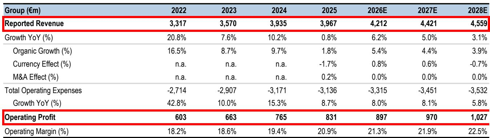
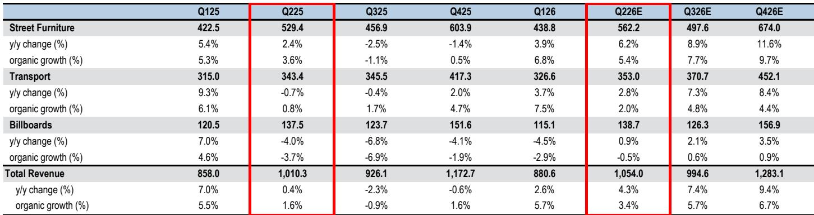
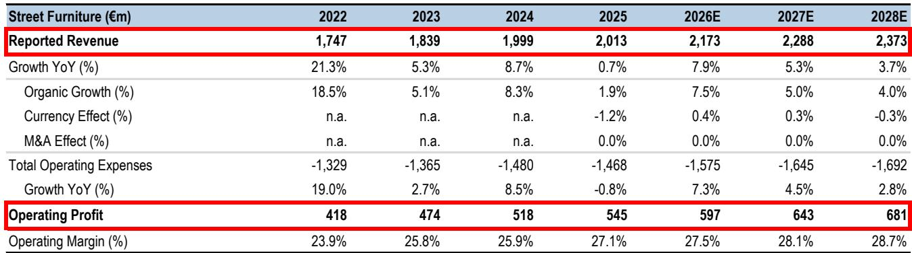

# JPM：JCDecauxJCDX.PASolidTr

户外广告行业正在经历一个被市场重新认识的阶段。JPM最新研究指出，德高集团（JCDecaux）在经历四年保守评级后，如今进入了一个明确的上行周期。报告的核心判断是：这家全球最大户外广告公司的基本面改善并非单一因素驱动，而是数字化渗透、自由现金流拐点、区域需求修复三重力量同时作用的结果。尤其值得关注的是，中东地区此前被市场过度担忧，实际表现好于预期，而世界杯相关增量收入正在成为短期催化剂。

报告将德高列入正面催化剂观察名单，认为即将发布的第二季度业绩有望超出公司自身给出的约3%有机增长指引。JPM预计第二季度有机增长为3.4%，略高于市场一致预期的3.2%。更关键的是，该机构对上半年营业利润的预测为3.29亿欧元，比市场一致预期高出约3%。这意味着业绩发布后，市场对全年盈利的预期可能面临上修。

## 1. 数字化占比突破50%成为利润率改善的真正引擎

德高近年最根本的变化在于业务结构。报告数据显示，数字化收入在2025年已接近总营收的50%。这一比例达到临界点后，对利润率的拉动效应开始显现——数字化广告位的边际成本远低于传统广告牌，且能通过程序化交易平台实现动态定价。JPM认为，这是德高多年来首次出现利润率趋势性改善。

数字化还改变了资本开支周期。报告指出，屏幕相关的资本投入已经越过峰值，叠加管理层在营运资本管理上的执行改善，自由现金流正在快速提升。研报预计，未来几年德高自由现金流有望接近4亿欧元，而当前市值仅为45亿欧元。

> **KC评论：** 数字化占比突破50%这个数字本身不是新闻，但JPM把它与利润率拐点、资本开支峰值并列，说明这三者之间存在因果关系。读者容易只关注收入增速，而忽略了结构变化对盈利质量的乘数效应。

## 2. 中东地区修复叠加世界杯增量，短期业绩存在超预期空间

市场此前对中东地区（占德高收入约5%）的担忧主要来自地缘政治对客流量的影响。但报告认为，关键广告数据已经趋于稳定并呈现改善趋势。JPM预计第二季度中东地区表现将好于此前预期，这将成为推动业绩超预期的因素之一。

世界杯相关收入是另一个短期增量。报告明确提到，这部分收入将分布在第二和第三季度，主要拉动交通广告和街道设施两个板块。JPM预计第三季度有机增长将明显高于5%，其预测值为5.7%，而市场一致预期为4.9%。如果这一判断成立，德高在下半年将连续两个季度交出超预期成绩单。

## 3. 新合同与程序化平台为中期增长提供可见性

报告列举了德高近期赢得的多个重要合同：斯德哥尔摩、丹佛、巴塞罗那的户外广告特许经营权，以及法国与家乐福/卡米拉合作的零售媒体合同。这些合同为2026年及之后的收入提供了可量化的可见性。

与此同时，德高的程序化广告平台仍在持续扩展。程序化交易意味着广告主可以像购买数字广告一样实时竞价户外广告位，这正在改变户外广告的销售模式。JPM在3月发布的欧洲户外广告行业深度报告中曾提出，户外广告正在从传统媒介向数字化、可衡量、可交易的资产转变，德高作为行业龙头是这一趋势的主要受益者。

> **KC评论：** 合同赢取和程序化平台这两个线索容易被当作分散的利好，但JPM将它们并列放在研究主题中，暗示德高的增长不是靠一两个大单，而是靠运营能力的系统性提升。这种结构性改善比周期性反弹更值得关注。

## 4. 中国区域仍是相对少见仍在调整，但整体影响有限

报告坦率指出，中国区域在第二季度可能录得小幅负增长，主要受消费水平偏弱影响。此前第一季度中国曾恢复增长，但这一势头未能持续。不过，中国在德高整体收入中的占比有限，且其他区域——欧洲、美国、英国——均表现强劲或好于预期。

JPM上调了2026和2027财年的收入预测各1%，主要来自交通广告板块的增长预期上调。营业利润预测也相应上调1%。这些调整幅度看似不大，但结合报告对业绩超预期和后续上修空间的判断，其隐含的含义是：当前市场对德高的盈利预测可能仍然保守。

---

For informational purposes only. Portions may be generated,translated,summarized,or edited with AI assistance based on source materials and may contain omissions or errors. Please verify independently. This is not investment,legal,tax,accounting,or other professional advice.

For informational purposes only. Portions may be generated,translated,summarized,or edited with AI assistance based on source materials and may contain omissions or errors. Please verify independently. This is not investment,legal,tax,accounting,or other professional advice.

