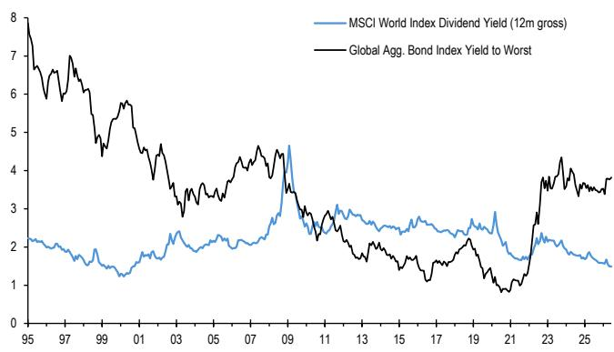
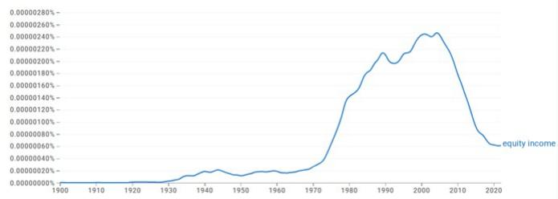
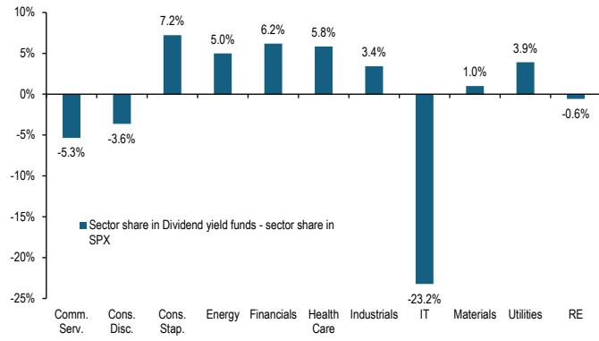
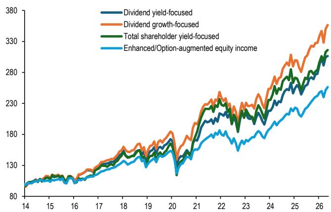
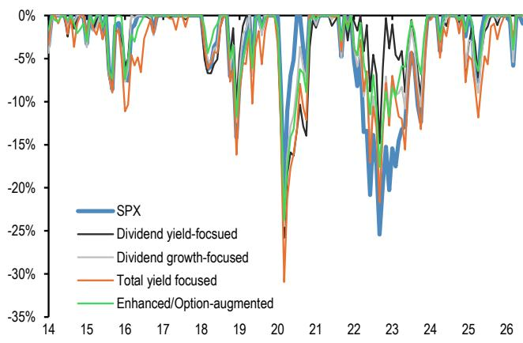

## 长期策略

## 长期观察者应关注哪种权益收益策略？

- 当前“2020–2026 后疫情 — AI 时代”的环境，对传统高股息收益基金构成了挑战，因为它们的表现明显落后于整体市场。

- 由于这种明显的落后表现，市场关注点已转向传统高股息收益策略之外的三种替代方法：

• 关注高股息增长的公司

- 关注高总股东回报的公司（即股息加回购收益）

- 通过卖出看涨期权来增强权益收益策略，即通过牺牲部分权益上行空间来获取期权收益的策略

- 随着 AI 热潮可能最终趋于正常化，我们认为未来十年可能更类似于“1963–1989 正常商业周期波动”的环境，而非当前的“2020–2026 后疫情 — AI 时代”环境。

- 这意味着，从长期来看，未来十年左右，资产配置应考虑股息与价值因子之间的强正相关性、股息与市场/贝塔因子之间的强负相关性，以及股息与盈利能力因子之间的强负相关性。

- 同时，鉴于股息增长策略在提供良好的波动调整后回报、相对一致的下跌表现以及一定的科技/成长因子敞口方面具有吸引力，我们认为追求权益收益的长期观察者应将传统股息收益策略与股息增长策略相结合。

## 全球市场研究

Mika Inkinen AC
(44-20) 7742 6565
mika.j.inkinen@JPM.com
JPM Securities plc

Nikolaos Panigirtzoglou AC

(44-20) 7134-7815

nikolaos.panigirtzoglou@JPM.com

JPM Securities plc

Krutik P Mehta

(91-22) 6157-5016

krutik.mehta@jpmchase.com

JPM India Private Limited

Mayur Yeole

(91 22) 6157 3872

mayur.yeole@jpmchase.com

JPM India Private Limited

权益收益策略，例如那些关注股息回报表现的策略，历来是读者组合的重要组成部分，因为历史上约三分之一的权益总回报来自股息。权益收益策略的重要性在低利率时期自然增加，例如 2008 年金融危机至 2021 年期间。

自 2022 年以来，向更高利率环境的转变在一定程度上影响了权益股息回报表现相对于债券回报表现的吸引力。然而，如图 1 所示，该图描绘了 MSCI 世界指数股息回报表现与全球综合债券指数最差回报表现之间的差距，在之前的时期，例如 1990 年代，债券回报表现与股息回报表现之间的差距要大得多，但这并未削弱当时对高股息回报表现公司的兴趣。如图 2 所示，该图描绘了 Google 图书中对关键词“权益收益”的搜索情况。从 1970 年代到 2004 年左右，“权益收益”主题的提及频率或流行度持续上升，从 2004 年到疫情前呈下降趋势。疫情后趋于稳定。

图 1：MSCI 世界指数股息回报表现 vs 全球综合债券指数最差回报表现  
  
来源：Bloomberg Finance L.P., JPM。

图 2：Google 图书中对关键词“权益收益”的搜索  
  
来源：Google。

自 2004 年以来的下降可能反映了科技在权益市场中的崛起，这降低了传统股息收益策略的吸引力，因为这些策略本质上低配科技股。如图 3 所示，该图描绘了美国 10 只最大高股息收益基金相对于标普 500 指数的行业偏离度。这些高股息收益基金通常低配科技、通信服务和可选消费行业，并超配金融、必需消费、能源、医疗保健。

图 3：美国 10 只最大高股息收益基金相对于标普 500 指数的行业偏离度  
  
来源：Bloomberg Finance L.P., JPM。  
尽管如此，高股息收益公司还有其他特性使其对读者具有吸引力。例如，使用 Fama-French 权益因子并观察 6 个因子（Mkt_RF-整体市场或贝塔因子、SMB-规模因子、HML-价值因子、RMW-运营盈利能力因子、CMA-保守投资因子、DY-股息回报表现因子，由高股息回报表现公司与低股息回报表现公司表现之差代表）的相关性矩阵（图 4），我们发现市场/贝塔因子与股息回报表现因子之间存在强负相关性，这表明高股息回报表现公司在历史上曾作为权益市场下跌的对冲工具。市场因子与股息因子之间的强负相关性至少部分反映了权益市场的成长倾向，因为在强势市场阶段，成长型公司往往跑赢更偏价值/股息的公司。

## 图 4：相关性矩阵

基于 1963 年至 2026 年的月度数据。

<table><tr><td></td><td>Mkt_RF</td><td>SMB</td><td>HML</td><td>RMW</td><td>CMA</td><td>DY</td></tr><tr><td>Mkt_RF</td><td>1</td><td>0.27</td><td>-0.21</td><td>-0.19</td><td>-0.36</td><td>-0.52</td></tr><tr><td>SMB</td><td>0.27</td><td>1</td><td>0.01</td><td>-0.34</td><td>-0.08</td><td>-0.21</td></tr><tr><td>HML</td><td>-0.21</td><td>0.01</td><td>1</td><td>0.09</td><td>0.68</td><td>0.68</td></tr><tr><td>RMW</td><td>-0.19</td><td>-0.34</td><td>0.09</td><td>1</td><td>0.01</td><td>0.06</td></tr><tr><td>CMA</td><td>-0.36</td><td>-0.08</td><td>0.68</td><td>0.01</td><td>1</td><td>0.61</td></tr><tr><td>DY</td><td>-0.52</td><td>-0.21</td><td>0.68</td><td>0.06</td><td>0.61</td><td>1</td></tr></table>

来源：JPM。

图 4 的相关性矩阵提供了一些额外的见解：

- 价值–保守投资–股息集群（HML、CMA、DY 因子）高度相关，因此在多因子组合中使用所有这三个因子会导致多重共线性。产生这种高相关性的原因相对简单：高账面市值比的公司（价值型公司）往往在投资倾向方面较为保守，而投资保守的公司也倾向于支付更高的股息。

- 盈利能力因子（RMW）实际上与价值/保守投资/股息集群正交。

- 规模因子与股息因子负相关，因为小公司往往支付较低的股息。

上述相关性在不同子时期会发生变化吗？是否存在结构性变化？为了回答这个问题，我们查看图 5，该图描绘了不同子时期的 DY 因子相关性。

图 5：不同子时期的 DY 因子相关性

<table><tr><td>时期</td><td>Mkt_RF</td><td>SMB</td><td>HML</td><td>RMW</td><td>CMA</td></tr><tr><td>1963-1975</td><td>-0.50</td><td>-0.23</td><td>0.80</td><td>-0.49</td><td>0.75</td></tr><tr><td>1976-1989</td><td>-0.69</td><td>-0.41</td><td>0.80</td><td>-0.31</td><td>0.62</td></tr><tr><td>1990-1999</td><td>-0.66</td><td>-0.32</td><td>0.74</td><td>0.21</td><td>0.75</td></tr><tr><td>2000-2009</td><td>-0.34</td><td>-0.26</td><td>0.68</td><td>0.42</td><td>0.50</td></tr><tr><td>2010-2019</td><td>-0.60</td><td>-0.31</td><td>0.07</td><td>0.47</td><td>0.37</td></tr><tr><td>2020-2026</td><td>-0.30</td><td>0.39</td><td>0.76</td><td>0.08</td><td>0.58</td></tr></table>

来源：JPM。

总体而言，图 5 指出了五个不同的环境：

1963–1989（正常商业周期波动）：DY 与 HML（+0.80）和 CMA（+0.75）强相关，与 Mkt_RF（-0.50 至 -0.68）和 RMW（-0.31 至 -0.49）强负相关。“价值”与“收益”因子之间的传统相关性。

1990–1999（互联网泡沫时代——成长型公司主导）：DY 与 RMW 从负相关转为正相关（+0.21）。随着成长型公司主导，盈利能力因子与股息的关系发生了变化。

2000–2009（信贷泡沫与全球金融危机）：DY 与 RMW 达到 +0.42。金融危机期间的避险行为加强了股息与盈利能力之间的联系。DY 与 Mkt_RF 减弱至 -0.34。

2010–2019（后全球金融危机低利率环境）：结构性断裂，DY 与 HML 骤降至 +0.07（此前时期为 +0.68）。长期低利率环境导致读者无论价值特征如何都追逐收益，使股息回报表现与传统价值脱钩。

2020–2026（后疫情 — AI 时代）：大规模政策干预和 AI 交易的出现重塑了因子关系，DY 与 SMB 在 60 年来首次转为正相关（+0.39）。DY 与 HML 反弹至 +0.76。DY 与 RMW 回落至接近零（+0.08）。

上述观察表明，长期读者的组合构建/资产配置取决于环境。随着 AI 热潮可能最终趋于正常化，我们认为未来十年可能更类似于“1963–1989 正常商业周期波动”的环境，而非当前的“2020–2026 后疫情 — AI 时代”环境。

这意味着，从长期来看，未来十年左右，资产配置应考虑股息与价值因子之间的强正相关性、股息与市场/贝塔因子之间的强负相关性，以及股息与盈利能力因子之间的强负相关性。

同时，我们认识到，当前“2020–2026 后疫情 — AI 时代”的环境对传统高股息收益基金构成了挑战，因为它们的表现明显落后于整体市场。由于这种明显的落后表现，市场关注点已转向传统高股息收益策略之外的三种替代方法：

1. 关注高股息增长的公司

2. 关注高总股东回报的公司（即股息加回购收益）

3. 通过卖出看涨期权来增强权益收益策略，即通过牺牲部分权益上行空间来获取期权收益的策略

向这三种新方法的转变有多大？它们是否跑赢了关注高股息回报表现的传统方法？

为了评估这些策略在实际中的表现，我们查看了以下类别中权益 ETF 和共同基金的总回报：股息回报表现型、股息增长型、总股东回报型以及增强型或期权增强型权益收益。每个类别内的回报按等权重计算，以反映策略层面的结果，而不是被个别大型基金所主导，我们关注的是 2014 年至今的时期，因为后三个类别的基金在此之前交易较少。我们为每个类别使用了最多十只最大的 ETF 和共同基金。图 6 显示了四种策略的累计回报。虽然这四种策略在 2020 年之前走势较为接近，但此后出现了明显的分化，股息增长策略的复利效应最为强劲。  
图 6：权益收益基金的累计回报  
  
来源：JPM。

图 7 显示了这些策略在完整样本期以及 2020 年前后分期的年化回报和信息比率。在 2020 年之前，关注股息回报表现和股息增长的传统收益策略的整体回报和信息比率与标普 500 指数较为接近。然而，疫情后，标普 500 指数的回报——该指数日益被这些收益策略低配的少数大型科技公司所主导——在相对和风险调整基础上均表现更优。股息增长基金在两个时期内的相对和风险调整回报均优于股息回报表现基金，但总回报型基金在 2020 年后的相对回报更高，然而较高的波动性拖累了风险调整回报。后者可能归因于较高的科技含量以及总回报型基金规模较小、历史较短。而增强型/期权增强型策略在 2020 年后的风险调整回报相似，但相对回报较低，这可能是由于通过卖出看涨期权获取的溢价收入降低了市场贝塔，从而抵消了部分下跌期间的负回报（该类别中的一些策略会买入看跌期权以提供下行保护），同时也限制了复苏期间的部分上行空间。

图 7：标普 500 指数和权益收益基金的年化回报和信息比率

<table><tr><td>年化回报</td><td>SPX</td><td>股息回报表现型</td><td>股息增长型</td><td>总回报型</td><td>增强型/期权增强型</td></tr><tr><td>2014-2019</td><td>11.3%</td><td>9.6%</td><td>10.9%</td><td>9.2%</td><td>7.6%</td></tr><tr><td>2020-2026</td><td>14.8%</td><td>10.3%</td><td>11.7%</td><td>12.1%</td><td>8.9%</td></tr><tr><td>完整样本</td><td>13.0%</td><td>10.0%</td><td>11.4%</td><td>10.6%</td><td>8.3%</td></tr><tr><td>信息比率</td><td colspan="5"></td></tr><tr><td>2014-2019</td><td>1.00</td><td>0.94</td><td>0.97</td><td>0.71</td><td>0.83</td></tr><tr><td>2020-2026</td><td>0.86</td><td>0.64</td><td>0.70</td><td>0.62</td><td>0.68</td></tr><tr><td>完整样本</td><td>0.89</td><td>0.74</td><td>0.80</td><td>0.64</td><td>0.74</td></tr></table>

来源：JPM。

为了更具体地考察下跌情况，图 8 显示了从先前高点以来的累计最大回撤的时间序列形式，而图 9 显示了六次主要修正事件中每种策略的最大月末回撤。

图 8：标普 500 指数和权益收益基金类型的回撤  
  
来源：JPM。

图 9：按事件划分的最大回撤

<table><tr><td>最大月末回撤发生在：</td><td>SPX</td><td>股息回报表现型</td><td>股息增长型</td><td>总回报型</td><td>增强型/期权增强型</td></tr><tr><td>2015年9月/2016年1月 人民币贬值/新兴市场增长担忧</td><td>-8.6%</td><td>-8.7%</td><td>-9.0%</td><td>-11.1%*</td><td>-7.3%</td></tr><tr><td>2018年12月 美联储紧缩/流动性收缩</td><td>-14.2%</td><td>-10.1%</td><td>-12.4%</td><td>-16.2%</td><td>-11.8%</td></tr><tr><td>2020年3月 疫情</td><td>-20.7%</td><td>-25.8%</td><td>-24.5%</td><td>-30.9%</td><td>-23.7%</td></tr><tr><td>2022年9月 通胀冲击</td><td>-25.4%</td><td>-14.8%</td><td>-20.6%</td><td>-21.7%</td><td>-17.6%</td></tr><tr><td>2025年4月 解放日</td><td>-7.7%</td><td>-7.2%</td><td>-9.0%</td><td>-11.9%</td><td>-6.4%</td></tr><tr><td>2026年3月 中东冲突</td><td>-5.8%</td><td>-4.1%</td><td>-5.4%</td><td>-2.6%</td><td>-4.0%</td></tr></table>

\* 总回报型基金的低点在 2016 年 1 月，标普 500 指数和其他收益策略的低点在 2015 年 9 月。来源：JPM。

第一次事件显示，标普 500 指数以及不同类型的权益收益基金的回撤相对一致。第二次事件显示，大多数收益策略（总股东回报型除外）相对于整体市场有明显的下行缓解，尤其是股息回报表现型和期权增强型收益策略，前者受益于价值/短久期倾向，后者则通过卖出看涨期权来增加收益和/或买入看跌期权以提供下行保护。第三次事件，即疫情冲击，对权益收益策略的打击比整体市场更严重，无论是在下跌过程中还是在复苏期间，因为能源、金融和房地产行业的盈利受损和股息削减对收益策略造成了不成比例的影响，而标普 500 指数对科技股的更大敞口在相对基础上支撑了整体市场。第四次事件是一次通胀冲击，引发了主要央行大幅加息，这不成比例地伤害了长久期成长型公司，在收益策略中，股息增长型基金因其更高的质量/成长倾向（也偏向更长久期）以及总股东回报型基金因其比股息回报表现策略更长的科技/成长久期敞口而受到更大影响。相比之下，关注当前回报表现且具有较短久期倾向的收益基金表现更好，期权增强型策略也可能受益于更高的隐含波动率，从而增加了溢价收入和/或看跌期权敞口。第五次事件是关税冲击，第六次事件是地缘政治不确定性冲击，两者都导致不确定性上升，总体回撤相似，尽管期权增强型收益基金可能受益于期权溢价收入，而总股东回报型基金在第六次事件中表现更好。

综上所述，上述情况突显出权益收益基金的相对回撤表现从根本上取决于环境。在 2018 年和 2022 年由货币紧缩驱动的修正中，特别是基于股息回报表现的收益策略受益于短久期价值倾向，而长久期资产则遭受损失。在 2020 年的盈利/现金流破坏冲击中，收益策略普遍跑输整体市场。股息回报表现和增长策略因其行业构成（例如，对科技股的敞口较低，对盈利/股息受损行业的敞口较高）而受到惩罚，放大了初始损失并在复苏中滞后，而总股东回报型策略可能因较高的中盘股敞口而遭受损失。在 2015 年、2025 年和 2026 年较短、更剧烈的波动率飙升中，期权增强型策略最一致地表现出从溢价收入中获得的韧性。一个相关的区别是，基于股息回报表现和股息增长的传统收益策略可能表现不同，前者因关注当前回报表现而具有更多的价值倾向，后者则具有更多的质量/成长倾向，而总股东回报型策略通过回购引入了更多的顺周期性因素。

在 2015 年、2025 年和 2026 年较短、更剧烈的波动率事件中，期权增强型策略最一致地表现出从溢价收入中获得的韧性，而总股东回报型策略在 2025 年的关税冲击中受到不成比例的损害——反映了其更大的跨国科技和工业敞口——但在 2026 年的地缘政治冲击中表现出相对韧性。一个相关的区别是，传统收益策略本身在因子倾向上存在显著差异：股息回报表现策略因其关注当前收益而具有更明显的价值导向；股息增长策略具有更高的质量和成长倾向；总股东回报型策略在因子空间上更接近整体市场，但通过其回购敞口引入了顺周期性因素，这可能在流动性和盈利压力事件中放大回撤。

最后，我们考察了四种权益收益策略变体相对于标普 500 指数回报的超额回报与 Fama-French 因子以及利率的相关性，以及它们在股息回报表现型、股息增长型、总股东回报型和增强型/期权增强型收益策略之间的差异。如图 10 所示。

图 10：权益收益策略相对于标普 500 指数的超额回报与 Fama-French 因子的相关性

<table><tr><td>相关系数</td><td>Mkt-RF</td><td>SMB</td><td>HML</td><td>RMW</td><td>CMA</td><td>DY</td></tr><tr><td>股息回报表现型</td><td></td><td></td><td></td><td></td><td></td><td></td></tr><tr><td>2014-2019</td><td>-0.48</td><td>-0.05</td><td>0.50</td><td>0.32</td><td>0.73</td><td>0.81</td></tr><tr><td>2020-2026</td><td>-0.38</td><td>0.29</td><td>0.78</td><td>0.21</td><td>0.67</td><td>0.88</td></tr><tr><td>完整样本</td><td>-0.39</td><td>0.21</td><td>0.72</td><td>0.23</td><td>0.67</td><td>0.86</td></tr><tr><td>股息增长型</td><td></td><td></td><td></td><td></td><td></td><td></td></tr><tr><td>2014-2019</td><td>-0.15</td><td>0.11</td><td>0.41</td><td>0.45</td><td>0.47</td><td>0.46</td></tr><tr><td>2020-2026</td><td>-0.23</td><td>0.45</td><td>0.75</td><td>0.26</td><td>0.59</td><td>0.80</td></tr><tr><td>完整样本</td><td>-0.21</td><td>0.36</td><td>0.68</td><td>0.28</td><td>0.56</td><td>0.75</td></tr><tr><td>增强型/期权增强型</td><td></td><td></td><td></td><td></td><td></td><td></td></tr><tr><td>2014-2019</td><td>-0.66</td><td>-0.23</td><td>-0.12</td><td>0.00</td><td>0.07</td><td>0.29</td></tr><tr><td>2020-2026</td><td>-0.74</td><td>0.03</td><td>0.30</td><td>0.08</td><td>0.33</td><td>0.52</td></tr><tr><td>完整样本</td><td>-0.72</td><td>-0.06</td><td>0.18</td><td>0.06</td><td>0.26</td><td>0.45</td></tr><tr><td>总回报型</td><td></td><td></td><td></td><td></td><td></td><td></td></tr><tr><td>2014-2019</td><td>0.27</td><td>0.57</td><td>0.54</td><td>-0.12</td><td>0.29</td><td>0.00</td></tr><tr><td>2020-2026</td><td>0.11</td><td>0.70</td><td>0.78</td><td>0.06</td><td>0.49</td><td>0.72</td></tr><tr><td>完整样本</td><td>0.14</td><td>0.65</td><td>0.73</td><td>0.02</td><td>0.45</td><td>0.59</td></tr></table>

来源：JPM。

对于股息回报表现型策略，主要敞口是 HML（价值）和 CMA（保守投资），这与寻找相对便宜、成熟且管理保守、派息率高的公司以支付高股息回报表现的目标一致。从 2020 年起，价值因子甚至更强，同时对 SMB 因子的敞口也有所增加，表明股息回报表现领域向小盘股发生了一些构成性转变。负的市场因子负载也表明，相对于广泛市场，它提供了真正的防御性特征，尽管在 2020 年后似乎有所减弱。毫不奇怪，鉴于该策略对股息回报表现的关注，对股息/收益因子的敞口一直很高。

对于股息增长型策略，关键区别在于 2020 年之前对 RMW（质量/盈利能力）的负载更高，而对 DY（收益/股息）因子的负载较低。也就是说，2020 年后，许多因子负载与股息回报表现型基金趋于一致，这可能对与股息回报表现策略的分散化有一些影响，尽管它仍然不那么具有防御性。

对于总股东回报型策略，其负载与股息回报表现或股息增长型策略存在显著差异。相对于标普 500 指数的超额回报与市场因子的相关性为正，表明对回购（本质上更具自由裁量权）的依赖使该策略比其他收益策略更具顺周期性。SMB 因子相关性高于其他策略，表明小盘/中盘股敞口更高。RMW 负载最低，表明几乎没有质量敞口，而价值因子负载似乎更类似于股息回报表现策略。虽然 DY 因子在 2020 年之前较低，但这可能受到该策略规模较小且可能历史较短的影响。

对于增强型/期权增强型策略，大多数因子的负载相当温和，而市场因子是最负的。2020 年后，对价值和保守投资因子以及股息因子的负载有所增加，表明该策略的收益特征更为明显。在下跌行为方面，这些策略在广泛市场修正期间相对于标普 500 指数产生了最一致的相对超额表现，尽管 2020 年的事件表明这并不排除显著的相对损失。

上述回报、回撤和因子相关性特征强化了一个结论：没有一种策略能在不同环境中都占主导地位。相反，它们突显出，分配这些不同收益策略的决策取决于最终目标，并且相对于整体市场，尤其是在 2020 年后，它们在回报方面存在机会成本。为了产生当前收益并具有更价值/保守的倾向，股息回报表现型策略表现更好，同时在我们样本中的大多数回撤事件中提供了一定的下行保护。对于更注重质量/成长的收益策略，股息增长策略表现更好，尽管它们提供的防御性敞口较少。增强型/期权增强型策略更强调相对于广泛市场的对冲特性，并在 2020 年后具有一定价值/保守倾向的敞口，但代价是相对回报较低，即使风险调整回报与其他收益策略相当。总股东回报型策略依赖于更具自由裁量权的回购，本质上更具顺周期性，在 2020 年后提供了比其他收益策略更高的相对回报，但代价是更高的波动性，这对风险调整回报构成了更大的阻力——因子分析证实了这种权衡是结构性的。

图 11 总结了不同收益策略的一些关键特征，考虑了风险调整回报、下跌事件中的表现以及科技/成长因子敞口，因为收益策略的低科技/成长敞口如果科技主导地位持续，会造成持续的回报拖累。在这四组中，股息增长策略似乎提供了良好的波动调整后回报、相对一致的下跌表现以及一定的科技/成长因子敞口之间的平衡。原则上，股息回报表现和增强型/期权增强型策略在下跌中表现更好，但前者几乎没有科技敞口，而后者虽然部分策略有较高的科技敞口，但有效贝塔被卖出看涨期权所抑制。虽然总回报策略提供了更多的科技/成长敞口，但其顺周期性特征——体现在任何收益类别中最弱的风险调整回报以及在大多数压力事件中糟糕的下跌表现——使其作为核心收益配置的吸引力降低。

图 11：总结表

<table><tr><td></td><td>股息回报表现型</td><td>股息增长型</td><td>总回报型</td><td>增强型/期权增强型</td></tr><tr><td>波动调整后回报</td><td>中等</td><td>良好</td><td>较差</td><td>中等</td></tr><tr><td>权益修正期间的下跌</td><td>利率冲击中良好；盈利冲击中较差</td><td>中等</td><td>较差；顺周期性</td><td>良好；整体最一致</td></tr><tr><td>科技/成长因子敞口</td><td>低</td><td>低/中等</td><td>中等</td><td>名义中等/高；有效低</td></tr></table>

来源：JPM。

总而言之，随着 AI 热潮可能最终趋于正常化，我们认为未来十年可能更类似于“1963–1989 正常商业周期波动”的环境，而非当前的“2020–2026 后疫情 — AI 时代”环境。这意味着，从长期来看，未来十年左右，资产配置应考虑股息与价值因子之间的强正相关性、股息与市场/贝塔因子之间的强负相关性，以及股息与盈利能力因子之间的强负相关性。同时，鉴于股息增长策略在提供良好的波动调整后回报、相对一致的下跌表现以及一定的科技/成长因子敞口方面具有吸引力，我们认为追求权益收益的长期观察者应将传统股息收益策略与股息增长策略相结合。

分析师认证：本报告封面标注“AC”的研究分析师（或，当多位研究分析师主要负责本报告时，封面或文件内标注“AC”的研究分析师分别就其在本研究中涵盖的每个证券或发行人认证）证明：(1) 本报告中表达的所有观点准确反映了研究分析师对任何及所有标的证券或发行人的个人观点；(2) 研究分析师的任何部分薪酬过去、现在或将来都不会直接或间接地与本研究报告中研究分析师表达的具体建议或观点相关。对于封面列出的所有韩国研究分析师，如适用，他们还根据 KOFIA 要求证明，研究分析师的分析是本着诚信原则进行的，并且观点反映了研究分析师自己的意见，没有受到不当影响或干预。

除非另有说明，本报告中列出的所有作者均为独立撰写研究报告的研究分析师。在欧洲，行业专家（销售和交易）可能作为联系人出现在本报告中，但并非报告的作者或研究部门成员。

## 重要披露

封面列出的分析师持有数字或加密资产的个人头寸。

公司特定披露：JPM 与其研究报告中所涵盖的公司开展业务并寻求开展业务。因此，读者应注意，该公司可能存在利益冲突，可能影响本报告的客观性。读者应将本报告视为做出投资决策的单一因素。重要披露，包括价格图表和信用意见历史表（如适用），可在 https://www.jpmm.com/research/disclosures 获取，或致电 1-800-477-0406，或发送电子邮件至 research.disclosure.inquiries@JPM.com 索取。

## 权益研究评级、指定和分析师覆盖范围说明：

JPM 使用以下评级系统：超配（在本报告指示的价格目标期限内，我们预期该股票将跑赢研究分析师或其团队覆盖范围内股票的平均总回报）；中性（在本报告指示的价格目标期限内，我们预期该股票将与研究分析师或其团队覆盖范围内股票的平均总回报表现一致）；低配（在本报告指示的价格目标期限内，我们预期该股票将跑输研究分析师或其团队覆盖范围内股票的平均总回报。NR 表示未评级。在这种情况下，JPM 已移除该股票的评级以及（如适用）价格目标，原因是缺乏足够的基本面基础，或出于法律、监管或政策原因。先前的评级和（如适用）价格目标不应再被依赖。NR 指定并非建议或评级。一些被覆盖的股票有评级但没有价格目标；在这些情况下，我们预期该股票将跑赢/表现一致/跑输研究分析师或其团队覆盖范围内股票在相关区域相关期限内的平均总回报。在我们的亚洲（除澳大利亚和印度外）和英国中小盘权益研究中，每只股票的预期总回报与基准国家市场指数的预期总回报进行比较，而非与研究分析师的覆盖范围进行比较。如果本报告的重要披露部分未显示，认证研究分析师的覆盖范围可在 JPM 研究网站 https://www.JPMmarkets.com 上找到。

JPM 权益研究评级分布，截至 2026 年 7 月 4 日

<table><tr><td></td><td>超配（买入）</td><td>中性（持有）</td><td>低配（卖出）</td></tr><tr><td>JPM 全球权益研究覆盖*</td><td>53%</td><td>36%</td><td>12%</td></tr><tr><td>投行客户**</td><td>83%</td><td>80%</td><td>73%</td></tr><tr><td>JPMS 权益研究覆盖*</td><td>51%</td><td>37%</td><td>12%</td></tr><tr><td>投行客户**</td><td>95%</td><td>92%</td><td>87%</td></tr></table>

\*请注意，由于四舍五入，百分比可能不总和为 100%。

\*\*JPM 在过去 12 个月内为其提供投资银行服务的“买入”、“持有”和“卖出”类别中各标的公司的百分比。

仅出于 FINRA 评级分布规则的目的，我们的超配评级属于报告评级类别；我们的中性评级属于持有评级类别；我们的低配评级属于报告评级类别。请注意，标有 NR 的股票不包含在上表中。此信息截至最近一个日历季度末。

权益估值与风险：有关被覆盖公司或价格目标的估值方法和风险，请参阅 http://www.JPMmarkets.com 上最新的公司特定研究报告，联系主要分析师或您的 JPM 代表，或发送电子邮件至 research.disclosure.inquiries@JPM.com。有关所用专有模型的实质性信息，请参阅公司特定研究报告中的财务摘要和公司概览表，这些可在我们客户网站 http://www.JPMmarkets.com 的公司页面上获取。本报告还阐述了其中使用的基本假设。

## 研究交流历史：

过去 12 个月内发布的 JPM 研究交流历史可在 http://www.JPMmarkets.com 的研究与评论页面获取，您也可以按分析师姓名、行业或金融工具进行搜索。

分析师薪酬：负责编写本报告的研究分析师的薪酬基于多种因素，包括研究的质量和准确性、客户反馈、竞争因素以及公司整体收入。

非美国分析师的注册：除非另有说明，本报告封面列出的非美国分析师是非美国 JPM Securities LLC 关联公司的员工，可能未根据 FINRA 规则注册为研究分析师，可能不是 JPM Securities LLC 的关联人士，并且可能不受 FINRA 规则 2241 或 2242 关于与被覆盖公司沟通、公开露面以及交易研究
