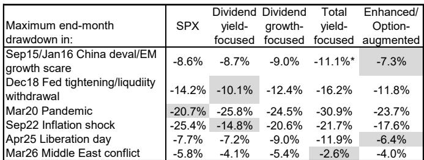
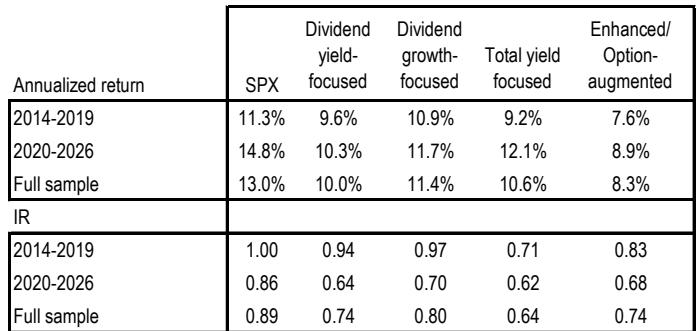
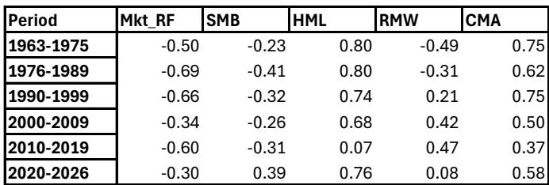

# JPM：长期观察，长期读者应如何理解权益收入策略

传统高股息策略在2020至2026年期间表现与市场整体存在差异，这并非偶然。JPM最新发布的长期观察报告指出，当前“后疫情-人工智能”这一特殊市场环境正在影响股息因子与价值、盈利等经典因子之间的关系。而随着人工智能热潮逐步正常化，未来十年更可能回归1963至1989年那种“正常商业周期波动”的环境。这意味着，长期读者若想从权益收入策略中获得稳定回报，可能需要放弃单纯追逐高股息率的做法，转而关注一个结合传统股息率和股息增长的双轨组合。

报告的核心证据来自对1963年至2026年间六个子时期股息因子相关性的拆解。在2010至2019年的低利率环境中，股息因子与价值因子的相关性从+0.68降至+0.07，读者为追求收益而忽视了价值属性。而在2020至2026年，股息因子与规模因子首次在60年内转为正相关（+0.39），与盈利因子的相关性则跌至接近零。这些结构性变化表明，过去十年有效的策略，未来可能不再适用。

> **KC评论：** 报告最关键的洞察不是“高股息需要继续观察”，而是“高股息因子与其他因子的关系会随宏观环境切换而剧烈变化”。读者需要关注的不是股息率本身，而是当前处于哪个环境周期。

## 1. 四种权益收入策略的实际表现已出现明显分化

报告追踪了2014年以来四类权益收入产品的实际回报：传统高股息率、股息增长、总股东回报（股息加回购）以及期权增强型。2020年之前，这四类策略的累计回报走势接近。但2020年后，差距迅速拉大：股息增长策略的复合回报最为强劲，总股东回报策略在2020至2026年期间年化回报达12.1%，高于传统高股息率策略的10.3%，但波动率也更高。期权增强型策略相对回报最低（8.9%），但在不确定性调整后表现与高股息率策略相当。

## 2. 不同市场冲击下，各策略的防御能力截然不同

报告通过六次市场修正事件（2015年中国汇率波动、2018年美联储紧缩、2020年疫情、2022年通胀冲击、2025年关税冲击、2026年地缘事件）的对比发现，没有一种策略在所有场景下都最优。在2022年通胀冲击中，传统高股息率策略因短久期价值倾向仅回撤14.8%，远低于标普500的25.4%。但在2020年疫情中，高股息策略因重仓能源和资金板块而回撤达25.8%，超过大盘。期权增强型策略在2015年、2025年和2026年三次短促波动中表现最为稳健，主要受益于期权权利金收入。

## 3. 未来十年资产配置可关注股息与价值因子的关联变化

报告判断，随着人工智能热潮的退潮，未来十年更可能重现1963至1989年的因子关系。这意味着股息因子与价值因子将重新呈现强正相关（+0.80），与市场贝塔因子保持强负相关（-0.50至-0.68），与盈利因子转为负相关（-0.31至-0.49）。对于长期读者而言，这意味着单纯持有高股息率组合可能再次面临价值陷阱的不确定性，而将股息增长策略纳入组合，可以在保持一定科技成长敞口的同时，获得更好的波动调整后回报和更一致的下跌保护。

> **KC评论：** 报告没有给出具体的组合权重，但提供了一个可复用的观察框架：先判断当前处于哪个因子环境，再决定股息策略的配置方向。未来十年，股息增长策略可能比传统高股息策略更适合作为核心持仓。

For informational purposes only. Portions may be generated,translated,summarized,or edited with AI assistance based on source materials and may contain omissions or errors. Please verify independently. This is not investment,legal,tax,accounting,or other professional advice.

For informational purposes only. Portions may be generated,translated,summarized,or edited with AI assistance based on source materials and may contain omissions or errors. Please verify independently. This is not investment,legal,tax,accounting,or other professional advice.

