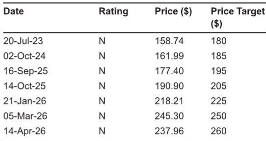

# JPM：JohnsonJohnsonJNJ.US2Q

强生二季度财报传递出一个清晰信号：公司增长的核心驱动力正在从Stelara专利到期后的缺口修复，转向口服新药Icotyde的放量。JPM在最新研究报告中指出，Icotyde上市后已有超过1万名患者开始治疗，商业保险覆盖率达到约50%，进度超出内部预期。与此同时，Tremfya在溃疡性结肠炎和克罗恩病领域的表现也持续优于预测。这两款药物正在成为强生创新药板块新的增长支柱。

但并非所有业务都在同步向好。MedTech部门的心血管业务增速低于预期，尤其是Abiomed旗下的Impella心脏泵，因一项英国独立临床试验结果导致使用量同比下降2%。强生管理层认为这是短期扰动，预计业务在2026年底至2027年恢复。中国市场的库存调整也对电生理业务造成约400个基点的增速影响。

整体来看，强生将2026年全年营收指引小幅上调至1008至1014亿美元，中位数提高3亿美元。上调主要来自创新药板块的强劲表现，包括Tremfya、Icotyde和Inlexo的贡献，但部分被MedTech的逆风抵消。JPM更新公司观点，认为当前约22倍2026年预期市盈率的估值已较为充分地反映了基本面改善。

## 1. Icotyde正在成为强生下一个重磅产品，口服药市场格局可能被重塑

Icotyde的早期表现是这份报告中最值得关注的数据点。从上一季度的约1500名患者启动治疗，到本季度超过1万名，季度环比增长超过5倍。商业保险覆盖率从几乎为零攀升至约50%，意味着支付方接受度正在快速建立。

JPM预计Icotyde的峰值销售额将超过100亿美元。这一预测基于两个逻辑：首先，Icotyde作为同类最佳口服药物，将首先从其他口服药手中夺取市场份额；其次，它有望在2020年代末至2030年代在炎症性肠病领域建立强势地位。如果这一路径兑现，Icotyde将与Tremfya形成互补，成为强生皮肤病和胃肠病治疗领域的一线系统治疗方案。

> **KC评论：** 100亿美元的峰值预测意味着Icotyde有望成为强生历史上销售额最大的产品之一。但关键在于，口服药能否真正从生物药手中抢到患者，尤其是在疗效数据尚未完全公开的情况下。当前1万名患者的样本量仍偏小，后续处方趋势和长期安全性数据才是真正的验证节点。

## 2. MedTech的短期逆风集中在心血管，但结构性转型方向未变

MedTech板块的二季度表现是这份报告中最大的不确定性来源。心血管业务增速低于预期，核心原因是Impella心脏泵在英国临床试验结果公布后使用量下降。Abiomed业务占MedTech销售额约5%，同比下降2%。强生认为这是短期扰动，预计2026年底至2027年恢复。

电生理业务增速也出现节奏变化，部分原因是竞争加剧，以及中国市场的库存调整造成约400个基点的影响。值得注意的是，虽然部分医院管理者提到手术量节奏变化，但强生表示自身业务尚未观察到明显趋势变化。

从更长的时间维度看，强生仍在推动MedTech业务从中个位数增长向高个位数增长加速。机器人手术平台是未来几年的关键看点，公司计划通过这些平台将MedTech业务进一步转向高增长领域。骨科业务的分拆也在按计划推进，预计2027年中完成，公司正在评估所有分拆选项。

## 3. 估值已反映基本面改善，后续增长需要新催化剂

JPM在报告中指出，强生过去一年的报价表现已经较为充分地反映了创新药板块的增长前景。当前约22倍2026年预期市盈率的估值，在大型制药公司中处于合理水平。这意味着后续报价上行需要新的催化剂，比如Icotyde在炎症性肠病领域的临床数据、MedTech业务的复苏节奏，或者骨科分拆带来的价值释放。

从竞争格局看，强生正在从一家依赖单一重磅生物药Stelara的公司，转型为拥有多款口服和生物药组合的创新药企。Stelara专利到期后的收入缺口正在被Tremfya和Icotyde填补。JPM预计，剔除Stelara后，创新药板块在2026年第二季度实现了约14%的运营收入同比增长。

但MedTech业务的短期不确定性仍在。Impella心脏泵的恢复时间、中国市场的库存调整周期、以及电生理业务的竞争态势，都是需要持续跟踪的变量。强生管理层对下半年MedTech增速的预期已有所下调，这可能是未来几个季度最需要关注的业绩不确定性点。

For informational purposes only. Portions may be generated,translated,summarized,or edited with AI assistance based on source materials and may contain omissions or errors. Please verify independently. This is not investment,legal,tax,accounting,or other professional advice.

For informational purposes only. Portions may be generated,translated,summarized,or edited with AI assistance based on source materials and may contain omissions or errors. Please verify independently. This is not investment,legal,tax,accounting,or other professional advice.

