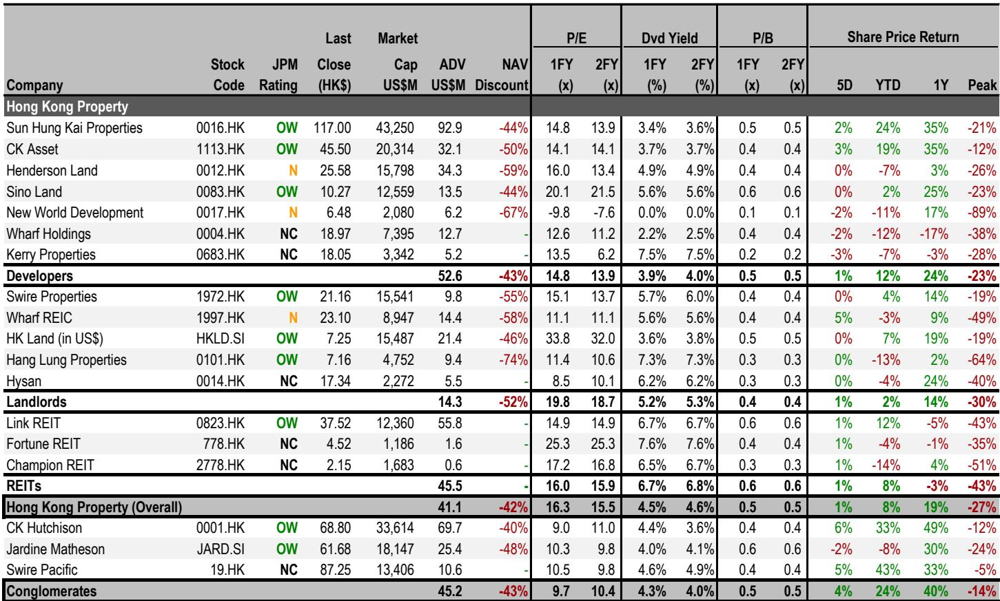
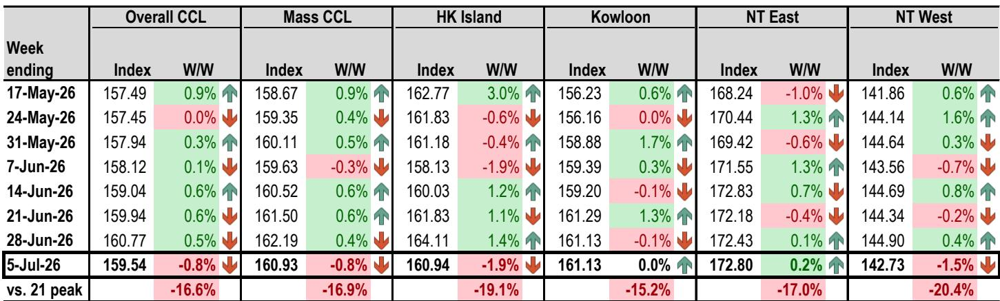
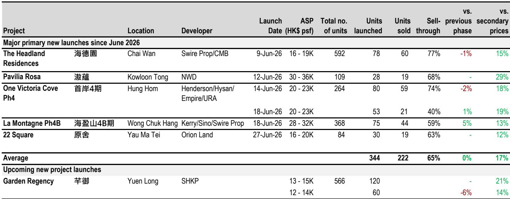

# 中国房地产市场观察：上半年驱动动能正在收窄

中国大陆房地产市场正进入一个比表面数据更为复杂的阶段。截至7月12日当周，十大城市实时二手房成交同比仅增长2%，较前一周11%的增速明显放缓，与2026年初两位数的增长态势形成对比。这并非暂时现象。环比走弱揭示出市场初期反弹动能已有所减弱，剩余支撑集中在日益狭窄的地域和细分领域。对于市场参与者而言，关键问题已不再是复苏是否真实，而是其能否在广度收窄的情况下持续。

数据中的张力显而易见。上海二手房成交仍录得8%的同比增长，但北京仅增长3%，广州增长1%，深圳实际下降6%。一线城市整体同比增长仅4%，为前一周增速的一半。与此同时，60城新房成交登记数据显示同比增长10%，但这同样掩盖了环比44%的大幅下滑，其中二线城市环比下降51%。趋势一致：复苏动能正在减弱，而低线城市率先出现调整。

## 一线城市库存收缩是最重要的结构性支撑，但不足以逆转整体趋势

报告中最具建设性的数据点是一线城市二手房挂牌量的持续下降。挂牌量较3月峰值下降3.8%，其中深圳以1.4%的周环比降幅领先，上海也有所下降。库存下降是支撑价格稳定的关键机制。当在售房源减少时，议价能力会边际向卖方倾斜，成交价格的下行压力随之缓解。

但这种支撑在地理上受限且机制上有限。十大城市整体挂牌量周环比实际上升0.1%，意味着库存并未在高质量城市之外下降。即便在一线城市，下降速度也在放缓。最近一期0.2%的周环比降幅小于两周前的0.6%。一线城市中原报价指数已从16.6降至16.3，表明卖方对定价能力的信心有所减弱。经理信心指数从55降至52，仍高于50阈值但趋势向下。这些是领先指标，正在发出警示信号。

## 香港市场已基本反映全年涨幅，下半年将呈现放缓特征

香港住宅市场也呈现出类似动能早于预期见顶的态势。房价指数周环比下降0.8%，为年内最大单周跌幅。这并非弱势下的调整；房价年内已上涨11%，已达到分析师设定的全年10-15%目标区间。问题在于后续走势，答案是明显放缓。对2026年下半年的预期是房价涨幅低于5%，意味着年内大部分涨幅已成为过去。

新房市场数据强化了这一观点。新鸿基地产锦田的Garden Regency项目定价较周边二手房成交价高出21%，这一大胆溢价反映了开发商信心。然而，第二张价单较第一张下调6%，表明初始定价水平的需求并未如预期强劲。该项目超额认购21倍，但这一指标在总价较低时可能具有误导性——定价400-500万港元的单位吸引首次置业者，他们对价格更为敏感，吸收溢价的能力较弱。实际成交率将是真正的考验，虽然预计可达90%，但降价表明开发商已在调整预期。

更广泛的市场指标与放缓趋势一致。前35个屋苑的二手房成交量同比下降53%。中原经纪人指数从64.5降至63.3，仍高于50但呈下降趋势。中原估价指数微升至81.8，但这是滞后指标。前瞻性信号指向一个动能已见顶、正进入更缓慢、更具选择性活动阶段的市场。

## 领展回购对收益型读者是战术信号，但未解决结构性回报压缩问题

领展决定启动基金单位回购，动用来自Swing By @ Thompson Plaza出售所得的8300万港元，是香港部分最值得关注的公司行动。计算很简单：如果全部15亿港元所得用于回购，将减少1.6%的单位数量，足以抵消预计0.6%的以股代息计划摊薄效应。对于基金单位持有人而言，这是直接的单位价值提升。

但这是战术性举措，而非战略转型。领展正利用单一资产出售来管理摊薄，这是对反复出现问题的单次解决方案。以股代息计划将在未来期间继续产生摊薄，除非该房托能持续产生出售所得或经营现金流以支持持续回购。这一信号很重要：管理层优先考虑单位价格支持和增值，这对收益型读者是积极信号。但香港房地产回报压缩的结构性挑战依然存在。随着房价指数已达全年目标且动能放缓，下半年净物业收入增长能力将受限，这限制了回购计划作为价值创造工具的长期有效性。

## 信用市场在幸存者和困境主体之间出现明显分化，差距将进一步扩大

信用数据提供了市场如何定价风险的窗口，分化十分明显。JACI中国高收益地产指数当周上涨0.36%，使年初至今回报率达到5.86%。这是可观的表现，但掩盖了显著的分化。万科的盈利预警——预计2026年上半年核心净亏损110-140亿元人民币，二季度亏损从一季度的53亿元加速至72亿元——提醒人们困境周期尚未结束。万科一直在以40%首付比例延长境内到期债务，其债务到期高峰在7月后有所减轻，但基础经营亏损正在加深而非企稳。

与此对比，普洛斯中国与乌兰察布市政府签署战略合作协议，在内蒙古开发一个多吉瓦级超大规模数据中心园区。这是该公司继2025年8月与浙江省达成25亿元投资后的第二个政府合作项目。信用市场正在正确解读这一点：普洛斯的债券交易价格分别为面值的86.5和87.2美分，最差回报表现分别为18.7%和13.4%。对于一家明显未陷入困境的公司而言，这些是困境级别的价格，为能够区分价格波动与基本面恶化的读者创造了引人注目的风险回报比。

信用读者的关键洞察是，市场仍在定价某种已不存在的系统性风险。房地产行业正在分化为幸存者和挣扎者，而债券市场尚未完全重新定价这种分化。具有运营动能、政府合作伙伴关系和可控到期结构的公司正与万科等主体被一视同仁。这为选择性布局创造了机会，但也意味着信用周期的下一阶段将由分化而非贝塔驱动。

## 下半年决策框架：聚焦库存动态、开发商定价纪律和信用分化

对于应对2026年下半年的机构读者而言，决策框架应基于三个支柱。首先，中国一线城市的库存动态仍是价格稳定最可靠的领先指标。挂牌量较3月峰值下降3.8%具有支撑作用，但下降速度正在放缓。读者应关注深圳1.4%的周环比降幅在未来几周是加速还是减速。持续的库存下降将支撑一线城市价格稳定的观点；持平则表明库存缓冲已耗尽，价格压力将重现。

其次，香港新房市场的开发商定价纪律是更广泛市场情绪的先行指标。Garden Regency项目第二张价单下调6%是一个警示。如果后续项目也出现相对于初始预期的降价，将确认开发商定价能力正在减弱，市场正从卖方转向买方环境。香港开发商和房东的读者应关注新房开盘价与二手房可比价格之间的价差；价差收窄表明需求减弱。

第三，信用分化是固定收益领域的主导主题。万科与普洛斯之间的差距并非异常；它是本轮周期剩余阶段如何展开的模板。读者应关注那些已证明能获得非传统资金来源的公司——政府合作、资产出售或非住宅板块的经营现金流——并避免那些仅依赖物业销售和债务展期的公司。信用领域的首选——LNGFOR '29s回报表现9.9%和SHUION '29s回报表现9.1%——反映了这一逻辑：这些是具有流动性缓冲和运营多元化的公司，市场仍在低估其价值。

2026年下半年不会重复上半年。容易获得的收益已被捕获。剩下的市场需要精细分析、纪律性布局以及对哪些板块仍有动能、哪些已接近尾声的清晰判断。数据正在讲述一个广度收窄、速度放缓的故事。对市场参与者而言，问题在于他们是否准备好据此行动。

*仅供参考。部分内容可能基于源材料通过AI辅助生成、翻译、总结或编辑，可能存在遗漏或错误。请独立核实。这不构成专业建议。*

仅供参考。部分内容可能基于源材料通过AI辅助生成、翻译、总结或编辑，可能存在遗漏或错误。请独立核实。这不构成专业建议。

