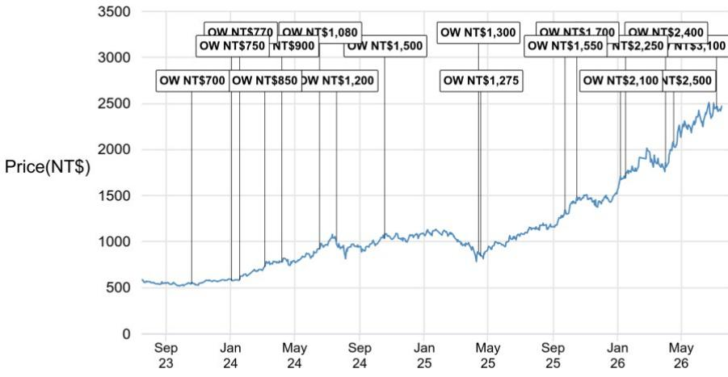
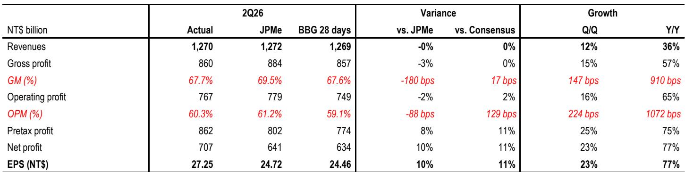

# 关于某头部半导体公司2026年展望的观察：AI需求周期结构性延伸，短期利润率波动无需过度关注

某头部半导体制造企业公布了2026年第二季度业绩。从表面看，营收达到新台币12,700亿元，毛利率为67.7%，均处于公司指引区间的高端，但市场最初反应略显平淡。毛利率未达到最乐观的预期（包括某分析机构自身预估的69.5%），相差约180个基点。原因较为明确：N2制程的折旧启动早于预期，且海外工厂的稀释效应持续存在。

然而，若仅聚焦于这180个基点的差距，可能会忽略更重要的信息。该公司将2026年全年营收指引上调至以美元计同比增长超过40%，显著高于市场普遍预期的30%中高水平。公司同时宣布2026年资本支出计划为600-640亿美元，远超预期，并暗示未来数年资本支出将维持高位。最关键的是，管理层指出，AI需求指标目前指向上行空间，这已经超过了公司此前对2024至2029年AI加速器50%中高水平的年复合增长率预测。客户和终端用户对代理型AI应用的需求正在加速，覆盖加速器、CPU、网络和内存基底芯片，预计增长势头将持续至2029-2030年。

这并非一次简单的增量更新，而是对整个AI半导体周期的结构性重估。近期的利润率波动属于一次性的重置。长期营收轨迹、资本密集度和竞争壁垒均在增强。对于认真的观察者而言，问题不在于该公司能否维持其地位，而在于如何校准对一个比以往任何半导体上升周期都更长、更深、资本密集度更高的周期的认知。

## 2026年营收增长指引超40%：AI需求进入新阶段，而非周期性波动

本次业绩发布中最关键的数字并非季度营收或毛利率，而是2026年全年以美元计同比增长超40%的营收指引。这不仅仅是超出预期，更代表了公司在已具规模的营收基础上，增长轨迹的根本性加速。

作为参照，该公司2025年营收约为900亿美元。40%的增长率意味着2026年营收将接近1300亿美元。这并非周期性的反弹，而是由AI基础设施建设驱动的结构性扩张，其规模前所未有。某分析机构此前预测2024至2029年数据中心AI的年复合增长率为69%，这一预测基于更高的加速器预估和AI CPU数量的激增，而管理层关于AI加速器年复合增长率存在上行空间的评论，使得该预测现在看来可能偏于保守。

其含义清晰：AI投资周期并未在2026或2027年见顶，仍处于早期至中期阶段。代理型AI不仅需要训练加速器，还需要推理CPU、网络芯片和内存基底芯片，这使得需求基础远超最初以GPU为核心的构建阶段。需求驱动因素的多样化降低了单一环节回调的风险。即使某一家客户收缩，其他客户也会跟进。

## 2026年600-640亿美元资本支出计划：为多年需求浪潮布局，而非仅管理产能

2026年600-640亿美元的资本支出预算，较2025年水平增长约50%或更多。公司明确表示，增长来自工具提前采购、N3和N5产能投资、工厂建设以及部分工具价格上涨。但更重要的信号是管理层对未来几年的表述：未来数年资本支出存在显著上行空间，这暗示着对2027年和2028年分别达到780亿和840亿美元的预估可能还有上调空间。

这并非一家看到近期峰值的公司。该公司正致力于一个多年的资本支出周期，这将使其成为美国最大的领先制程代工厂，并已宣布对美国业务追加1000亿美元投资。公司押注美国客户（主要是超大规模云提供商和AI公司）将需要在美国本土生产的领先制程芯片，其规模要求在美国本土建设工厂。

其战略逻辑有两点。首先，通过使任何竞争对手都难以匹配其产能规模，来巩固自身竞争地位。其次，通过在美国建厂，既顺应了客户对地域多元化的需求，也获得了本土制造带来的政治和监管层面的好感。对于观察者而言，风险不在于该公司过度投资，而在于竞争对手投资不足并永久失去市场份额。

## N2与海外工厂导致的毛利率稀释：暂时性机械问题，非定价能力的结构性恶化

第二季度67.7%的毛利率，虽处于指引区间高端，但未达到最乐观预期，相差约180个基点。分析机构将差距归因于N2制程折旧启动早于预期，以及海外工厂稀释效应增加。2026年下半年，N2的产能爬坡预计将拖累毛利率300-400个基点，但这部分影响应能被N3的产能爬坡和盈利能力改善部分抵消。

这是一个机械性问题，而非定价问题。N2是新节点，早期生产通常成本较高。随着N3盈利能力改善，预计将在2026年下半年与公司整体盈利能力持平。分析机构观点认为，尽管存在这些不利因素，未来几个季度毛利率仍将稳定在60%以上的高水平，且长期毛利率可能呈逐步上升趋势。

关键在于，该公司的定价能力依然稳固且正在增强。管理层关于持续传递价值的评论，结合强劲的需求和运营效率，表明这是一家能够将成本转嫁给客户的公司。半导体行业历史上，随着节点成熟和竞争加剧，利润率往往会压缩。该公司似乎正在打破这一模式，因为其客户在规模上没有可行的替代方案。毛利率的下降是建设下一代产能的暂时性成本，而非公司定价能力被侵蚀的信号。

## 竞争地位强化：欢迎新封装合作伙伴，同时淡化来自OSAT的威胁

业绩电话会议中最具启示性的方面之一是管理层对竞争的评论。公司对在领先制程技术领域持续保持份额表达了强烈信心。公司欢迎先进封装领域的新参与者，包括英特尔的EMIB技术，并指出先进封装产能存在严重短缺。同时，管理层坚决反驳了OSAT（外包半导体封装测试）公司可能利用封装作为进入代工服务入口的观点。

这是一种成熟的竞争策略。通过欢迎封装合作伙伴，公司承认先进封装是瓶颈，行业需要更多产能。但通过明确区分封装和代工服务，公司表明其不认为OSAT对其核心业务构成竞争威胁。代工业务的护城河不在于封装，而在于制程技术、设计生态系统和制造规模。

追加的1000亿美元美国投资进一步强化了这一竞争优势。该公司将成为相对少见在美国拥有规模化领先制程产能的代工厂。这使其在服务日益重视供应链地域多元化的美国客户时，拥有结构性优势。无法匹配这一投资的竞争对手将被排除在增长最快的终端市场之外。

## 观察框架：评估AI半导体主题的三个关键问题

本次业绩报告提供了足够的信息，为评估该公司及更广泛AI半导体生态系统的观察者构建了一个决策框架。三个问题至关重要。

第一，AI需求周期的持续时间有多长？管理层表示，需求应能强劲持续至2029-2030年，代理型AI正成为训练和推理之外的新需求驱动力。如果这一观点正确，那么当前的资本支出周期并非峰值，而是爬坡阶段。过度投资的风险是可控的，因为需求正在扩大。分析机构预测2024至2029年数据中心AI年复合增长率为69%，这为这一观点提供了量化锚点。认为周期长于市场普遍预期的观察者，应关注该公司及其关键供应商。

第二，利润率压缩是暂时性的还是结构性的？证据指向暂时性。N2折旧是一次性重置。N3盈利能力正在改善，并将在2026年下半年与公司整体水平持平。海外工厂稀释是经营成本，将被更高的营收和定价能力所抵消。分析机构关于长期利润率将逐步上升的观点，得到了管理层关于传递价值和运营效率的评论支持。接受这一观点的观察者，应透过近期利润率波动，关注长期盈利能力。

第三，除该公司外，谁将从产能建设中受益？公司承认的先进封装短缺，为英特尔EMIB等封装专业公司创造了机会。1000亿美元的美国投资将使建筑、设备和材料公司受益。推动资本支出上行的工具提前采购，表明半导体设备供应商将看到持续需求。观察者应梳理供应链，识别哪些公司受益于该公司的产能扩张，同时不承担代工业务的竞争风险。

本次业绩报告的核心结论是，该公司不仅执行出色，更在重塑半导体行业的结构以利于自身。加速的营收增长、持续的资本投入、稳固的定价能力和扩大的竞争护城河，使其成为值得给予估值溢价的标的。近期的利润率失望只是干扰项。长期故事比三个月前更为强劲。

*仅供参考。部分内容可能基于源材料通过AI辅助生成、翻译、总结或编辑，可能存在遗漏或错误。请独立核实。本文不构成任何专业建议。*

仅供参考。部分内容可能基于源材料通过AI辅助生成、翻译、总结或编辑，可能存在遗漏或错误。请独立核实。本文不构成任何专业建议。

