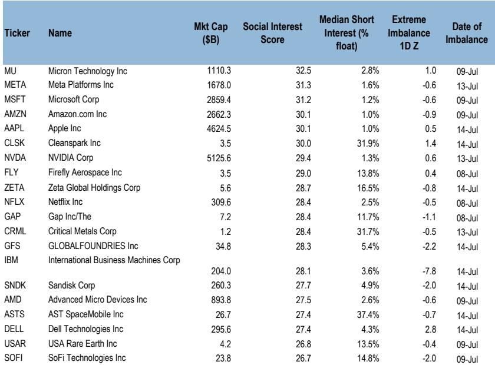

# JPM：散户雷达7月15日-交易财报季资金流降温

二季度财报季刚拉开帷幕，JPM一份截至7月15日的零售资金流报告揭示了一个值得关注的信号：散户整体交易活跃度降至年内均值的24%以下，但资金流向的结构性变化比总量节奏变化更值得细看。半导体相关ETF的防御性调仓、资金板块ETF创下14个月最大资金流入、以及IBM单日明显波动后成为当周最被抛售的公司，这三件事发生在同一周，指向同一个判断——散户正在从追逐AI半导体转向交易财报季的银行和航空股，但AI主题的长期持仓并未瓦解。

报告显示，当周散户总净流入约56亿美元，低于过去12个月周均的68亿美元。资金减速主要来自ETF端，其活跃度降至18%分位。单只公司交易虽然也从上周的86%分位回落至51%分位，但结构变化更值得关注。

## 1. 资金ETF资金流入创14个月新高，散户在财报后选择获利了结

当周资金板块ETF录得2.5个标准差的净观点偏积极，这是14个月以来的最大单周流入。银行股财报普遍超预期，交易与国际机构业务是主要驱动力。但散户在公司层面的操作与ETF形成反差：GS、美国银行和富国银行在财报公布后均遭遇净观点偏谨慎，分别录得-2.1z、-0.4z和0.5z的散户资金流。Citi是例外，获得3.0z的净观点偏积极。

> **KC评论：** 这意味着散户在财报季的操作模式更接近“买预期、卖事实”。ETF的持续流入说明板块整体看多情绪仍在，但公司层面的获利了结表明，散户对银行股反弹的持续性存疑，更倾向于锁定短期收益。

## 2. 半导体ETF转向防御，但AI核心持仓未松动

半导体ETF的持仓变化是当周最清晰的防御信号。散户观点偏谨慎SOXL（-1.8z）并观点偏积极SOXS（1.6z），前者是3倍做多半导体，后者是3倍做空。这种双向操作在7月初以来持续出现，与Mag 7的持续观点偏积极形成对比。NVDA、TSLA和MSFT依然是当周散户净观点偏积极最多的公司，分别流入4.86亿、3.43亿和1.67亿美元。

报告特别提到，ASML财报超预期并上调2026年全年销售指引16%，同时计划将2027和2028年的EUV和浸没式DUV产能提升30%，高于所有卖方预期。散户在ASML上净观点偏积极1.0z至1.9z。JPM分析师认为，半导体设备板块近期约15%的回调为下半年表现提供了支撑，预计AI驱动的正面盈利修正周期将持续。

## 3. IBM单日明显波动25%成为散户抛售的极端案例，但并非系统性信号

IBM在7月14日盘后预披露二季度业绩远低于预期，次日报价明显波动超过25%，创下1968年以来最大单日跌幅。散户在当周净观点偏谨慎IBM约2.02亿美元，其中周二和周三连续两天各观点偏谨慎约7000万美元，使其成为当周最被抛售的公司。

报告详细列出了IBM业绩不及预期的三个原因：季度资本支出在6月最后几周转向服务器、存储和内存以锁定供应受限的基础设施；大单未能完成签约；交易处理业务疲软。这是一个公司层面的不确定性事件，而非行业性信号。IBM的明显波动并未引发散户对科技板块的整体撤退，同期散户仍在净观点偏积极NVDA、TSLA和MSFT。

## 4. 散户的AI主题交易正在从“买设备”转向“买应用”

一个容易被忽略的细节是，散户在AI数据中心和电气化主题篮子（JPAMAIDE）中的交易量当周仍达12.7亿美元，仅次于Mag 7和成长股篮子。但半导体存储公司的散户资金流已出现平台化迹象：SNDK的累计净观点偏积极自7月2日后趋于平稳，MU的净流入也仅为0.3z。

报告还提到，散户在期权市场的参与度处于历史高位，最活跃的期权标的依然是TSLA、NVDA、MU、AMZN和SNDK。这暗示散户并未离开AI主题，而是从直接观点偏积极半导体公司转向更复杂的期权策略，或者将资金分散到更广泛的AI受益标的。

> **KC评论：** 散户从半导体ETF转向资金ETF，同时继续持有Mag 7核心仓位，这种“换仓不换场”的行为模式值得跟踪。它反映的不是对AI主题的怀疑，而是对短期估值和财报节奏的主动管理。如果后续半导体设备股的财报能够验证ASML给出的产能扩张信号，散户资金可能重新回流。

当周数据还显示，散户净买入最多的主题篮子包括AI数据中心、Mag 7、成长股、高中国营收敞口公司以及OBBBA即时费用化受益股。净卖出最多的则是低端消费敏感股、地缘敏感能源股和特朗普去监管议程受益股。这种“买AI、卖消费和能源”的偏好，与过去数周保持一致。

财报季才刚刚开始。截至7月15日，标普500中约7.2%的公司已公布业绩，主要集中在资金和工业板块。市场共识预期二季度盈利同比增长23.7%，营收增长11.7%。散户资金流的变化节奏，将在未来几周成为检验这些预期是否被定价的实时指标。

For informational purposes only. Portions may be generated,translated,summarized,or edited with AI assistance based on source materials and may contain omissions or errors. Please verify independently. This is not investment,legal,tax,accounting,or other professional advice.

For informational purposes only. Portions may be generated,translated,summarized,or edited with AI assistance based on source materials and may contain omissions or errors. Please verify independently. This is not investment,legal,tax,accounting,or other professional advice.

