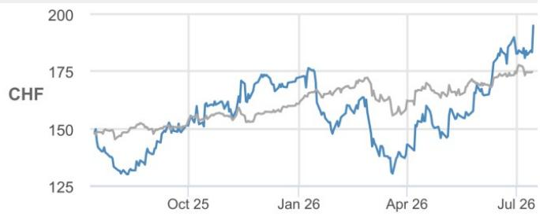
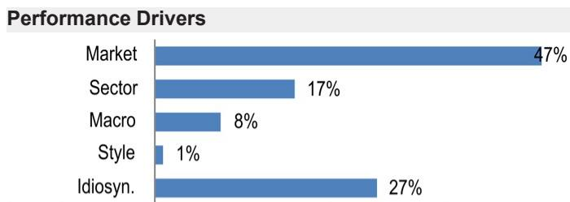

# JPM

## Richemont

The sparkles: raising forecasts by 7-8%

Richemont kicked off the H1/Q2 26 reporting season yesterday morning with, once again, a stellar performance. Momentum was solid not just in the Jewellery Maisons division (which was up an incredible +24%! but also in the Specialist Watchmakers and Other divisions, which also came in ahead of expectations. As we have been arguing, structural tailwinds in jewellery are clearly benefiting the Group (see more in our deep-dive note Richemont: 18 Karats of strength); still, the broad-based nature, magnitude, and consistency of growth also reflect, in our view the superior quality of execution. This should be increasingly recognized by market participants, notably in the context of a luxury backdrop that remains highly polarised and volatile. Banking in the solid beat on Q1 27 numbers, faster momentum and better operating leverage, we have raised our forecasts by 7-8%, taking our price target to CHF220 (CHF200). Despite and already solid outperformance YTD (+14% vs sector around -10%), we think the story has further legs thanks to sustained momentum and earnings growth acceleration from here. Hence, Richemont remains our top pick in luxury.

- Superior business quality, delivering best results. The key highlight of the trading update was clearly the outstanding performance in Jewellery Maisons, +24% ex-FX in Q1, accelerating from an already exceptional +16% in Q4. Positively, all regions and all brands contributed to this, with balanced momentum among domestic consumers and tourists. This balanced growth in our view is very important. In fact, looking at such high level of growth, the concern could be on the sustainability of these numbers and whether penetration is being pushed too far. Such a balanced delivery, by nationality, brand, family line, different SKUs in our view dilutes the risk of over penetration and over reliance on a key best seller, leaving the growth journey more sustainable for longer (as we have explored for instance for Van Cleef Alhambra here). To support this, we think that the level of newness and innovation across all jewellery maisons have been carrying on (if anything seemingly accelerating in recent months) has been instrumental in feeding the momentum and supporting growth in such a robust way. While growth should not sustain at such high levels as we move on tougher comps, we still expect very sustained trends throughout the years, standing at a whole other level vs the rest of the sector (we model at +17% ex-FX in both Q2 and for the FY). Importantly, we think this proactive brand and product management is increasingly spreading to the broader portfolio, with sharper collections also at some of the brands in the other divisions (e.g. Piaget recent drops for both jewellery and watches), leading to healthier results there too.

- Where does this leave us for the rest of reporting? We think this outperformance is, to a large extent, driven by category- and company-specific dynamics. Having said this, the extent of the acceleration, also at brands where momentum is more mixed (notably in the Other division) in our view sends a generally positive read to the rest of the sector. As we discussed in our preview book last week, we think the luxury backdrop is not as unfavorable as some of the broader narrative would suggest; Richemont trading update clearly confirmed this. With luxury share prices reacting positively to this print, the

Sources for: Style Exposure – JPM Global Markets Strategy; all other tables are company data and JPM estimates.

See page 8 for analyst certification and important disclosures, including non-US analyst disclosures.

## Overweight

CFR.S, CFR SW
Price (15 Jul 26): CHF194.95

▲ Price Target (Dec-27): CHF220.00

Prior (Dec-27): CHF200.00

## European Luxury & Sporting Goods

Chiara Battistini AC
(39-02) 8895-2700
chiara.x.battistini@JPM.com
JPM Securities plc/ JPM Securities (Asia Pacific) Limited

Wendy Liu
(44-20) 3493-9733
wendy.liu@JPM.com
JPM Securities plc

Apurva Vishwaraj
apurva.vishwaraj@jpmchase.com
JPM Securities plc
Victoria Saden
(44-20) 3493-0435
victoria.saden@JPM.com
JPM Securities plc

Specialist Sales contact details:

## Olivia Petronilho - Specialist Sales - European Consumer

(44-20) 3493-3709
olivia.b.petronilho@JPM.com

## Key Changes (FYE Mar)

<table><tr><td></td><td>Prev</td><td>Cur</td><td> $\Delta$ </td></tr><tr><td>Revenue - 27E (€ mn)</td><td>24,549</td><td>25,697</td><td>4.7%</td></tr><tr><td>Revenue - 28E (€ mn)</td><td>26,502</td><td>27,951</td><td>5.5%</td></tr><tr><td>Adj. EPS - 27E (€)</td><td>6.96</td><td>7.49</td><td>7.7%</td></tr><tr><td>Adj. EPS - 28E (€)</td><td>7.95</td><td>8.55</td><td>7.5%</td></tr><tr><td>Adj. EBIT - 27E (€ mn)</td><td>5,168</td><td>5,654</td><td>9.4%</td></tr><tr><td>Adj. EBIT - 28E (€ mn)</td><td>5,906</td><td>6,451</td><td>9.2%</td></tr></table>

Style Exposure

<table><tr><td rowspan="2">Quant Factors</td><td rowspan="2">Current %Rank</td><td colspan="4">Hist %Rank (1=Top)</td></tr><tr><td>6M</td><td>1Y</td><td>3Y</td><td>5Y</td></tr><tr><td>Value</td><td>85</td><td>84</td><td>82</td><td>71</td><td>64</td></tr><tr><td>Growth</td><td>54</td><td>39</td><td>5</td><td></td><td></td></tr><tr><td>Momentum</td><td>25</td><td>21</td><td>59</td><td>23</td><td>55</td></tr><tr><td>Quality</td><td>25</td><td>38</td><td>41</td><td>58</td><td>55</td></tr><tr><td>Low Vol</td><td>45</td><td>45</td><td>47</td><td>45</td><td>36</td></tr><tr><td>ESGQ</td><td>24</td><td>16</td><td>34</td><td>29</td><td>79</td></tr></table>

Price Performance  

— CFR.S Price (CHF) — MSCI-Eu (rebased)

<table><tr><td></td><td>YTD</td><td>1m</td><td>3m</td><td>12m</td></tr><tr><td>Abs</td><td>13.3%</td><td>7.9%</td><td>27.1%</td><td>31.6%</td></tr><tr><td>Rel</td><td>4.6%</td><td>6.6%</td><td>22.8%</td><td>13.6%</td></tr></table>

Company Data

<table><tr><td>Shares O/S (mn)</td><td>588</td></tr><tr><td>52-week range (CHF)</td><td>196.95-127.20</td></tr><tr><td>Market cap ($ mn)</td><td>141,773.10</td></tr><tr><td>Exchange rate</td><td>0.81</td></tr><tr><td>Free float (%)</td><td>96.6%</td></tr><tr><td>3M ADV (mn)</td><td>0.92</td></tr><tr><td>3M ADV ($ mn)</td><td>192.6</td></tr><tr><td>Volatility (90 Day)</td><td>34</td></tr><tr><td>Index</td><td>MSCI Europe</td></tr><tr><td>BBG ANR (Buy | Hold | Sell)</td><td>20|11|1</td></tr></table>

Key Metrics (FYE Mar)

<table><tr><td>€ in millions</td><td>FY26A</td><td>FY27E</td><td>FY28E</td><td>FY29E</td></tr><tr><td colspan="5">Financial Estimates</td></tr><tr><td>Revenue</td><td>22,420</td><td>25,697</td><td>27,951</td><td>29,810</td></tr><tr><td>Adj. EBITDA</td><td>6,101</td><td>7,424</td><td>8,267</td><td>9,043</td></tr><tr><td>Adj. EBIT</td><td>4,492</td><td>5,654</td><td>6,451</td><td>7,181</td></tr><tr><td>Adj. net income</td><td>3,464</td><td>4,419</td><td>5,041</td><td>5,630</td></tr><tr><td>Adj. EPS</td><td>5.88</td><td>7.49</td><td>8.55</td><td>9.55</td></tr><tr><td>BBG EPS</td><td>6.15</td><td>6.95</td><td>7.94</td><td>-</td></tr><tr><td>Cashflow from operations</td><td>4,880</td><td>4,468</td><td>6,286</td><td>7,065</td></tr><tr><td>FCFF</td><td>3,932</td><td>3,557</td><td>5,317</td><td>6,032</td></tr><tr><td colspan="5">Margins and Growth</td></tr><tr><td>Revenue Growth Y/Y (%)</td><td>4.8%</td><td>14.6%</td><td>8.8%</td><td>6.7%</td></tr><tr><td>Gross margin</td><td>64.4%</td><td>63.4%</td><td>63.7%</td><td>63.9%</td></tr><tr><td>EBITDA margin</td><td>27.2%</td><td>28.9%</td><td>29.6%</td><td>30.3%</td></tr><tr><td>EBIT margin</td><td>20.0%</td><td>22.0%</td><td>23.1%</td><td>24.1%</td></tr><tr><td>Adj. EPS growth</td><td>(8.1%)</td><td>27.6%</td><td>14.1%</td><td>11.7%</td></tr><tr><td colspan="5">Ratios</td></tr><tr><td>Adj. tax rate</td><td>20.0%</td><td>19.1%</td><td>19.1%</td><td>19.1%</td></tr><tr><td>Interest cover</td><td>89.2</td><td>137.8</td><td>159.3</td><td>182.2</td></tr><tr><td>Net debt/Equity</td><td>NM</td><td>NM</td><td>NM</td><td>NM</td></tr><tr><td>Net debt/EBITDA</td><td>NM</td><td>NM</td><td>NM</td><td>NM</td></tr><tr><td>ROCE</td><td>10.1%</td><td>12.2%</td><td>13.0%</td><td>13.2%</td></tr><tr><td>ROE</td><td>15.0%</td><td>17.7%</td><td>18.3%</td><td>18.1%</td></tr><tr><td colspan="5">Valuation</td></tr><tr><td>FCFF yield</td><td>3.2%</td><td>2.9%</td><td>4.3%</td><td>4.8%</td></tr><tr><td>Dividend yield</td><td>2.0%</td><td>1.7%</td><td>1.9%</td><td>2.1%</td></tr><tr><td>EV/Revenue</td><td>4.9</td><td>4.3</td><td>3.8</td><td>3.5</td></tr><tr><td>EV/EBITDA</td><td>18.1</td><td>14.8</td><td>12.9</td><td>11.5</td></tr><tr><td>Adj. P/E</td><td>35.9</td><td>28.2</td><td>24.7</td><td>22.1</td></tr></table>

## Summary Investment Thesis and Valuation

## Investment Thesis

Richemont is the global leader in branded jewellery and one of the leaders in high-end watches. It is strongly positioned with Cartier and VC&A to tap into the jewellery segment's long-term strong fundamentals. The Group has evolved meaningfully over the past 15 years, increasing exposure to the jewellery category and a higher retail mix, and has been working on its cost base to make it increasingly variable. Further, we think the jewellery space in general has also changed structurally in the last few years, with more attractive value for money propositions vs leather goods, more wearable designs and stronger marketing campaigns increasingly driving traction with self-purchasing women. These features and changing dynamics should benefit Richemont the most globally and help it navigate through a slowdown better than in the past, smoothing out historical operational and financial volatility, possibly better than what is perceived by market participants currently and what is priced in at current valuation levels. We rate the stock Overweight.

## Valuation

Our Dec-27 DCF-based target price of CHF220 is based on the following factors: March 2027-31 explicit forecast, medium-term growth of 5.5%, terminal growth of 3.5% and WACC of 9% reflecting the current cost of equity.

<table><tr><td>Factors</td><td>6M Corr</td><td>1Y Corr</td></tr><tr><td>Market: MSCI Europe ex UK</td><td>0.78</td><td>0.71</td></tr><tr><td>Sect: Cons Discretionary</td><td>0.76</td><td>0.64</td></tr><tr><td>Ind: Cons Dur &amp; Apparel</td><td>0.85</td><td>0.80</td></tr><tr><td>Macro:</td><td></td><td></td></tr><tr><td>Citi Eco Surprise Eurozone</td><td>0.41</td><td>0.21</td></tr><tr><td>Eurozone CPI</td><td>-0.12</td><td>-0.08</td></tr><tr><td>Eurozone Exports</td><td>0.20</td><td>0.07</td></tr><tr><td>Quant Styles:</td><td></td><td></td></tr><tr><td>Growth</td><td>-0.22</td><td>-0.18</td></tr><tr><td>Momentum</td><td>-0.25</td><td>-0.09</td></tr><tr><td>Size</td><td>-0.18</td><td>0.08</td></tr></table>

'bar' should have clearly gone up now. Still within the mix, we think polarisation of performance and specific category dynamics (notably the leather goods fatigue) will continue to drive a visible divide between winners and laggards. Within the winners, we expect Zegna and Brunello to report particularly strong results. While the former is up almost 30% YTD, Brunello stock has lagged and hence we see the current share price level as particularly attractive and we would be positive into the next update (on the 30 $^{th}$ of July, recall we have placed the stock on Positive Catalyst Watch into this).

## Q1 27 sales in focus

Table 1: Richemont – Sales by segment (€m)

<table><tr><td></td><td>Q1 26</td><td>Q1 27A</td><td>Q1 27E</td></tr><tr><td>Jewellery maisons</td><td>3,914</td><td>4,732</td><td>4,364</td></tr><tr><td>% Change</td><td>7%</td><td>21%</td><td>12%</td></tr><tr><td>% constant currency</td><td>11%</td><td>24%</td><td>14%</td></tr><tr><td>Specialist watchmakers</td><td>824</td><td>873</td><td>840</td></tr><tr><td>% Change</td><td>-10%</td><td>6%</td><td>2%</td></tr><tr><td>% constant currency</td><td>-7%</td><td>8%</td><td>4%</td></tr><tr><td>Other</td><td>674</td><td>724</td><td>691</td></tr><tr><td>% Change</td><td>-4%</td><td>7%</td><td>2%</td></tr><tr><td>% constant currency</td><td>-1%</td><td>9%</td><td>5%</td></tr><tr><td>Total Sales</td><td>5,412</td><td>6,329</td><td>5,895</td></tr><tr><td>% Change</td><td>3%</td><td>17%</td><td>9%</td></tr><tr><td>% constant currency</td><td>6%</td><td>20%</td><td>11%</td></tr></table>

Source: JPM estimates, Company data.

Table 2: Richemont – Sales by region (€m)

<table><tr><td></td><td>Q1 26</td><td>Q1 27A</td><td>Q1 27E</td></tr><tr><td>Europe</td><td>1,295</td><td>1,429</td><td>1,391</td></tr><tr><td>% Change</td><td>11%</td><td>10%</td><td>7%</td></tr><tr><td>% Forex</td><td>0%</td><td>-1%</td><td>0%</td></tr><tr><td>% constant currency</td><td>11%</td><td>11%</td><td>7%</td></tr><tr><td>Japan</td><td>527</td><td>632</td><td>585</td></tr><tr><td>% Change</td><td>-13%</td><td>20%</td><td>11%</td></tr><tr><td>% Forex</td><td>2%</td><td>-16%</td><td>-11%</td></tr><tr><td>% constant currency</td><td>-15%</td><td>36%</td><td>22%</td></tr><tr><td>Asia Excl Japan</td><td>1,731</td><td>2,068</td><td>1,872</td></tr><tr><td>% Change</td><td>-4%</td><td>19%</td><td>8%</td></tr><tr><td>% Forex</td><td>-4%</td><td>-2%</td><td>0%</td></tr><tr><td>% constant currency</td><td>0%</td><td>21%</td><td>8%</td></tr><tr><td>Americas</td><td>1,335</td><td>1,670</td><td>1,546</td></tr><tr><td>% Change</td><td>10%</td><td>25%</td><td>16%</td></tr><tr><td>% Forex</td><td>-7%</td><td>-2%</td><td>-3%</td></tr><tr><td>% constant currency</td><td>17%</td><td>27%</td><td>18%</td></tr><tr><td>Middle East/Africa</td><td>524</td><td>530</td><td>500</td></tr><tr><td>% Change</td><td>11%</td><td>1%</td><td>-5%</td></tr><tr><td>% Forex</td><td>-6%</td><td>-2%</td><td>-3%</td></tr><tr><td>% constant currency</td><td>17%</td><td>3%</td><td>-2%</td></tr><tr><td>Total</td><td>5,412</td><td>6,329</td><td>5,895</td></tr><tr><td>% Change</td><td>3%</td><td>17%</td><td>9%</td></tr><tr><td>% Forex</td><td>-3%</td><td>-3%</td><td>-2%</td></tr><tr><td>% constant currency</td><td>6%</td><td>20%</td><td>11%</td></tr></table>

Source: JPM estimates, Company data.

Table 3: Richemont – Sales by channel (€m)

<table><tr><td></td><td>Q1 26</td><td>Q1 27A</td><td>Q1 27E</td></tr><tr><td>Retail</td><td>3,734</td><td>4,504</td><td>4,145</td></tr><tr><td>% Change</td><td>3%</td><td>21%</td><td>11%</td></tr><tr><td>% Forex</td><td>-3%</td><td>-3%</td><td>-2%</td></tr><tr><td>% constant currency</td><td>6%</td><td>24%</td><td>13%</td></tr><tr><td>Wholesale</td><td>1,355</td><td>1,452</td><td>1,423</td></tr><tr><td>% Change</td><td>2%</td><td>7%</td><td>5%</td></tr><tr><td>% Forex</td><td>-4%</td><td>-2%</td><td>-2%</td></tr><tr><td>% constant currency</td><td>6%</td><td>9%</td><td>7%</td></tr><tr><td>Online</td><td>323</td><td>373</td><td>328</td></tr><tr><td>% Change</td><td>3%</td><td>15%</td><td>2%</td></tr><tr><td>% Forex</td><td>-3%</td><td>-3%</td><td>-2%</td></tr><tr><td>% constant currency</td><td>6%</td><td>18%</td><td>4%</td></tr><tr><td>Total</td><td>5,412</td><td>6,329</td><td>5,895</td></tr><tr><td>% Change</td><td>3%</td><td>17%</td><td>9%</td></tr><tr><td>% Forex</td><td>-3%</td><td>-3%</td><td>-2%</td></tr><tr><td>% constant currency</td><td>6%</td><td>20%</td><td>11%</td></tr></table>

Source: JPM estimates, Company data.

## Changes to JPM forecasts and price target

Table 4: Richemont - Summary of changes to JPM forecasts (€m)

<table><tr><td></td><td>FY26A</td><td>FY27E Old</td><td>FY27E New</td><td>% Change</td><td>FY28E Old</td><td>FY28E New</td><td>% Change</td><td>FY29E Old</td><td>FY29E New</td><td>% Change</td></tr><tr><td>Sales</td><td>22,420</td><td>24,549</td><td>25,697</td><td>5%</td><td>26,502</td><td>27,951</td><td>5%</td><td>28,263</td><td>29,810</td><td>5%</td></tr><tr><td>% Change</td><td>5%</td><td>9%</td><td>15%</td><td></td><td>8%</td><td>9%</td><td></td><td>7%</td><td>7%</td><td></td></tr><tr><td>Gross profit</td><td>14,438</td><td>15,572</td><td>16,298</td><td>5%</td><td>16,829</td><td>17,805</td><td>6%</td><td>18,004</td><td>19,049</td><td>6%</td></tr><tr><td>% Change</td><td>1%</td><td>8%</td><td>13%</td><td></td><td>8%</td><td>9%</td><td></td><td>7%</td><td>7%</td><td></td></tr><tr><td>Gross margin</td><td>64.4%</td><td>63.4%</td><td>63.4%</td><td></td><td>63.5%</td><td>63.7%</td><td></td><td>63.7%</td><td>63.9%</td><td></td></tr><tr><td>adj EBIT</td><td>4,492</td><td>5,168</td><td>5,654</td><td>9%</td><td>5,906</td><td>6,451</td><td>9%</td><td>6,609</td><td>7,181</td><td>9%</td></tr><tr><td>% Change</td><td>1%</td><td>15%</td><td>26%</td><td></td><td>14%</td><td>14%</td><td></td><td>12%</td><td>11%</td><td></td></tr><tr><td>EBIT Margin</td><td>20.0%</td><td>21.1%</td><td>22.0%</td><td></td><td>22.3%</td><td>23.1%</td><td></td><td>23.4%</td><td>24.1%</td><td></td></tr><tr><td>Adj. Net Income</td><td>3,464</td><td>4,102</td><td>4,419</td><td>8%</td><td>4,688</td><td>5,041</td><td>8%</td><td>5,266</td><td>5,630</td><td>7%</td></tr><tr><td>% Change</td><td>-8%</td><td>18%</td><td>28%</td><td></td><td>14%</td><td>14%</td><td></td><td>12%</td><td>12%</td><td></td></tr><tr><td>Adj EPS</td><td>5.88</td><td>6.96</td><td>7.49</td><td>8%</td><td>7.95</td><td>8.55</td><td>8%</td><td>8.93</td><td>9.55</td><td>7%</td></tr><tr><td>% Change</td><td>-8%</td><td>18%</td><td>28%</td><td></td><td>14%</td><td>14%</td><td></td><td>12%</td><td>12%</td><td></td></tr></table>

Source: Company reports and JPM estimates.

Table 5: Summary of DCF (€m)

<table><tr><td>Present Value of Cash Flow</td><td>45,019</td></tr><tr><td>PV of Terminal Value</td><td>85,796</td></tr><tr><td>Firm Value</td><td>130,816</td></tr><tr><td>+(Net Debt)/Cash</td><td>9,182</td></tr><tr><td>Equity Value</td><td>139,998</td></tr><tr><td>Number of Shares</td><td>590</td></tr><tr><td>Equity Value (€) of Richemont Luxury</td><td>237</td></tr><tr><td>Equity Value per Share (SwF)</td><td>220</td></tr></table>

Source: JPM estimates.

# Investment Thesis, Valuation and Risks

Richemont (Overweight; Price Target: CHF220.00)

## Investment Thesis

Richemont is the global leader in branded jewellery and one of the leaders in high-end watches. It is strongly positioned with Cartier and VC&A to tap into the jewellery segment's long-term strong fundamentals. The Group has evolved meaningfully over the past 15 years, increasing exposure to the jewellery category and a higher retail mix, and has been working on its cost base to make it increasingly variable. Further, we think the jewellery space in general has also changed structurally in the last few years, with more attractive value for money propositions vs leather goods, more wearable designs and stronger marketing campaigns increasingly driving traction with self-purchasing women. These features and changing dynamics should benefit Richemont the most globally and help it navigate through a slowdown better than in the past, smoothing out historical operational and financial volatility, possibly better than what is perceived by market participants currently and what is priced in at current valuation levels. We rate the stock Overweight.

## Valuation

Our Dec-27 DCF-based target price of CHF220 is based on the following factors: March 2027-31 explicit forecast, medium-term growth of 5.5%, terminal growth of 3.5% and WACC of 9% reflecting the current cost of equity.

## Risks to Rating and Price Target

We believe that the key risks to our OW rating and target price include the following:

• Changes in the macro-economic environment

• Deceleration in the jewellery category top-line growth

- The SF strengthening vs the euro (sourcing base)

• Sustained heavy investments in the downturn

- Acquisition risk, given the cash pile and a different time horizon for the returns on those than the market

<table><tr><td>Cash Flow Statement</td><td>FY25A</td><td>FY26A</td><td>FY27E</td><td>FY28E</td><td>FY29E</td></tr><tr><td>Cash flow from operating activities</td><td>4,443</td><td>4,880</td><td>4,468</td><td>6,286</td><td>7,065</td></tr><tr><td>o/w Depreciation &amp; amortization</td><td>1,560</td><td>1,609</td><td>1,770</td><td>1,816</td><td>1,863</td></tr><tr><td>o/w Changes in working capital</td><td>(693)</td><td>(514)</td><td>(2,017)</td><td>(858)</td><td>(708)</td></tr><tr><td>Cash flow from investing activities</td><td>(1,548)</td><td>(1,564)</td><td>(954)</td><td>(1,012)</td><td>(1,072)</td></tr><tr><td>o/w Capital expenditure</td><td>(1,054)</td><td>(1,003)</td><td>(954)</td><td>(1,012)</td><td>(1,072)</td></tr><tr><td>as % of sales</td><td>4.9%</td><td>4.5%</td><td>3.7%</td><td>3.6%</td><td>3.6%</td></tr><tr><td>Cash flow from financing activities</td><td>(2,550)</td><td>(4,331)</td><td>(2,908)</td><td>(2,561)</td><td>(2,739)</td></tr><tr><td>o/w Dividends paid</td><td>(1,710)</td><td>(1,889)</td><td>(2,128)</td><td>(1,781)</td><td>(1,959)</td></tr><tr><td>o/w Shares issued/(repurchased)</td><td>-</td><td>-</td><td>-</td><td>-</td><td>-</td></tr><tr><td>o/w Net debt issued/(repaid)</td><td>(810)</td><td>(780)</td><td>(780)</td><td>(780)</td><td>(780)</td></tr><tr><td>Net change in cash</td><td>387</td><td>(1,020)</td><td>606</td><td>2,714</td><td>3,253</td></tr><tr><td>Adj. Free cash flow to firm</td><
