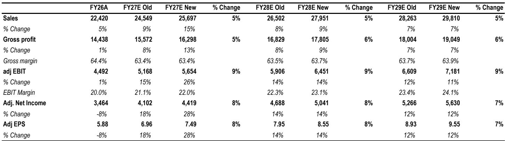
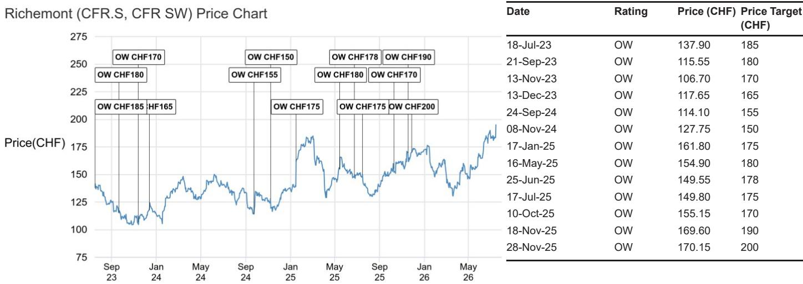
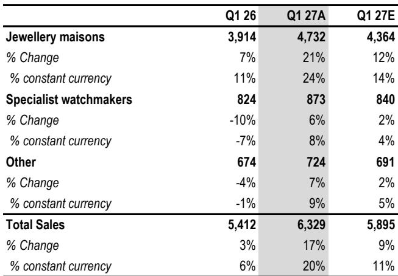

# JPM：RichemontCFR.SThesparkles

当整个奢侈品行业还在谈论“分化”和“波动”时，厉峰集团交出了一份让市场不得不重新审视其增长逻辑的季度成绩单。JPM在最新发布的研报中，将这家卡地亚和梵克雅宝的母公司称为“奢侈品领域的重点关注对象”，并上调了未来两年的盈利预测7%至8%。这并非一次简单的业绩上修，而是对一种增长模式的确认：在珠宝这个品类里，厉峰正在把规模效应转化为一种可持续的、难以被复制的竞争壁垒。

报告的核心证据来自Q1 27的运营数据。珠宝部门按固定汇率计算同比增长24%，不仅远超市场预期的14%，更是从上一季度已经非常出色的16%基础上再次加速。更关键的是，这种增长并非依赖单一产品或单一市场。JPM分析师指出，所有地区、所有品牌、所有价位段都在贡献增量，国内消费者和游客之间也保持了平衡。这种“全面开花”的格局，恰恰削弱了市场对“过度渗透”的担忧——当一个品牌的增长依赖少数几个SKU时，不确定性是集中的；而当增长来自整个产品矩阵的轮动时，可持续性就完全不同了。

> **KC评论：** 报告特别提到了梵克雅宝的Alhambra系列，但强调增长并非只靠这一条线。真正值得关注的是，厉峰在过去几个月中明显加快了新品推出的节奏，这种“产品创新密度”的提升，才是支撑24%增速的底层燃料。对于跟踪奢侈品行业的读者来说，与其盯着季度增速的相对值，不如观察品牌推新的频率和广度——这往往是判断增长质量更前置的指标。

## 1. 这轮增长的核心驱动力不是宏观，是执行

JPM在报告中做了一个重要的归因：厉峰的出色表现，很大程度上是品类和公司自身的结构性因素在起作用，而非宏观环境的普遍回暖。报告认为，奢侈品行业的整体背景并不像一些广泛叙事所暗示的那样不利，但厉峰的增长幅度和广度，已经超出了“行业贝塔”能够解释的范围。

珠宝品类本身在过去几年经历了结构性变化。相比皮具，珠宝在“性价比”上提供了更有吸引力的价值主张——更耐用的设计、更强的营销攻势、以及越来越多针对女性自购场景的推广。厉峰旗下的卡地亚和梵克雅宝恰好处于这个趋势的中心。但JPM强调，真正让厉峰与众不同的，是它把这种品类红利转化为了执行层面的优势。从珠宝到专业制表，甚至到其他部门（如伯爵的珠宝和腕表新系列），品牌管理的主动性和产品策划的锐度正在向整个集团扩散。

## 2. 增长的广度稀释了不确定性，也抬高了市场对同行的期待

这份报告对行业的一个潜在影响在于，它提高了市场对即将发布财报的其他奢侈品公司的预期。JPM明确表示，厉峰的业绩更新对整个行业发出了“普遍积极的信号”。在行业高度分化的背景下，赢家和输家之间的差距将进一步拉大。报告点名了杰尼亚和布鲁内罗·库奇内利，认为它们将是下一轮财报中可能表现突出的公司。

但这里需要保持克制。厉峰的增长有其独特性——珠宝品类的结构性优势、集团内部多品牌矩阵的协同、以及长期积累的运营能力。这些不是所有奢侈品公司都能复制的。对于读者而言，更合理的做法是，把厉峰的表现当作一个“不确定性测试”的标尺：如果一家公司在这个环境下能交出24%的珠宝增长，那么那些增速明显落后的同行，可能需要回答一个更尖锐的问题——问题出在品类上，还是出在执行上？

## 3. 一个可复用的观察框架：从“增长来源”判断可持续性

JPM的分析方法本身值得借鉴。面对一个超预期的季度，分析师没有简单接受数字，而是拆解了增长的“质量”：增长来自哪些品牌、哪些地区、哪些价位段、哪些客户群体。只有当这些维度都呈现出均衡分布时，高增长才不容易被下一季度的基数效应击穿。

这个框架可以迁移到任何消费行业的公司分析中。当一家公司报告了超出预期的营收增长时，追问三个问题：增长是来自量还是价？是来自老客户复购还是新客获取？是来自核心品类还是边缘业务？如果答案集中在少数几个点上，那这个增长可能是脆弱的；如果答案是“全面开花”，那它才更有可能被写进下一份上调的预测里。

厉峰的故事还没有结束。报告认为，尽管报价年初至今已经跑赢行业约24个百分点，但增长的动能和盈利加速的空间仍然存在。在奢侈品行业普遍面临基数不确定性和品类轮动的当下，这份报告提供了一个难得的正面案例：当一家公司把结构性趋势转化为执行优势时，市场最终会给出奖励。

For informational purposes only. Portions may be generated,translated,summarized,or edited with AI assistance based on source materials and may contain omissions or errors. Please verify independently. This is not investment,legal,tax,accounting,or other professional advice.

For informational purposes only. Portions may be generated,translated,summarized,or edited with AI assistance based on source materials and may contain omissions or errors. Please verify independently. This is not investment,legal,tax,accounting,or other professional advice.

