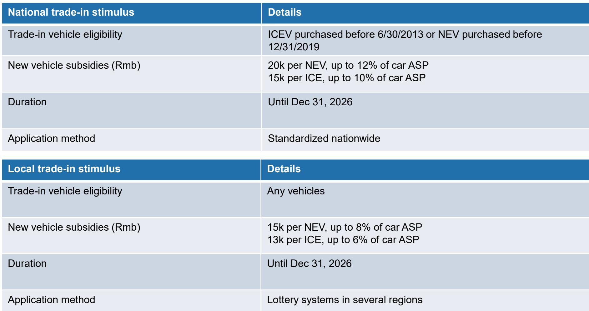
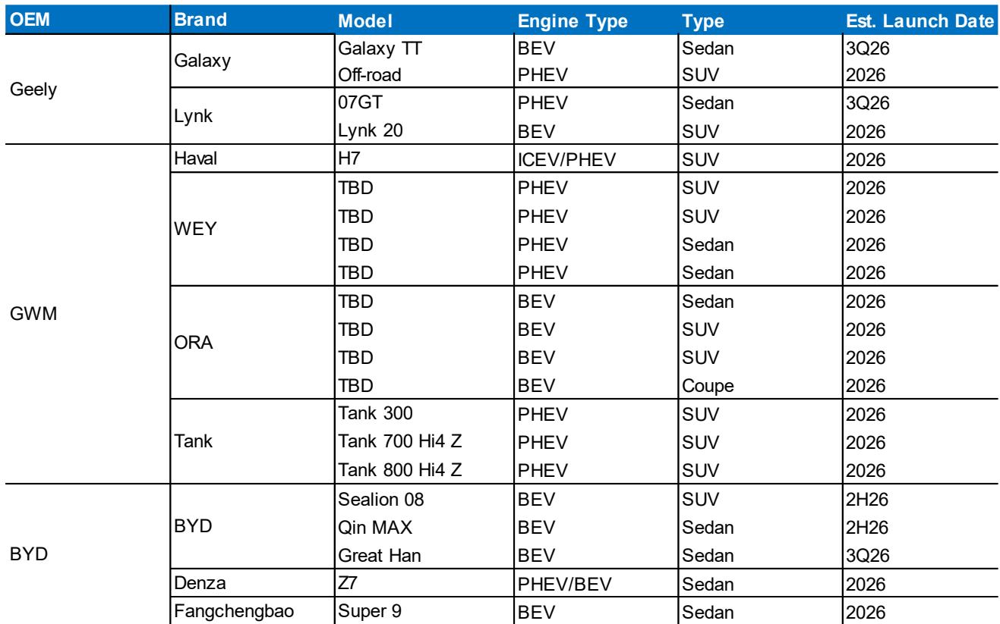
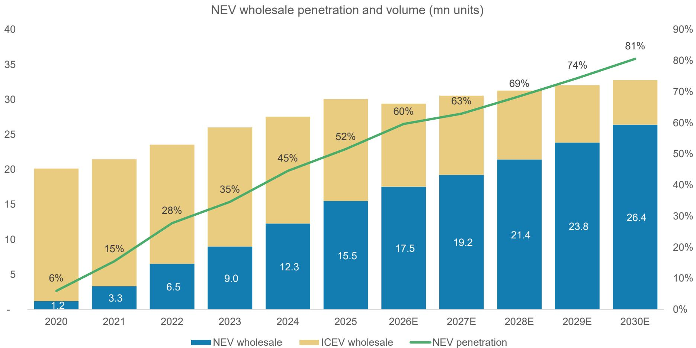

# MS：中国汽车-共享出行-汽车行业概览

中国乘用车市场正在经历一场结构性分化。MS最新发布的行业展望报告给出了一组值得关注的数字：2026年国内乘用车批发销量预计为2140万辆，同比下降11%；但出口将增长33%至800万辆，新能源汽车渗透率突破60%。这不是一个简单的“总量见顶”叙事，而是一个市场正在被重新定义的过程——国内竞争从价格战转向价值差异化，海外扩张从试探性布局进入规模化落地，智能化从功能配置升级为竞争门槛。

报告的核心判断是：中国汽车行业正在经历从“规模驱动”向“技术+全球化”双轮驱动的转折点。国内需求调整仍在持续，但出口和新能源的增长足以支撑行业整体批发量仅下降2%至2940万辆。这意味着，2026年真正值得关注的不是总量，而是结构——谁能把出口和智能化变成利润来源，谁就能穿越周期。

## 1. 国内需求调整是主动出清，而非被动调整

2026年国内乘用车批发量预计下降11%，这个数字看起来令人关注，但需要放在政策背景中理解。报告指出，2025年有1150万辆新车申请了国家或地方以旧换新补贴，仅2026年第一季度就有140万辆。补贴政策延续至2026年底，但门槛在收紧——新能源车购置税免征额度从3万元降至1.5万元，2028年起将完全恢复10%税率。

这意味着2026年的需求调整，更多是政策效果递减后的正常回归，而非消费信心变化。报告预计2027年国内销量将恢复3%的增长，2028年再增长1%。市场不是在调整，而是在完成一轮“补贴依赖”到“内生需求”的切换。

> **KC评论：** 国内销量下降11%和批发量仅降2%之间的差距，就是出口。2026年出口预计增长33%，其中56%是新能源车。出口不仅是增量，更是利润池——海外定价通常高于国内，这对整车厂的盈利结构是实质性改善。

## 2. 出口从“试水”进入“建厂”阶段，产能本地化成为新变量

报告详细梳理了中国主要车企的海外产能布局。比亚迪在泰国、巴西、匈牙利、印尼、土耳其等地规划了总计81万辆的海外产能，2026年将是多个工厂集中投产的年份。长城、吉利、上汽、奇瑞的海外产能规划也分别达到35万、34万、44万和56万辆。

这些数字背后是一个重要判断：中国车企的全球化正在从“整车出口”转向“产能本地化”。出口增速在2026年达到33%的峰值后，2027-2028年将节奏变化至6%左右，因为越来越多的产能将在海外当地消化。亚洲和欧洲目前占中国汽车出口的50%以上，但中东、拉美和非洲正在成为新的增长极。

报告同时指出了不确定性：地缘政治不确定性和海外监管挑战可能对出口造成扰动。但整体方向是清晰的——中国车企的海外布局已经从“可选项”变成“必选项”。

## 3. 智能化从“功能竞赛”进入“商业化验证”阶段

报告对自动驾驶的预测是2026年的另一大看点。L3级自动驾驶将实现商业化，L4级Robotaxi部署将加速。全球Robotaxi车队规模预计在2035年接近250万辆，形成一个万亿美元级别的生态系统。

在中国市场，文远知行和小马智行已经分别在阿布扎比和广州实现了单车宏观环境盈亏平衡。两家公司的Robotaxi车队规模均超过1000辆，硬件成本（BOM）在3.5万至4万美元之间。报告认为，随着L2+智能驾驶渗透率持续提升，智能驾驶正在从“卖点”变成“标配”，竞争焦点将从“有没有”转向“好不好用”。

值得注意的是，报告将“反内卷”列为关键趋势之一，认为竞争正从价格战转向价值驱动差异化。智能化正是实现这种差异化的核心抓手——谁能把智能驾驶和智能座舱的体验做到足够好，谁就能在价格战之外建立护城河。

## 4. 本土品牌份额继续扩大，但速度在节奏变化

报告数据显示，中国本土品牌的市场份额仍在上升，但增速在节奏变化。2026年新能源车批发市场中，比亚迪、吉利、长城等本土品牌预计占据70%以上的份额。但报告同时指出，外资品牌并非完全退出竞争，而是在加速电动化转型和本土化合作。

竞争格局的变化意味着，2026年真正考验企业的不再是“能不能造出新能源车”，而是“能不能在出口和智能化两个维度上同时建立优势”。那些只依赖国内补贴和价格战的企业，将面临更大的调整压力。

> **KC评论：** 报告没有直接说，但数据暗示了一个逻辑：国内销量下降11%，但新能源渗透率从2025年的约50%提升到60%，这意味着燃油车的相对销量下降速度更快。对于传统合资品牌而言，2026年可能是最需要关注的一年——既要应对国内燃油车市场的调整，又要面对新能源领域的激烈竞争。

这份报告的核心价值不在于预测数字的精确性，而在于它揭示了一个正在发生的结构性转变：中国汽车行业正在从“国内规模竞争”转向“全球技术竞争”。2026年，出口和智能化将成为检验企业真实竞争力的试金石。

For informational purposes only. Portions may be generated,translated,summarized,or edited with AI assistance based on source materials and may contain omissions or errors. Please verify independently. This is not investment,legal,tax,accounting,or other professional advice.

For informational purposes only. Portions may be generated,translated,summarized,or edited with AI assistance based on source materials and may contain omissions or errors. Please verify independently. This is not investment,legal,tax,accounting,or other professional advice.

