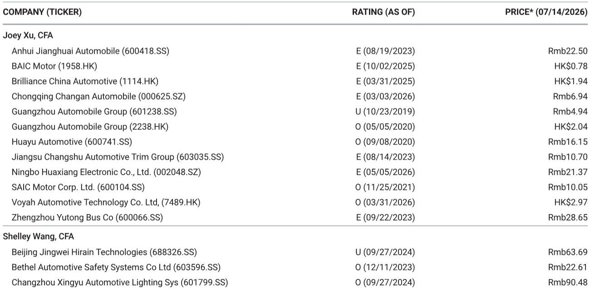

# 中国电动汽车订单数据观察：产品周期驱动市场节奏，而非需求趋势转变

2026年夏季，中国电动汽车市场周度订单量出现普遍性回落，但这并非消费者对电动化兴趣减弱的信号。7月6日至12日当周，所有主要品牌均录得环比负增长，降幅在7%至31%之间。比亚迪作为行业风向标，订单环比下降19%至约73.5-74千辆。华为合作的鸿蒙智行品牌家族降幅最大，达31%。乍看之下，这些数字似乎表明行业进入夏季低谷。然而，对整体数据背后模式的深入观察揭示了一个更精确且可操作的判断：市场正经历一次协调性的新品发布前“真空期”，而非需求崩溃。夏季淡季确实存在，但这是一个暂时的结构性暂停，而非周期性恶化。对于研究者和策略制定者而言，关键问题不在于需求是否减弱，而在于哪些品牌能在8月产品周期重启时加速。

当前订单疲软高度集中于近期推出新车型的品牌，这些品牌正经历初始脉冲后的自然均值回归。比亚迪海豹08、极氪9X五座版以及蔚来ES8五座版均在6月底和7月初带动了订单激增。随后的周度下降并非品牌力减弱的证据，而是发布脉冲消退后的统计回响。例如，蔚来订单环比下降17%至9.3-9.5千辆，但这之前已有36%的月度降幅，反映了ES8发布浪潮与下一个催化剂之间的空档期。这些品牌的潜在轨迹依然稳固，因为其产品节奏设计为通过连续发布而非单一事件来维持动能。因此，风险不在于这些品牌正在失去客户，而在于市场可能将正常的发布后调整误解为结构性放缓。

数据中最具启发性的对比在于那些拥有即将到来催化剂与没有催化剂的品牌之间。理想汽车订单环比下降25%至5.5-5.7千辆，是发布前真空期最清晰的例子。该公司正准备在7月下旬推出下一代L6，当前的疲软是理性的消费者行为：买家在等待更新产品。这种模式在耐用消费品市场中很典型，其中产品周期透明且消费者信息充分。理想汽车周度订单同比下降39%这一数据，只有在忽略即将到来的产品更新时才会令人担忧。同样，小鹏汽车订单环比下降9%至6.1-6.3千辆，掩盖了该品牌在7月16日MONA L03发布前蓄势待发的事实。小鹏汽车同比下降47%是该群体中最显著的，但这完全取决于其当前产品组合与下一代产品之间的空档期。MONA L03是指定的升级催化剂，订单数据证实市场处于等待模式，而非拒绝模式。

相反，在7月6日至12日当周表现出韧性的品牌，要么没有导致购买暂停的重大发布活动，要么受益于持续的低波动需求。零跑汽车订单为14-14.2千辆，仅环比下降7%，同比增长33%，使其成为主要电动汽车参与者中最具韧性的品牌。腾势和小鹏汽车的MONA系列也保持稳定。这些强势领域有一个共同特征：它们不处于会创造自然订单真空的高调发布周期中。零跑汽车的A系列尤其服务于产品周期不那么剧烈、消费者决策更为一致的细分市场。这表明整体市场并非普遍疲软；相反，疲软集中在产品周期造成暂时需求缺口的地方。真正的软点是那些没有即将到来催化剂的品牌，鸿蒙智行是最突出的例子。其环比下降31%、月度下降30%反映了问界M系列缺乏近期产品更新，该系列目前正在等待下一次升级。鸿蒙智行的订单轨迹并非品牌价值或技术吸引力的反映；它纯粹是时间节点的函数。

从这些数据中得出的决策框架并非关于哪个品牌在静态意义上获胜或失败。而是关于识别产品周期当前所处位置，以及下一个催化剂是否在合理范围内可见。对于7月下旬，催化剂是明确的：下一代理想L6、小鹏MONA L03以及吉利战舰700/e5改款均计划发布。这些事件将重置各自品牌的订单轨迹，当前的疲软将被事后理解为那些识别出该模式的人的布局机会。对于研究者而言，关键问题是8月的产品周期重启是否足够广泛以提振整个市场，或者是否将成为同一组品牌之间零和博弈的份额重新分配。数据表明后者更有可能，因为整体市场扩张速度不足以在避免相互蚕食的情况下吸收同时发布。夏季淡季压缩了每个品牌吸引注意力的时间窗口，8月的反弹可能不均衡，有利于那些拥有最引人注目的产品故事和最有效市场执行力的品牌。

对策略的启示有两点。首先，当前的订单疲软不应被解读为减少对该领域或处于发布前真空期的特定品牌敞口的信号。正确的应对是识别发布日历并在催化剂之前布局。理想汽车、小鹏汽车和吉利是近期订单反弹最清晰的候选者。其次，零跑汽车和腾势等品牌的韧性表明，存在一个不依赖于发布活动的结构性电动汽车需求基础。这些品牌服务于产品周期波动较小的细分市场，其稳定的订单摄入为市场提供了底部。策略上的教训是，中国电动汽车市场日益分化为两类品牌：一类运营在高波动、催化剂驱动的周期上，另一类则产生稳定、低波动的需求。前者在发布窗口期间提供更高的上行空间，但在窗口之间出现更急剧的回撤。后者提供更可预测的轨迹，但峰值回报较低。

对于任何策略观察者而言，最重要的收获是，中国电动汽车市场并非单一的需求曲线。它是一个重叠的产品周期集合，每个周期都有自己的节奏。7月6日至12日当周的总体数据看起来疲软，是因为多个周期恰好同时汇聚在一个低点。这是一个统计巧合，而非结构性信号。当前疲软但拥有即将到来催化剂的品牌并非问题案例；它们是蓄势待发的弹簧。真正疲软的品牌，如鸿蒙智行，是那些没有可见下一步行动的品牌。区分发布前真空期与根本性需求问题，是任何追踪该市场的人最重要的分析技能。7月第一周的数据是一份礼物，而非警告，因为它准确揭示了市场在其周期中的位置以及接下来应关注什么。

*仅供参考。部分内容可能基于源材料通过AI辅助生成、翻译、总结或编辑，可能存在遗漏或错误。请独立核实。本文不构成专业建议。*

仅供参考。部分内容可能基于源材料通过AI辅助生成、翻译、总结或编辑，可能存在遗漏或错误。请独立核实。本文不构成专业建议。

