# 2Q26 CIO Survey: IT Services Lags Broader Budget Acceleration as AI Continues to Crowd Out Discretionary Spend

2Q26 CIO Survey points to modestly weaker 2026 IT Services growth expectations despite improving overall IT budgets, suggesting AI remains a top enterprise priority but is still absorbing discretionary dollars, affecting Services growth.

**AlphaWise α**

Annual IT Services budget growth is still down vs. CY25, with growth expectations weakening QoQ, even as overall IT budget growth improves. Our 2Q26 CIO Survey, fielded May 8 to June 18, 2026, points to +1.8% y/y IT Services growth in 2026, a slight downward QoQ revision from the +2.0% y/y growth recorded in our 1Q26 survey. Services growth expectations for 2026 remain slightly below 2025 levels, with expected growth of +1.8% in 2026 down from +2.1% in 2025. Consistent with our last survey (1Q26 CIO Survey: IT Services Not Getting Worse, But Mixed Backdrop; Hope In Broader Budgets), overall IT budget growth expectations for 2026, which include hardware, software, communications, and services, accelerated to +3.8% versus +3.7% in 2025 and the 1-year up-to-down ratio for potential overall IT budget revisions increased to 1.2x from 0.8x in 1Q26, with 30% of CIOs expecting upward revisions versus 25% expecting downward revisions. This marks the first up-to-down reading above 1.0x since 1Q24 and the strongest reading above 1.1x since 1Q22. We believe this could be viewed as early evidence that AI is beginning to drive tangible ROI and support broader budget acceleration (or at least a willingness to continue to grow AI investment). However, that acceleration has yet to benefit Services, which stands out as the only category to tick down sequentially this quarter. See broader U.S. Tech note here: 2Q26 CIO Survey – Budget Support Improves, But Winners Remain Selective.

Rapid model advancement may be crowding out Services spend. Our broader view on AI disruption has been that, as AI use cases mature from proof of concept to production, enterprises will gain clearer visibility into returns and only a subset of pilots will advance to deployment. In turn, this should free IT budget that could be reprioritized toward broader digital transformation, a dynamic that should eventually benefit Services yet has not played out. While the modest acceleration in overall IT budget expectations to +3.8% could indicate that AI pilots are beginning to demonstrate meaningful returns, the QoQ deceleration in Services spending growth expectations suggests that AI is still crowding out discretionary Services spend. In our view, the rapid pace of model advancement is likely forcing leadership teams and boards to prioritize continuous AI investment, often at the expense of broader discretionary development programs.

AI prioritization remains high, but defensibility is softening. AI/ML remains the #1 CIO priority at 18%, followed by Security Software at 11% and Digital Transformation at 10%. However, AI/ML/Process Automation defensibility ticked down to +4% versus +10% in 4Q25, suggesting CIOs are becoming more discerning about which AI initiatives are truly protected in a downturn (Exhibit 17). Our survey suggests that IT Services still have a role to play in AI transformation, with 59% of respondents planning to increase traditional IT outsourcing spend as a result of Gen AI, while 19% of respondents are reducing spend (Exhibit 18). Funding sources for AI initiatives also remain varied: 33% of CIOs cite net new IT budget dollars, 21% cite net new budget from outside IT, and 15% cite reallocation from existing software budgets. Additional respondents point to reallocation from Professional Services, other IT budget areas, and non-IT business unit budgets.

We see ACN (EW) as relatively best positioned should there be a reacceleration in IT Services spend, and favor ACN and CTSH's (EW) investment-forward AI strategies. As noted in our Downgrade to EW, we believe ACN remains the best-positioned scaled IT Services vendor given its breadth, scale, enterprise relationships, and exposure to large transformation programs, further evidenced by our 2Q26 survey results that point to ACN as the largest share gainer in vendor consolidation. Survey respondents screen ACN as the highest quality provider of strategic consulting (Exhibit 23), though strategic consulting remains the least defensive IT project (Exhibit 17). As such, we still think ACN will need to see a clearer acceleration in IT budgets and a recovery in discretionary Services demand for the stock to work, as AI spend continues to crowd out traditional Services. We are encouraged that both ACN and CTSH are also allocating significant capital toward acquisitions (~50% of FCF), as M&A remains a strategic imperative for IT Services companies to re-equip and reskill for AI-specific work, strengthen technical offerings, potentially build proprietary IP portfolios, and stay at the leading edge of emerging technologies. We are also generally constructive on CTSH's front-footed 3-vector AI strategy (see here: Living with AI: Bridging the Capability-to-Production-Value Gap), which is focused on context engineering, model routing, token economics, and agentification. However, monetization remains early and we await clearer evidence of scaled production adoption.

## IT Services - Key Takeaways:

- Broad-based willingness to discount. We see willingness to discount across the space, with all 12 vendors having positive net discounting scores. We note that WIT, INFY, CAP and ACN show the greatest willingness to discount relative to industry peers. Relative to our 4Q25 survey, WIT saw the largest increase in willingness to discount (up +44%), followed by EPAM (up +40%). While all vendors show positive discounting scores, IBM has the lowest positive net discounting score (3%) relative to peers, followed by Gartner (5%) and DXC (7%). Continued Discounting Across IT Services Vendors

- Macro concerns less likely to drive project delays, contrary to company commentary. Our survey data shows 23% of respondents delaying IT Services-related projects due to geopolitical and/or macroeconomic concerns, down significantly from 42% polled in 4Q25. This improvement stands in notable contrast to the tone struck by most IT Services companies, where macro-driven caution, elongated sales cycles, and discretionary spending headwinds remain persistent themes. Macroeconomic Concerns Less Likely to Drive Project Delays

- ACN is the key beneficiary from vendor consolidation, with 52% of respondents consolidating vendor relationships (vs. 54% in 4Q25). On a net basis, ACN and Deloitte screened as the greatest share gainers in vendor consolidation, while Infosys, IBM and Other screened as the largest share donors. ACN's strength is likely driven by the company's breadth of offerings across both consulting and outsourcing. Of the 11 respondents that highlighted ACN as the greatest share gainer, IBM, Wipro and Deloitte were the key share donors. Conversely, IBM and ACN screened as the largest share donors. Of the 5 respondents highlighting IBM as the greatest share donor, ACN screened as the largest share gainer. Of the 4 respondents highlighting ACN as the greatest share donor, Deloitte and IBM were share gainers. 52% of Respondents Consolidating Vendor Relationships

- Potential to overspend on IT Services rises. CIO confidence around IT Services trended slightly upward, with the percentage of companies expecting to overspend increasing to 33% (vs. 28% in our 4Q25 survey), while 5% of companies expect to underspend on IT Services, matching 4Q25 levels. As it relates to specific vendors, ACN is expected to see an increase in spend, with 15 respondents looking to increase spend, offset by 4 respondents looking to decrease spend over the next 12 months. Conversely, Wipro is expected to see a marginal reduction in spend, with 1 respondent looking to increase spend, offset by 5 respondents looking to decrease spend over the next 12 months. Similarly, for EPAM, 1 respondent is looking to increase spend, offset by 3 respondents looking to decrease spend. Spending Intentions Vary By Vendor and Delivery Preference

- Consulting and Systems Integration leads spending categories, while BPO spend expectations decline. On a net basis, Consulting and Systems Integration (33%) and Offshore/outsource resources (23%) are expected to see the greatest spending increases over the next twelve months. Consulting and Systems Integration also saw the greatest percentage of respondents that indicated an expectation that spending could increase by >1% (48% of respondents), while BPO support saw the greatest percentage of respondents indicating an expectation that spending could decrease >1% (23% of respondents), marginally above Infrastructure Outsourcing and Application Development (22% of respondents). Consulting and Systems Integration Leads Spending Categories

- Artificial Intelligence, Software Upgrades and Security are the top three IT Services-related initiatives in 2026. Survey results suggest CIOs are prioritizing Artificial Intelligence as the top spending initiative in 2026, with 77% of polled respondents intending to engage an IT Services provider (up from 68% in 4Q25). Additionally, 59% of respondents are planning to increase traditional IT outsourcing spend as a result of Gen AI, while 19% of respondents are reducing spend. Software Upgrades ranked as the second-most prioritized spending initiative, with 62% of respondents looking to engage a service provider (vs. 47% in 4Q25). AI, Software Upgrades and Security Areas of Near-Term Demand

# Key CIO Survey Exhibits

## IT Services Spending Intentions Shows Downtick

Exhibit 1: Survey results show sequential deceleration in IT Services spending expectations, with CIOs now expecting IT Services spend to grow +1.8% (vs. +2.0% when surveyed in 1Q26)

2026 External IT Spending Growth Expectations by Sector

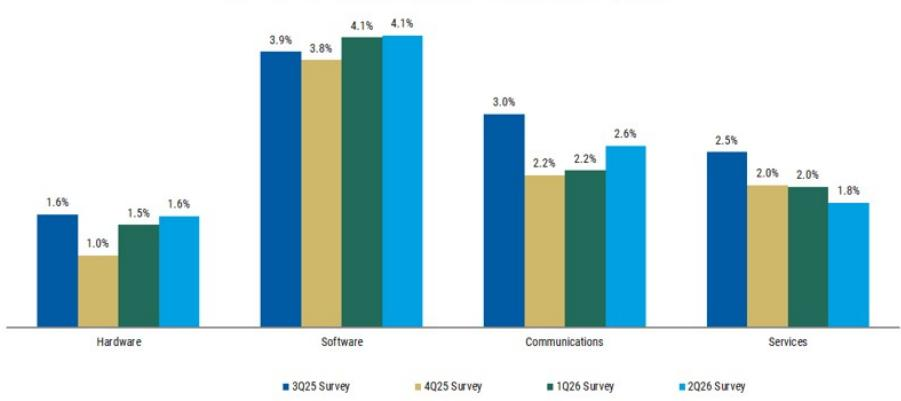  
Source: AlphaWise, MS; n=100 (US and EU data)

By what percentages did your company's external IT spending change for each of the following technology areas in 2025 vs. 2024? What is your estimated spending for 2026 vs. 2025?

Exhibit 2: IT Services shows a deceleration in spending intentions for 2026 vs. 2025

2026 vs. 2025 External IT Spending Growth Expectations by Sector

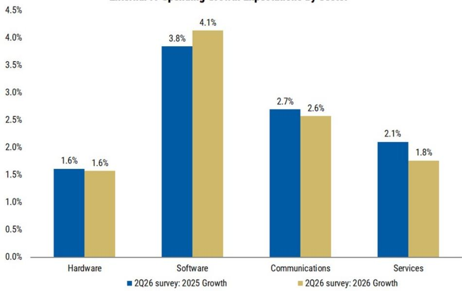  
Source: AlphaWise, MS; n=100 (US and EU data)

Exhibit 3: Within IT Services, EU spending expectations are modestly improving QoQ to +1.3% while US respondents expect spending to decelerate to +1.9%.

2026 IT Services spending growth expectations (%)

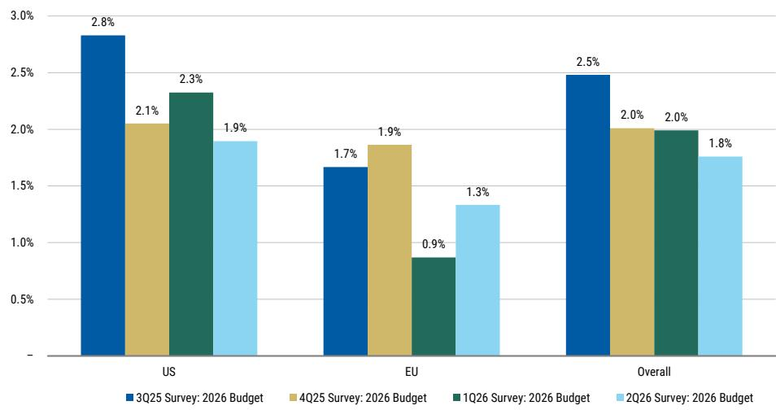  
Source: AlphaWise, MS; n=100 (US and EU data)  
Exhibit 4: Financials show the highest sequential acceleration in spending expectations (+300 bps), while Services shows the largest sequential deceleration (-450bps)  
2026 IT Services spending growth expectations by vertical (%)

  
Source: AlphaWise, MS; n=100 (US and EU data)

Exhibit 5: IT Services spending growth expectations show slight deceleration vs. 1Q26  
IT Services Spending Growth Expectations Over Time  
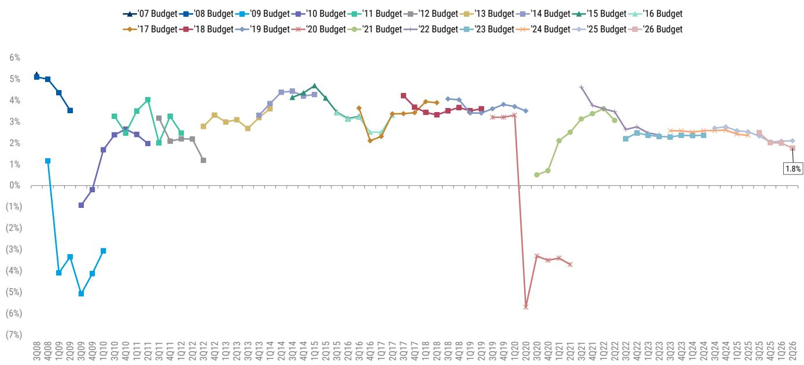  
Source: AlphaWise, MS; n=100 (US and EU data)  
Do you expect your professional IT services spending in 2026 to be in-line with the budget this year, or is your organization more likely to over- or under-spend vs. your 2025 IT services budget?

Exhibit 6: The percentage of companies expecting to overspend on IT Services increased to 33% (vs. 28% in 4Q25), which is slightly ahead of pre-pandemic levels, while 5% of companies expect to underspend.

IT Services: Overspending vs. underspending expectations

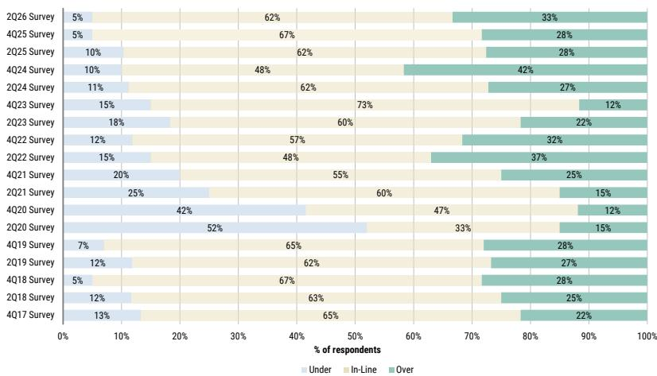  
Source: AlphaWise, MS; n=60 (US and EU data)

## Macroeconomic Concerns Less Likely to Drive Project Delays

Are your company's expected professional IT Services-related projects (e.g., digital transformation, cloud migration) delayed due to macroeconomic and / or geopolitical concerns?

Exhibit 7: 23% of respondents are delaying IT Services-related projects due to geopolitical and / or macroeconomic concerns, meaningfully below 42% of respondents polled in 4Q25.  
IT Services-related project delays due to macroeconomic concerns (% of respondents)  
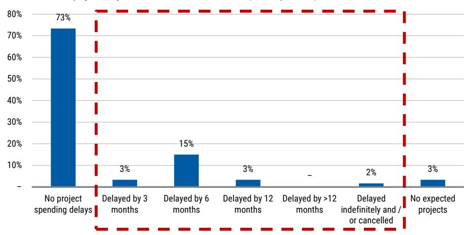  
Source: AlphaWise, MS; n=60 (US and EU data)

Exhibit 8: 73% of respondents have not delayed project spending due to geopolitical and / or macroeconomic concerns, up from 57% in 4Q25.

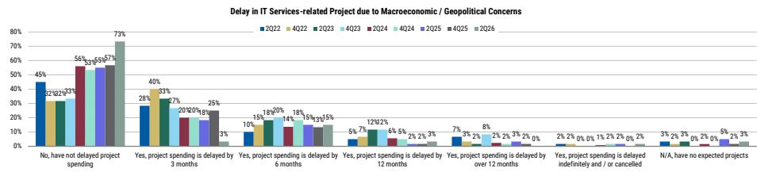  
Source: AlphaWise, MS; n=60 (US and EU data)

## Supply Challenges Continue To Abate Amidst Macro Uncertainty

Is your company changing their mix of spending on resources in-house vs. outsourced?

Exhibit 9: 54% of CIOs are planning to increase utilization of outsourced services (vs. 10% that are looking to shift work in-house), vs. 47% expected to increase and 13% expected to decrease in 4Q25.  
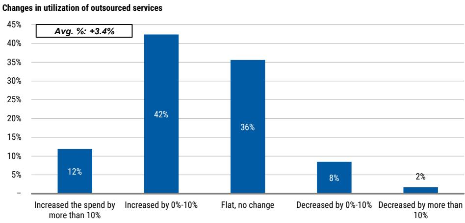  
Source: AlphaWise, MS; n=59 (US and EU data)

Is your company increasing utilization of IT Services providers due to internal talent shortages?

Exhibit 10: 25% of respondents noted they are increasing usage of IT Services providers in response to internal talent shortages, which is slightly lower than the ~27% of respondents cited in our 4Q25 survey. 37% of respondents are increasing utilization of IT Services providers despite not facing internal talent shortages.

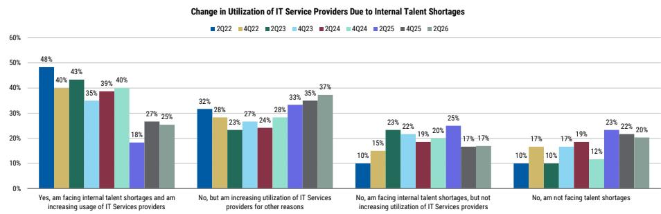  
Source: AlphaWise, MS; n=59 (US and EU data)

## Consulting and Systems Integration Leads Spending Categories

How do you expect your company's professional IT services spending in the following segments to change in the next 12 months?

IT Services end-customer spending changes over NTM

■ Up by more than10% □ Up 1-10% ■ Flat □ Down 1-10% ■ Down more than 10% ■ Will not spend

Exhibit 11: On a net basis, subtracting the percentage of respondents indicating a decline from the percentage of respondents indicating an increase, Consulting and Systems Integration (33%) and Offshore/outsource resources (23%) are expected to see the greatest spending increases over the next twelve months.

  
Source: AlphaWise, MS; n=60 (US and EU data)

Exhibit 12: Consulting Systems Integration saw the greatest percentage of respondents that indicated an expectation that spending could increase by >1% (48% of respondents), while BPO support saw the greatest percentage of respondents indicating an expectation that spending could decrease >1% (23% of respondents), marginally above Infrastructure Outsourcing and Application Development (22% of respondents).  
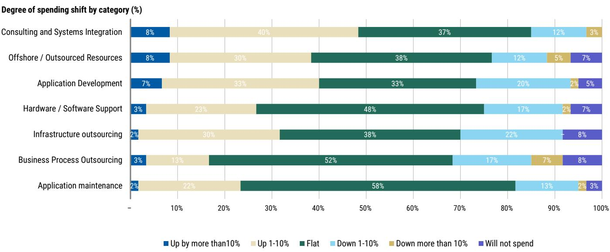  
Source: AlphaWise, MS; n=60 (US and EU data)

Exhibit 13: Weighted by the magnitude of expected spend change (% increase or decrease over the next year), respondents indicated that they expect increased spend across most IT Services initiatives, with the greatest positive spending shift in Consulting and Systems Integration (+2.1%) and Offshore / outsource resources (+1.4%).

Historical weighted degree of spending shift by category (%)  
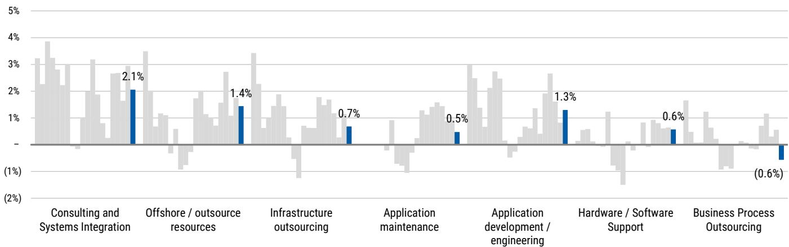  
Source: AlphaWise, MS; n=60 (US and EU data)  
Exhibit 14: Historically, Consulting & Systems Integration spending has seen the greatest average weighted spending increase since 3Q16, increasing by an average of +2.0%. This is followed by Application Development (+1.3%). We recognize both services as vehicles to enable digital transformation.  
Historical average spending shift by category (3Q16–2Q25, %)

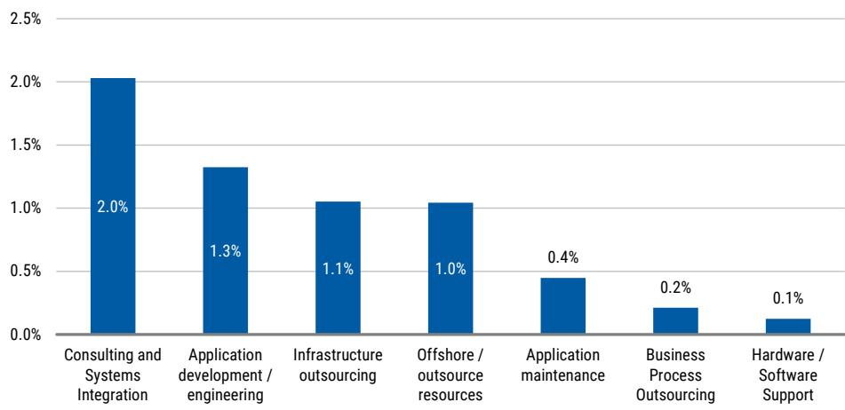  
Source: AlphaWise, MS; n=60 (US and EU data)

How is digital transformation impacting your company's traditional IT outsourcing spend? We are defining IT outsourcing as BPO, application maintenance, IT outsourcing & infrastructure maintenance.

Exhibit 15: 63% of respondents expect digital transformation to drive increased IT outsourcing spend by at least 1%

Digital transformation impact on expected traditional IT Outsourcing spend (%)  
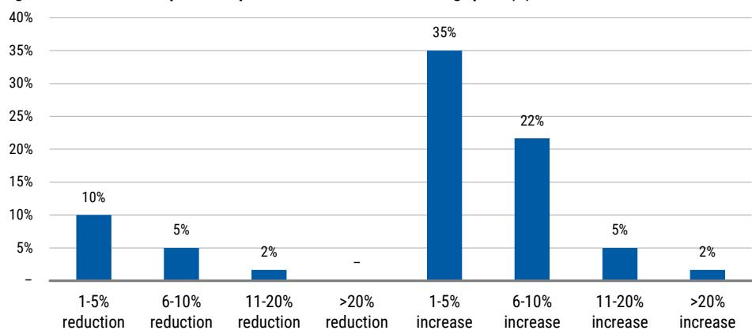  
Source: AlphaWise, MS; n=60 (US and EU data)

## AI, Software Upgrades and Security Areas of Near-Term Demand

Are any of the following initiatives a priority for your company in 2026? If so, is your company engaging or planning to engage outside professional IT services providers to help with the planning or execution?

Exhibit 16: In terms of priorities for spend that respondents indicated they will act upon in the next 12 months, the categories with the highest percentage of respondents remain Artificial Intelligence, with 77% of respondents indicating an intention to engage a service provider (vs. 68% in 4Q25), and Software Upgrades at 62% (vs. 47% in 4Q25).

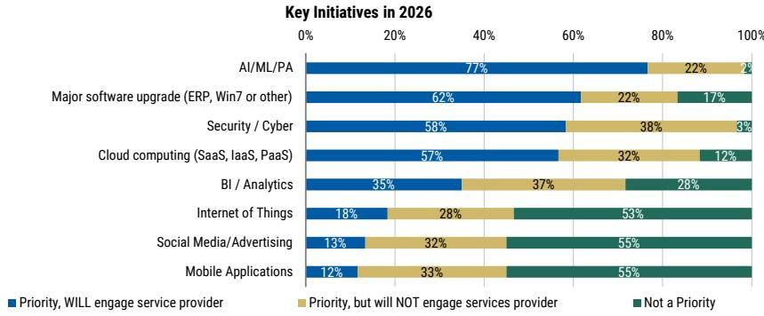  
Source: AlphaWise, MS; n=60 (US and EU data)

Exhibit 17: Security software remains the most defensive IT project by a wide margin, while AI/ML screens relatively less defensible

% IT Projects Most & Least Likely to Get Cut  
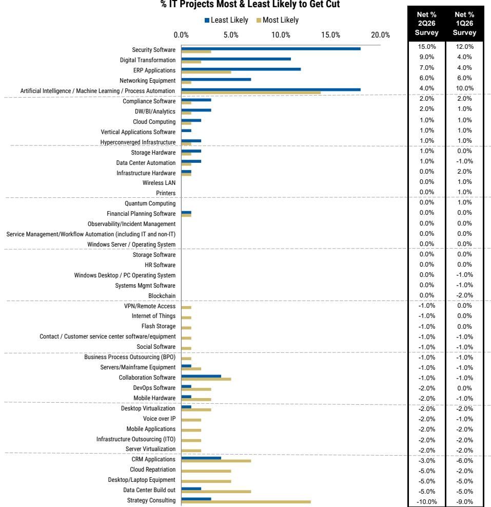  
Source: AlphaWise, MS. n=100 (US and EU data)

How is Gen AI impacting your company's traditional IT outsourcing spend (consider the impact specifically attributable to Gen AI, separate from broader digital transformation initiatives)?

Exhibit 18: 59% of respondents expect to increase traditional IT outsourcing spend as a result of Gen AI, while 19% are reducing spend

Impact of Gen AI on Traditional IT Outsourcing Spend  
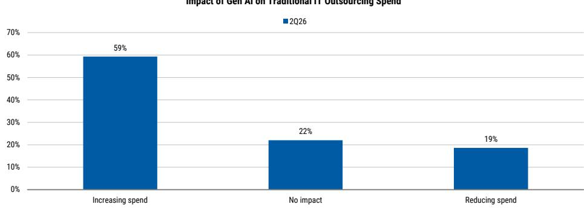  
Source: AlphaWise, MS, n=59 (US and EU data)

## Continued Discounting Across IT Services Vendors

Compared to last year, how would you describe the following vendors' willingness to discount pricing over the past 12 months?

Exhibit 19: We see incrementally more discounting across the space  
Vendor willingness to discount in last 12 months (%)  
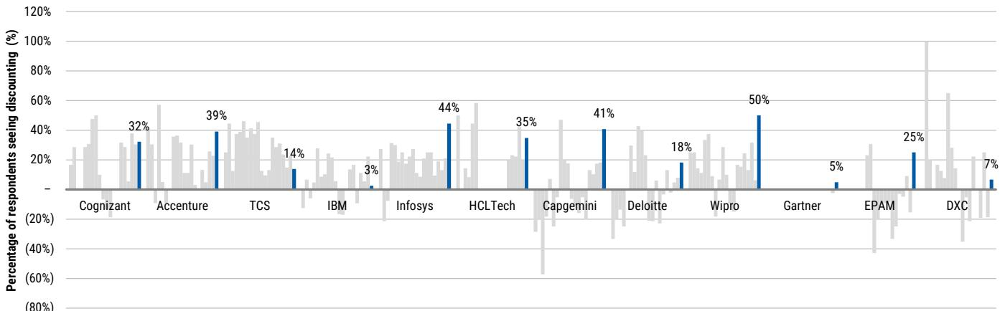  
Source: AlphaWise, MS; n=60 (US and EU data)

## 52% of Respondents Consolidating Vendor Relationships

Has your organization undergone vendor consolidation with respect to professional IT Services providers over the last year? If so, which professional IT Services vendor was the largest share gainer and which was the largest share donor?

Exhibit 20: Of respondents undertaking vendor consolidation, ACN and Deloitte screened as the largest share gainers...

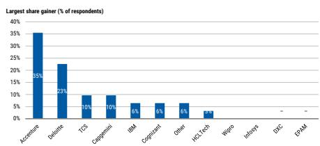  
Source: AlphaWise, MS; n=60 (US and EU data)  
Exhibit 19 ...while Other, IBM, and ACN screened as the largest share donors

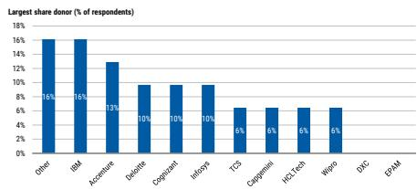  
Source: AlphaWise, MS; n=60 (US and EU data)

Exhibit 21:  
Net-net, ACN screened as the greatest beneficiary of vendor consolidation  
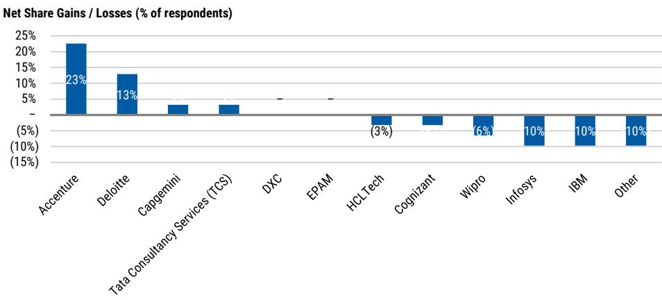  
Source: AlphaWise, MS; n=60 (US and EU data)

## Spending Intentions Vary By Vendor and Delivery Preference

Over the next 12 months, what are your company's IT services spending plans as it relates to specific vendors?

Exhibit 22: Spending intentions appear more balanced across providers  
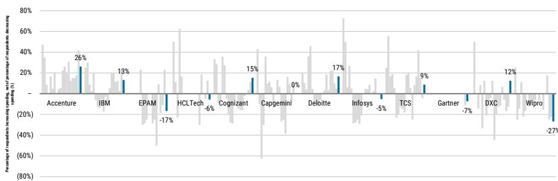  
Source: AlphaWise, MS; n=60 (US and EU data)

Which of the following vendors provides the highest quality level of strategic consulting?

Exhibit 23: ACN screens as the highest quality provider of strategic consulting

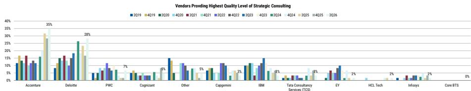  
Source: AlphaWise, MS; n=60 (US and EU data)

How are your company's IT delivery preferences changing in each of the following regions?

Exhibit 24: Preferences for onshore and nearshore delivery are down QoQ  
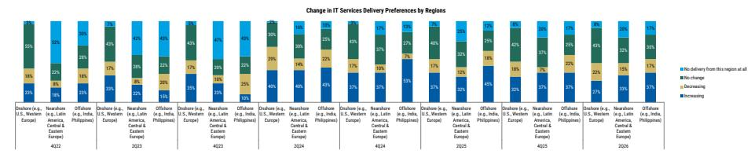  
Source: AlphaWise, MS; n=60 (US and EU data)

## Valuation Methodology and Risks

## Accenture Plc (ACN.N)

Our price target is derived from our Base Case scenario, which assumes low-single-digit organic growth near-term. Our price target applies a market multiple of 9x multiple to our FY27E EPS, which is meaningfully below the 10-year average market premium of 30%.

## Risks to Upside

- Acceleration in high-growth strategic priorities
- Profitable share gains in Gen AI advisory practice
- Durability of demand
- Strength in Consulting bookings

## Risks to Downside

- Deceleration in revenue growth across industry groups and / or business dimensions
- Lengthening bookings-to-revenue conversion cycle
- Lower utilization
- Accelerating attrition
- Recession

## Cognizant Technology Solutions Corp (CTSH.O)

Our price target is derived from our Base Case scenario, which assumes gradual revenue growth and modest margin expansion near-term, driven by NextGen structural cost reduction efforts. Our target applies an approximate 7x P/E multiple to our Base Case CY27E EPS estimate.

## Risks to Upside

- Recovery across large bank relationships
- Meaningfully lower attrition
- Improved fulfillment / delivery capabilities
- Improved pricing

## Risks to Downside

- Wage inflation and an inability to pass-through costs
- Inability to deliver on contracted work
- Accelerating rates of attrition
- Inability to hire talent
- Share losses to competitors
- Restrictions on H-1B and work visas
- Recession

## Disclosure Section

The information and opinions in MS were prepared by MS & Co. LLC, and/or MS C.T.V.M. S.A., and/or MS Mexico, Casa de Bolsa, S.A. de C.V., and/or MS Canada Limited. As used in this disclosure section, "MS" includes MS & Co. LLC, MS C.T.V.M. S.A., MS Mexico, Casa de Bolsa, S.A. de C.V., MS Canada Limited and their affiliates as necessary.

For important disclosures, stock price charts and equity rating histories regarding companies that are the subject of this report, please see the MS Disclosure Website at www.morganstanley.com/eqr/disclosures/webapp/generalresearch, or contact your investment representative or MS at 1585 Broadway, (Attention: Research Management), New York, NY, 10036 USA.

For valuation methodology and risks associated with any recommendation, rating or price target referenced in this research report, please contact the Client Support Team as follows: US/Canada +1 800 303-2495; Hong Kong +852 2848-5999; Latin America +1 718 754-5444 (U.S.); London +44 (0)20-7425-8169; Singapore +65 6834-6860; Sydney +61 (0)2-9770-1505; Tokyo +81 (0)3-6836-9000. Alternatively you may contact your investment representative or MS at 1585 Broadway, (Attention: Research Management), New York, NY 10036 USA.

## Analyst Certification

The following analysts hereby certify that their views about the companies and their securities discussed in this report are accurately expressed and that they have not received and will not receive direct or indirect compensation in exchange for expressing specific recommendations or views in this report: James E Faucette; Michael N Infante; Shefali Tamaskar; Meryl R Thomas, CFA.

## Global Research Conflict Management Policy

MS has been published in accordance with our conflict management policy, which is available at www.morganstanley.com/institutional/research/conflictpolicies. A Portuguese version of the policy can be found at www.morganstanley.com.br

## Important Regulatory Disclosures on Subject Companies

As of June 30, 2026, MS beneficially owned 1% or more of a class of common equity securities of the following companies covered in MS: Accenture Plc, Cognizant Technology Solutions Corp, DXC Technology Company, EPAM Systems Inc, Kyndryl Holdings Inc, TaskUs, Inc..

Within the last 12 months, MS managed or co-managed a public offering (or 144A offering) of securities of Accenture Plc, DXC Technology Company.

Within the last 12 months, MS has received compensation for investment banking services from Accenture Plc, DXC Technology Company.

In the next 3 months, MS expects to receive or intends to seek compensation for investment banking services from Accenture Plc, Cognizant Technology Solutions Corp, DXC Technology Company, Endava PLC, EPAM Systems Inc, Kyndryl Holdings Inc, TaskUs, Inc..

Within the last 12 months, MS has received compensation for products and services other than investment banking services from Accenture Plc, Cognizant Technology Solutions Corp, DXC Technology Company, EPAM Systems Inc.

Within the last 12 months, MS has provided or is providing investment banking services to, or has an investment banking client relationship with, the following company: Accenture Plc, Cognizant Technology Solutions Corp, DXC Technology Company, Endava PLC, EPAM Systems Inc, Kyndryl Holdings Inc, TaskUs, Inc..

Within the last 12 months, MS has either provided or is providing non-investment banking, securities-related services to and/or in the past has entered into an agreement to provide services or has a client relationship with the following company: Accenture Plc, Cognizant Technology Solutions Corp, DXC Technology Company, EPAM Systems Inc.

MS & Co. LLC makes a market in the securities of DXC Technology Company, Kyndryl Holdings Inc, TaskUs, Inc..

The equity research analysts or strategists principally responsible for the preparation of MS have received compensation based upon various factors, including quality of research, investor client feedback, stock picking, competitive factors, firm revenues and overall investment banking revenues. Equity Research analysts' or strategists' compensation is not linked to investment banking or capital markets transactions performed by MS or the profitability or revenues of particular trading desks.

MS and its affiliates do business that relates to companies/instruments covered in MS, including market making, providing liquidity, fund management, commercial banking, extension of credit, investment services and investment banking. MS sells to and buys from customers the securities/instruments of companies covered in MS on a principal basis. MS may have a position in the debt of the Company or instruments discussed in this report. MS trades or may trade as principal in the debt securities (or in related derivatives) that are the subject of the debt research report.

Certain disclosures listed above are also for compliance with applicable regulations in non-US jurisdictions.

## STOCK RATINGS

MS uses a relative rating system using terms such as Overweight, Equal-weight, Not-Rated or Underweight (see definitions below). MS does not assign ratings of Buy, Hold or Sell to the stocks we cover. Overweight, Equal-weight, Not-Rated and Underweight are not the equivalent of buy, hold and sell. Investors should carefully read the definitions of all ratings used in MS. In addition, since MS contains more complete information concerning the analyst's views, investors should carefully read MS, in its entirety, and not infer the contents from the rating alone. In any case, ratings (or research) should not be used or relied upon as investment advice. An investor's decision to buy or sell a stock should depend on individual circumstances (such as the investor's existing holdings) and other considerations.

## Global Stock Ratings Distribution

## (as of June 30, 2026)

The Stock Ratings described below apply to MS's Fundamental Equity Research and do not apply to Debt Research produced by the Firm.

For disclosure purposes only (in accordance with FINRA requirements), we include the category headings of Buy, Hold, and Sell alongside our ratings of Overweight, Equal-weight, Not-Rated and Underweight. MS does not assign ratings of Buy, Hold or Sell to the stocks we cover. Overweight, Equal-weight, Not-Rated and Underweight are not the equivalent of buy, hold, and sell but represent recommended relative weightings (see definitions below). To satisfy regulatory requirements, we correspond Overweight, our most positive stock rating, with a buy recommendation; we correspond Equal-weight and Not-Rated to hold and Underweight to sell recommendations, respectively.

<table><tr><td></td><td colspan="2">Coverage Universe</td><td colspan="3">Investment Banking Clients (IBC)</td><td colspan="2">Other Material Investment ServicesClients (MISC)</td></tr><tr><td>Stock RatingCategory</td><td>Count</td><td>% of Total</td><td>Count</td><td>% of Total IBC</td><td>% of RatingCategory</td><td>Count</td><td>% of Total OtherMISC</td></tr><tr><td>Overweight/Buy</td><td>1544</td><td>42%</td><td>453</td><td>49%</td><td>29%</td><td>757</td><td>44%</td></tr><tr><td>Equal-weight/Hold</td><td>1577</td><td>43%</td><td>390</td><td>42%</td><td>25%</td><td>769</td><td>44%</td></tr><tr><td>Not-Rated/Hold</td><td>3</td><td>0%</td><td>1</td><td>0%</td><td>33%</td><td>1</td><td>0%</td></tr><tr><td>Underweight/Sell</td><td>544</td><td>15%</td><td>89</td><td>10%</td><td>16%</td><td>204</td><td>12%</td></tr><tr><td>Total</td><td>3,668</td><td></td><td>933</td><td></td><td></td><td>1731</td><td></td></tr></table>

Data include common stock and ADRs currently assigned ratings. Investment Banking Clients are companies from whom MS received investment banking compensation in the last 12 months. Due to rounding off of decimals, the percentages provided in the "% of total" column may not add up to exactly 100 percent.

## Analyst Stock Ratings

Overweight (O). The stock's total return is expected to exceed the average total return of the analyst's industry (or industry team's) coverage universe, on a risk-adjusted basis, over the next 12-18 months.

Equal-weight (E). The stock's total return is expected to be in line with the average total return of the analyst's industry (or industry team's) coverage universe, on a risk-adjusted basis, over the next 12-18 months.

Not-Rated (NR). Currently the analyst does not have adequate conviction about the stock's total return relative to the average total return of the analyst's industry (or industry team's) coverage universe, on a risk-adjusted basis, over the next 12-18 months.

Underweight (U). The stock's total return is expected to be below the average total return of the analyst's industry (or industry team's) coverage universe, on a risk-adjusted basis, over the next 12-18 months.

Unless otherwise specified, the time frame for price targets included in MS is 12 to 18 months.

## Analyst Industry Views

Attractive (A): The analyst expects the performance of his or her industry coverage universe over the next 12-18 months to be attractive vs. the relevant broad market benchmark, as indicated below.

In-Line (I): The analyst expects the performance of his or her industry coverage universe over the next 12-18 months to be in line with the relevant broad market benchmark, as indicated below. Cautious (C): The analyst views the performance of his or her industry coverage universe over the next 12-18 months with caution vs. the relevant broad market benchmark, as indicated below. Benchmarks for each region are as follows: North America - S&P 500; Latin America - relevant MSCI country index or MSCI Latin America Index; Europe - MSCI Europe; Japan - TOPIX; Asia - relevant MSCI country index or MSCI sub-regional index or MSCI AC Asia Pacific ex Japan Index.

## Stock Price, Price Target and Rating History (See Rating Definitions)

Accenture Plc (ACN.N) - As of 07/15/26 GMT in USD
Industry : IT Services  
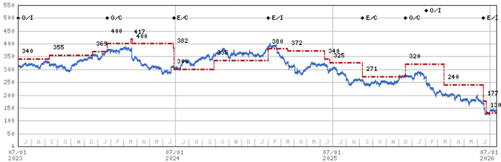  
Stock Rating History: 7/1/21 : 0/I; 1/10/22 : 0/A; 1/27/23 : 0/I; 1/24/24 : 0/C; 6/26/24 : E/C; 1/31/25 : E/I; 9/8/25 : E/C; 12/16/25 : 0/C; 2/2/26 : 0/I; 6/15/26 : E/I  
Price Target History: 6/25/21 : 330; 9/10/21 : 380; 9/24/21 : 400; 12/17/21 : 475; 4/6/22 : 480; 6/14/22 : 390; 6/24/22 : 385; 9/7/22 : 350; 9/23/22 : 340; 3/15/23 : 325; 6/2/23 : 350; 6/23/23 : 340; 9/12/23 : 355; 12/20/23 : 369; 1/24/24 : 400; 3/18/24 : 417; 3/22/24 : 400; 6/25/24 : 382; 6/26/24 : 300; 9/27/24 : 335
