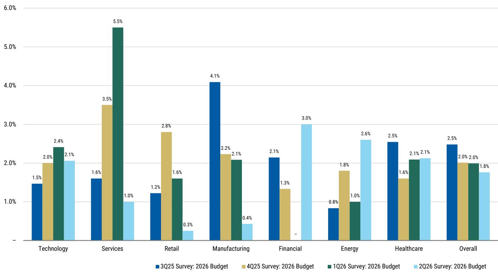
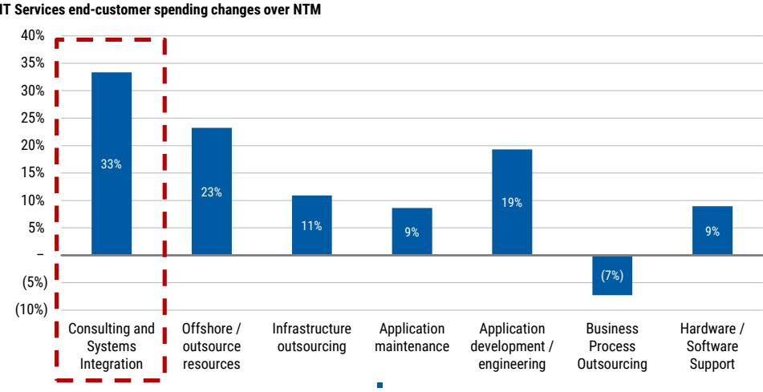

# MS：CIO与IT与AI 2Q26 Survey

企业整体IT预算正在加速扩张，但IT服务却成了相对少见环比下滑的支出类别。MS 2026年二季度CIO调查给出了一个反直觉的信号：AI正在从“推动力”变成“挤出者”。

这份覆盖100位美国与欧洲CIO的调查显示，2026年整体IT预算增速预期从2025年的+3.7%小幅提升至+3.8%，预算上调与下调的比例自2024年一季度以来首次回到1.0倍以上，达到1.2倍。但IT服务支出增速预期却从一季度的+2.0%进一步下滑至+1.8%，低于2025年全年+2.1%的实际增速。

整体预算在加速，服务却在减速。这个剪刀差背后，是AI研究逻辑正在发生一次结构性切换。

## 1. 模型快速迭代正在持续挤占服务预算，而非释放预算

报告的核心判断是：AI从概念验证向生产部署的过渡，理论上应该释放出此前被占用的预算，重新投向更广泛的数字化转型，从而惠及IT服务。但现实是，这一释放尚未发生。

MS分析师认为，模型迭代速度过快，迫使企业领导层和董事会持续将AI研究置于优先位置，代价就是压缩了其他可自由支配的服务支出。调查中，AI/ML仍是CIO的第一优先级（18%），但AI项目的“防御性”评分从2025年四季度的+10%骤降至+4%，说明CIO对哪些AI项目真正不可削减的判断正在变得挑剔。

> **KC评论：** 这里的关键不是AI研究本身在降温，而是CIO开始区分“必须投的AI”和“可以等的AI”。防御性评分下降意味着，如果宏观环境进一步变化，部分AI项目可能成为第一批被调整的对象——这与市场普遍认为AI“不可逆”的叙事存在偏差。

## 2. 宏观担忧显著缓解，但服务商仍在大幅折价抢单

与IT服务公司管理层在财报电话会上反复强调的“宏观不确定性导致销售周期拉长”不同，调查数据给出了另一幅图景：因宏观或地缘政治担忧而推迟IT服务项目的CIO比例，从2025年四季度的42%大幅降至23%。73%的受访者表示没有因此推迟任何项目。

但服务商之间的竞争并未因此缓和。所有12家被调查的供应商均呈现“净折价”状态，即愿意通过降价来获取订单的比例高于不愿降价的比例。Wipro和EPAM的折价意愿环比分别上升44%和40%。IBM是折价意愿最低的供应商（净折价仅3%），其次是Gartner（5%）和DXC（7%）。

宏观不确定性在消退，但价格竞争没有停。这说明当前IT服务市场的核心矛盾不是需求不足，而是供给过剩叠加AI对预算的挤占，迫使服务商用价格换份额。

## 3. 埃森哲是整合中的最大赢家，但战略咨询仍是最脆弱的项目

在供应商整合趋势中，52%的CIO正在精简其服务商名单。埃森哲和德勤是最大的份额获取者，而Infosys、IBM和其他小型供应商是主要的份额流失方。埃森哲的胜出逻辑很清晰：横跨咨询和外包的广度，使其成为企业“一站式”整合的首选。

但调查同时揭示了一个矛盾：埃森哲在战略咨询领域被评为最高质量的服务商，而战略咨询恰恰是所有IT项目中“最不具防御性”的类别——一旦预算调整，它是最容易被调整的。这意味着，埃森哲的核心优势同时也是它的脆弱点。报告认为，埃森哲需要看到IT预算更明确的加速以及可自由支配服务需求的真正复苏，其市场表现才能获得支撑。

## 4. 一个可复用的观察框架：跟踪“AI挤出效应”何时逆转

这份调查提供了一个实用的分析框架：区分“整体IT预算增速”和“IT服务预算增速”之间的缺口。当AI开始从试点走向规模化部署，且企业能够清晰衡量AI研究的回报时，被挤占的服务预算才可能回流。

目前，这个缺口仍在扩大。但调查中也有积极信号：33%的CIO预计将在IT服务上超支（高于四季度的28%），且咨询与系统集成仍是未来12个月支出增长最快的子类别（净增33%）。AI、软件升级和安全是2026年三大优先支出领域，其中AI相关服务需求从四季度的68%升至77%。

这些数据指向一个判断：IT服务的拐点可能不是“需求消失”，而是“需求被AI暂时压制”。当AI从预算的“黑洞”变成“杠杆”时，服务商中谁能率先证明自己有能力帮企业把AI研究转化为可量化的业务价值，谁就能在下一轮周期中占据主动。

For informational purposes only. Portions may be generated, translated, summarized, or edited with AI assistance based on source materials and may contain omissions or errors. Please verify independently. This is not professional advice.

