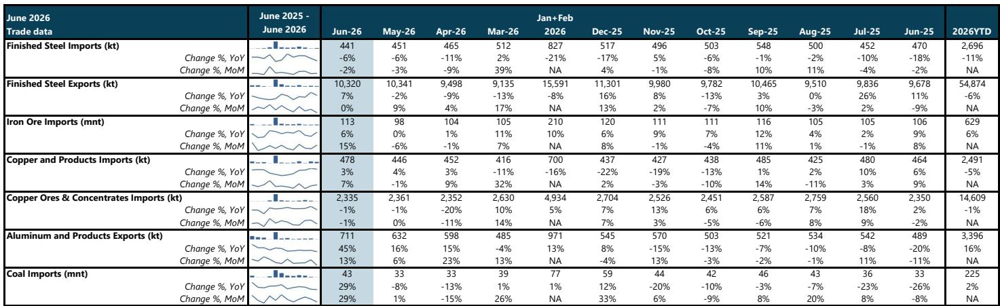
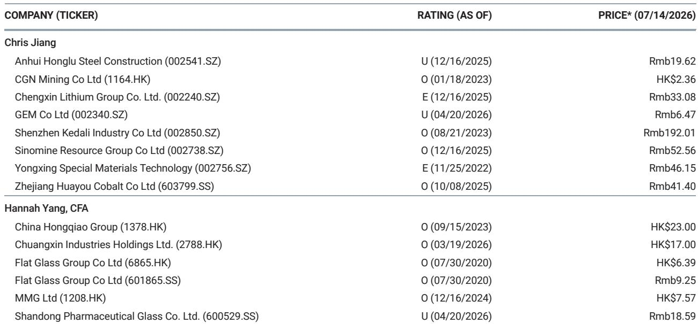
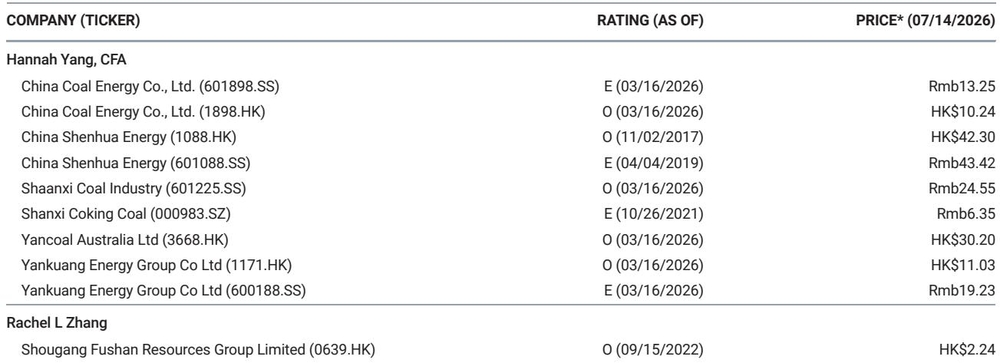

# MS：中国材料-6月贸易数据-铝材出口继续上升

中国6月贸易数据中，最值得关注的不是总量，而是结构分化。MS最新报告显示，铝材产品出口在6月达到71.1万吨，同比增长45%，环比增长13%，创下历史最高单月纪录。与此同时，钢材出口维持在1032万吨的高位，煤炭进口则超预期跳升。这些数字背后，是不同商品在全球定价权与国内供需之间的不同博弈路径。

这份报告的核心信号是：铝材出口的爆发式增长，可能正在接近一个短期拐点。6月铝价回落导致出口套利空间收窄，7月出口量或将承压。而铜的进口套利窗口虽间歇性打开，但洋山铜溢价已回升至每吨90美元，为2025年初以来最高，表明实物需求依然扎实。

## 1. 铝材出口创纪录，但套利窗口正在关闭

6月铝材及制品出口71.1万吨，同比增幅45%是过去一年中最高的单月增速。MS指出，6月铝价有所回落，出口套利空间随之收窄，这可能对7月出口形成压制。国内库存已经开始下降，尤其是半成品出口增加，正在加速去库存。

这一组合意味着，出口商在6月集中抢运，部分原因可能是赶在套利窗口关闭前完成订单。7月数据如果出现环比回落，不应被解读为需求变化，而更可能是套利驱动的节奏调整。

> **KC评论：** 铝材出口的45%同比增速，放在过去12个月的数据序列里看，是相对少见一个超过40%的月份。6月之前，增速在-20%到16%之间波动。这种跳跃式增长，更多反映的是短期套利窗口，而非趋势性需求变化。

## 2. 铜的实物需求信号比价格更值得关注

铜及铜制品6月进口47.8万吨，环比增长7%，同比增长3%。更关键的信号来自洋山铜溢价——在5月短暂回落后，6月已反弹至每吨90美元，为2025年初以来最高。MS认为，这“表明实物需求持续坚挺”。

铜精矿进口则出现环比和同比均下降1%的情况，至233.5万吨。加工费继续走低，但硫酸价格强劲，支撑了冶炼厂利润。这里有一个容易被忽略的观察框架：当铜精矿进口下降、但精炼铜进口上升时，往往意味着国内冶炼环节的瓶颈正在向加工环节转移，而终端需求并未同步走弱。

## 3. 煤炭进口超预期，但市场可能高估了持续性

6月煤炭进口4300万吨，同比和环比均增长29%，上半年累计进口2.25亿吨，同比增长2%。MS明确表示，这一进口量“高于市场预期”。驱动因素有两个：一是对夏季用电高峰需求的提前备货，二是6月套利窗口打开。

但报告同时指出，7月进口量“可能保持高位”。这意味着，超预期进口并非一次性事件，而可能持续到三季度初。对于煤炭行业，MS维持“谨慎”行业观点，这与进口放量形成对照——进口增加更多是供给侧的调节，而非需求侧的强劲信号。

## 4. 钢材出口高位持稳，但表观消费仍在调整

6月钢材出口1032万吨，同比增长7%，环比持平。上半年累计出口5487万吨，同比下降5.6%。更值得关注的是国内需求端：中钢协会员钢厂6月日均产量同比下降3.5%，MS据此估算，6月表观钢材消费同比下降约9%，环比下降5.8%。

出口高位与内需调整并存，意味着中国钢铁企业正在通过海外市场消化国内产能。但出口量已经处于历史高位区间，进一步上行的空间有限。如果内需持续调整，钢价和利润率的不确定性可能从国内市场向出口市场传导。

这份报告提供的不是一个简单的“好”或“差”的结论，而是一组相互印证又彼此制约的信号。铝材出口的创纪录与套利窗口收窄、铜溢价的回升与精矿进口下降、煤炭进口超预期与行业谨慎观点——这些矛盾组合，才是理解中国大宗商品市场当前状态的正确起点。

For informational purposes only. Portions may be generated,translated,summarized,or edited with AI assistance based on source materials and may contain omissions or errors. Please verify independently. This is not investment,legal,tax,accounting,or other professional advice.

For informational purposes only. Portions may be generated,translated,summarized,or edited with AI assistance based on source materials and may contain omissions or errors. Please verify independently. This is not investment,legal,tax,accounting,or other professional advice.

