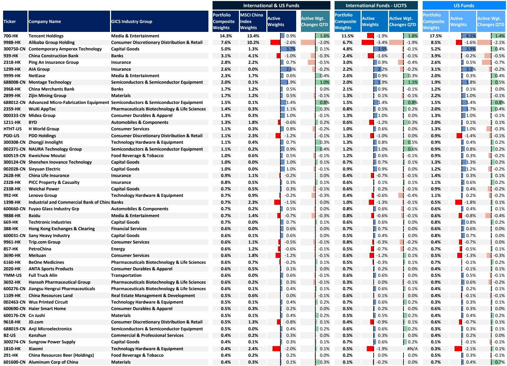
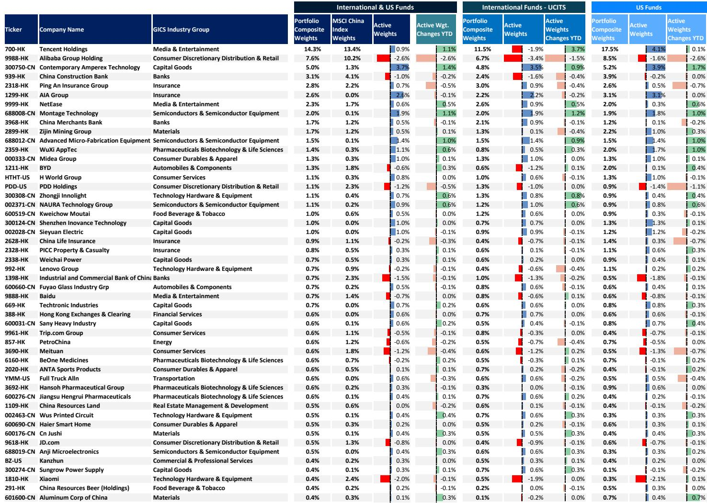
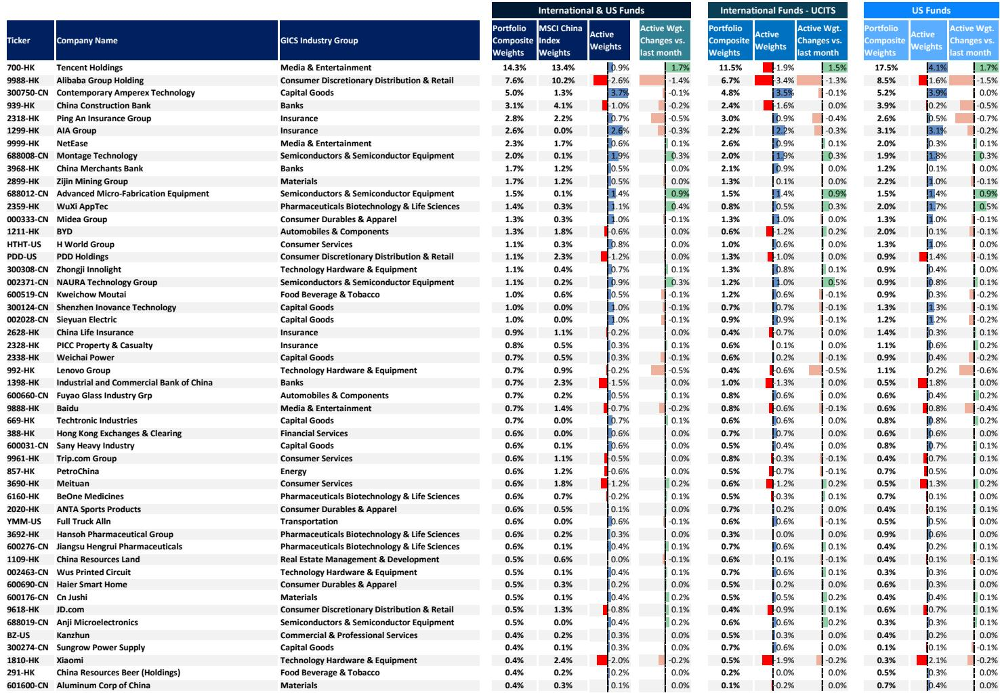

# MS：中国Equity策略中国HKFlows和P

六月外资流出规模创下年内第三高，仅次于2025年4月互征关税和2026年3月美伊冲突两个极端事件。MS最新月度资金流追踪显示，海外注册产品在六月净流出中国和香相关市场票36亿美元，其中被动产品由前两个月的净流入转为净流出13亿美元，主动产品流出加速至22亿美元。

这份报告最值得关注的判断不是外资流出本身，而是资金结构正在发生实质性切换：外资在撤退，但国内资金——从私募产品到融资盘——仍在加码。两股力量的方向分歧，正在重塑中国权益市场的定价权分布。

## 1. 外资撤退的规模与结构都值得重新审视

六月36亿美元的流出量，放在历史序列中看并不寻常。MS的数据显示，2026年上半年外资累计净流入已降至69亿美元，仅为2025年全年流入总额的50%。这意味着过去六个月里，外资对中国公司的整体配置节奏明显仍在调整。

结构上更值得拆解的是主动与被动资金的分化。被动产品在四月和五月连续净流入后，六月突然逆转。主动产品则延续了更长时间的流出趋势，六月加速至22亿美元。两类资金行为的不一致，说明这轮流出并非单一因素驱动——被动资金更多受指数再平衡和全球不确定性偏好影响，主动资金则反映组合负责人对基本面和估值的主观判断。

> **KC评论：** 外资流出规模虽然大，但需要区分“主动减仓”和“被动跟随”。六月被动资金逆转更值得关注，因为它往往与全球资金流向中国市场的整体情绪有关，而非公司层面的判断。

## 2. 国家队的退出节奏在加快，但市场并未因此失速

报告用沪深300 ETF资金流作为国家队买卖的代理指标，六月估算净流出230亿美元，高于五月的210亿美元。与此同时，中证500和中证1000 ETF的资金流基本平稳。

国家队的持续退出本身不是新闻，但值得追问的是：在这样一个外资也在流出的月份，是谁接住了这些卖盘？MS的数据指向两个来源：一是私募产品，其管理资产规模自2025年中以来累计增长42%，五月继续增加69亿元人民币；二是融资余额，六月达到3.0万亿元人民币的历史新高，环比增长4%。

散户端的数据则更为复杂。新开账户数从五月的280万户小幅升至290万户，但日均小额订单净流入从330亿元降至250亿元。这意味着散户参与度在边际上有所降温，但杠杆资金仍在加码。

## 3. 南下资金重新加速，但相关市场被动外资转为流出

六月南下资金净流入35亿美元，扭转了五月4亿美元的净流出。2026年上半年累计南下资金达360亿美元，相当于2025年全年流入的21%。这个数字本身并不低，但相比2025年同期的节奏，增速已经明显节奏变化。

更值得关注的是相关市场的被动外资流向。报告使用跟踪沪深300的海外被动产品作为北向资金的代理指标，六月这些资金转为净流出，结束了此前两个月的净流入。考虑到北向资金日度数据自2024年8月起已停止披露，这个代理指标是目前观察外资通过互联互通机制进出相关市场的最有效窗口。

> **KC评论：** 南下资金和北向被动资金的方向背离，说明相关市场和相关市场正面临不同的资金环境。相关市场有内地资金支撑，但相关市场的外资被动配置正在降温，这对两个市场的流动性结构会产生不同影响。

## 4. 行业配置的微妙转向：半导体和科技硬件成为加仓方向

报告还披露了主动管理产品在五月末的持仓变化。从行业层面看，组合负责人在半导体、科技硬件和媒体娱乐三个板块增加了最多主动权重，而在可选消费分销与零售、保险、食品饮料与烟草三个板块减仓最多。

公司层面，腾讯、中微公司和药明康德是加仓最多的标的，而阿里巴巴、中国平安和联想集团是减仓最多的标的。这个组合反映出组合负责人正在从消费和资金板块向科技和半导体板块迁移，与全球AI和半导体产业链的重估逻辑一致。

但需要指出的是，这些持仓数据截至五月末，尚未完全反映六月外资加速流出期间组合负责人的应对行为。六月的数据要到七月中下旬才会陆续披露。

---

这份报告的核心价值不在于告诉读者外资在流出，而在于揭示了一个正在发生的资金结构切换：外资的定价影响力在下降，国内资金——尤其是私募产品和杠杆资金——正在成为边际定价力量。这种切换是否可持续，取决于国内资金的流入能否对冲外资的持续撤退，以及国内资金本身的杠杆水平是否会在某个时点引发监管关注。

对于关注中国权益市场的读者而言，未来几个月的关键观察点不是外资流出的相对规模，而是国内资金——特别是私募产品和融资盘——能否继续保持当前的流入节奏。如果国内资金出现边际降温，而外资流出未见收敛，市场流动性环境将面临更复杂的考验。

For informational purposes only. Portions may be generated,translated,summarized,or edited with AI assistance based on source materials and may contain omissions or errors. Please verify independently. This is not investment,legal,tax,accounting,or other professional advice.

For informational purposes only. Portions may be generated,translated,summarized,or edited with AI assistance based on source materials and may contain omissions or errors. Please verify independently. This is not investment,legal,tax,accounting,or other professional advice.

