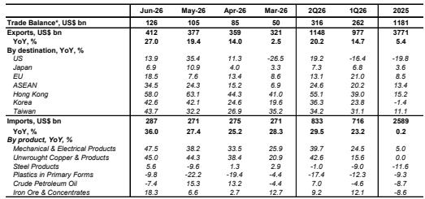
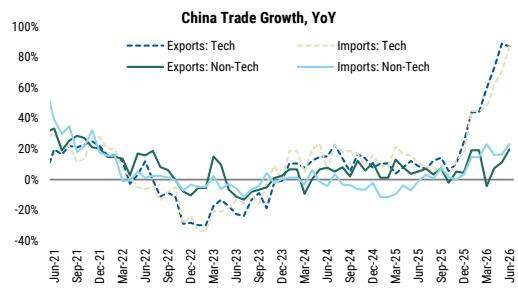

# MS：中国宏观环境学-六月贸易-科技引领，其余追赶

六月进出口数据双双超出市场预期。MS最新发布的六月贸易报告指出，出口同比增长27%，进口同比增长36%，均较五月明显加速。表面上看，这组数字延续了年初以来的强势，但真正值得关注的不是增速本身，而是增长结构的微妙变化——科技板块继续扮演核心驱动力，而非科技类出口的修复速度正在加快，两者叠加构成了当前贸易韧性的底层逻辑。

报告特别提醒，部分强势表现可能包含前期航运瓶颈和能源供应中断后的补单效应。这意味着，未来几个月的环比动能未必能线性外推。

## 1. 半导体和计算机贡献了出口增长的九个百分点，进口贡献超过十七个百分点

科技板块依然是贸易增长最确定的支撑。MS的数据显示，半导体和计算机类产品对六月出口增长的贡献达到9.4个百分点，对进口增长的贡献高达17.4个百分点，分别高于五月的9.3和14.3个百分点。全球人工智能相关需求持续拉动中国电子产业链，这一趋势没有出现松动迹象。

> **KC评论：** 科技出口的贡献度已经连续数月处于高位，但边际提升幅度在收窄。读者需要关注的是，当科技出口增速不再加速时，非科技板块能否接住接力棒。

## 2. 非科技出口增速从11.2%跳升至19.8%，汽车和劳动密集型产品是主要推手

报告中最值得注意的变化是非科技类出口的加速。六月非科技出口同比增速从上月的11.2%跃升至19.8%。汽车出口经季节调整后环比增长12%，同比增速从五月的39%大幅攀升至70%。劳动密集型消费品出口环比增长4.2%。上游产品同样表现强劲，精炼石油出口在五月环比增长13%的基础上再增9%，铝材出口在1-5月累计增长25%后，六月环比再增17%。

出口目的地的广度也在改善。对东盟出口同比增长34.5%，对欧盟增长18.5%，对韩国增长42.6%，对台湾增长43.7%。对美出口增速从五月的35.4%回落至13.9%，但相对水平仍不低。

## 3. 进口结构分化：煤炭和铁矿石量价齐升，原油进口量持续调整

进口端的改善更多集中在商品领域，且分布不均。煤炭进口在五月环比暴增33%的基础上，六月再增17%。铁矿石进口环比增长7%。报告指出，这两类商品的进口增长主要由数量驱动，而非价格。煤炭进口量上升，部分反映了国内煤矿安全大检查后供给收紧的替代效应。

与之形成对比的是，原油进口金额环比下降16%，尽管进口价格保持稳定。这意味着原油进口量仍在持续调整，反映出国内炼厂开工率或需求端的仍在调整。

## 4. 结构性科技需求支撑中期前景，但霍尔木兹海峡局势是最大变数

MS认为，结构性科技需求将在未来数月继续支撑进出口增速。但报告同时明确指出，霍尔木兹海峡局势再度紧张是最大的节奏变化不确定性。当前库存缓冲较薄，即便是一次中等程度的冲击，也可能对航运、生产和全球贸易产生不成比例的影响。

对于关注宏观环境的读者而言，这份报告提供了一个清晰的观察框架：科技出口是基本盘，非科技出口的广度修复是弹性来源，而地缘政治冲击则是需要持续跟踪的变量。三者之间的相对强弱变化，将决定下半年贸易数据的实际走向。

For informational purposes only. Portions may be generated,translated,summarized,or edited with AI assistance based on source materials and may contain omissions or errors. Please verify independently. This is not investment,legal,tax,accounting,or other professional advice.

For informational purposes only. Portions may be generated,translated,summarized,or edited with AI assistance based on source materials and may contain omissions or errors. Please verify independently. This is not investment,legal,tax,accounting,or other professional advice.

