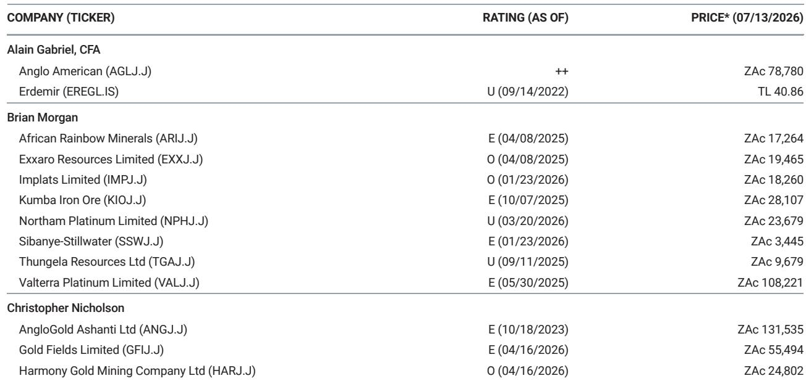
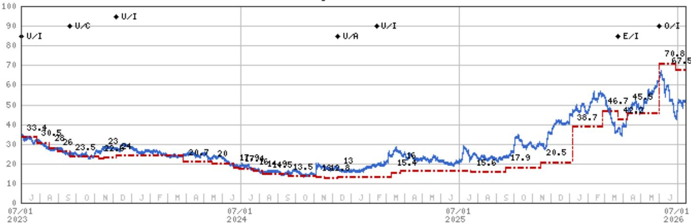
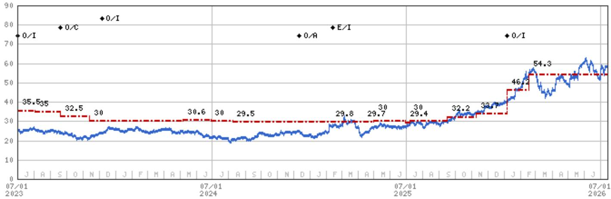

# European Steel Mills Are Regaining Pricing Power as Trade Policy Reshapes the Global Supply Map

China's finished-steel net exports in June 2026 ran at an annualised rate of approximately 119 million tonnes per annum, flat month-on-month on a day-adjusted basis but still roughly 5 percent lower year-on-year year-to-date. This plateau, sustained above the 110 million tonne forecast for 2026, masks a deeper structural shift: the global steel trade is being remade not by demand cycles but by policy architecture. In Europe, the combination of Carbon Border Adjustment Mechanism (CBAM) implementation from January 2026 and safeguard tightening from July 2026 is progressively insulating the region from import pressure, even as Chinese export volumes remain elevated by historical standards. The result is a widening premium for European hot-rolled coil, which has already risen to $426 per tonne, well above the long-run average of $320 per tonne. For observers, the question is no longer whether European steel producers can recover pricing power, but how durable the new regime will prove and which companies are best positioned to capture the rebalancing.

The evidence is accumulating faster than consensus appears to recognise. ArcelorMittal raised European coil offers by €50 per tonne in late June, bringing hot-rolled coil to €770 per tonne base delivered, with September order books reportedly full and lead times extending into October. This price action is occurring against a backdrop of soft end-market demand, which makes the move particularly significant. It suggests that supply-side constraints, not demand recovery, are driving the repricing. The policy framework is beginning to function as intended: raising import parity, tightening available tonnes, and shifting marginal pricing power back to domestic mills. The implications for company performance, valuation, and portfolio positioning are material.

## Chinese Export Pressure Is Easing, but the Mechanism Is Policy-Driven, Not Cyclical

China's steel export machine remains formidable but is no longer accelerating. The June data, showing net exports of approximately 9.9 million tonnes, represents a flat month-on-month outcome after adjusting for working days. Year-to-date, exports are down roughly 5 percent versus the same period in 2025. Two forces are at work. The first is growing trade protectionism across destination markets, from anti-dumping duties in Europe and the United States to safeguard measures in emerging economies. The second is China's own export licensing system, introduced to manage outflows and avoid provoking retaliatory trade actions. Domestic production is also muted: CISA member output is down approximately 6 percent year-on-year year-to-date, with late-June data pointing to a further 5 percent decline heading into the summer season.

The critical insight is that Chinese export volumes are being constrained by policy, not by a collapse in Chinese demand or capacity closure. The annualised run-rate of 119 million tonnes per annum remains above the level that many analysts had expected for 2026. This means the global steel market is not experiencing a simple reduction in Chinese supply. Rather, Chinese tonnes are being redirected away from markets that have erected barriers and toward those that have not. The pattern is visible in the fragmentation of China's export destinations: volumes are spreading across a wider set of smaller buyers, reducing concentration risk for China but increasing volatility for individual importing regions. For Europe, the key metric is not total Chinese export volume but the share of that volume reaching European ports. That share is declining, and the policy framework is designed to ensure it stays low.

## The European Policy Framework Is Creating a Structural Supply Deficit of 10 to 15 Million Tonnes

The dual implementation of CBAM from January 2026 and the tightened steel safeguard regime from July 2026 is fundamentally altering the supply-demand balance in Europe. CBAM will require importers to purchase certificates equivalent to the carbon price that would have been paid had the steel been produced under the EU Emissions Trading System. The safeguard, meanwhile, has been tightened through reduced quota volumes and the introduction of a melted-and-poured clause, which extends the framework's reach to steel produced in intermediary countries using Chinese-origin inputs.

The arithmetic is straightforward. European steel demand is running at approximately 150 million tonnes per annum, while domestic production capacity is around 160 million tonnes, though effective capacity is lower due to plant closures and maintenance. Imports have historically filled the gap, averaging 25 to 30 million tonnes annually. Under the new regime, even without a demand recovery, the measures could leave Europe structurally short by 10 to 15 million tonnes. This is not a forecast of demand growth. It is an estimate of the import volume that will be priced out of the market by the combination of carbon costs and quota constraints.

The early evidence supports this view. EU hot-rolled coil spreads have risen to $426 per tonne, well above the long-run average of $320 per tonne. This spread expansion is occurring despite weak end-market demand in construction, automotive, and white goods. It is a supply-side phenomenon driven by policy. The spread between EU and Chinese hot-rolled coil has also widened, reflecting the growing cost of importing into Europe. For domestic mills, this translates directly into improved pricing power and margin recovery, independent of the economic cycle.

## ArcelorMittal Is the Preferred Exposure to the European Steel Rebalancing

Within the European carbon steel universe, ArcelorMittal offers the most leveraged exposure to the policy-driven repricing. The company's integrated asset base, shipment flexibility, and ability to flex production volumes make it the primary beneficiary of the shift from imported to domestic supply. The latest €50 per tonne price hike, if sustained, implies approximately $1.7 billion of annualised gross EBITDA upside before timing, mix, cost, and realisation offsets. This is equivalent to roughly 17 percent of 2027 Visible Alpha consensus EBITDA. If the price increase holds, it would support upside risk to fourth-quarter 2026 run-rate EBITDA and 2027 estimates, while reducing 2027 enterprise value-to-EBITDA from 5.6 times to around 4.8 times on a commensurate average selling price uplift.

The valuation framework is also shifting. The analyst applies a through-the-cycle multiple of 7.1 times on 2027-2028 average EBITDA, which captures the first period in which the new, stronger European trade policy regime is fully reflected in industry economics. This multiple is in line with ArcelorMittal's own historical average, but the earnings base against which it is applied is expected to be structurally higher. The upside risks include stronger Chinese steel demand or a supply reform programme that reduces Chinese exports, a faster end-market demand improvement in key European markets, or a larger buyback programme. The downside risks include weaker Chinese steel demand that boosts exports and pressures seaborne prices, escalating trade friction that weakens demand, renewed end-market weakness, or unexpected large investments in new regions.

## Salzgitter Offers a Complementary Play on European Steel Recovery

Salzgitter represents a second, distinct exposure to the European steel recovery. The company's earnings inflection is becoming increasingly visible, driven by the same policy dynamics that benefit ArcelorMittal, but with additional company-specific catalysts. The analyst applies a through-the-cycle multiple of 7.0 times on estimated average 2027-2028 EBITDA, consistent with Salzgitter's own historical average. The upside risks include further re-rating in Aurubis shares and a higher earnings profile going forward, the full margin upside from the new EU policy framework driving further EBITDA upgrades, and successful restructuring of the HKM asset. The downside risks include a de-rating of Aurubis shares, a worse-than-expected demand environment in Europe, and spending slippage at the SALCOS green steel project phases.

The key difference between the two names is leverage and risk profile. ArcelorMittal offers greater scale, geographic diversification, and the ability to flex volumes across a global asset base. Salzgitter offers higher sensitivity to the European recovery, with a more concentrated earnings base and greater exposure to the success of its green steel transformation. Both are 报告观点-rated, but they serve different portfolio roles. ArcelorMittal is the core holding for observers seeking broad exposure to the European steel rebalancing. Salzgitter is a higher-beta complement for those willing to accept additional project and execution risk in exchange for potentially greater upside.

## A Decision Framework for Positioning in European Carbon Steel

For institutional observers evaluating exposure to European carbon steel, the following decision framework emerges from the analysis. First, assess the durability of the policy regime. The combination of CBAM and safeguard tightening is not a temporary measure. It is a structural change to the European steel market that will persist regardless of the economic cycle. The melted-and-poured clause is particularly important, as it extends the framework's reach beyond direct Chinese exports to include indirect flows through intermediary countries. This means the policy will continue to tighten over time, not loosen.

Second, evaluate the demand environment. The current repricing is occurring without demand recovery. If end-market demand improves, the effect on pricing and margins would be additive. If demand weakens further, the policy framework provides a floor that did not exist in previous downturns. The margin of safety is therefore higher than in prior cycles.

Third, differentiate between companies based on asset location, cost structure, and shipment flexibility. Integrated mills in Europe with access to scrap or low-cost iron ore are better positioned than minimills reliant on imported slab or billet. Companies with the ability to redirect shipments between domestic and export markets can optimise for the highest-margin destination. ArcelorMittal and Salzgitter both meet these criteria, but ArcelorMittal's global footprint provides additional optionality.

Fourth, monitor the key risk factors: Chinese export policy, European demand trends, and the pace of CBAM implementation. A sharp increase in Chinese exports to non-European markets could depress global steel prices and indirectly pressure European pricing through the seaborne market. A deeper-than-expected European recession could delay the volume recovery that underpins earnings estimates. Implementation delays or loopholes in CBAM could reduce the policy's effectiveness. These risks are manageable but require active monitoring.

The European steel market is undergoing a regime change. The policy architecture is shifting the profit pool from importers to domestic mills, from traders to producers, and from cyclical volatility to structural support. Observers who recognise this shift early and position accordingly stand to benefit from a re-rating that is already underway but has further to run. The evidence is in the pricing data, the order books, and the policy calendar. The question is whether the market will fully price the new equilibrium before the earnings materialise.

*For informational purposes only. Portions may be generated, translated, summarized, or edited with AI assistance based on source materials and may contain omissions or errors. Please verify independently. This is not investment, legal, tax, accounting, or other professional advice.*

For informational purposes only. Portions may be generated, translated, summarized, or edited with AI assistance based on source materials and may contain omissions or errors. Please verify independently. This is not investment, legal, tax, accounting, or other professional advice.

