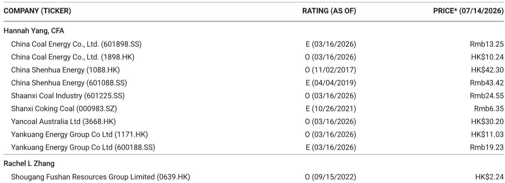
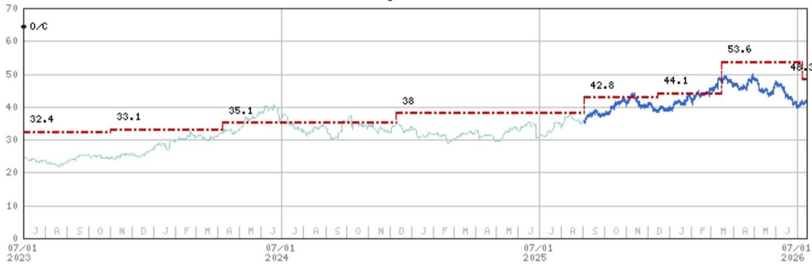
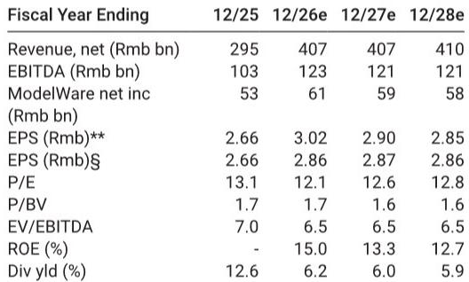

# 中国神华2026年第二季度业绩增长揭示中国煤炭利润模式的结构性转变

中国神华能源公布2026年上半年初步净利润为263-298亿元，同比增长7-21%，超出分析师预期的260亿元。由此推算的2026年第二季度净利润为156-191亿元，同比增长23-51%。这不仅仅是周期性的超预期表现。业绩增长揭示了中国煤炭行业更深层次的变化：利润中心正从纯开采向综合基础设施模式迁移，而神华是主要受益者。

市场习惯将煤炭公司视为大宗商品标的——受动力煤价格和需求周期的波动影响。神华2026年第二季度的业绩挑战了这一框架。虽然煤价上涨对超预期表现有所贡献，但更重要的驱动因素是从中国能源集团注入的11项资产的整合，这扩大了神华在煤化工、铁路和港口领域的布局。按重述口径计算，2026年上半年净利润同比变化仅为-4.7%至+8.0%，这意味着报告中的整体增长实质上是一个业务范围扩张的故事，而非价格杠杆。

这一点之所以重要，是因为行业正接近一个转折点。近期煤价因多雨天气抑制电厂消耗和港口库存增加而有所回调。然而，预计神华2026年第三季度的盈利仍将获得支撑。原因是结构性的，而非周期性的：公司涵盖采矿、物流、化工和电力的综合模式创造了纯开采企业无法复制的盈利韧性。对于关注中国能源转型的研究者和观察者而言，神华正成为一个测试案例，展示国有能源资产如何在动力煤面临长期需求变化时维持盈利能力。

## 资产注入将神华的盈利特征从采矿标的转变为综合基础设施集团

报告中最关键的数据点并非盈利超预期本身，而是重述后的比较。考虑到中国能源集团资产注入，按重述口径计算，神华2026年上半年净利润同比变化仅为-4.7%至+8.0%。这表明，报告中7-21%的增长几乎完全归因于新资产的合并，而非有机运营杠杆。

注入的资产涵盖煤化工、铁路和港口。这些业务各自拥有与动力煤开采不同的需求驱动因素和利润结构。铁路和港口产生稳定的、基于收费的收入，与吞吐量挂钩，而非煤炭现货价格。煤化工提供下游加工利润，可抵消上游波动。通过吸收这些资产，神华有效地将其盈利基础分散到四个不同的利润池：采矿开采、运输物流、化工转化和发电。

这一转变对市场定价有直接影响。传统煤炭公司基于反映商品价格风险的市盈率进行定价。综合基础设施公司因其盈利流更稳定而享有更高的估值倍数。继续使用纯开采煤炭指标评估神华的研究者，可能低估了新资产基础所提供的盈利稳定性。

## 2026年第二季度盈利受益于时机和价格，但第三季度支撑来自不同机制

报告明确将2026年第二季度的超预期表现归因于两个因素：煤价同比上涨（尤其是第二季度），以及煤化工、铁路和港口业务的盈利贡献增加。价格因素很直接——2026年第二季度动力煤价格较去年同期有所上升。但非采矿业务的贡献是更具战略意义的因素。

报告指出，近期煤价因多雨天气降低电厂日耗率和港口库存水平上升而回调。这是一个典型的短期需求冲击。然而，报告认为，2026年第三季度盈利仍将获得支撑，因为梅雨季节即将结束，这将触发电厂日耗峰值和补库需求。同时，主要产煤省份的供应限制继续制约供给。

这里的机制值得仔细审视。报告并非预测价格上涨。它描述的是供需失衡将支撑价格维持在当前水平，而非推动其走高。对神华而言，这已经足够，因为其盈利不再仅仅依赖于价格上涨。无论动力煤价格是上涨还是保持稳定，物流和化工业务都能持续产生盈利。补库周期提供了一个底部，而非催化剂。

## 供应受限叙事是支撑盈利韧性的关键假设

报告对2026年第三季度盈利支撑的信心取决于一个关键假设：主要产煤省份的供应仍然受限。这不是一个次要细节。过去三年，随着政府加强安全检查、执行产量上限并加速关闭小型低效矿井，中国的煤炭供应动态发生了显著变化。结果是，即使需求增长放缓，供应曲线也结构性趋紧。

对神华而言，这种供应限制是一个双重优势。作为最大的国有煤炭生产商，神华的矿井是效率最高、最能适应新监管框架的。较小的竞争对手面临更高的合规成本和更大的运营风险。同时，神华的铁路和港口资产受益于更高的利用率，因为行业总吞吐量仍受限制。供应限制放大了神华综合模式的价值：公司在价值链的每个环节都获取利润，而竞争对手则难以维持产量。

这一论点的风险在于供应侧政策的放松。如果政府优先考虑能源可负担性而非安全合规或环境目标，供应可能增加并给价格带来压力。然而，报告对行业的谨慎看法——Cautious而非Attractive——表明研究团队认为煤炭行业整体面临挑战，即使神华表现优于同行。这与市场结构一致：最大的综合参与者受益于整合，而整个行业则面临结构性压力。

## 研究者的决策框架：决定神华模式是否可复制的三个条件

对于将神华作为组合持仓进行评估的机构研究者而言，关键问题不在于2026年第二季度盈利是否强劲，而在于产生这些盈利的条件是否持久。报告提供了足够的证据来构建一个三条件决策框架。

首先，资产整合必须继续带来盈利多元化收益。中国能源集团的注入是一次性事件，但神华可能有进一步整合相关资产的机会。研究者应关注公司是否在物流、化工或发电领域进行额外收购。每一次增加都会进一步降低盈利对煤价的敏感性。

其次，供应限制必须持续。如果中国的煤炭供应政策转向放松管制，定价环境将走弱，神华的采矿利润将压缩。物流和化工业务仍能产生盈利，但整体回报状况将下降。研究者应关注国家能源局以及山西、陕西和内蒙古等省级政府的监管公告。

第三，补库周期必须按预期实现。报告假设梅雨季节结束将触发电厂需求复苏。如果天气模式出现偏差——例如，如果高于平均水平的降雨持续到第三季度——需求复苏可能会延迟或减弱。这是一个可能影响2026年第三季度盈利的短期风险，但不会削弱结构性论点。

这三个条件构成了一个连贯的框架。如果三个条件都成立，神华的盈利轨迹保持积极，公司的市场定价将继续调整。如果任何一个条件不成立，盈利支撑会减弱，但综合模式仍提供纯开采企业所缺乏的底部。该框架允许研究者在出现新数据时区分噪音和信号。

## 市场定价启示：神华的盈利质量证明估值扩张合理，而市场尚未完全定价

报告提供了剩余收益模型估值，权益成本为6.5%，贝塔系数为0.67，终端增长率为2%。2026年每股收益估计为3.02元。这相对于中国煤炭公司历史交易区间（通常为8-12倍市盈率）存在溢价。

估值扩张的合理性在于盈利质量。神华注入资产后的盈利波动性更低、更多元化、更可预测。市场已开始认识到这一转变——该公司的报价已从52周低点30港元回升。

报告对2026年股息率的预测为6.2%，增加了另一个维度。神华历来是一只高股息标的，即使在价格上涨后，股息率仍然具有吸引力。对于收益导向的研究者而言，6.2%的股息率与14%的潜在资本增值相结合，在当前收益环境中创造了罕见的整体回报机会。

然而，研究者应注意报告自身的谨慎态度：对中国煤炭的行业看法为Cautious，神华的相对优势是在一个分析师预期面临挑战的行业中。这不是对煤炭行业的全面背书。这是一个在面临挑战的行业中，对神华结构性优势的具体判断。

*仅供参考。部分内容可能基于源材料通过AI辅助生成、翻译、总结或编辑，可能存在遗漏或错误。请独立核实。本文不构成专业建议。*

仅供参考。部分内容可能基于源材料通过AI辅助生成、翻译、总结或编辑，可能存在遗漏或错误。请独立核实。本文不构成专业建议。

