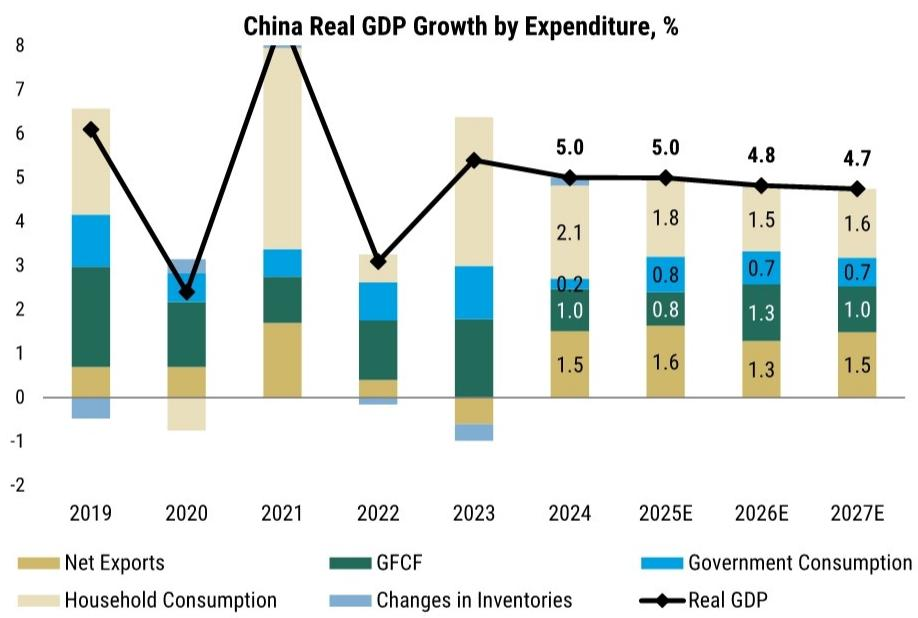
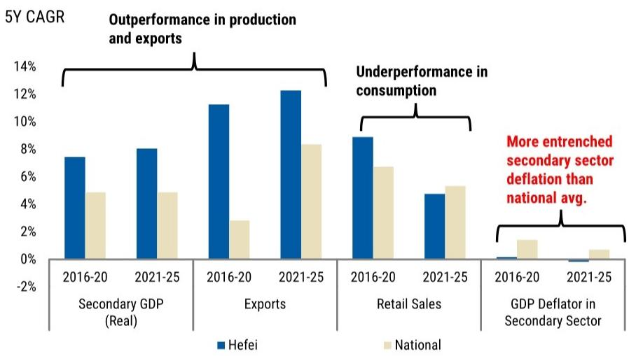

# MS：中国AI与能源双超级周期，出口份额料升至16.5%

这份MS在2026年亚洲夏季研讨会上发布的报告，核心判断是：中国正在经历一轮由AI和能源资本支出驱动的工业超级周期——其强度可能是2000年代中期以来最大的。但与此同时，宏观环境呈现明显的“双速”特征：出口和高端制造强劲，而消费和房地产依然偏弱。报告认为，这种结构性分化意味着政策更可能是“微调”而非“转向”，而AI对GDP的贡献在短期中性、长期正面。

## 1. 亚洲工业超级周期启动，中国出口份额有望升至16.5%

报告指出，亚洲正进入2000年代中期以来较强的工业周期，这不仅是AI和科技的故事。数据显示，亚洲在高速增长领域的名义研究正在快速攀升。而中国在全球制造业增加值中的占比已占据主导地位——从基础制造到高端装备，多个细分领域的全球份额都处于领先位置。基于这一结构性优势，MS预计，到2030年中国在全球出口市场的份额将从当前水平进一步上升至16.5%。

> **KC评论：** 这一判断的关键支撑不是短期订单，而是中国在制造业全链条的深度嵌入。报告特别强调，非科技类出口的复苏是“广泛基础”的，这意味着增长并非依赖单一行业。

## 2. 但正向溢出效应可能比以往更温和

尽管出口强劲，报告提醒，这一轮增长对整体宏观环境的带动作用可能弱于历史周期。原因有二：一是工业部门正变得更加资本密集和自动化，这意味着就业吸纳能力下降；二是普遍存在的产能过剩削弱了出口强劲向资本开支的传导效果。报告用“3年滚动相关性”图表展示了这一趋势——出口与资本开支的联动性正在降低。

## 3. 消费与地产仍在低位，K型分化加深

报告用“K型宏观环境”来描述当前格局。一方面，假日旅游数据显示“人流强、钱包弱”——出行人次增长可观，但人均消费转化率不高。另一方面，以旧换新相关商品消费在高基数下增速节奏变化。二手房销售在经历短暂回暖后再次走弱，房价调整仍在持续。PPI环比在6月转负，受油价下跌影响，而下游利润率被压缩，反映出终端需求依然偏弱。

## 4. AI进入新阶段：从基础设施到损益表

报告认为，中国AI正进入“2.0”阶段，核心变化是重心从基础设施转向盈利。具体表现为三个方向：算力转向电力（瓶颈从计算能力变为电网灵活性）、模型转向物理AI（人形机器人、自动驾驶）、以及AI开始体现在企业损益表中。报告预计，2026年中国的人形机器人销量将达到2.8万台，L2+智能驾驶渗透率将达32%，2030年自动驾驶出租车车队规模将达36-40万辆，占网约车/出租车总量的8%。

> **KC评论：** 报告特别强调中国在AI领域的“速度优势”——部署速度、成本效率和系统集成能力。但同时也指出，先进芯片和EDA工具仍是短板，B端变现模式仍在探索中。

## 5. 政策空间存在，但不会大规模刺激

报告认为，下半年仍有约2万亿元的财政脉冲空间，但政策重心是“加快预算执行”而非“扩大预算规模”。出口韧性降低了额外逆周期宽松的紧迫性。在AI带来的就业结构调整方面，报告预期政策将采取“差异化”策略：对高端知识工作鼓励灵活化以加速AI采用，对劳动密集型服务业则更谨慎，以保护就业。可能的缓解措施包括技能培训、创造新岗位、加强社会保障（特别是对零工宏观环境从业者）。

## 6. 合肥模式的经验与局限

报告用“合肥模式”作为工业政策案例：其成功在于扮演“生态系统规划者”而非“补贴提供者”。但报告也指出，即便是合肥本身也难以避免产能过剩和价格变化问题。如果多个地区模仿同样的工具——大规模政府种子资本、建设工业园区、聚焦相同的前沿领域——可能会在全国范围内加剧产能过剩。报告认为，“全国统一市场”和“反内卷”方向正确，但执行面临挑战：跨区域产能协调困难，地方激励机制尚未理顺。

## 7. 真正的再平衡需要更深层改革

报告最后指向三个结构性改革方向：干部考核改革（奖励改善民生和环境的成果）、社会福利改革（强化安全网以减少预防性储蓄）、财政体系改革（转向效率挂钩的直接税，为公共服务而非项目融资）。报告认为，中国家庭储蓄率仍然偏高，释放储蓄需要“三步走”路线图，而社会福利支出增加与消费在GDP中占比上升之间存在正相关关系。

---

For informational purposes only. Portions may be generated,translated,summarized,or edited with AI assistance based on source materials and may contain omissions or errors. Please verify independently. This is not investment,legal,tax,accounting,or other professional advice.

For informational purposes only. Portions may be generated,translated,summarized,or edited with AI assistance based on source materials and may contain omissions or errors. Please verify independently. This is not investment,legal,tax,accounting,or other professional advice.

