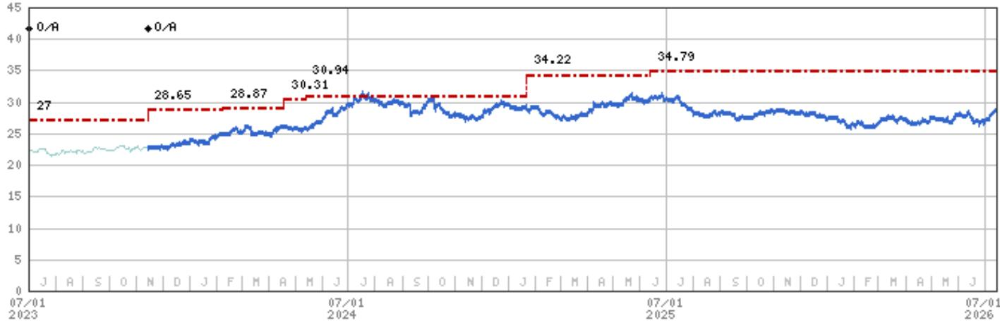
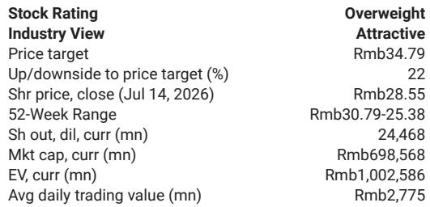

# MS：长江电力-SGNDR关键要点

水电股通常被市场看作“看天吃饭”的资产——来水多则发电多，电价随市场波动。但MS近期与长江电力管理层交流后，得出了一个更细致的判断：这家公司真正的防御性，来自它如何定义自己的电价，而不是它能发多少电。

报告的核心信号是：长江电力正在主动构建一套“能量价值+容量价值+绿色价值”的三段式电价框架。这听起来像一句口号，但背后有具体的资产配置、合同结构和研究纪律支撑。市场如果只盯着短期来水和现货电价波动，可能低估了这家公司在电力系统转型中积累的议价能力。

## 1. 电价改革不是不确定性，是重新定价的起点

市场对电力市场化改革的一个普遍担忧是：竞价会压低水电的上网电价。长江电力管理层的回应是，这种担忧忽略了水电的物理特性。

报告提到，公司2025年市场化电量占比约36%，其中98%通过中长期合同锁定，真正暴露在现货市场的比例极小。更重要的是，水电机组可以在约10分钟内完成启停，30GW的日调峰能力在新能源占比快速提升的系统中，是一种稀缺资源。调峰、备用、频率调节——这些服务在现行电价中尚未被充分定价，但电力系统越依赖风电和光伏，这些服务的价值就越突出。

> **KC评论：** 这张图的关键不在于36%这个比例，而在于98%的中长期合同占比。它意味着现货电价波动对公司收入的影响被大幅隔离。真正值得关注的是，水电的调峰和绿色价值何时能被货币化——那才是电价框架中尚未兑现的部分。

## 2. 融资成本降至2%以下，财务结构进入正向循环

长江电力的资产负债表正在经历一个被低估的改善。报告指出，公司当前平均融资成本已低于3%，新发行的中长期债券利率甚至低于2%。这为通过再融资和负债管理进一步压降财务费用创造了空间。

在维持至少70%分红率的前提下，公司计划将超额现金用于偿债和优化负债结构。这意味着，即使来水条件没有超预期改善，财务费用的持续下降也能为每股盈利提供支撑。报告中的财务模型显示，公司杠杆率（EOP）预计从2024年的139%降至2027年的88.7%，ROE维持在17%左右。这不是一个高增长故事，但是一个现金流和资本结构持续优化的过程。

## 3. 新项目研究不以ROE为相对少见标准，战略卡位才是

长江电力在“十五五”期间的研究方向已经明确：葛洲坝和向家坝扩机合计2.2GW、6.8GW抽水蓄能项目、以及有限的水风光一体化项目。管理层坦承，新项目的回报率低于现有水电资产，但研究决策的逻辑不是最大化项目ROE，而是维持公司在电力系统中的战略重要性。

这个判断值得细读。报告引述管理层的原话：继续研究是保持公司在未来电价谈判中议价能力的前提。换句话说，如果长江电力停止扩张，它在电力调度和定价体系中的话语权就会逐渐稀释。抽水蓄能项目虽然回报周期长（投产后约6-7年才能产生正自由现金流），但它们是公司从“单一水电运营商”向“系统级灵活性服务商”转型的基础设施。

> **KC评论：** 这里有一个容易被忽略的细节：管理层强调研究决策要看EPS增厚，而非ROE最大化。这意味着新项目即使回报率偏低，只要对每股盈利有正向贡献，就是可接受的。这种框架降低了市场对资本开支回报率下滑的担忧，因为它把分析重心从项目层面转移到了公司整体盈利的可持续性上。

## 4. 厄尔尼诺是变量，但不是交易逻辑

报告提到了一个市场关注的话题：强厄尔尼诺事件可能在2026年秋季出现，历史上1997-1998年的案例曾导致长江流域严重洪涝。但管理层没有给出确定性判断，而是强调实际发电量和来水情况仍取决于降雨、天气模式和水库调度。

这份报告对来水变量的处理方式是克制的。它没有把厄尔尼诺作为提到逻辑，而是将其列为需要持续观察的因子。真正支撑公司定价的，是中长期合同结构、融资成本下降、以及研究纪律带来的盈利可见性。对于关注公用事业板块的决策者而言，长江电力的核心叙事已经从“来水弹性”转向“现金流质量和系统地位”。

For informational purposes only. Portions may be generated,translated,summarized,or edited with AI assistance based on source materials and may contain omissions or errors. Please verify independently. This is not investment,legal,tax,accounting,or other professional advice.

