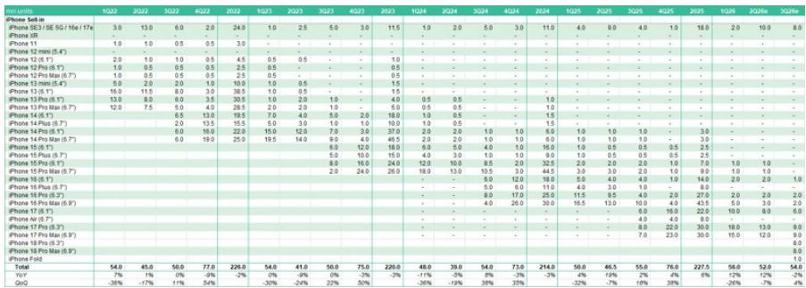

# Apple's 3Q26 Build Plans Signal a Strategic Pivot Toward Premium Segmentation, Not Volume Growth

The most telling data point in the latest Greater China technology hardware analysis is not the absolute build number, but what the composition of those builds reveals about Apple's evolving hardware strategy. The 3Q26 iPhone build estimate stands unchanged at 54 million units, representing a 4% sequential increase but a 2% year-over-year decline. At first glance, this appears to be a period of consolidation. Look closer at the product mix, and a different narrative emerges: Apple is deliberately compressing volume in its base models while expanding its addressable market at the high end through new premium SKUs, including the anticipated iPhone Fold.

This matters now because the 2Q26 build data has already validated a key inflection point. At 52 million units, the 2Q26 iPhone build came in exactly as expected, but the context is what commands attention. Typically, the second quarter sees a 15% to 25% sequential decline as the post-holiday demand trough sets in. This quarter posted only a 7% decline, the mildest seasonal drop in recent memory. Supply chain checks with major assembly partners, including Hon Hai, confirmed that iPhone shipments actually increased month-over-month in June. For a product cycle that is often dismissed as mature, this behavior suggests underlying demand is proving more resilient than the headline year-over-year comparisons imply.

The iPad story reinforces the same theme through a different lens. The 3Q26 iPad build forecast holds at 13 million units, flat sequentially and down 7% year-over-year. The year-over-year decline is largely a base effect from product launches in 2Q25 that inflated that period's comparison. More important than the absolute number is the fact that builds are holding steady despite memory and material cost hikes that could have easily triggered inventory destocking. The decision to maintain normal stocking levels in the face of input cost pressure is a deliberate strategic choice, not a passive outcome.

---

## The 2Q26 iPhone Build Defied Seasonal Gravity, Confirming Sustained Demand Momentum Amid Cost Headwinds

The magnitude of the 2Q26 outperformance is best understood by placing it against the historical pattern. Over the past four years, second-quarter iPhone builds have declined by an average of roughly 20% from the first quarter. The 7% decline in 2Q26 is less than half the historical norm. This is not a statistical anomaly; it is the result of specific operational and market dynamics that the supply chain data makes visible.

First, the month-over-month increase in June shipments from Hon Hai, Apple's primary iPhone assembler, indicates that demand remained robust late into the quarter. Typically, June is a period of inventory correction ahead of the next generation launch. An upward trajectory in June suggests that channel inventories were lean and that replenishment demand was still active. Second, this performance occurred against the backdrop of memory cost hikes, which have been a persistent concern for the entire consumer electronics supply chain. The fact that Apple's assembly partners maintained elevated build rates while other OEMs may have pulled back signals that Apple either has greater pricing power to pass through costs or that its demand visibility gave it confidence to keep production steady.

The implication for observers and supply chain participants is that Apple's end-market demand is less elastic to component cost inflation than the broader industry. This is a structural advantage that should be factored into any assessment of Apple's margin resilience through the second half of 2026.

---

## The 3Q26 iPhone Mix Shift Toward Premium Models and the Fold Will Compress Unit Growth But Expand Revenue Per Device

The 3Q26 build estimate of 54 million units is flat year-over-year, but the product mix within that number is undergoing a significant transformation. The report indicates that the slower year-over-year run rate reflects new model SKUs shifting to the premium segment, specifically the 18 Pro and Pro Max models, along with the introduction of the iPhone Fold. Meanwhile, the base iPhone 18 model is not scheduled for introduction until the first half of 2027.

This timing gap is the strategic crux. By delaying the base model launch, Apple is effectively funneling a larger share of the 3Q26 build toward the highest-margin products in its lineup. The Pro models have historically carried ASP premiums of 30% to 40% over the base models, and the iPhone Fold, at an anticipated 7 to 8 million units in the second half of 2026, represents an entirely new price tier. The revenue impact of this mix shift is material: replacing 5 million base-model units with 5 million Pro or Fold units can generate over $2 billion in incremental revenue at the device level, even before accounting for accessory and service attach rates.

The risk is that the Fold's ramp-up introduces manufacturing complexity and yield uncertainty. The report explicitly states that the team will monitor the ramp-up progress to assess upside or downside to builds. For supply chain observers, the Fold is the single most important swing factor in the second-half outlook. A smooth ramp could drive upward revisions to both build numbers and component orders. Any hiccup, however, would have a disproportionate impact on the premium segment's contribution.

---

## iPad Builds Are Holding Steady Despite Input Cost Pressure, Signaling That Apple Is Prioritizing Market Position Over Short-Term Margin Protection

The iPad forecast tells a story of deliberate stability. At 13 million units for 3Q26, builds are flat sequentially and down 7% year-over-year. The year-over decline is almost entirely attributable to the comparison with 2Q25, which benefited from new product launches. On a normalized basis, the iPad is running at a consistent run rate.

What makes this noteworthy is the explicit mention that memory and material price hikes could have impacted stocking decisions. In a typical cost-push environment, OEMs reduce inventory targets to protect working capital. Apple's decision to maintain normal stocking levels suggests that the company sees the iPad as a strategically important platform, not merely a volume business. The iPad serves as the entry point for the Apple ecosystem for many education and enterprise users, and it is increasingly positioned as a computing alternative to traditional laptops. Allowing supply to tighten in response to component costs would risk losing share in these growth segments.

For the supply chain, the implication is that iPad component orders should remain steady through the third quarter. Suppliers with exposure to iPad-specific components, such as displays, enclosures, and batteries, can expect stable volume visibility. The risk to this outlook is if memory costs continue to escalate into the fourth quarter, at which point Apple may need to reevaluate. But for the immediate term, the build plan provides a floor for demand expectations.

---

## A Decision Framework for Supply Chain Positioning Through the Second Half of 2026

The data in this report supports a structured approach to evaluating supply chain exposure. Three factors should guide operational decisions over the next two quarters.

First, prioritize exposure to premium iPhone components over base-model components. The mix shift toward Pro, Pro Max, and Fold models means that suppliers of high-value components, such as titanium frames, advanced camera modules, and foldable displays, will see disproportionate volume growth relative to the overall iPhone build number. Suppliers of base-model components, by contrast, face a flatter demand profile.

Second, monitor the Fold ramp as a real-time indicator. The 7 to 8 million unit estimate for the second half of 2026 is the largest single variable in the build outlook. Supply chain checks on yield rates, assembly throughput, and component delivery schedules will provide leading indicators of whether the final build number lands at the high or low end of the range. Any supply chain disruption at the module level will have outsized consequences given the Fold's higher ASP.

Third, treat iPad stability as a defensive anchor. The iPad build is not growing, but it is also not declining beyond the base-effect normalization. For suppliers with diversified exposure across both iPhone and iPad, the iPad provides a volume floor that reduces overall earnings volatility. In a period where the iPhone mix shift introduces upside optionality but also execution risk, the iPad's predictability is a valuable portfolio hedge.

---

## The 3Q26 Build Plans Confirm That Apple Is Executing a Deliberate Strategy of Volume Discipline and Premium Expansion

The unchanged build estimates for both iPhone and iPad in 3Q26 are not a sign of stagnation. They are the output of a strategic calculus that prioritizes revenue per device and ecosystem depth over unit share. The 2Q26 iPhone build already demonstrated that demand is holding up better than seasonal norms would suggest, even with memory cost headwinds. The 3Q26 mix shift, with its emphasis on Pro models and the Fold, will compress unit growth but expand dollar content per device. The iPad, meanwhile, is being maintained as a stable volume platform despite cost pressure, underscoring its strategic importance.

For the supply chain, the message is clear: the opportunity lies not in chasing aggregate build numbers, but in aligning with the premium segments where Apple is concentrating its production capacity. The Fold is the wild card that could either amplify or constrain that opportunity. The next two quarters will reveal whether Apple's bet on premium segmentation can sustain the momentum that the 2Q26 data has already validated.

*For informational purposes only. Portions may be generated, translated, summarized, or edited with AI assistance based on source materials and may contain omissions or errors. Please verify independently. This is not professional advice.*

For informational purposes only. Portions may be generated, translated, summarized, or edited with AI assistance based on source materials and may contain omissions or errors. Please verify independently. This is not professional advice.

