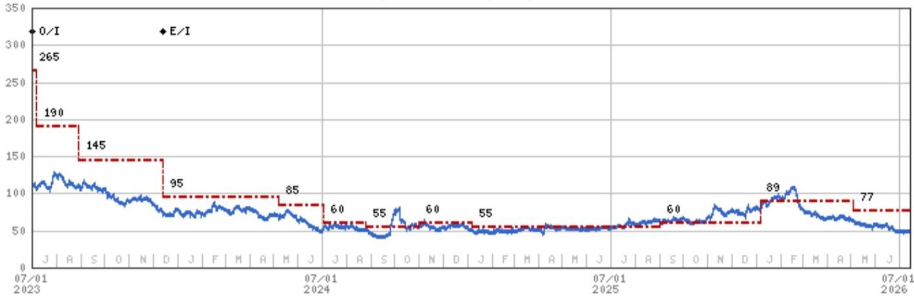
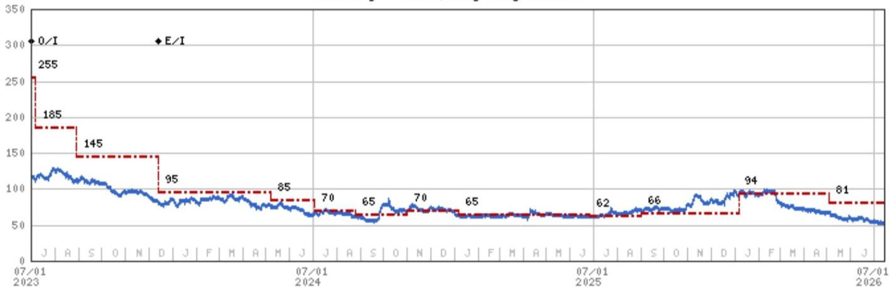

# 中国旅游集团中免 | 亚太地区

# 2026年第二季度初步业绩：季度环比表现符合预期

## 业绩解读

| 对研究框架的影响——未变 | 财务数据与市场预期——一致 | 未来12个月市场预期方向——小幅下调 |
|---|---|---|

来源：公司数据，MS

## 核心要点

2026年第二季度收入同比下降2%、营业利润同比下降20%，这一结果并不意外，因为海南免税销售增速自4月以来已出现明显放缓。

不过，2026年第二季度报告营业利润率为8.5%，同比下降1.9个百分点，表现并不突出；尤其是主营业务毛利率同比实际扩大了1.44个百分点。

我们认为汇率损失可以部分解释营业利润率的压缩，但需等待8月下旬的中期业绩以获取更多关于经营去杠杆的细节。

海南免税市场第三季度的同比基数较低，但近期相关旅游行业（如酒店和交通）的趋势表现不一。

图表1：中国旅游集团中免：2026年第二季度初步业绩

| 初步业绩（百万元人民币） | 2025年第一季度 | 2025年第二季度 | 2025年第三季度 | 2025年第四季度 | 2026年第一季度 | 2026年第二季度 |
|---|---|---|---|---|---|---|
| 收入 | 16,746 | 11,405 | 11,711 | 13,831 | 16,906 | 11,177 |
| 报告营业利润 | 2,519 | 1,189 | 777 | 819 | 2,793 | 949 |
| 税前利润 | 2,518 | 1,145 | 755 | 889 | 2,796 | 949 |
| 归属股东净利润 | 1,938 | 662 | 452 | 534 | 2,348 | 758 |
| 同比 | | | | | | |
| 收入 | -11% | -8% | 0% | 3% | 1% | -2% |
| 报告营业利润 | -13% | -27% | -16% | 14% | 11% | -20% |
| 税前利润 | -13% | -30% | -17% | 27% | 11% | -17% |
| 归属股东净利润 | -16% | -32% | -29% | 54% | 21% | 14% |
| 利润率 | | | | | | |
| 营业利润率 | 15.0% | 10.4% | 6.6% | 5.9% | 16.5% | 8.5% |
| 净利润率 | 11.6% | 5.8% | 3.9% | 3.9% | 13.9% | 6.8% |
| 营业利润率同比变化 | 15.0个百分点 | 10.4个百分点 | 6.6个百分点 | 5.9个百分点 | 1.5个百分点 | -1.9个百分点 |
| 净利润率同比变化 | 11.6个百分点 | 5.8个百分点 | 3.9个百分点 | 3.9个百分点 | 2.3个百分点 | 1.0个百分点 |

来源：公司数据，MS

## 参见：

香港/中国休闲与住宿：一个极具挑战的暑假（2026年7月10日）

中国航空公司：暑期高峰：客运需求增长的早期复苏迹象（2026年7月12日）

中国——航空：国际运力：2026年第27周（2026年7月7日）

中国航空公司：暑期开局温和，乐观情绪减弱（2026年7月6日）

MS ASIA LIMITED+

亚洲暑期学校 2026

## 中国旅游集团中免（1880.HK, 1880 HK）

## 中国/香港消费 | 中国

| 公司评级 | 中性 |
| --- | --- |
| 行业观点 | 中性 |
| 目标价 | 77.00港元 |
| 收盘价（2026年7月14日） | 47.94港元 |
| 52周区间 | 107.00-46.00港元 |
| 摊薄后总股本（百万股） | 116 |
| 市值（百万元人民币） | 104,245.0 |
| 企业价值（百万元人民币） | 75,612.9 |
| 日均交易额（百万港元） | 219 |

MS与报告中覆盖的公司有业务往来，并寻求开展业务。因此，读者应注意，公司可能存在影响MS客观性的利益冲突。读者应将MS视为其决策的单一因素。

有关分析师认证及其他重要披露，请参阅本报告末尾的披露部分。

+= 受雇于非美国关联公司的分析师未在FINRA注册，可能不是该会员的关联人士，且可能不受FINRA关于与标的公司沟通、公开露面以及交易研究分析师账户持有证券的限制。

## 估值方法与风险

## 中国旅游集团中免（1880.HK）

我们对A股估值给予15%的折价。这意味着2026年预期市盈率为27倍，而A股为32倍（自2017年以来高于均值1个标准差）。这一H股折价幅度与其自2022年中期H股上市以来的平均水平相似。

## 上行风险

■ 海南自贸港及市内免税店政策利好

■ 消费支出改善（尤其是美妆产品）及消费升级（更多非美妆奢侈品）

## 下行风险

■ 宏观环境变化及可支配收入相关因素

■ 各零售渠道间的价格竞争

■ 若政府进一步开放免税市场（包括海南和内地），竞争可能加剧

## 中国旅游集团中免（601888.SS）

我们采用2026年预期市盈率32倍作为目标，自2017年以来高于均值1个标准差。我们的目标市盈率隐含1倍PEG，略低于中国消费类公司平均水平，因为中免属于重资产模式，净资产回报表现较低。增长动力集中于海南业务的复苏，但多元化程度不足。我们预计2026年海南旅游零售市场增长将保持健康态势，推动收入增长和利润率扩张。

## 上行风险

■ 海南自贸港及市内免税店政策利好

■ 消费支出改善（尤其是美妆产品）及消费升级（更多非美妆奢侈品）

## 下行风险

■ 宏观环境变化及可支配收入相关因素

■ 各零售渠道间的价格竞争

■ 若政府进一步开放免税市场（包括海南和内地），竞争可能加剧

## 披露部分

本报告中的信息及观点由MS Asia Limited（对其内容负责）及/或MS Asia (Singapore) Pte.（注册号199206298Z）及/或MS Asia (Singapore) Securities Pte Ltd（注册号200008434H，受新加坡金融管理局监管，对其内容承担法律责任，如有任何相关问题请联系）及/或MS Taiwan Limited及/或MS & Co International plc, Seoul Branch及/或MS Australia Limited（ABN 67 003 734 576，持有澳大利亚金融服务牌照号233742，对其内容负责）及/或MS Wealth Management Australia Pty Ltd（ABN 19 009 145 555，持有澳大利亚金融服务牌照号240813，对其内容负责）及/或MS India Company Private Limited（公司识别号U22990MH1998PTC115305，受印度证券交易委员会监管，持有研究分析师（SEBI注册号INH000001105）、股票经纪商（SEBI股票经纪商注册号INZ000244438）、商人银行（SEBI注册号INM000011203）及国家证券存管有限公司存管参与者（SEBI注册号IN-DP-NSDL-567-2021）牌照，注册地址为Altimus, Level 39 & 40, Pandurang Budhkar Marg, Worli, Mumbai 400018, India；电话+91-22-61181000；合规官：Tejarshi Hardas先生，电话+91-22-61181000或电邮tejarshi.hardas@morganstanley.com；申诉官：Tejarshi Hardas先生，电话+91-22-61181000或电邮msic-compliance@morganstanley.com）及其关联公司（统称"MS"）编制或分发。MS India Company Private Limited (MSICPL) 可能在提供研究服务时使用AI工具。本报告中的所有建议均由合格的研究分析师做出。

有关重要披露、股价图表及股权评级历史，请访问MS披露网站www.morganstanley.com/eqr/disclosures/webapp/generalresearch，或联系您的投资代表或MS，地址：1585 Broadway, (Attention: Research Management), New York, NY, 10036 USA。

有关本研究报告引用的任何建议、评级或目标价的估值方法及风险，请联系客户支持团队：美国/加拿大+1 800 303-2495；香港+852 2848-5999；拉丁美洲+1 718 754-5444（美国）；伦敦+44 (0)20-7425-8169；新加坡+65 6834-6860；悉尼+61 (0)2-9770-1505；东京+81 (0)3-6836-9000。或联系您的投资代表或MS，地址：1585 Broadway, (Attention: Research Management), New York, NY 10036 USA。

## 分析师认证

以下分析师特此证明，他们对本报告讨论的公司及其证券的观点准确表达，且未因表达具体建议或观点而直接或间接获得或将获得补偿：Hildy Ling；Lillian Lou。

## 全球研究冲突管理政策

MS已按照冲突管理政策发布，该政策可在www.morganstanley.com/institutional/research/conflictpolicies查阅。葡萄牙语版本可在www.morganstanley.com.br查阅。

## 关于标的公司的重要监管披露

截至2026年6月30日，MS实益持有MS报告中以下公司普通股类别1%或以上：安徽古井贡酒股份有限公司、茶姬控股有限公司、中国蒙牛乳业、东鹏饮料、佛山市海天调味食品、杭州巨星科技股份有限公司、老铺黄金、李宁、牧原食品股份有限公司、新秀丽集团、青岛啤酒股份有限公司。

在过去12个月内，MS管理或联合管理了东鹏饮料、老铺黄金、牧原食品股份有限公司、万洲国际的公开（或144A）发行。在过去12个月内，MS因投资银行服务从东鹏饮料、健合集团、老铺黄金、美的集团股份有限公司、新秀丽集团、万洲国际获得报酬。

在未来3个月内，MS预计将或意图寻求从以下公司获得投资银行服务报酬：安踏体育、茶姬控股有限公司、晶苑国际集团有限公司、东鹏饮料、佛山市海天调味食品、巨子生物控股有限公司、公牛集团股份有限公司、珠海格力电器股份有限公司、海底捞国际控股有限公司、海尔智家股份有限公司、健合集团、恒安国际集团、老铺黄金、美的集团股份有限公司、牧原食品股份有限公司、农夫山泉股份有限公司、泡泡玛特国际集团有限公司、珀莱雅化妆品股份有限公司、新秀丽集团、高鑫零售有限公司、特海国际、创科实业有限公司、滔搏国际控股有限公司、卫龙美味全球控股有限公司、万洲国际、伊利实业、珍酒李渡集团。

在过去12个月内，MS因投资银行服务以外的产品和服务从以下公司获得报酬：安踏体育、波司登国际控股有限公司、周大福珠宝集团有限公司、珠海格力电器股份有限公司、海底捞国际控股有限公司、海尔智家股份有限公司、健合集团、美的集团股份有限公司、泡泡玛特国际集团有限公司、新秀丽集团、九兴控股有限公司、创科实业有限公司、滔搏国际控股有限公司、统一企业中国、万洲国际、燕京啤酒、裕元工业、百胜中国控股有限公司。

在过去12个月内，MS已提供或正在提供投资银行服务，或与以下公司存在投资银行客户关系：安踏体育、茶姬控股有限公司、晶苑国际集团有限公司、东鹏饮料、佛山市海天调味食品、巨子生物控股有限公司、公牛集团股份有限公司、珠海格力电器股份有限公司、海底捞国际控股有限公司、海尔智家股份有限公司、健合集团、恒安国际集团、老铺黄金、美的集团股份有限公司、牧原食品股份有限公司、农夫山泉股份有限公司、泡泡玛特国际集团有限公司、珀莱雅化妆品股份有限公司、新秀丽集团、高鑫零售有限公司、特海国际、创科实业有限公司、滔搏国际控股有限公司、卫龙美味全球控股有限公司、万洲国际、伊利实业、珍酒李渡集团。

在过去12个月内，MS已提供或正在提供非投资银行、证券相关服务，及/或过去已签订服务协议或与以下公司存在客户关系：安踏体育、波司登国际控股有限公司、周大福珠宝集团有限公司、东鹏饮料、珠海格力电器股份有限公司、海底捞国际控股有限公司、海尔智家股份有限公司、健合集团、恒安国际集团、老铺黄金、美的集团股份有限公司、农夫山泉股份有限公司、泡泡玛特国际集团有限公司、新秀丽集团、九兴控股有限公司、创科实业有限公司、滔搏国际控股有限公司、统一企业中国、万洲国际、燕京啤酒、裕元工业、百胜中国控股有限公司。

MS & Co. LLC 是特海国际证券的做市商。

主要负责编制MS的股权研究分析师或策略师的薪酬基于多种因素，包括研究质量、读者客户反馈、选股能力、竞争因素、公司收入及整体投资银行收入。股权研究分析师或策略师的薪酬不与MS进行的投资银行或资本市场交易或特定交易台的盈利能力或收入挂钩。

MS及其关联公司与MS涵盖的公司/工具有业务往来，包括做市、提供流动性、基金管理、商业银行、信贷扩展、投资服务及投资银行。MS以主体身份向客户买卖MS涵盖公司的证券/工具。MS可能持有本报告讨论的公司或工具的债务头寸。MS作为主体交易或可能交易作为债务研究报告主题的债务证券（或相关衍生品）。

上述某些披露也适用于非美国司法管辖区的合规要求。

## 股票评级

MS使用相对评级体系，采用"增持"、"中性"、"未评级"或"减持"等术语（见下方定义）。MS不对我们覆盖的股票分配"买入"、"持有"或"卖出"评级。"增持"、"中性"、"未评级"和"减持"不等同于买入、持有和卖出。读者应仔细阅读MS中所有评级的定义。此外，由于MS包含分析师观点的更完整信息，读者应仔细阅读MS全文，而非仅从评级推断内容。在任何情况下，评级（或研究）不应被用作或依赖为研究交流。读者买卖股票的决定应取决于个人情况（如读者现有持仓）及其他考虑因素。

## 全球股票评级分布

## （截至2026年6月30日）

以下描述的股票评级适用于MS的基础股权研究，不适用于公司生产的债务研究。

仅为披露目的（根据FINRA要求），我们在"增持"、"中性"、"未评级"和"减持"评级旁边包含"买入"、"持有"和"卖出"类别标题。MS不对我们覆盖的股票分配"买入"、"持有"或"卖出"评级。"增持"、"中性"、"未评级"和"减持"不等同于买入、持有和卖出，而是代表建议的相对权重（见下方定义）。为满足监管要求，我们将"增持"（我们最正面的股票评级）对应买入建议；将"中性"和"未评级"对应持有建议；将"减持"对应卖出建议。

| | 覆盖范围 | | 投资银行客户 | | 其他重要投资服务客户 |
| --- | --- | --- | --- | --- | --- | --- |
| 股票评级类别 | 数量 | 占比 | 数量 | 占投资银行客户比例 | 占评级类别比例 | 数量 | 占其他重要投资服务客户比例 |
| 增持/买入 | 1544 | 42% | 453 | 49% | 29% | 757 | 44% |
| 中性/持有 | 1577 | 43% | 390 | 42% | 25% | 769 | 44% |
| 未评级/持有 | 3 | 0% | 1 | 0% | 33% | 1 | 0% |
| 减持/卖出 | 544 | 15% | 89 | 10% | 16% | 204 | 12% |
| 总计 | 3,668 | | 933 | | | 1731 | |

数据包括当前已分配评级的普通股和ADR。投资银行客户是MS在过去12个月内收到投资银行报酬的公司。由于四舍五入，"占比"列中的百分比可能不完全等于100%。

## 分析师股票评级

增持（O）：预计该股票的总回报在未来12-18个月内，在风险调整基础上，将超过分析师行业（或行业团队）覆盖范围的平均总回报。

中性（E）：预计该股票的总回报在未来12-18个月内，在风险调整基础上，将与分析师行业（或行业团队）覆盖范围的平均总回报一致。

未评级（NR）：目前分析师对该股票的总回报相对于分析师行业（或行业团队）覆盖范围的平均总回报，在风险调整基础上，没有足够的信心。

减持（U）：预计该股票的总回报在未来12-18个月内，在风险调整基础上，将低于分析师行业（或行业团队）覆盖范围的平均总回报。

除非另有说明，MS中包含的目标价时间范围为12至18个月。

## 分析师行业观点

有吸引力（A）：分析师预计其行业覆盖范围在未来12-18个月内的表现相对于相关广泛市场基准具有吸引力，如下所示。

中性（I）：分析师预计其行业覆盖范围在未来12-18个月内的表现将与相关广泛市场基准一致，如下所示。

谨慎（C）：分析师认为其行业覆盖范围在未来12-18个月内的表现相对于相关广泛市场基准需谨慎，如下所示。

各区域基准如下：北美——标普500；拉丁美洲——相关MSCI国家指数或MSCI拉丁美洲指数；欧洲——MSCI欧洲；日本——TOPIX；亚洲——相关MSCI国家指数或MSCI次区域指数或MSCI AC亚洲太平洋（除日本）指数。

## 股票价格、目标价及评级历史（见评级定义）

中国旅游集团中免（1880.HK）——截至2026年7月14日GMT，以港元计
行业：中国/香港消费

股票评级历史：2022年9月28日：增持/中性；2023年12月13日：中性/中性

目标价历史：2022年9月28日：215；2022年10月13日：200；2023年1月18日：290；2023年4月11日：300；2023年5月11日：265；2023年7月7日：190；2023年8月28日：145；2023年12月13日：95；2024年5月8日：85；2024年7月4日：60；2024年8月26日：55；2024年11月1日：60；2025年1月7日：55；2025年9月2日：60；2026年1月6日：89；2026年5月4日：77

来源：MS 日期格式：月/日/年 目标价 = 未分配目标价（NA）

股价（当前分析师未覆盖）——股价（当前分析师覆盖）

股票和行业评级（缩写如下）显示为 ♦ 股票评级/行业观点

股票评级：增持（O）中性（E）减持（U）未评级（NR）无可用评级（NA）

行业观点：有吸引力（A）中性（I）谨慎（C）无评级（NR）

自2014年1月13日起，MS亚太地区覆盖的股票将相对于分析师行业（或行业团队）覆盖范围进行评级。

自2014年1月13日起，MS亚太地区的行业观点基准如下：相关MSCI国家指数或MSCI次区域指数或MSCI AC亚洲太平洋（除日本）指数。

中国旅游集团中免（601888.SS）——截至2026年7月14日GMT，以人民币计
行业：中国/香港消费

## 股票评级历史：2021年7月1日：增持/中性；2023年12月13日：中性/中性

目标价历史：2021年2月1日：340；2021年8月6日：320；2021年10月30日：295；2022年1月17日：230；2022年7月7日：245；2022年9月2日：235；2022年10月13日：215；2023年1月18日：280；2023年4月11日：290；2023年5月11日：255；2023年7月7日：185；2023年8月28日：145；2023年12月13日：95；2024年5月8日：85；2024年7月4日：70；2024年8月26日：65；2024年11月1日：70；2025年1月7日：65；2025年6月27日：62；2025年9月2日：66；2026年1月6日：94；2026年5月4日：81

来源：MS 日期格式：月/日/年 目标价 = 未分配目标价（NA）

股价（当前分析师未覆盖）——股价（当前分析师覆盖）

股票和行业评级（缩写如下）显示为 ♦ 股票评级/行业观点

股票评级：增持（O）中性（E）减持（U）未评级（NR）无可用评级（NA）
行业观点：有吸引力（A）中性（I）谨慎（C）无评级（NR）

自2014年1月13日起，MS亚太地区覆盖的股票将相对于分析师行业（或行业团队）覆盖范围进行评级。

自2014年1月13日起，MS亚太地区的行业观点基准如下：相关MSCI国家指数或MSCI次区域指数或MSCI AC亚洲太平洋（除日本）指数。

## MS Smith Barney LLC客户的重要披露

关于任何可能合理预期影响MS Smith Barney LLC选择第三方研究提供商或第三方研究报告标的公司的重大利益冲突的重要披露，可在MS财富管理披露网站www.morganstanley.com/online/researchdisclosures查阅。有关MS的具体披露，请参阅https://www.morganstanley.com/eqr/disclosures/webapp/generalresearch。

每份MS报告均由代表MS Smith Barney LLC的人员审阅和批准。此审阅和批准由与代表MS审阅研究报告的同一人员进行。这可能产生利益冲突。

## 其他重要披露

MS政策是根据研究分析师和研究管理层认为适当的情况，基于发行人、行业或市场可能对研究观点或意见产生重大影响的发展，更新研究报告。此外，某些研究出版物旨在定期更新（每周/每月/每季度/每年），并将按此频率更新，除非研究分析师和研究管理层根据当前情况确定不同的发布计划更为适当。

MS不担任市政顾问，本文所含观点或意见不构成也不应被视为《多德-弗兰克华尔街改革与消费者保护法》第975条含义内的建议。

MS生产一种称为"战术观点"的股权研究产品。关于特定股票的"战术观点"中所含观点可能与同一股票的研究中表达的建议或观点相反。这可能是由于不同的时间范围、方法、市场事件或其他因素所致。如需获取特定股票的所有研究，请联系您的销售代表或访问Matrix：http://www.morganstanley.com/matrix。

MS通过我们的专有研究门户Matrix向客户提供，并由MS以电子方式分发给客户。某些（但非全部）MS产品也通过第三方供应商提供给客户，或通过替代电子方式重新分发给客户，以方便使用。如需访问所有可用的MS，请联系您的销售代表或访问Matrix：http://www.morganstanley.com/matrix。

任何访问和/或使用MS均须遵守MS的使用条款（http://www.morganstanley.com/terms.html）。通过访问和/或使用MS，即表示您已阅读并同意受我们的使用条款约束。此外，您同意MS根据我们的隐私政策和全球Cookie政策（http://www.morganstanley.com/privacy_pledge.html）处理您的个人数据并使用Cookie，包括用于设置您的偏好和收集读者数据，以便我们为您提供更好、更个性化的服务和产品。有关MS如何处理个人数据、我们如何使用Cookie以及如何拒绝Cookie的更多信息，请参阅我们的隐私政策和全球Cookie政策（http://www.morganstanley.com/privacy_pledge.html）。请使用提供的链接查看MS India Company Private Limited的条款和条件及最重要条款和条件（https://www.morganstanley.com/assets/pdfs/about-us-global-offices/india/Terms_and_conditions.pdf），以及以下链接查看审计报告（https://ny.matrix.ms.com/eqr/research/webapp/researchdocs/MSICPL_Morgan_Stanley_Research_Audit_Report.pdf）。

如果您不同意我们的使用条款和/或不愿同意MS处理您的个人数据或使用Cookie，请勿访问我们的研究。MS不提供个性化研究交流。MS的编制未考虑接收者的具体情况和目标。MS建议读者独立评估特定投资和策略，并鼓励读者寻求财务顾问的建议。投资或策略的适当性将取决于读者的具体情况和目标。MS中讨论的证券、工具或策略可能不适合所有读者，某些读者可能没有资格购买或参与其中部分或全部。MS不构成买入或卖出要约，也不构成参与任何特定交易策略的要约邀请。您的研究价值和收入可能因利率、汇率、违约率、提前还款率、证券/工具价格、市场指数、公司的运营或财务状况或其他因素的变化而变动。证券/工具交易中期权或其他权利的行使可能存在时间限制。过往表现不一定是未来表现的指引。未来表现的估计基于可能无法实现的假设。如有提供且除非另有说明，封面上的收盘价是标的公司证券/工具主要交易所的收盘价。

主要负责编制MS的固定收益研究分析师、策略师或经济学家的薪酬基于多种因素，包括研究质量、准确性和价值、公司盈利能力或收入（包括固定收益交易和资本市场盈利能力或收入）、客户反馈和竞争因素。固定收益研究分析师、策略师或经济学家的薪酬不与MS进行的投资银行或资本市场交易或特定交易台的盈利能力或收入挂钩。

MS中的"关于标的公司的重要监管披露"部分列出了MS提及的所有公司，其中MS持有这些公司普通股类别1%或以上。对于MS中提及的所有其他公司，MS可能持有公司证券/工具或衍生品不到1%的投资，并可能以与MS中讨论不同的方式进行交易。未参与MS编制的MS员工可能持有提及公司的证券/工具或衍生品投资，并可能以与MS中讨论不同的方式进行交易。衍生品可能由MS或关联人士发行。

除有关MS的信息外，MS基于公开信息。MS尽一切努力使用可靠、全面的信息，但我们不保证其准确或完整。我们没有义务在MS中的意见或信息发生变化时通知您，除非我们打算停止对标的公司的股权研究覆盖。MS中提出的事实和观点未经MS其他业务领域（包括投资银行人员）的专业人员审阅，可能不反映他们所知的信息。

MS人员可能参与公司活动，如实地考察，且通常被禁止接受公司支付相关费用，除非经研究管理授权成员事先批准。

MS可能做出与本报告中的建议或观点不一致的投资决策。

致我们位于台湾或交易台湾证券/工具的读者：关于在台湾交易的证券/工具的信息由MS Taiwan Limited（"MSTL"）分发。此类信息仅供您参考。读者应独立评估投资风险，并自行承担投资决策责任。未经MS明确书面同意，MS不得向公共媒体分发，也不得被公共媒体引用或使用。属于台湾证券交易所推荐规范第7-1条范围内的非客户读者访问和/或接收MS时，不得将MS提供给任何第三方（包括但不限于关联方、关联公司及任何其他第三方），或从事任何可能产生或看似产生利益冲突的MS相关活动。关于不在台湾交易的证券/工具的信息仅供信息参考，不构成建议或交易此类证券/工具的邀请。MSTL可能无法为客户执行这些证券/工具的交易。

MS中的某些信息由MS Asia Limited上海代表处的员工为MS Asia Limited的使用而获取。MS未根据中国法律注册，本报告相关研究在中国境外进行。MS不构成在中国出售或邀请购买任何证券的要约。中国读者应具备投资此类证券的相关资格，并应自行负责从相关政府机构获得所有必要的批准、许可、验证和/或注册。本报告或其任何部分均不构成也不应被视为中国法律定义的证券投资咨询或顾问服务。此类信息仅供您参考。

MS在巴西由MS C.T.V.M. S.A.分发，地址为Av. Brigadeiro Faria Lima, 3600, 6th floor, São Paulo - SP, Brazil；受Comissão de Valores Mobiliários监管；在墨西哥由MS México, Casa de Bolsa, S.A. de C.V分发，受Comision Nacional Bancaria y de Valores监管，地址为Paseo de los Tamarindos 90, Torre 1, Col. Bosques de las Lomas Floor 29, 05120 Mexico City；在日本由MS MUFG Securities Co., Ltd.分发，对于商品相关研究报告，由MS Capital Group Japan Co., Ltd分发；在香港由MS Asia Limited（对其内容负责）和MS Bank Asia Limited分发；在新加坡由MS Asia (Singapore) Pte.（注册号199206298Z）和/或MS Asia (Singapore) Securities Pte Ltd（注册号200008434H，受新加坡金融管理局监管，对其内容承担法律责任，如有任何相关问题请联系）和MS Bank Asia Limited, Singapore Branch（注册号T14FC0118）分发；在澳大利亚向《澳大利亚公司法》定义的"批发客户"由MS Australia Limited ABN 67 003 734 576分发，持有澳大利亚金融服务牌照号233742，对其内容负责；在澳大利亚向《澳大利亚公司法》定义的"批发客户"和"零售客户"由MS Wealth Management Australia Pty Ltd（ABN 19 009 145 555，持有澳大利亚金融服务牌照号24-0813，对其内容负责）分发；在韩国由MS & Co International plc, Seoul Branch分发；在印度由MS India Company Private Limited分发，公司识别号U22990MH1998PTC115305，受印度证券交易委员会监管，持有研究分析师（SEBI注册号INH000001105）、股票经纪商（SEBI股票经纪商注册号INZ000244438）、商人银行（SEBI注册号INM000011203）及国家证券存管有限公司存管参与者（SEBI注册号IN-DP-NSDL-567-2021）牌照，注册地址为Altimus, Level 39 & 40, Pandurang Budhkar Marg, Worli, Mumbai 400018, India；电话+91-22-61181000；合规官：Tejarshi Hardas先生，电话+91-22-61181000或电邮tejarshi.hardas@morganstanley.com；申诉官：Tejarshi Hardas先生，电话+91-22-61181000或电邮msic-compliance@morganstanley.com。MS India Company Private Limited (MSICPL) 可能在提供研究服务时使用AI工具。本报告中的所有建议均由合格的研究分析师做出；在加拿大由MS Canada Limited分发；在德国和欧洲经济区（如需要）由MS Europe S.E.分发，受德国联邦金融监管局授权和监管，参考号149169；在美国由MS & Co. LLC分发，对其内容负责。MS & Co. International plc，由审慎监管局授权并由金融行为监管局和审慎监管局监管，在英国分发其已编制的研究以及其任何关联公司已编制的研究，仅面向以下人员：(i) 属于《2000年金融服务与市场法（金融促进）令2005》（经修订，"该令"）第19(5)条范围内的投资专业人士；(ii) 属于该令第49(2)(a)至(d)条范围内的高净值实体；或(iii) 可以合法地以其他方式传达或促使传达参与投资活动（根据经修订的《2000年金融服务与市场法》第21条的含义）的邀请或诱导的人员。RMB MS Proprietary Limited是JSE Limited和A2X (Pty) Ltd的成员。RMB MS Proprietary Limited是由MS International Holdings Inc.和RMB Investment Advisory (Proprietary) Limited（由FirstRand Limited全资拥有）各持股50%的合资企业。MS中的信息由MS Saudi Arabia分发，受沙特阿拉伯王国资本市场管理局监管，仅面向专业读者。

MS Hong Kong Securities Limited是以下在香港联合交易所有限公司上市证券的流动性提供者/做市商：安踏体育、百威亚太控股有限公司、中国蒙牛乳业、华润啤酒控股有限公司、中国旅游集团中免、巨子生物控股有限公司、海底捞国际控股有限公司、老铺黄金、李宁、毛戈平化妆品股份有限公司、美的集团股份有限公司、农夫山泉股份有限公司、泡泡玛特国际集团有限公司、申洲国际集团控股有限公司、创科实业有限公司、青岛啤酒股份有限公司。最新列表可在香港交易所网站查阅：http://www.hkex.com.hk。

MS中的信息由MS & Co. International plc（DIFC分行）传达，受迪拜金融服务管理局监管；或由MS & Co. International plc（ADGM分行）传达，受阿布扎比金融服务监管局监管，仅面向专业客户（定义见迪拜金融服务管理局或阿布扎比金融服务监管局）。本研究所涉及的金融产品或金融服务仅提供给符合专业客户监管标准的客户。不同MS研究评级或建议在每个覆盖行业的投资百分比分布，可向您的销售代表索取。

MS中的信息由MS & Co. International plc（QFC分行）传达，受卡塔尔金融中心监管局监管，仅面向商业客户和市场对手方，不面向卡塔尔金融中心监管局定义的零售客户。

根据土耳其资本市场委员会的要求，此处提供的投资信息、评论和建议不属于投资咨询活动范围。投资咨询服务仅由授权公司根据个人的风险和收入偏好提供。此处的评论和建议具有一般性。这些意见可能不适合您的财务状况、风险和回报偏好。因此，仅依赖此处信息做出投资决策可能无法产生符合您预期的结果。

MS中包含的商标和服务标志为其各自所有者的财产。第三方数据提供商对其提供数据的准确性、完整性或及时性不作任何保证或陈述，且不对与此类数据相关的任何损害承担责任。全球行业分类标准由MSCI和S&P开发并为其专有财产。

MS或其任何部分未经MS书面同意不得转载、出售或再分发。

MS中引用的指标和跟踪器不得用作或被视为欧盟2016/1011法规或任何类似框架下的基准。

某些固定收益研究报告中推荐或讨论的发行人和/或固定收益产品可能不会持续跟踪。因此，读者应将此类固定收益研究报告视为提供独立分析，不应期望对此类发行人和/或个别固定收益产品进行持续分析或额外报告。MS可能不时持有研究报告标的公司的重大财务和商业利益。

SEBI的注册和印度证券市场监管机构的认证不以任何方式保证中介机构的业绩或向读者提供任何回报保证。证券市场投资存在市场风险。投资前请仔细阅读所有相关文件。

## 行业覆盖：中国/香港消费

| 公司（代码） | 评级（截至） | 价格*（2026年7月14日） |
| --- | --- | --- |
| Dustin Wei | | |
| 安踏体育（2020.HK） | ++ | 73.90港元 |
| 波司登国际控股有限公司（3998.HK） | 增持（2024年11月27日） | 4.76港元 |
| 中顺洁柔纸业股份有限公司（002511.SZ） | 减持（2021年9月22日） | 7.13人民币 |
| 洽洽食品股份有限公司（002557.SZ） | 减持（2025年2月20日） | 19.30人民币 |
| 巨子生物控股有限公司（2367.HK） | 增持（2024年8月8日） | 26.90港元 |
| 健合集团（1112.HK） | 中性（2021年7月12日） | 14.02港元 |
| 恒安国际集团（1044.HK） | 中性（2021年5月6日） | 23.16港元 |
| 李宁（2331.HK） | 增持（2019年10月9日） | 14.90港元 |
| 毛戈平化妆品股份有限公司（1318.HK） | 增持（2026年3月10日） | 51.70港元 |
| 泡泡玛特国际集团有限公司（9992.HK） | 增持（2021年5月17日） | 155.00港元 |
| 珀莱雅化妆品股份有限公司（603605.SS） | 增持（2021年10月12日） | 57.38人民币 |
| 新秀丽集团（1910.HK） | 增持（2020年6月15日） | 13.48港元 |
| 上海家化联合股份有限公司（600315.SS） | 减持（2023年7月7日） | 17.72人民币 |
| 高鑫零售有限公司（6808.HK） | 中性（2019年
