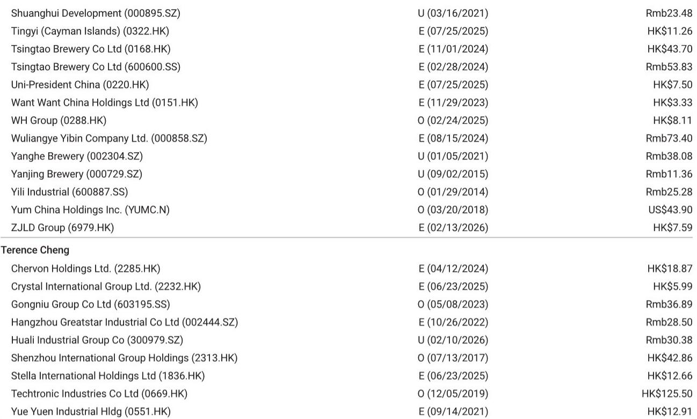

# 中国旅游集团中免：利润率压缩揭示结构性问题，而非仅仅是季度性波动

中国旅游集团中免2026年第二季度初步业绩显示，公司毛利率改善的成果被运营去杠杆和汇兑损失完全抵消，导致营业收入仅下降2%的情况下，营业利润同比下降20%。这并非一个可以等待过去的周期性低谷，而是一个信号：公司基于海南离岛免税高客流量（自4月以来明显放缓）的成本结构，与当前需求环境日益不匹配。第二季度报告营业利润率为8.5%，同比下降1.9个百分点，尤其值得关注的是，这一情况发生在主营业务毛利率扩张1.44个百分点的背景下。产品利润率改善与运营利润率下降之间的差距，是观察者需要理解的核心矛盾。

公司第二季度收入为112亿元人民币，环比走弱符合预期，但利润相对于收入的下降幅度才是关键。收入仅同比下降2%，营业利润却下降20%。这种10倍的经营杠杆效应表明，包括租金、人工和与海南免税零售综合体相关的物流基础设施在内的固定成本，并未随需求下降而灵活调整。其含义明确：公司的盈亏平衡点已经上移，除非需求大幅回升，否则利润率恢复需要结构性成本削减，而不仅仅是销售反弹。

这一利润率压缩的时机尤其棘手，因为它发生在2026年第三季度海南免税销售同比基数较低的时期。如果基础成本结构仍然臃肿，低基数本身无法恢复盈利能力。来自相关旅游行业（酒店和交通）的近期趋势喜忧参半，没有明确信号表明一波被压抑的需求即将拯救公司摆脱当前的利润率轨迹。

## 10倍经营杠杆差距揭示成本结构建立在已不复存在的需求水平之上

数据对比鲜明。2026年第二季度，收入同比下降2%，但营业利润下降20%。这意味着收入每下降1%，营业利润大约下降10%。这种极端的经营杠杆是高固定成本和相对低可变成本企业的典型特征。对于中国旅游集团中免而言，这些固定成本主要嵌入其海南零售布局中。公司在三亚和海口运营大型免税综合体，相关的租金、折旧和人员成本在很大程度上不随月度客流量变化。

当过去几年收入以两位数增长时，这种固定成本基础在上行周期产生了强大的经营杠杆。现在收入增长停滞——公司已连续四个季度收入同比增速低于3%，2026年第二季度是自2024年第四季度以来首次负增长——同样的成本结构在下行周期产生了同样强大的负杠杆。

关键洞察在于，这不是毛利率问题。主营业务毛利率在2026年第二季度实际上同比扩张了1.44个百分点。这表明公司并未被迫进行激进折扣以清理库存，其产品组合或采购效率正在改善。问题完全出在运营费用方面。公司运营费用的相对支出与收入高出10%时大致相同，而这些费用现在消耗了较小收入基础中更大份额。

## 汇兑损失是潜在利润率问题的症状，而非原因

研究报告指出，汇兑损失可以解释部分营业利润率压缩，但完整细节需待8月底中期业绩公布。这是一个重要的注意事项，但不应分散对结构性问题的关注。汇兑损失是公司资产负债表敞口的结果，而非运营效率问题。如果公司持有外币计价资产（可能与其国际奢侈品采购相关），且这些货币对人民币贬值，将产生折算损失。

然而，即使完全剔除汇兑影响，基础运营利润率轨迹仍在恶化。2026年第一季度，公司报告营业利润率为16.5%，同比提升1.5个百分点。到第二季度，该利润率已降至8.5%，环比下降8个百分点。仅凭汇兑损失无法解释一个季度内如此幅度的利润率波动。更可能的解释是，第一季度受益于季节性因素（春节旅行和消费），掩盖了基础利润率疲软，而第二季度更准确地反映了公司正常化的盈利能力。

观察者应关注中期报告中将披露的剔除汇兑后的营业利润率轨迹。如果该利润率低于10%，公司的投入资本回报率将低于资本成本，引发对其当前资产基础可持续性的根本性质疑。

## 对海南的依赖是限制复苏叙事的战略脆弱性

中国旅游集团中免的增长驱动力集中在海南旅游零售市场。当海南受益于离岛免税购物政策和海南自由贸易港逐步开放等政策利好时，这种集中是优势来源。现在它成为脆弱性来源，因为自4月以来海南免税销售增长明显放缓，而更广泛的旅游生态系统（酒店、航空和交通）信号不一。

研究报告引用了关于“香港/中国休闲与住宿：一个极具挑战性的暑假”的相关说明，这凸显了旅游行业更广泛的需求疲软。如果酒店入住率困难，航空公司夏季高峰开局疲软，海南免税店的客流量将面临压力。公司无法将其表现与海南旅游经济的健康状况脱钩。

2026年第三季度较低的同比比较基数为收入稳定提供了一些希望，但这是一种机械效应。即使第三季度收入恢复至持平或温和正增长，除非公司采取积极措施降低成本基础，营业利润率仍将受到压缩。风险在于管理层将低基数视为耐心的理由，而非重组的紧迫性理由。

## 评估利润率恢复路径的决策框架

对于试图评估当前股价47.94港元——较52周高点107.00港元下跌超过50%——是价值机会还是价值陷阱的观察者而言，一个结构化的决策框架是有用的。该框架应关注三个变量：收入轨迹、运营费用灵活性和汇兑敞口。

首先，收入轨迹。关键问题是海南免税销售是否已触及底部，还是将继续下降。酒店和交通的喜忧参半信号表明，明确的底部尚未确立。观察者应监测月度海南免税销售数据、前往海南的航空客运量以及三亚和海口的酒店入住率。如果这些指标在8月和9月显示环比改善，收入基础可能稳定。如果继续走弱，第二季度的收入下降可能是一个更长下行趋势的开始。

其次，运营费用灵活性。公司必须证明其能够削减固定成本基础。这可能涉及与海南零售物业业主重新谈判租金协议、减少人员编制或关闭表现不佳的门店。8月底的中期业绩将首次详细展示管理层是否正在采取这些措施。如果运营费用占收入比例仍高于8%（意味着营业利润率低于10%），将表明管理层尚未解决结构性问题。

第三，汇兑敞口。公司应明确其外币敞口的规模和期限。如果汇兑损失是经常性的且不可预测，它们会增加盈利波动性，使股票难以估值。观察者应要求明确的套期保值策略或减少外币计价资产。

如果所有三个变量都朝着正确方向发展——收入稳定、运营费用削减、汇兑敞口得到管理——公司可能恢复到12-14%的正常化营业利润率，这将支撑当前估值。如果其中任何一个变量进一步恶化，盈利的下行风险将是巨大的。

## 公司情况更新

研究报告对A股估值（2026年预期市盈率32倍）给予Eq5%的折让。A股32倍的目标市盈率比2017年以来的平均水平高出一个标准差，意味着1倍的PEG比率。

这些估值假设是慷慨的。对于一家营业利润下降、业务模式集中且处于需求疲软环境的公司，27倍的市盈率需要盈利大幅复苏。如果2026年每股收益比当前预期低20%或更多——鉴于第二季度的利润率压缩，这是可能的——该股票在正常化盈利基础上的交易市盈率将达到34倍或更高，上行空间有限。

报告中概述的下行风险是相关的：整体宏观环境变化和可支配收入压力、各种零售渠道之间的价格竞争，以及如果政府进一步开放海南和中国大陆免税市场的竞争加剧。这些风险中的每一个都是实质性的，且未完全反映在估值中。上行风险——海南自由贸易区和市内免税的有利政策结果，以及消费支出改善——是可能的，但鉴于当前宏观环境，短期内不太可能实现。

结论是，中国旅游集团中免不是一个简单的价值投资。它是一家面临结构性利润率问题的公司，需要积极的管理干预来解决。2026年第三季度的低同比比较基数可能提供暂时的喘息，但基础成本结构仍与需求环境不匹配。在管理层展示出可信的降低运营费用计划之前，第二季度出现的利润率压缩可能会持续，股票将继续面临压力。

*仅供参考。部分内容可能基于源材料通过AI辅助生成、翻译、总结或编辑，可能存在遗漏或错误。请独立核实。这不构成专业建议。*

仅供参考。部分内容可能基于源材料通过AI辅助生成、翻译、总结或编辑，可能存在遗漏或错误。请独立核实。这不构成专业建议。

