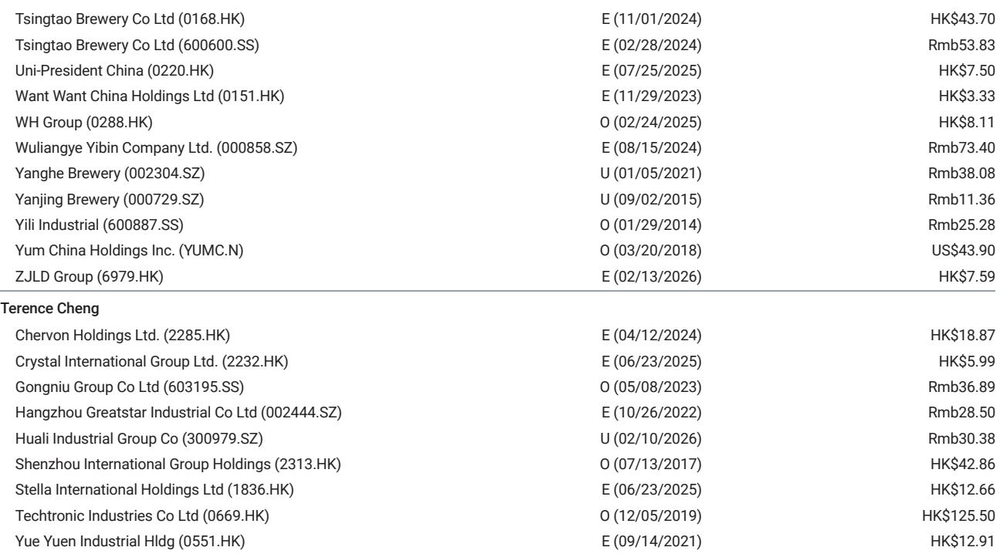
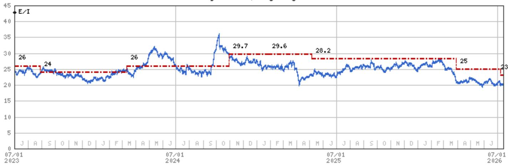
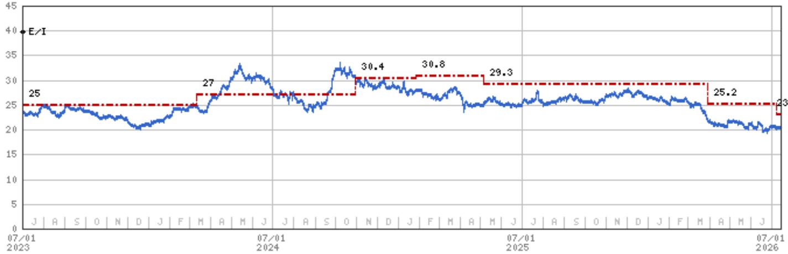

# Haier’s 2Q26 Recovery Is Real, But the Real Test Begins in 3Q26 When China’s Consumer Trend Becomes the Decisive Variable

Haier Smart Home reported a 2Q26 that finally broke the pattern of sequential changes. After a 1Q26 that saw China sales decline and overseas margins adjust, the company delivered a quarter where China residential air conditioner sales grew at a double-digit rate, U.S. revenue declines narrowed by several points, and European operations achieved high-single-digit top-line growth. The most important signal, however, is not the quarter itself. It is the fact that the improvement was driven by channel restocking ahead of price adjustments, summer seasonality, and new SKU launches—not by an organic recovery in end-consumer demand. That distinction matters because it shifts the focus to 3Q26.

Management has maintained its full-year 2026 target of mid-single-digit growth for both sales and net profit. After a 1Q26 that likely fell short of that trajectory, and a 2Q26 that merely stabilized, the second half must deliver the acceleration. The company’s own guidance implies that 3Q26 and 4Q26 will need to show meaningfully stronger momentum than the first half. Whether that materializes depends on three variables: the sustainability of China’s home appliance subsidy cycle, the pace of tariff cost mitigation in the United States, and the scalability of margin improvement in Europe.

## Haier’s China Business Is Stabilizing, But the Recovery Is Driven by Timing Tactics, Not Structural Demand

The improvement in Haier’s 2Q26 China performance is real but requires careful interpretation. Residential air conditioner sales grew at a double-digit rate, and commercial air conditioner sales grew at a mid-single-digit rate. Refrigerators and washing machines narrowed their year-on-year declines to mid-single digits. On the surface, this looks like a broad-based recovery.

The underlying mechanism, however, is more tactical than structural. The air conditioner growth was led by new SKU launches at attractive price points combined with aggressive channel restocking ahead of the summer peak season and before announced price adjustments. This is a classic pull-forward dynamic: distributors bought inventory in anticipation of higher future prices and seasonal demand. The subsidy rollout for refrigerators and washing machines provided a similar one-time boost. These are timing catalysts, not evidence that Chinese consumers have suddenly increased their willingness to spend on large appliances.

The implication for observers is that 3Q26 will be the real test. If the restocking wave fades and end-demand does not follow, Haier’s China business could revert to the low-single-digit or flat trajectory that characterized the first half. The company itself noted that competition remains intense but is shifting from pricing toward cost management. That shift is a positive sign for margins, but it also confirms that demand is not strong enough to support price increases. Haier is effectively competing on cost efficiency rather than brand pricing power in its home market.

## The U.S. Tariff Mitigation Plan Is Credible, But the Margin Impact Will Be Gradual and Back-End Loaded

Haier’s U.S. business saw its top-line decline narrow to mid-single digits in 2Q26, an improvement from the sharper drop in 1Q26. The more significant development, however, is the company’s detailed plan to reduce its exposure to Chinese production for the U.S. market.

Currently, approximately 10% of Haier’s U.S. sales are sourced from Chinese factories. The company plans to reduce that share to a single-digit percentage by 2027. The mechanism is a combination of a new factory in Thailand and expanded local production in the United States. The financial impact is already measurable: Haier estimates that its tariff cost reduction will be approximately USD 10 million to USD 20 million per quarter after the production shift takes effect.

This is a strategically sound plan, but its margin contribution will be gradual. The USD 10 million to USD 20 million quarterly savings, while meaningful, must be weighed against the USD 3 billion investment commitment Haier has made for U.S. facility renovation and R&D over the next five years. The company is targeting flat operating profit margin year-on-year in 2026 for the U.S. business, with a 20 to 30 basis point improvement per annum thereafter. That trajectory is achievable, but it implies that U.S. margin expansion will be a multi-year story, not a near-term catalyst.

The critical question for 3Q26 is whether the U.S. top-line decline can continue to narrow. If consumer spending on home appliances remains under pressure in the U.S., even a successful tariff mitigation strategy will not prevent revenue stagnation. The production shift protects margins, but it does not create demand.

## Europe Is Haier’s Most Encouraging Growth Story, But Margin Expansion Requires Scale and Localization

Among Haier’s major regions, Europe stands out as the most structurally positive. The region delivered high-single-digit sales growth in 2Q26, with HVAC products—which now represent approximately 20% of European white goods sales—growing at a double-digit rate year-to-date.

The European opportunity is not just about top-line growth. Haier is targeting an operating profit margin of approximately 2% for 2026, compared to a break-even level in 2025. That improvement, while modest in absolute terms, represents a significant operational inflection. The company is accelerating R&D spending to launch more localized products tailored to European consumer preferences, which should support both volume growth and pricing power.

The risk is that European margin expansion depends on continued volume growth to absorb fixed costs. If the European economy slows or if competition from local brands intensifies, Haier may find it difficult to reach its 2% margin target. The high-single-digit growth rate in 2Q26 is encouraging, but it must be sustained through the second half of the year to give management confidence that the margin trajectory is on track.

## Emerging Markets Provide a Diversification Buffer That Reduces Haier’s Reliance on Any Single Region

Haier’s emerging markets segment delivered double-digit top-line growth in 2Q26, maintaining the momentum that has been a consistent feature of the company’s recent performance. This segment includes markets in Southeast Asia, South Asia, the Middle East, and Africa, where Haier has been investing in distribution and brand-building.

The importance of emerging markets is not just the growth rate itself, but the diversification it provides. Unlike the U.S. business, which is exposed to tariff risk and consumer spending cycles, and unlike the China business, which is dependent on subsidy timing and property market trends, the emerging markets segment is driven by penetration gains and urbanization. These are structural drivers that are less sensitive to quarterly macro fluctuations.

For Haier, maintaining double-digit growth in emerging markets is critical to achieving its full-year mid-single-digit sales target. If China or the U.S. face challenges in the second half, the emerging markets segment can partially offset the shortfall. The risk is that emerging market margins are typically lower than developed market margins, so rapid growth in this segment can dilute overall profitability if not managed carefully.

## A Decision Framework for Evaluating Haier’s Second-Half Trajectory

For those tracking Haier through the remainder of 2026, the following framework provides a structured way to assess whether the company will achieve its mid-single-digit growth target.

The first variable is China subsidy sustainability. The 2Q26 improvement was partly driven by government subsidies for refrigerators and washing machines. If these subsidies are extended or expanded in 3Q26, the recovery could continue. If they expire or are not renewed, the risk of a sequential slowdown is high. The second variable is U.S. demand stabilization. Haier’s U.S. business is benefiting from tariff mitigation, but top-line growth depends on whether the U.S. consumer appliance market returns to positive territory. Watch for industry-level U.S. appliance shipment data as a lead indicator. The third variable is European margin execution. The 2% OPM target for 2026 is achievable, but it requires that the high-single-digit revenue growth rate is maintained and that R&D spending does not outpace revenue gains. The fourth variable is emerging market momentum. Double-digit growth in this segment is the most reliable component of Haier’s overall revenue trajectory. Any deceleration here would be a notable signal, as it would indicate that even structural growth markets are slowing.

Management has maintained its payout ratio guidance of 58% for 2026 and 60% for 2027-2028, which signals confidence in cash flow generation. The dividend yield, projected at 6.0% for 2026, provides a reference point for the company’s valuation. But the narrative for the remainder of the year hinges on whether the 2Q26 improvement was the beginning of a sustained recovery or a one-time benefit from channel restocking and seasonality. The answer will become clear in 3Q26.

*For informational purposes only. Portions may be generated, translated, summarized, or edited with AI assistance based on source materials and may contain omissions or errors. Please verify independently. This is not professional advice.*

For informational purposes only. Portions may be generated, translated, summarized, or edited with AI assistance based on source materials and may contain omissions or errors. Please verify independently. This is not professional advice.

