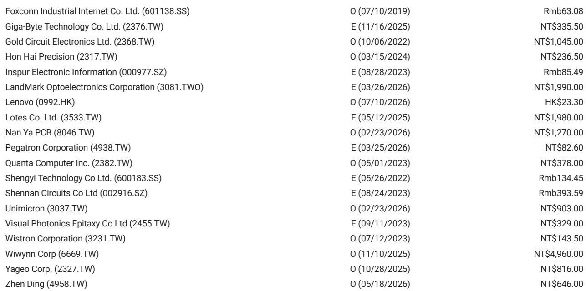
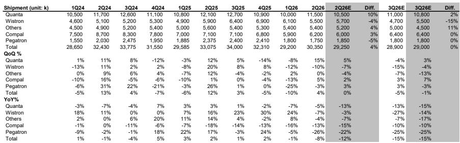
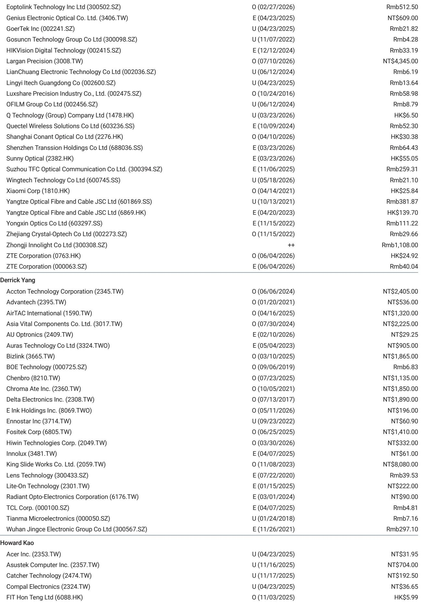

# MS：大中华科技硬件月度数据，6月出货超预期10%

笔记本供应链在6月经历了一轮季度末冲量，但这份来自MS的月度追踪报告揭示了一个更值得关注的信号：三季度出货预期正走向逆季节性调整。

五大ODM厂商6月合计出货1200万台，环比增长29%，同比仍下降8%，但比MS自己的预期高出10%。这组数字本身不算差，问题在于7月的预估值——MS预计7月笔记本出货将降至860万台，环比下降28%，同比下降20%。季度末拉货效应过后，需求能否持续，是当前供应链面临的核心观察点。

报告维持三季度笔记本出货预估在2890万台不变，环比下降5%，同比下降15%。这个环比变化值得细看：过去15年三季度出货的平均季节性环比增幅是+5%，而当前预估是-5%，两者之间差了10个百分点。换句话说，即便维持预估不变，隐含的假设已经是需求表现与历史均值存在差异。

## 1. 组件瓶颈仍在压制低端机型出货

出货低于季节性的直接原因，报告指向组件供应限制。MS在调研中持续听到供应链反馈，组件约束仍然是关键瓶颈，且正在迫使ODM优先生产高毛利的高端机型，低端笔记本的产能受到挤压。

这一判断有两层含义。其一，组件短缺并非全面性的，而是结构性偏向低端市场。其二，ODM在产能分配上已经做出取舍——保利润、压规模。这意味着三季度出货量可能继续受低端机型影响，而高端机型的占比提升，会在一定程度上对冲出货量变化对营收的影响。

> **KC评论：** 组件约束不是新故事，但报告强调它正在改变ODM的产品组合结构。读者在跟踪出货量之外，应关注平均单价和产品组合的变化，后者可能比总量更能反映供应链的真实盈利状况。

## 2. 二季度超预期，但三季度指引仍偏保守

二季度整体出货3040万台，环比增长4%，同比下降8%，比MS预期高出4%。这个超预期主要来自6月的集中拉货，而非需求端的持续改善。

报告预计ODM将在8月初的二季度财报电话会上给出三季度出货的量化指引。在此之前，MS维持的2890万台预估，实际上已经隐含了对需求端相对谨慎的判断。如果ODM自身的指引低于这个数字，市场可能需要进一步调整预期。

## 3. 观察框架：从总量转向节奏与结构

这份报告提供了一个可复用的观察框架。对于笔记本供应链的跟踪，有三个维度值得持续关注

第一是出货节奏。季度末冲量后次月的大幅回落，已经成为近几个季度的常态模式。7月环比下降28%的预估，本质上是对6月透支效应的消化。第二是同比变化。6月同比-8%与7月预估的-20%之间，差距主要来自基数效应——去年同期的出货节奏不同。第三是产品结构。组件约束下ODM优先保高端，意味着低端机型的出货占比可能持续调整，这会影响整条供应链的订单分配。

这三个维度合在一起，指向一个判断：当前笔记本市场的核心关注点不是需求总量，而是供给端的结构性错配和季度节奏的波动。总量数据容易掩盖这些细节。

For informational purposes only. Portions may be generated,translated,summarized,or edited with AI assistance based on source materials and may contain omissions or errors. Please verify independently. This is not investment,legal,tax,accounting,or other professional advice.

For informational purposes only. Portions may be generated,translated,summarized,or edited with AI assistance based on source materials and may contain omissions or errors. Please verify independently. This is not investment,legal,tax,accounting,or other professional advice.

