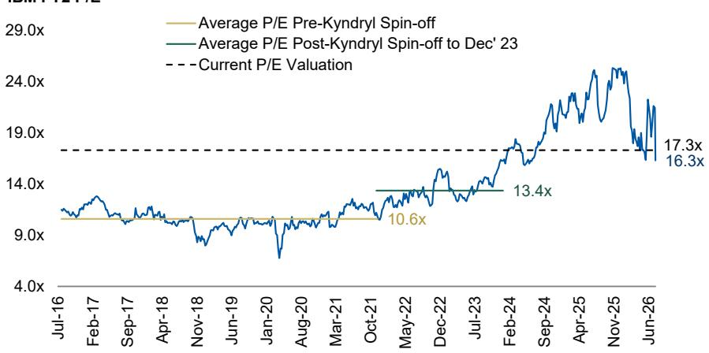
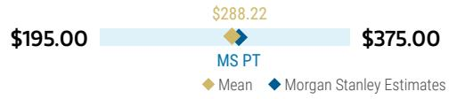
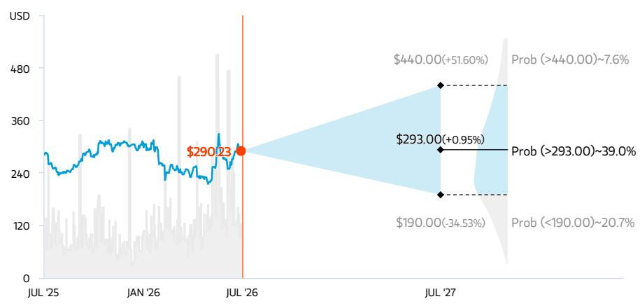
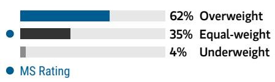
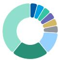
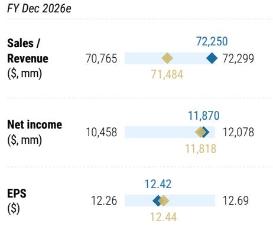

July 14, 2026 06:12 PM GMT

IBM | North America

# 资本支出优先级调整——5个关键要点

IBM观察到企业在第二季度将资本支出预算重新优先分配给支出瓶颈领域——具体而言，是快速膨胀的企业服务器/存储产品，代价是牺牲了大型机硬件、TP、数据和自动化软件。这一趋势的持续性将是IBM未来需要关注的风险。

## 关键要点

第二季度收入比MSe低5%，软件和基础设施均未达预期，咨询业务符合预期。不利的产品组合导致毛利率未达预期，但成本举措保护了PTI利润率。

- 本季度面临挑战的业务：IBM Z、交易处理、数据和自动化软件。表现稳健的业务：RHT同比增长11%，HashiCorp和Confluent。

IBM认为第二季度的动态是资本支出决策的短期优化，而非普遍趋势。第二季度的缺口主要源于几笔大交易的延迟。

■ 对企业服务器/存储和HDD支出强度的方向性确认——CDW、DELL、HPE、INGM、NTAP、P、SNX、STX（首选）、WDC。

■ 报价的底部在哪里？使用日内倍数，我们的回归自由现金流方法指向207美元；SOTP指向164-219美元。问题在于什么是合适的EPS/自由现金流基数。

这是一个关于内存“超级周期”如何降低广泛支出类别优先级的例子。在与管理层沟通后——今天负面预警的高层原因很明确。客户在本季度进行大额资本支出采购时，将内存密集型存储和服务器视为更高的支出优先级——因此缩减了在大型机硬件、交易处理、数据和自动化软件方面的ELA采购，推迟了通常在本季度末完成的交易。如果这个问题——内存通胀导致企业计算/存储支出的重新优先级排序——仅限于第二季度，我们可以观察今天的报价变动并推测负面风险事件已经过去。但正如我们在《IT硬件：企业计算短缺——提前还是范式转变？》中所论述的，内存价格被视为一个结构性/多年期的因素，企业因此持续提前进行计算/存储支出，这意味着同样类型的资本支出重新优先级排序理论上可能在2026年下半年及2027年再次发生。此外，我们想指出，尽管股价日内下跌25%，但IBM在215美元的水平交易，回到了2026年5月中旬的位置，尽管基本面可能刚刚有所下降。因此，很难将今天视为报价的底部。我们将在下周的财报中了解更多信息，但我们不会对股价短期内保持疲软感到惊讶，原因在于（1）内存因素的持续性，以及（2）如果这种支出转变持续时间更长，可能对IBM支出产生的广泛影响。以下分享5个关键想法和影响。

<table><tr><td colspan="2">MS & CO. LLC</td></tr><tr><td colspan="2">Erik W Woodring</td></tr><tr><td colspan="2">股票分析师</td></tr><tr><td>Erik.Woodring@morganstanley.com</td><td>+1 212 296-8083</td></tr><tr><td colspan="2">Rauf Ural</td></tr><tr><td colspan="2">研究助理</td></tr><tr><td>Rauf.Ural@morganstanley.com</td><td>+1 212 761-5958</td></tr><tr><td colspan="2">Maya C Neuman</td></tr><tr><td colspan="2">研究助理</td></tr><tr><td>Maya.Neuman@morganstanley.com</td><td>+1 212 761-1946</td></tr><tr><td colspan="2">Dylan Liu</td></tr><tr><td colspan="2">研究助理</td></tr><tr><td>Dylan.Liu@morganstanley.com</td><td>+1 212 761-4519</td></tr></table>

<table><tr><td>股票评级</td><td>中性</td></tr><tr><td>行业观点</td><td>谨慎</td></tr><tr><td>目标价</td><td>$293.00</td></tr><tr><td>股价，收盘价（2026年7月13日）</td><td>$290.23</td></tr><tr><td>市值，当前（百万）</td><td>$276,858</td></tr><tr><td>52周范围</td><td>$332.41-212.35</td></tr></table>

<table><tr><td>财年截止</td><td>12/25</td><td>12/26e</td><td>12/27e</td><td>12/28e</td></tr><tr><td>每股收益（$）§</td><td>11.35</td><td>12.44</td><td>13.44</td><td>14.75</td></tr><tr><td>市盈率</td><td>25.6</td><td>23.4</td><td>22.1</td><td>19.8</td></tr><tr><td>股息率（%）</td><td>2.3</td><td>2.3</td><td>2.3</td><td>2.3</td></tr><tr><td>每股收益（$）**</td><td>11.58</td><td>12.42</td><td>13.14</td><td>14.66</td></tr><tr><td>先前每股收益（$）**</td><td>-</td><td>-</td><td>-</td><td>-</td></tr></table>

除非另有说明，所有指标均基于MS ModelWare框架
§ = 共识数据由Refinitiv Estimates提供
\*\* = 基于共识方法
e = MS估计

- 第二季度数据概览。根据第二季度预警，总收入172亿美元比MSe的182亿美元低5%。软件收入同比增长5%，比MSe的11%低5亿美元；咨询收入基本符合MSe，同比增长1%（固定汇率）；基础设施同比下降7%，比MSe的+2%低近4亿美元。鉴于大型机和TP是高利润率业务，IBM第二季度毛利率未达预期130个基点，但利用成本削减举措将PTI利润率维持在19.2%。最终，第二季度每股收益比MSe（3.08美元）低5%，比市场预期（3.01美元）低3%。

- 这对第二季度（或全年）部分业务关键绩效指标意味着什么。根据我们与读者关系团队的沟通，我们估计IBM Z收入在第二季度同比下降40-50%。RHT同比增长11%是一个积极惊喜，但作为ELA一部分购买的数据、自动化和交易处理业务弱于预期。我们怀疑TP在第二季度可能同比下降约10%（考虑到70%年金/30%交易的分成，TP的交易部分可能同比下降近50%）。鉴于管理层对HashiCorp和Confluent本季度表现的积极评论，软件业务在第二季度的疲软似乎完全是内生性的，因此本季度的内生软件增长可能接近0%同比增长。从内生角度看，这意味着IBM第二季度的总收入增长在几个季度以来首次出现同比负增长。最后，2026年上半年的自由现金流为48亿美元，同比持平。在2023年（z周期的同一时点），上半年自由现金流占全年自由现金流的31%。假设今年季节性相似，将意味着2026年自由现金流为155亿美元，低于约157亿美元的指引。

- 对第二季度Power/存储表现优于预期的方向性正确——对企业计算和存储实力的积极解读/确认。我们第二季度预览的部分论点在本季度得到验证，分布式基础设施增长强劲，同比增长37%。如果没有大型机的疲软，这将推动基础设施在本季度实现超预期。尽管如此，我们认为第二季度基础设施支出的强劲是对企业服务器和存储支出的积极解读，目前这些领域的需求缺乏弹性，并正在占据IT预算份额。直接受益者：DELL、HPE、P、NTAP、SNX、CDW和INGM。间接受益者：STX（我们的首选）和WDC。

- 从IBM听到的定性信息。IBM的观点是，第二季度末（“季度内的几天”）出现了资本支出的短期优化，将支出重新优先分配给Power和存储。这主要影响了ELA/3年资本支出采购。读者关系团队明确表示——他们认为第二季度大型机的未达预期与2025年任何需求提前无关，本季度也未观察到任何大型机迁移。他们指出了其他支出强劲的领域——RedHat、Confluent、HashiCorp——作为证据，表明这个问题仅限于通过ELA购买的产品。但他们也指出，通过ELA购买的TP的疲软，超过了先前z17部署可能带来的滞后容量增长对TP的潜在益处。IBM团队仍在梳理管道（质量/规模），并审查延迟的交易等，以确定资本支出重新优先级排序的任何更广泛影响。

- 今天的估值水平以及报价的潜在底部。将第二季度每股收益未达预期纳入我们的模型，假设下半年展望不变（如果第二季度的不利因素持续，我们认为存在下行风险），我们的2026年每股收益降至12.27美元。在215美元的水平，这意味着IBM的交易价格约为2026年每股收益的17-18倍，接近2024年7月前的水平。修正我们的回归自由现金流估值并移除PANW等更高增长/估值的同行，意味着目标价为207美元（12.5倍价格/自由现金流），而我们的分部加总分析意味着估值在164美元（含25%综合企业折扣）和219美元之间，使用日内同行倍数。但需要明确的是，我们在这些分析中并未假设2026年自由现金流/每股收益减少，这将使这些估值更低。

预警后我们仍存在的问题。（1）这种支出重新优先级排序的风险是否不仅限于第二季度/如果内存短缺/通胀持续，是否会延续到2026年下半年？（2）当提到“采取新举措并加速其他举措”以解决本季度的挑战时，这具体意味着什么？（3）如果现有客户仍在利用处理能力，为什么交易处理会受到如此大的影响？换句话说，为什么TP收入会下降而不是更温和地增长？（4）我们应该如何看待今年的自由现金流线性分布，以及您有哪些可能的抵消措施来保护2026年自由现金流？（5）鉴于咨询业务季度表现相对符合预期，咨询积压订单、预订/开票的最新情况如何？（6）您能否更详细地提供关于本季度行业范围网络安全担忧造成干扰的评论？

图表1：IBM目前交易于17.3倍市盈率，较4月中旬估值下降约2倍。
IBM FY2 市盈率

来源：FactSet, MS

## 风险回报 – IBM (IBM.N)

中性评级平衡历史高估值与量子计算期权价值

## 目标价 $293.00

我们293美元的目标价反映了2026年自由现金流每股16.55美元的17.7倍价格/自由现金流倍数，并意味着IBM在增长调整后的基础上与软件和咨询同行交易一致。

共识目标价分布

来源：Refinitiv, MS

## 风险回报图表及期权隐含概率（12个月）

关键：— 历史股价表现 ● 当前股价 ◆ 目标价

来源：Refinitiv, MS, MS Institutional Equities Division。我们牛市、基准和熊市情景的概率是使用截至2026年7月13日期权市场的隐含波动率数据估算的。所有数字均为股价在三个月或一年时间内达到情景价格以上的近似风险中性概率。在此查看期权概率方法说明

## 中性评级论点

IBM近年来因推动更一致的业绩表现以及将业务组合转向更多经常性软件和服务而获得认可。收购HashiCorp结合大型机/ELA周期，导致2025年增长加速，但也带来了2026年增长放缓的风险。这一风险以及其他因素支撑了我们293美元的目标价。然而，市场显然也关注量子计算，鉴于纯量子计算公司估值的重新评估，IBM在量子计算领域的早期领导地位具有上行期权价值。平衡这些事实是我们给予中性评级的原因，执行不力是主要的看跌风险。

来源：Refinitiv, MS

## 风险回报主题

<table><tr><td>新数据时代：</td><td>正面</td></tr><tr><td>定价能力：</td><td>正面</td></tr><tr><td>技术扩散：</td><td>正面</td></tr></table>

在此查看风险回报主题说明

## 牛市情景

$440.00

## 25.3倍 价格/自由现金流 2026年每股$17.38（扣除应收款）

IBM量子计算对模型变得更加重要。普遍共识是IBM在生成式AI和量子计算领域占有一席之地，客户赢单/收入超出预期。IBM加速咨询和软件增长，核心业务竞争地位改善。此外，量子计算在我们的基准情景估值基础上增加了1800亿美元的企业价值，因此股价重新评估至2026年自由现金流每股17.38美元的25.5倍。

## 基准情景

## $293.00 熊市情景

17.7倍 价格/自由现金流 2026年每股$16.55（扣除应收款）

稳定的基本面推动2026年固定汇率收入同比增长6%，自由现金流同比增长8%。咨询业务因IT服务复苏迹象和低基数效应，固定汇率同比增长2.2%；软件因2026年ELA周期续约延长，固定汇率同比增长11.2%；基础设施固定汇率同比增长0.8%。AI咨询预订逐渐对咨询收入增长产生增量贡献。我们预测固定汇率收入同比增长6%。我们以2026年自由现金流每股16.55美元的17.7倍估值IBM。

$190.00

11.8倍 价格/自由现金流 2026年每股$16.05（扣除应收款）

宏观环境挑战导致预算削减，IBM 2026年固定汇率自由现金流同比增长4%。RHT增长因份额流失而放缓，软件领域的收购未能提升产品组合相关性，导致核心增长减速快于预期。2026年ELA周期也未能实现。IT服务支出因执行不力未能反弹，导致咨询收入下降。由于新大型机对企业相关性降低，大型机支出大幅削减。

## 风险回报 – IBM (IBM.N)

## 关键盈利输入

<table><tr><td>驱动因素</td><td>2025年12月</td><td>2026年12月e</td><td>2027年12月e</td><td>2028年12月e</td></tr><tr><td>固定汇率收入增长（同比）（%）</td><td>6.1</td><td>6.3</td><td>4.0</td><td>6.3</td></tr><tr><td>软件固定汇率收入增长（同比）（%）</td><td>9.1</td><td>11.3</td><td>8.9</td><td>0.0</td></tr><tr><td>PTI利润率（同比）（%）</td><td>20.683</td><td>19.504</td><td>20.047</td><td>0.000</td></tr><tr><td>自由现金流增长（同比）（%）</td><td>15.6</td><td>7.7</td><td>6.7</td><td>11.1</td></tr></table>

## 投资驱动因素

• (+) 持续/多年收入增长

• (+) 战略剥离和/或收购

• (+) 自由现金流正面惊喜

\- (-) 软件/咨询增长低于中期模型减速

• (-) 利润率对盈利和自由现金流构成压力

## 全球收入分布

<table><tr><td rowspan="9"></td><td>0-10%</td><td>亚太（除日本、中国大陆和印度）</td></tr><tr><td>0-10%</td><td>印度</td></tr><tr><td>0-10%</td><td>日本</td></tr><tr><td>0-10%</td><td>拉丁美洲</td></tr><tr><td>0-10%</td><td>中东和非洲</td></tr><tr><td>0-10%</td><td>英国</td></tr><tr><td>10-20%</td><td>中国大陆</td></tr><tr><td>20-30%</td><td>欧洲（除英国）</td></tr><tr><td>40-50%</td><td>北美</td></tr></table>

来源：MS估计 在此查看区域层级说明

## MS ALPHA 模型

<table><tr><td>3/5最佳</td><td>24个月展望</td><td>2/5最多</td><td>3个月展望</td></tr></table>

来源：Refinitiv, FactSet, MS；1为最高偏好五分位，5为最低偏好五分位

## 目标价/评级风险

## 上行风险

• 生成式AI的强劲为软件和咨询增加增量增长

\- 咨询增长正面惊喜

• 增量并购加速增长

\- IBM自由现金流超预期

• 量子计算商业成功得到验证

## 下行风险

• 宏观扰动导致交易延长

\- 本地部署软件加速被替代

• AI蚕食/颠覆核心咨询

• 内生软件增长低于7%目标

\- 缺乏并购贡献

## 持仓情况

<table><tr><td>机构持有人，主动占比</td><td>41.1%</td><td></td></tr><tr><td>对冲基金行业多空比</td><td>2.1倍</td><td></td></tr><tr><td>对冲基金行业净敞口</td><td>29.5%</td><td></td></tr></table>

MS估计 vs. 共识
2026年12月财年

Refinitiv; MSPB内容。包含与MSPB持有的某些对冲基金敞口。信息可能与更广泛的市场趋势不一致或无法反映。多空比 = 多头敞口 / 空头敞口。行业占总净敞口百分比 = （对于特定行业：多头敞口 - 空头敞口）/（跨所有行业：多头敞口 - 空头敞口）。

◆ 均值 ◆ MS估计
来源：Refinitiv, MS

## IBM 财务模型

图表2：IBM 利润表

<table><tr><td rowspan="2">（百万美元）</td><td colspan="4">2025A</td><td colspan="4">2026E</td><td colspan="4">2027E</td></tr><tr><td>2025年3月</td><td>2025年6月</td><td>2025年9月</td><td>2025年12月</td><td>2026年3月</td><td>2026年6月</td><td>2026年9月</td><td>2026年12月</td><td>2027年3月</td><td>2027年6月</td><td>2027年9月</td><td>2027年12月</td></tr><tr><td>收入</td><td>8,469</td><td>16,977</td><td>16,331</td><td>19,685</td><td>15,918</td><td>18,147</td><td>17,482</td><td>20,703</td><td>16,578</td><td>18,748</td><td>17,977</td><td>21,177</td></tr><tr><td>软件</td><td>263</td><td>7,387</td><td>7,209</td><td>9,031</td><td>7,052</td><td>8,294</td><td>8,196</td><td>10,028</td><td>7,786</td><td>8,953</td><td>8,826</td><td>10,698</td></tr><tr><td>咨询</td><td>5,068</td><td>5,315</td><td>5,324</td><td>5,348</td><td>5,272</td><td>5,436</td><td>5,489</td><td>5,567</td><td>5,447</td><td>5,664</td><td>5,604</td><td>5,700</td></tr><tr><td>基础设施</td><td>2,886</td><td>4,141</td><td>3,559</td><td>5,132</td><td>3,326</td><td>4,211</td><td>3,556</td><td>4,888</td><td>3,111</td><td>3,947</td><td>3,330</td><td>4,583</td></tr><tr><td>融资</td><td>191</td><td>166</td><td>200</td><td>179</td><td>220</td><td>168</td><td>202</td><td>181</td><td>209</td><td>159</td><td>192</td><td>172</td></tr><tr><td>其他</td><td>61</td><td>(32)</td><td>39</td><td>(5)</td><td>48</td><td>39</td><td>39</td><td>39</td><td>25</td><td>25</td><td>25</td><td>25</td></tr><tr><td>收入成本</td><td>237</td><td>6,775</td><td>6,740</td><td>7,526</td><td>6,731</td><td>7,123</td><td>7,041</td><td>7,836</td><td>6,823</td><td>7,258</td><td>7,090</td><td>7,881</td></tr><tr><td>软件</td><td>43</td><td>1,189</td><td>1,218</td><td>1,499</td><td>1,213</td><td>1,360</td><td>1,381</td><td>1,655</td><td>1,324</td><td>1,450</td><td>1,470</td><td>1,744</td></tr><tr><td>咨询</td><td>3,684</td><td>3,853</td><td>3,764</td><td>3,829</td><td>3,822</td><td>3,936</td><td>3,875</td><td>3,980</td><td>3,949</td><td>4,101</td><td>3,956</td><td>4,075</td></tr><tr><td>基础设施</td><td>1,362</td><td>1,594</td><td>1,523</td><td>2,022</td><td>1,434</td><td>1,625</td><td>1,565</td><td>1,990</td><td>1,356</td><td>1,543</td><td>1,482</td><td>1,888</td></tr><tr><td>融资</td><td>104</td><td>90</td><td>109</td><td>100</td><td>125</td><td>93</td><td>112</td><td>103</td><td>119</td><td>89</td><td>107</td><td>99</td></tr><tr><td>其他</td><td>(4,956)</td><td>48</td><td>126</td><td>76</td><td>138</td><td>109</td><td>109</td><td>109</td><td>75</td><td>75</td><td>75</td><td>75</td></tr><tr><td>毛利润</td><td>8,232</td><td>10,202</td><td>9,591</td><td>12,159</td><td>9,187</td><td>11,024</td><td>10,440</td><td>12,867</td><td>9,754</td><td>11,490</td><td>10,887</td><td>13,297</td></tr><tr><td>毛利率</td><td>97.2%</td><td>60.1%</td><td>58.7%</td><td>61.8%</td><td>57.7%</td><td>60.7%</td><td>59.7%</td><td>62.1%</td><td>58.8%</td><td>61.3%</td><td>60.6%</td><td>62.8%</td></tr><tr><td>软件</td><td>220</td><td>6,198</td><td>5,991</td><td>7,532</td><td>5,839</td><td>6,934</td><td>6,815</td><td>8,373</td><td>6,462</td><td>7,502</td><td>7,357</td><td>8,954</td></tr><tr><td>咨询</td><td>1,384</td><td>1,462</td><td>1,560</td><td>1,519</td><td>1,450</td><td>1,500</td><td>1,614</td><td>1,587</td><td>1,498</td><td>1,563</td><td>1,648</td><td>1,624</td></tr><tr><td>基础设施</td><td>1,524</td><td>2,547</td><td>2,036</td><td>3,110</td><td>1,892</td><td>2,586</td><td>1,991</td><td>2,899</td><td>1,754</td><td>2,403</td><td>1,848</td><td>2,695</td></tr><tr><td>融资</td><td>87</td><td>76</td><td>91</td><td>79</td><td>95</td><td>75</td><td>90</td><td>78</td><td>90</td><td>70</td><td>85</td><td>73</td></tr><tr><td>其他</td><td>5,017</td><td>(80)</td><td>(87)</td><td>(81)</td><td>(90)</td><td>(70)</td><td>(70)</td><td>(70)</td><td>(50)</td><td>(50)</td><td>(50)</td><td>(50)</td></tr><tr><td>运营费用</td><td>6,226</td><td>6,561</td><td>6,257</td><td>7,010</td><td>6,683</td><td>7,123</td><td>6,853</td><td>7,267</td><td>7,128</td><td>7,405</td><td>6,957</td><td>7,793</td></tr><tr><td>销售、一般及行政费用</td><td>4,533</td><td>4,679</td><td>4,394</td><td>5,100</td><td>4,682</td><td>4,963</td><td>4,563</td><td>4,886</td><td>4,973</td><td>4,968</td><td>4,620</td><td>5,040</td></tr><tr><td>研发</td><td>1,946</td><td>2,097</td><td>2,082</td><td>2,187</td><td>2,173</td><td>2,432</td><td>2,552</td><td>2,691</td><td>2,404</td><td>2,718</td><td>2,607</td><td>3,071</td></tr><tr><td>知识产权收入</td><td>253</td><td>215</td><td>219</td><td>277</td><td>172</td><td>272</td><td>262</td><td>311</td><td>249</td><td>281</td><td>270</td><td>318</td></tr><tr><td>营业利润（PTOP）</td><td>2,006</td><td>3,641</td><td>3,334</td><td>5,149</td><td>2,504</td><td>3,902</td><td>3,587</td><td>5,600</td><td>2,626</td><td>4,084</td><td>3,930</td><td>5,503</td></tr><tr><td>PTOP利润率</td><td>23.7%</td><td>21.4%</td><td>20.4%</td><td>26.2%</td><td>15.7%</td><td>21.5%</td><td>20.5%</td><td>27.0%</td><td>15.8%</td><td>21.8%</td><td>21.9%</td><td>26.0%</td></tr><tr><td>利息收入（费用）净额</td><td>(268)</td><td>(445)</td><td>(301)</td><td>(404)</td><td>(375)</td><td>(409)</td><td>(378)</td><td>(340)</td><td>(336)</td><td>(314)</td><td>(298)</td><td>(264)</td></tr><tr><td>利息收入</td><td>-</td><td>-</td><td>-</td><td>-</td><td>-</td><td>-</td><td>-</td><td>-</td><td>-</td><td>-</td><td>-</td><td>-</td></tr><tr><td>其他收入</td><td>187</td><td>65</td><td>191</td><td>74</td><td>98</td><td>109</td><td>122</td><td>145</td><td>133</td><td>150</td><td>162</td><td>191</td></tr><tr><td>利息费用</td><td>455</td><td>510</td><td>492</td><td>478</td><td>473</td><td>518</td><td>500</td><td>484</td><td>469</td><td>464</td><td>459</td><td>455</td></tr><tr><td>税前收入</td><td>1,738</td><td>3,196</td><td>3,033</td><td>4,745</td><td>2,129</td><td>3,492</td><td>3,210</td><td>5,260</td><td>2,289</td><td>3,770</td><td>3,632</td><td>5,239</td></tr><tr><td>PTI利润率</td><td>20.5%</td><td>18.8%</td><td>18.6%</td><td>24.1%</td><td>13.4%</td><td>19.2%</td><td>18.4%</td><td>25.4%</td><td>13.8%</td><td>20.1%</td><td>20.2%</td><td>24.7%</td></tr><tr><td>GAAP所得税准备</td><td>103</td><td>404</td><td>686</td><td>(1,435)</td><td>172</td><td>493</td><td>447</td><td>775</td><td>283</td><td>505</td><td>484</td><td>725</td></tr><tr><td>经常性所得税准备</td><td>221</td><td>545</td><td>516</td><td>438</td><td>308</td><td>559</td><td>514</td><td>842</td><td>343</td><td>565</td><td>545</td><td>786</td></tr><tr><td>有效税率</td><td>12.7%</td><td>17.1%</td><td>17.0%</td><td>9.2%</td><td>14.5%</td><td>16.0%</td><td>16.0%</td><td>16.0%</td><td>15.0%</td><td>15.0%</td><td>15.0%</td><td>15.0%</td></tr><tr><td>法定税率</td><td>21.0%</td><td>21.0%</td><td>21.0%</td><td>21.0%</td><td>21.0%</td><td>21.0%</td><td>21.0%</td><td>21.0%</td><td>21.0%</td><td>21.0%</td><td>21.0%</td><td>21.0%</td></tr><tr><td>营业净利润</td><td>1,517</td><td>2,651</td><td>2,517</td><td>4,307</td><td>1,821</td><td>2,934</td><td>2,696</td><td>4,419</td><td>1,946</td><td>3,204</td><td>3,087</td><td>4,453</td></tr><tr><td>营业净利润率</td><td>17.9%</td><td>15.6%</td><td>15.4%</td><td>21.9%</td><td>11.4%</td><td>16.2%</td><td>15.4%</td><td>21.3%</td><td>11.7%</td><td>17.1%</td><td>17.2%</td><td>21.0%</td></tr><tr><td>一次性（收益）/费用，税后净额</td><td>462</td><td>459</td><td>773</td><td>(1,272)</td><td>606</td><td>339</td><td>339</td><td>339</td><td>345</td><td
