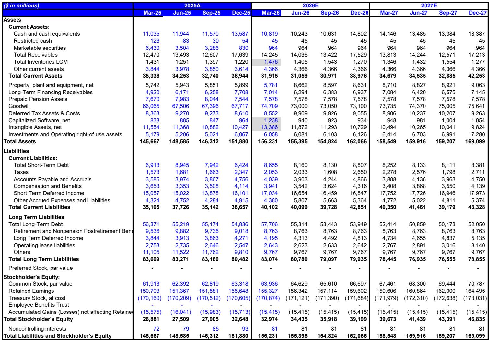
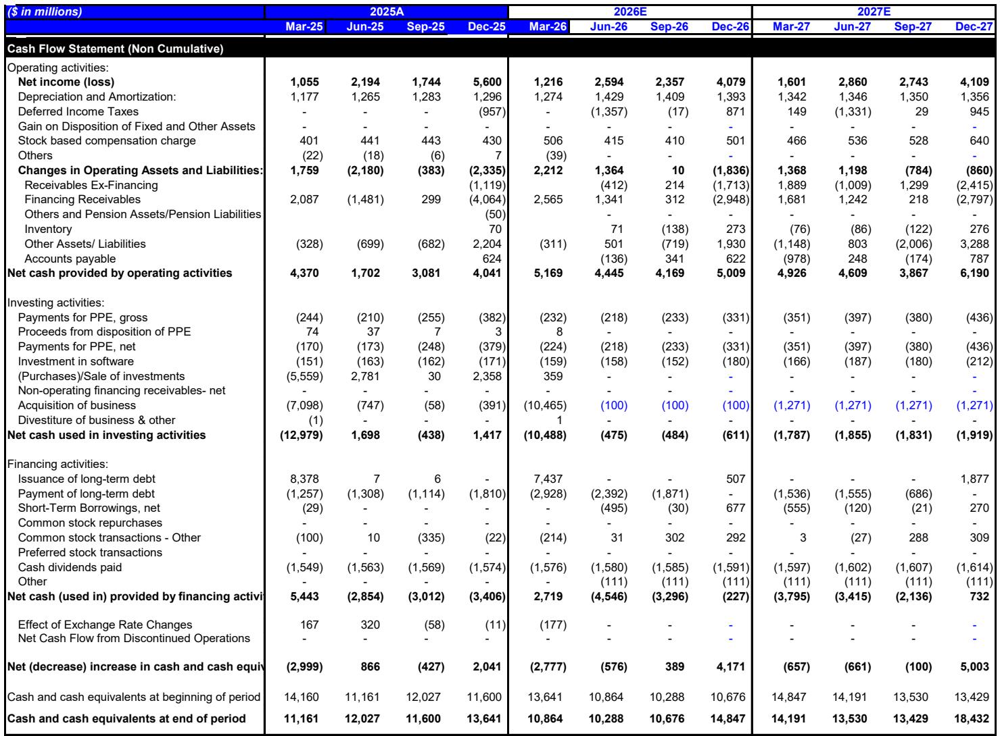
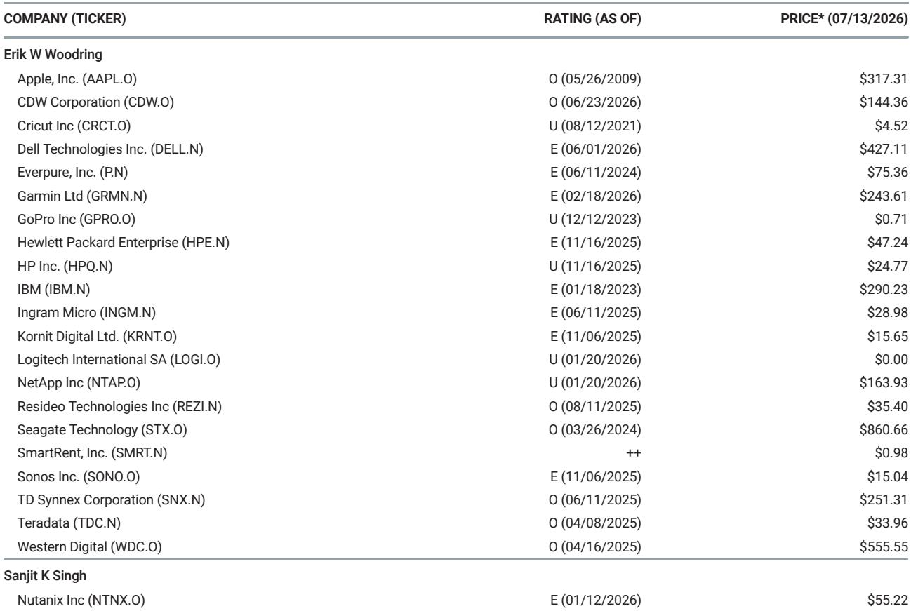

# MS：IBM-UN资本开支重排序-5大要点

这份MS在7月14日发布的IBM预警报告，揭示了一个比季度业绩miss更值得关注的信号：企业客户正在将资本开支从IBM的传统强项——大型机硬件和交易处理软件——大规模转移到内存密集型的存储和服务器产品上。第二季度IBM收入较MS预期低5%，软件和基础设施双双miss，只有咨询业务符合预期。但真正的问题不在于这一季度的数字，而在于这种开支重分配是否会成为持续趋势。

IBM管理层将第二季度的波动解释为短期优化，认为只是“季度末几天”的资本开支调整。但MS提出了一个更尖锐的质疑：如果内存价格上涨被视为结构性、多年期的不确定性，企业持续提前采购计算和存储资源，那么同样的资本开支重分配可能在2026年下半年甚至2027年再次发生。IBM报价在预警当日下跌25%至215美元，回到2026年5月中旬的水平，但基本面已经出现变化。

## 1. 第二季度miss的核心是产品组合的结构性出现变化

第二季度IBM总收入172亿美元，软件增长5%但低于预期11个百分点，基础设施同比下降7%，只有咨询业务基本符合预期。问题集中在大型机业务：IBM Z收入同比下滑40-50%，交易处理业务可能下降约10%，其中交易性部分跌幅接近50%。这些高毛利业务的调整直接导致毛利率低于预期130个基点，公司依靠成本削减才保住了19.2%的税前利润率。

更值得关注的是软件业务的内部结构。红帽增长11%是亮点，HashiCorp和Confluent表现积极，但数据、自动化和交易处理软件——这些通过企业许可协议采购的产品——明显弱于预期。MS估算，剔除收购贡献后，IBM第二季度有机软件增长接近零，整体有机收入同比出现几个季度以来的首次负增长。

> **KC评论：** 第二季度的miss不是单一产品的问题，而是IBM产品组合中高利润、长周期采购的部分被低利润、短周期的存储和服务器挤出了预算。这种结构性变化对IBM的盈利质量影响比收入miss更值得关注。

## 2. 内存通胀正在重塑企业IT开支的优先级

MS将这一现象与更广泛的行业趋势联系起来。报告指出，内存价格持续上涨正在推动企业将计算和存储开支前置，这种需求在当前阶段几乎无弹性，正在抢占IT预算中其他项目的份额。IBM的分布式基础设施增长37%，如果没有大型机的影响，基础设施板块本可实现超预期增长。

报告认为，这一趋势的直接受益者是戴尔、慧与、Pure Storage、NetApp等企业服务器和存储厂商，间接受益者包括希捷和西部数据。但IBM作为大型机和传统企业软件的代表，正在成为这一轮开支重分配的代价承担者。问题在于，如果内存通胀持续，这种重分配可能不是季度性的，而是年度性的。

## 3. 估值支撑的逻辑需要重新审视

MS用两种方法估算了IBM的潜在底部。基于回归的自由现金流估值指向207美元，分部加总估值在164至219美元之间。但报告明确指出，这些估值尚未考虑第二季度miss对全年自由现金流的潜在影响。2026年上半年IBM自由现金流48亿美元，与去年同期持平。如果参照2023年大型机周期中上半年的季节性占比（31%），全年自由现金流可能约为155亿美元，低于公司约157亿美元的指引。

当前IBM报价对应17-18倍2026年预期市盈率，接近2024年7月之前的估值水平。但报告提出的核心问题是：在资本开支重分配可能持续的情况下，什么样的盈利和自由现金流基础才是合理的估值锚点。

而在于它揭示了一个逻辑困境：如果内存通胀驱动的开支重分配不是一次性事件，那么IBM的盈利基础可能需要调整，而当前报价的“底部”可能只是暂时的。

## 4. 一个可复用的观察框架：企业IT开支的“挤出效应”

这份报告提供了一个可以迁移到其他企业的分析框架：当某一类硬件或组件出现价格快速上涨时，企业IT预算会发生“挤出效应”——优先采购涨价品，推迟或压缩其他品类的采购。这种效应在季度末尤为明显，因为企业需要在预算周期内完成关键采购。

对于读者和分析师而言，需要关注三个信号：一是内存、存储等关键组件的价格趋势是否具有持续性；二是受影响企业的订单积压和管道质量是否在出现变化；三是管理层对“短期优化”和“结构性变化”的判断是否可靠。IBM管理层认为第二季度只是短期调整，但MS用“如果内存通胀被视为结构性不确定性”这一假设，提出了一个更谨慎的观察视角。

这份报告的核心价值不在于对IBM的季度预测，而在于它揭示了一个正在发生的行业现象：内存通胀正在重新排序企业IT开支的优先级，而IBM只是第一个发出预警的公司。

For informational purposes only. Portions may be generated,translated,summarized,or edited with AI assistance based on source materials and may contain omissions or errors. Please verify independently. This is not investment,legal,tax,accounting,or other professional advice.

For informational purposes only. Portions may be generated,translated,summarized,or edited with AI assistance based on source materials and may contain omissions or errors. Please verify independently. This is not investment,legal,tax,accounting,or other professional advice.

