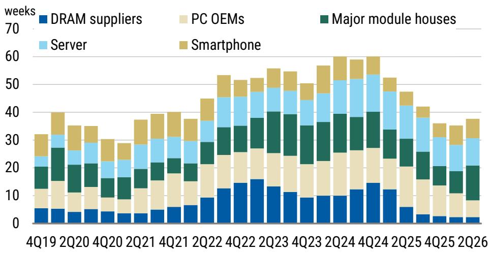
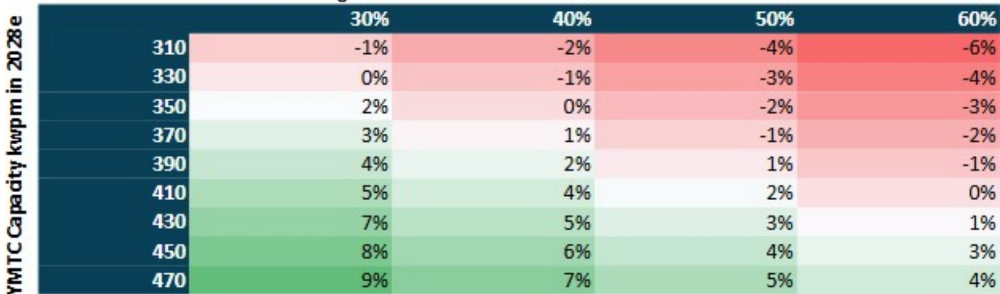
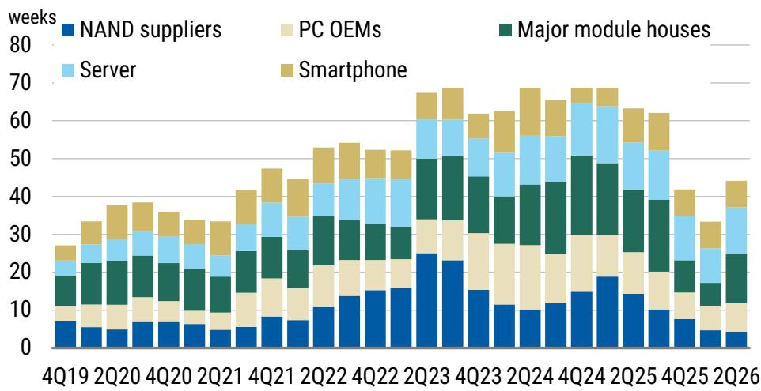

# 存储行业的下一个阶段并非衰退——而是结构性拉长，研究者需重新思考价值积累的方向

存储周期正在转变，但并非以引发恐慌的方式。DRAM合约价格同比增速正从周期高点回落，以未来十二个月市净率衡量的估值尚未重新定价。某全球研究机构对2026年中期的分析认为，这并非下行周期的开始，而是一个拉长而非崩溃的拐点。对研究者而言，关键洞察在于传统策略——即在价格动量见顶时卖出存储相关公司——可能在本轮周期失效，因为需求结构已经改变。

当前格局由三个讨论定义：AI资本支出是否真实到足以支撑需求、长期协议是否应享有估值溢价、以及周期在从扩张到收缩的轨迹上实际处于何处。每个讨论对组合配置都有不同的含义。该机构的框架对AI支出、长期协议重新定价以及周期拐点均持建设性观点。综合来看，这些观点表明存储相关收益正在被理性定价，而非狂热，选择性关注的机会窗口仍然敞开。

核心张力在于：价格信号正在见顶，但来自AI基础设施的结构性需求仍在加速。解决这一张力需要一个能区分周期噪音与长期趋势的框架。以下部分逐一解析每个讨论，并将分析转化为机构研究者的可操作决策。

## AI基础设施支出真实且仍在加速，使算力过剩担忧为时过早

当前存储研究中最具争议的问题是，超大规模企业的资本支出是在创造真实需求，还是仅仅在建设闲置产能。该机构的分析坚定地站在建设性一边，其推理基于一个特定指标：AI基础设施货币化的年化收入。

基础设施货币化与建设过剩算力不同。该机构认为，2026年第二季度的资本支出周期将是决定性的验证点。如果超大规模企业继续在产能上升期投入，这表明利用率正在证明扩张的合理性。高质量大语言模型训练运行的强度，加上持续流入AI初创企业和企业部署的资金，创造了一个此前存储周期中不存在的需求底部。在疫情期间的模拟芯片繁荣期，需求被提前释放然后崩溃。而这一次，需求正从需要持续高带宽内存和NAND存储的新AI服务器安装基础中构建。

其含义很直接：与AI相关的存储需求并非一次性库存建设，而是持续性消耗。将AI相关存储视为暂时性峰值的研究者，可能低估本轮上升周期的持续时间。该机构对AI支出的建设性观点表明，需求突然断崖的风险低于市场共识所暗示的水平。

## 长期协议不应享有结构性估值重估，因为历史表明其在压力下可重新谈判

第二个讨论聚焦于存储供应商与客户之间长期协议的普及是否应证明更高的估值倍数。该机构持审慎立场，其推理直接借鉴了疫情期间的模拟芯片案例研究。

在疫情期间，许多半导体细分领域采用长期协议来确保供应。当需求正常化后，这些协议被重新谈判，在某些情况下，客户将库存强加给供应商。存储行业在长期协议方面的经验并非合同刚性，而是压力下的商业灵活性。该机构的分析表明，市场正在正确地为存储相关收益定价，而未对长期协议覆盖给予溢价，因为结构性vs周期性的讨论仍未解决。

如果长期协议真正具有结构性，它们将降低收益波动性并证明更高倍数的合理性。但模拟芯片案例研究表明，当终端需求疲软时，客户会利用其议价能力重新谈判条款。供应商最终承担了他们以为已经转移的库存风险。该机构对长期协议重新定价的审慎观点，是对假设合同安排已改变存储基本周期性的一个警示。研究者不应为历史表明脆弱的稳定性支付溢价。

## 周期拐点正在变化率上见顶，但周期形态已从尖峰转变为平台

第三个讨论涉及最具战术性的问题：我们处于周期的哪个位置？该机构的分析显示，DRAM合约价格同比增速正从周期高点回落，模组厂的库存在2026年第二季度有所上升。这些都是变化率正在见顶的经典信号。

然而，该机构的整体立场是建设性的，而非悲观。原因是周期正在拉长。在以往周期中，变化率见顶先于相对价格的急剧下跌。而这一次，该机构预计价格将在2026年第四季度左右见顶，但随后的下跌将更浅、更慢。拉长是由AI需求吸收本会涌入现货市场的供应，以及供应商在多年投资不足后保持资本纪律所驱动的。

“好消息等于坏消息”这一说法捕捉了其中的微妙之处。积极的需求消息不再自动推高存储相关公司，因为市场已经定价了改善。但狂热定价的缺失意味着下行空间有限。该机构的建设性拐点观点是减少战术性多头头寸的信号，但并非做空。周期正在成熟，而非破裂。

## 存储周期配置的决策框架：区分AI相关需求与传统需求，偏好具有结构性增长方向的供应商

将这三个讨论转化为组合决策，需要一个按公司对AI驱动需求与传统应用（如PC和智能手机）的敞口进行区分的框架。该机构的分析为此类框架提供了基础模块。

首先，评估对高带宽内存和AI固态硬盘的收入敞口。具有显著AI相关存储收入的公司对DRAM合约价格变化率见顶的敏感度较低，因为其需求驱动因素是超大规模企业部署带来的数量增长，而非现货价格波动。其次，评估库存风险。该机构指出，2026年第二季度库存上升主要发生在模组厂，而非供应商。直接接触超大规模企业采购周期的公司资产负债表更健康。第三，考虑NAND供需平衡，该机构将其模型延伸至2028年。在基准情景下，非AI NAND需求同比增长5%，AI固态硬盘需求同比增长30%至60%。在此情景下，即使DRAM定价走软，NAND仍保持紧张。

关键风险因素是新进入者的产能扩张。该机构对某主要中国NAND制造商建设额外晶圆厂的场景分析显示，激进的绿地扩张可能使NAND市场从紧张转为供应过剩。如果该制造商达到每月47万片晶圆启动量，即使在乐观的AI需求假设下，NAND过剩也可能达到9%。研究者必须将非现有供应商的产能公告作为主要摇摆因素进行监控。

另一个值得关注的次要方向是光学组件供应链。该机构包含了对某镜头制造商在增强现实全臂单元模组中机会的详细分析。虽然并非存储相关，但这一分析说明了评估新兴技术采用曲线的方法论。在基准情景下，该制造商的FAU收入预计将从2026年的零增长到2028年的近10亿美元，净利润率从10%扩大到30%。每股影响显著，乐观情景意味着更大的上行空间。这表明，在更广泛的科技硬件领域中，接触新形态的精选公司可以产生独立于存储周期的回报。

因此，存储研究者的框架是三维的：周期时机、AI敞口以及来自新产能的供应风险。每个维度需要不同的行动。在周期时机上，减少对依赖DRAM现货价格上涨的公司的敞口。在AI敞口上，维持或增加与超大规模企业有直接关系和高带宽内存内容的供应商头寸。在供应风险上，避免其终端市场可能被非现有参与者的激进产能增加所淹没的公司。

该机构的分析并非呼吁全面撤出存储领域，而是要求精准。周期并未结束，它正在从重新定价阶段过渡到数量驱动阶段。理解这一区别的研究者可以继续产生回报，同时避免那些将所有存储公司视为可互换周期赌注的陷阱。

*仅供参考。部分内容可能基于源材料通过AI辅助生成、翻译、总结或编辑，可能存在遗漏或错误。请独立核实。本文不构成专业建议。*

仅供参考。部分内容可能基于源材料通过AI辅助生成、翻译、总结或编辑，可能存在遗漏或错误。请独立核实。本文不构成专业建议。

