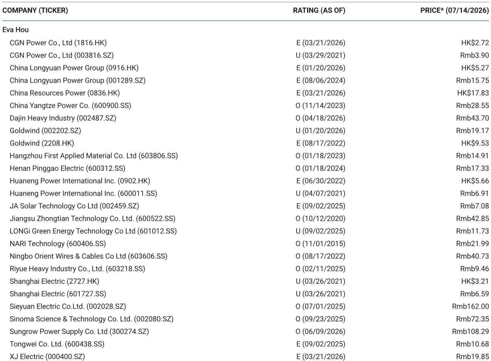
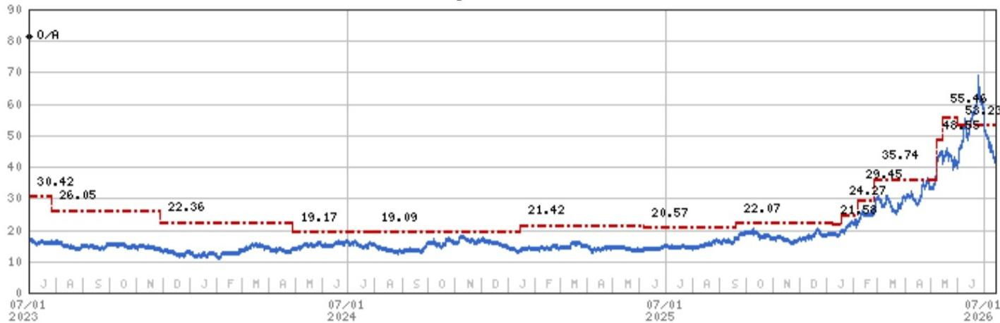
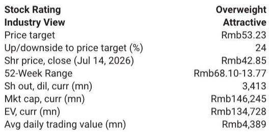

# ZTT's Second-Quarter Miss Is a Timing Issue, Not a Trend Problem -- The Real Story Is the Unfolding Pricing Power and Selective Capacity Allocation That Will Drive a Third-Quarter Acceleration

Jiangsu Zhongtian Technology reported a preliminary second-quarter 2026 net profit of RMB 1.43 billion to RMB 1.59 billion, representing 52-69 percent year-over-year growth. That headline number fell slightly below the analyst estimate range of RMB 1.5 billion to RMB 2.0 billion. On the surface, a miss is a miss. But the composition of that miss reveals something far more important than a single quarter's deviation: ZTT is deliberately managing its revenue recognition, customer selection, and pricing strategy from a position of structural strength, not weakness.

The shortfall was not driven by softening demand, margin compression, or competitive pressure. It was driven by a revenue recognition schedule that deferred certain high-margin specialty optical fiber export deliveries and a comparison base that included large-volume, lower-priced China Mobile orders completed in the first half. These are timing effects, not deterioration effects. The company's own guidance for first-half 2026 net profit growth of 50-60 percent year-over-year, to RMB 2.35-2.51 billion, confirms that the underlying earnings trajectory remains intact.

What makes this moment strategically significant is the conjunction of three forces that will converge in the second half of 2026: a step-change in optical fiber pricing as new China Mobile contracts take effect, full production utilization that has shifted ZTT from volume-chasing to quality-selecting, and a multi-billion RMB submarine cable order book that is back-end loaded. The second-quarter "miss" is best understood as the last echo of an old pricing regime. The third quarter will be the first full expression of the new one.

The most important single data point in the report is not the quarterly profit number. It is the statement that ZTT completed delivery of a lower-priced order for China Mobile in the first half of 2026, and that new prices in the second half will increase substantially. This is not a marginal uptick. It is a regime change in the company's largest revenue segment, and it creates a mechanical tailwind to earnings that does not depend on volume growth.

## The Second-Quarter Miss Is a Reflection of Deliberate Timing Choices by a Supplier Operating from Strength, Not a Signal of Weakening Demand

The gap between reported second-quarter profit and the low end of the analyst estimate range is approximately RMB 70 million. That is roughly 5 percent of the midpoint of the reported range. A miss of this magnitude would normally invite scrutiny of demand conditions or competitive dynamics. In this case, the explanation is more structural than cyclical, and it points to the company's increasing bargaining power rather than any erosion of it.

ZTT's optical fiber segment underperformed relative to expectations in the quarter because some exported specialty optical fiber products had not yet been recognized as revenue and remained recorded as inventory. This is a recognition timing issue, not a demand issue. The products have been produced and delivered to customers; the revenue simply has not cleared the accounting threshold. In a seller's market, where ZTT requires prepayment before delivery and selectively chooses which customers to accept, the risk that these deferred revenues will not materialize is low. They will be recognized in subsequent quarters, adding to the already-strong third-quarter base.

The power transmission segment, by contrast, performed in line with expectations, delivering greater than 15 percent year-over-year revenue and earnings growth. This segment is the steady engine of the business, and it continues to hum. The marine systems segment delivered moderate growth, but the composition matters: the Sanshan Island 500kV AC and DC submarine cable project carried higher margins but lower revenue compared to the Jiangsu projects recognized in the second quarter of 2025. The trade-off between margin and revenue volume is a deliberate strategic choice. ZTT is prioritizing profitability over top-line scale, and the two European Union orders, with a combined order size exceeding RMB 2 billion, will be booked in the second half of 2026.

The pattern across all three segments is consistent. ZTT is not chasing revenue. It is managing its revenue recognition, customer mix, and project selection to optimize earnings quality. The second-quarter miss is the cost of that discipline, and it is a temporary one.

## Optical Fiber Pricing Is Entering a Step-Change Regime in the Second Half, Creating a Mechanical Earnings Tailwind That Does Not Require Volume Growth

The most consequential development for ZTT's near-term earnings trajectory is the pricing transition in its optical fiber business. The company completed delivery of a lower-priced order for China Mobile in the first half of 2026. The new prices for the second half of 2026 will increase substantially. This is not a forecast. It is a contractual fact.

The magnitude of the pricing increase is not disclosed in the report, but the context makes the direction unambiguous. The spot price of G657 fiber increased slightly month-over-month in June, while the spot price of G652.D fiber remained flat. These spot market movements are modest on their own. But they are occurring in an environment where ZTT describes the optical fiber market as a seller's market, where the company is selective in customer acceptance and continues to require prepayment for orders. When a supplier in a seller's market shifts from a lower-priced contract to a substantially higher-priced one, the earnings impact is multiplicative.

The arithmetic is straightforward. Optical fiber is ZTT's largest and most profitable segment. The first-half 2026 revenue from this segment was depressed by the legacy China Mobile pricing. Starting in the third quarter, every unit shipped under the new pricing carries a higher contribution margin. Because ZTT is operating at full production utilization, the volume is already constrained by capacity. The incremental earnings from the pricing step-change flow almost entirely to the bottom line.

This is the core reason why the analyst report anticipates that third-quarter 2026 net profit growth will accelerate rapidly. The second-quarter comparison was burdened by the tail end of old pricing and the deferral of specialty fiber revenue recognition. The third-quarter comparison will benefit from the full effect of new pricing, the recognition of deferred revenues, and the absence of the old contract drag. The sequential improvement from second to third quarter is likely to be dramatic.

## Full Production Utilization Has Shifted ZTT's Strategy from Volume Maximization to Customer Selection and Prepayment, Fundamentally Improving Cash Flow and Order Quality

The report contains a sentence that, on its own, is worth more than most financial metrics: ZTT has become more selective on customer allocation given the strong demand environment and full production utilization. The company's current sales strategy emphasizes customer selection and advance payment before delivery, helping improve cash flow and optimize order quality.

This is a structural transformation in how ZTT operates. In a capacity-constrained environment, the company no longer needs to accept every order that comes its way. It can choose customers based on payment terms, credit quality, and pricing. It can demand prepayment, which eliminates accounts receivable risk and improves working capital. It can prioritize higher-margin specialty products over standard commodity fiber. It can delay revenue recognition to optimize quarterly comparatives.

The cash flow implications are significant. The report's own financial projections show free cash flow yield of 2.7 percent for 2026, rising to 4.1 percent in 2027 and 5.2 percent in 2028. These figures may understate the improvement if ZTT's prepayment discipline persists. When a company demands cash before delivery, its cash conversion cycle compresses dramatically. The need for working capital financing diminishes. The quality of earnings improves because cash and revenue are recognized contemporaneously rather than with a lag.

The strategic implication is even broader. ZTT is effectively using its capacity constraint as a competitive weapon. By being selective about which customers it serves and on what terms, it is improving the quality of its order book and reducing its exposure to counterparty risk. In a market where demand exceeds supply, the supplier sets the terms. ZTT is exercising that power, and the benefits will compound over time.

## The Submarine Cable Order Book Provides a Multi-Year Backlog with Back-End Loaded Revenue Recognition, Creating Visibility into 2027 and Beyond

The marine systems segment, which includes submarine cables, is ZTT's highest-growth and highest-visibility business. The segment delivered moderate growth in the second quarter, but the composition of that growth reveals a deliberate strategy of prioritizing margin over revenue volume.

The Sanshan Island 500kV AC and DC submarine cable project carried higher margins but lower revenue compared to the Jiangsu projects recognized in the second quarter of 2025. This is a trade-off that ZTT is willing to make because it has a deep pipeline of higher-volume projects waiting in the wings. The two European Union orders, with a combined order size exceeding RMB 2 billion, will be booked in the second half of 2026. These are large, high-margin, multi-year projects that provide revenue visibility extending into 2027 and 2028.

The European submarine cable market is a strategic growth vector for ZTT. The company is competing against established European players, but its cost structure and manufacturing scale give it a competitive advantage. The two EU orders are a proof point that ZTT can win large-scale projects in developed markets against incumbent suppliers. If this trend continues, the marine systems segment could become a material contributor to overall earnings growth over the next three to five years.

The analyst report's financial projections show revenue growing from RMB 52.5 billion in 2025 to RMB 84.4 billion in 2028, a compound annual growth rate of approximately 17 percent. EBITDA is projected to grow from RMB 4.8 billion to RMB 13.1 billion over the same period, a compound annual growth rate of approximately 40 percent. The divergence between revenue growth and EBITDA growth reflects the operating leverage inherent in ZTT's business model. As revenue scales, fixed costs are spread over a larger base, and the mix shift toward higher-margin products amplifies the effect.

## A Decision Framework for Observers: Distinguishing Between Timing Noise and Structural Change in ZTT's Earnings Trajectory

The second-quarter earnings report provides a natural laboratory for distinguishing between two types of signals: timing noise, which is temporary and should be discounted, and structural change, which is persistent and should be weighted heavily.

Timing noise includes the deferral of specialty optical fiber revenue recognition, the comparison base effect from the lower-priced China Mobile contract, and the uneven recognition of submarine cable revenues across quarters. These factors will reverse or normalize in the second half of 2026. They do not change the underlying earnings power of the business.

Structural change includes the step-change in optical fiber pricing, the shift to customer selection and prepayment, the improvement in cash flow and order quality, and the expansion into the European submarine cable market. These factors are self-reinforcing and durable. They will continue to drive earnings growth in 2027 and 2028, even if optical fiber demand growth moderates from its current pace.

The decision framework for observers is therefore straightforward. If the second-quarter miss is interpreted as a sign of weakening demand or competitive pressure, the logical conclusion is to reduce exposure. But the evidence points in the opposite direction. The miss is a byproduct of strength: the ability to defer revenue, to select customers, to demand prepayment, and to prioritize margin over volume. These are not the actions of a company under pressure. They are the actions of a company that knows it holds the upper hand in its markets.

The third-quarter 2026 results will be the definitive test of this thesis. If ZTT delivers the rapid acceleration that the analyst report anticipates, the second-quarter miss will be remembered as a footnote. If it does not, the thesis will need to be reexamined. But the preponderance of evidence from the report points toward acceleration, not deceleration.

The earnings trajectory over the next twelve months is likely to be characterized by sequential improvement, driven by pricing, mix, and the recognition of deferred revenues. The analyst report projects 2026 EPS of RMB 1.88, rising to RMB 2.43 in 2027 and RMB 3.01 in 2028. These estimates may prove conservative if the pricing step-change in optical fiber and the submarine cable backlog deliver as expected.

*For informational purposes only. Portions may be generated, translated, summarized, or edited with AI assistance based on source materials and may contain omissions or errors. Please verify independently. This is not professional advice.*

For informational purposes only. Portions may be generated, translated, summarized, or edited with AI assistance based on source materials and may contain omissions or errors. Please verify independently. This is not professional advice.

