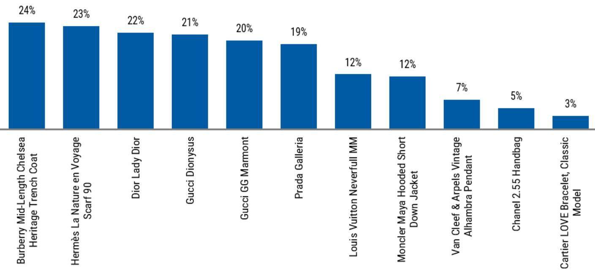
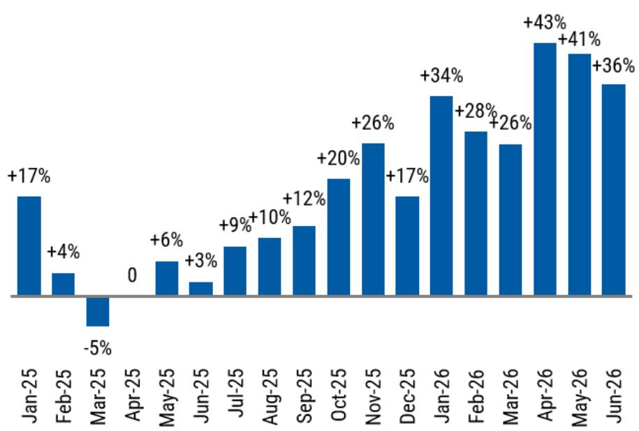
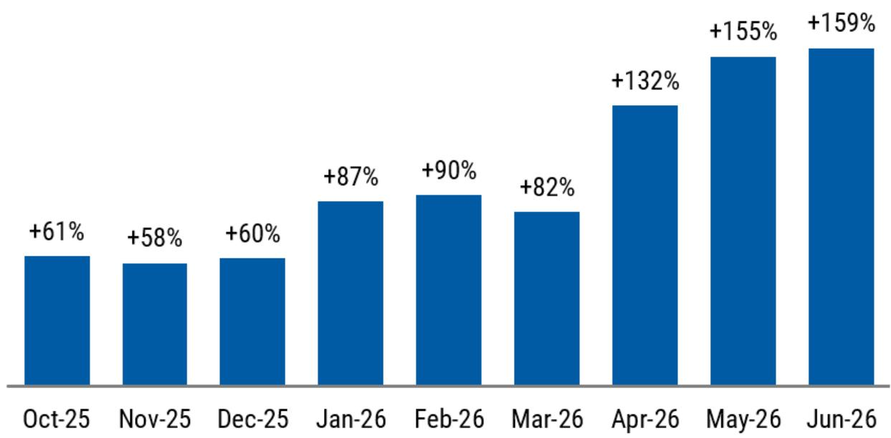

# MS：韩国奢侈品市场概览，人均消费预计全球第一

韩国是全球个人奢侈品人均支出最高的国家。MS最新发布的韩国奢侈品市场研究显示，2025年韩国人均奢侈品消费金额预计将位居世界第一。但真正值得关注的不是这个排名本身，而是支撑这个排名的渠道结构、财富效应和跨境价差三重因素，正在同时发生变化。

这份报告的核心判断是：韩国奢侈品市场的增长动力正在从本土财富效应转向外国游客消费，而汇率和价差是这一转换的关键放大器。

## 1. 百货商店而非奢侈品街，才是韩国奢侈品生态的中心

韩国奢侈品市场的渠道结构在全球范围内都算独特。报告指出，韩国几乎没有传统意义上的奢侈品商业街，绝大多数奢侈品牌在全国范围内只开设一到两家独立旗舰店。真正的销售主战场在百货商店。

韩国三大百货集团——新世界、乐天、现代——合计占据了百货渠道超过90%的销售额。这些百货商店本质上是以特许经营模式运营的大型商场，每个品牌在其中开设直营精品店，百货方则提供礼宾服务、VIP休息室、私人餐饮、文化活动和代客泊车等配套。这种模式让百货商店成为品牌与消费者之间的核心界面，而非简单的零售终端。

> **KC评论：** 这意味着，在韩国观察奢侈品消费趋势，盯住百货商店的月度同店销售数据比盯住品牌财报更及时。新世界百货2025年6月同店销售同比增长26%，这个数字背后反映的是整个渠道的健康度，而非单一品牌的表现。

## 2. 财富效应曾是核心驱动力，但结构正在变化

报告通过两组数据展示了韩国奢侈品消费与居民财富之间的强相关性。韩国居民资金资产总额与奢侈品销售增长之间存在明显的同步波动，尤其是居民公司资产的变化，几乎可以提前反映奢侈品销售的拐点。

过去几年，韩国市场的上涨直接转化为了奢侈品购买力。但报告同时指出，这种财富效应的边际贡献正在减弱。2024年以来，韩国居民资金资产增速节奏变化，而奢侈品销售依然保持增长——缺口由外国游客消费填补。

## 3. 中国游客和汇率价差正在重塑需求曲线

外国游客在韩国百货商店的消费占比正在快速提升。报告数据显示，2024年至2026年，三大百货的外国销售占比预计将持续上升。其中，中国游客是最大的增量来源。

核心驱动力是价差。报告对比了多个奢侈品牌热门款式在韩国与中国大陆的零售价差，结果显示韩国普遍存在10%到20%的价格优势。叠加近期韩元对人民币的汇率变化，这个价差进一步扩大。对于中国消费者而言，在韩国购买奢侈品的实际成本已经低于国内专柜，甚至低于海南免税渠道。

新世界百货的外国消费数据印证了这一趋势：近几个月外国消费增速显著加快，报告认为这与汇率窗口直接相关。

> **KC评论：** 这里有一个容易被忽略的细节：韩国免税渠道的份额在过去十年大幅调整，而百货商店的外国消费却在增长。说明中国游客的购物行为正在从“机场提货”转向“百货商店体验式消费”。这对品牌来说意味着更高的客单价和更深的客户关系，但也对百货的运营能力提出了更高要求。

## 4. 韩国市场对全球奢侈品牌的意义被低估了

报告估算，韩国市场在大多数奢侈品牌全球销售中的占比约为高个位数百分比。对于一个单一国家市场而言，这个比例并不低。考虑到韩国人口只有约5100万，其人均贡献远超其他主要市场。

但更值得关注的是，韩国市场正在成为奢侈品牌测试“百货商店+体验式零售”模式的试验场。如果这个模式被验证成功，它可能被复制到其他亚洲市场——尤其是那些百货渠道正在重建的地区。

对于品牌而言，韩国市场的战略价值已经从“销售贡献”转向“模式验证”。而对于观察者而言，韩国百货商店的月度数据、汇率走势和外国游客消费占比，正在成为比季度财报更灵敏的先行指标。

这份报告没有给出明确的趋势预测，但它提供的分析框架已经足够清晰：韩国奢侈品市场的下一个变量，不在韩国人自己的钱包里，而在汇率和游客的购物清单上。

For informational purposes only. Portions may be generated,translated,summarized,or edited with AI assistance based on source materials and may contain omissions or errors. Please verify independently. This is not investment,legal,tax,accounting,or other professional advice.

For informational purposes only. Portions may be generated,translated,summarized,or edited with AI assistance based on source materials and may contain omissions or errors. Please verify independently. This is not investment,legal,tax,accounting,or other professional advice.

