# 2Q26 CIO Survey Takeaways – GenAI Leadership Position Remains Clear

Microsoft's GenAI leadership continues with robust demand trends across Azure and M365 + Copilot. Azure remains leading platform for incremental share gains, E5 upgrades move higher, with strong early adoption signals for E7. M365 Copilot penetration continues to improve, up to 88% from 80%.

Microsoft's Strong Positioning for AI Opportunity Unchanged, Remaining a Clear GenAI Winner. Our 2Q26 CIO survey points to a more constructive budget backdrop heading into 2026, with CIOs expecting IT budget growth to accelerate modestly to +3.8% in 2026 from +3.7% in 2025, a +14 bps year-over-year improvement and modest uptick versus the +3.7% growth expectation in our 1Q26 survey, though still below the +4.1% 2010-2019 average. At the same time, Microsoft has been able to maintain its leadership position in terms of core spending intentions and specifically related to capturing share of GenAI spend. Relative to broader software, CIOs expect the highest forward-year growth for Microsoft (vs. other vendors) in terms of absolute growth expectations at +7.6%, up from +7.3% in our 4Q25 survey. Microsoft also continues to lead the group from a net software spending perspective at 72% of CIOs expecting to see an increase in net spending on Microsoft tools (up from 67% in 2Q25), demonstrating the company's AI leadership position translating to budget dollars. Further, Microsoft continues to be the leading vendor for gaining incremental share of GenAI spend in 2026 and over the next 3 years.

Core Microsoft spending intentions: 1) Azure spend intentions remained strong in 2Q26 – of the CIOs who currently use or plan to use Azure, 62% expect to increase spend over the next 12 months, above the 57% of CIOs that expected to increase Azure spend in 2Q25; 2) M365 / O365 spending intentions materially upticked – with 65% of CIOs indicating intent to increase spend in the next 12 months, vs. 46% in 2Q24 and 55% in 2Q25 – while the longer-term E1/E3/E5 mix shift continues to be more bullish for Microsoft, indicating sustained shift toward higher subscription tiers, as 50% of CIOs using M365 expect to use E5 next year, inline with 50% from 4Q25, while 21% expect to use E7 next year as well (first time E7 included as option in our CIO survey); 3) On-premise server related products spending intentions are expected to decline -0.8% over the next 3 years, which is slightly below +0.9% expectations from our 4Q25 survey.

Microsoft AI spending intentions: 1) Extent of Adoption of Microsoft's Generative AI suite remains robust, with 97% of CIOs expecting to leverage some form of AI tooling from Microsoft over the next 12 months, up from 92% in 4Q25; 2) Breadth of Adoption – Copilot adoption outside of M365 Copilot continues to see strong demand across the board. Planned use of Microsoft tools over the next 12 months not only increased overall, but either increased or remained stable for every product listed in our survey (M365 Copilot, GitHub Copilot, Security Copilot, Dynamics 365 Copilot, Microsoft Designer and Viva Copilot). For example, GitHub Copilot improved to 58% over the next 12 months, up from 42% in 4Q25; 3) Microsoft 365 Copilot screens as the most popular solution within Microsoft's growing suite of GenAI offerings, inline with observations in prior periods. In particular, Microsoft 365 Copilot remains the most popular solution within Microsoft's GenAI portfolio, as 88% of CIOs expect to use the product over the next 12 months, up from 80% in 4Q25. Looking ahead, Microsoft 365 Copilot usage is expected to reach 63% over the next three years, down slightly from 68% in 4Q25. Partially offsetting, CIOs expect to deploy M365 Copilot across 39% of their M365 user base over the next 12 months, up from 36% in 4Q25, increasing to 62% over the next three years, up from 61% in 4Q25, likely supported by increasing E7 penetration, in our view.

## Microsoft Takeaways from the 2Q26 AlphaWise CIO Survey:

- Software: Better Budget Air Cover, Though Applications Still Need More Evidence. With the broader IT budget backdrop improving and the 1-year up-to-down ratio moving above 1.0x for the first time since 1Q24, Software investor focus has shifted back toward whether improving AI momentum can drive a more durable inflection in Software budgets. At the sector level, Software remains the fastest-growing IT category, with CIOs expecting +4.1% growth in 2026, up +29 bps from 2025. That said, we still do not find sufficient ammunition to become structurally more positive on application software broadly. Sequentially, Software spending expectations were effectively unchanged, up just +3 bps quarter-over-quarter, and vendor-level spending intentions remain highly dispersed, with Microsoft and ServiceNow the only tracked vendors expected to accelerate versus our 4Q25 survey.

- AI-Native Capabilities and Vendor Consolidation Point to Selective App Software Winners, Not a Broad Inflection. CIO indications around AI-native / LLM-based software adoption do not necessarily point to wholesale displacement of incumbent application software vendors. Rather, the overlap between expected AI-native adoption and vendor consolidation propensity suggests CIOs are looking to adopt new AI capabilities while reducing software fragmentation. In a new 2Q26 survey question, CIOs expect AI-native / LLM-based software adoption over the next 12 months to be highest across BI / Analytics (22%), Customer Service (18%), IT Operations / Observability (17%), and Collaboration / Productivity (13%). At the same time, CIOs show the greatest propensity to consolidate vendors in Collaboration / Content Workflow Management (3.4), Marketing Applications (3.3), IT Operations / Observability (3.3), and Database / Data Storage (3.3), while Security remains the most best-of-breed-skewed category at 2.6. In our view, this points less to CIOs adding another layer of fragmented AI point solutions, and more to an opportunity for scaled incumbents to become the consolidation layer by embedding AI-native functionality into existing workflows. Across our software coverage, this framework points most constructively to Microsoft and ServiceNow as scaled platforms best positioned to embed AI into existing workflows and consolidate spend, with Salesforce and Snowflake retaining meaningful AI relevance in Customer Service and BI / Analytics, respectively, though with less clean spend momentum.

- Looking across the suite of vendor growth expectations assessed in our Survey, CIOs continue to indicate expectations for spend with Microsoft to remain durable at +7.6% in 2026, the highest level across vendors tracked in our survey. Spending expectations for Microsoft improved from +7.3% in 4Q25, marking the second consecutive read of accelerating growth expectations. From a net expectations perspective, Microsoft also leads the pack with a 72% net score, though down from 78% in 4Q25, emblematic of the company's AI leadership position.

- As workloads shift to the cloud, Microsoft and Amazon remain the clear beneficiaries, though LLM Providers are emerging as a secondary share gainer. Microsoft remains the top expected share gainer from cloud migration in both 2026 and over the next three years (42% and 37% net scores, respectively), followed by Amazon (17% and 13% net scores, respectively). That said, results also point to some budget share shifting toward LLM Providers, which screen as an emerging beneficiary in both one-year and three-year views with 2% and 7% net scores, respectively.

- CIOs continue to note expectations for Microsoft, LLM Providers, and Amazon to gain the largest incremental share of GenAI spend. In 2026, Microsoft remains the clear leader at 27% (down from 32% in 1Q26), followed by LLM Providers at 11% (down from 12% in 1Q26), Amazon at 10% (down from 11% in 1Q26), Salesforce at 8% (up from 7% in 1Q26), and Google / ServiceNow at 6% each (down from 8% / 7% in 1Q26, respectively). On a three-year view, Microsoft remains the largest gainer at 30% (down from 32% in 1Q26), followed by LLM Providers at 17% (unchanged quarter-over-quarter), Amazon at 12% (unchanged quarter-over-quarter), Google at 11% (up from 9% in 1Q26), Salesforce at 8% (up from 7% 1Q26), and ServiceNow at 5% (down from 6% in 1Q26). Net, Microsoft remains the clearest public AI beneficiary on a three-year view.

- As it relates to Agentic Automation initiatives, CIOs point to Microsoft (36%), Google (8%), Amazon (7%), and LLM Providers (7%) as the top four vendor preferences.

- For those building custom AI Applications, CIOs point to Microsoft (47%), Amazon (10%), Google (10%), LLM Providers (7%), ServiceNow (5%), and Salesforce (5%) as their preferred vendors today. On a three year view, they indicate Microsoft (34%), LLM Providers (13%), Google (8%), and ServiceNow (7%) as their top choices for building out custom AI Applications.

- Durability of Azure Growth Intentions. Of the CIOs who currently use or plan to use Azure, 62% expect to increase spend over the next 12 months, relative to 57% in 2Q25. 23% of CIOs plan to keep spend unchanged and 5% plan to decrease spend on Azure over the next 12 months. Separately, Azure remains the preferred public cloud provider, with CIOs indicating 43% of public cloud workloads reside on Azure today, increasing to 47% over the next three years, compared to AWS at 32% today and 31% over the next three years.

- Uptick in M365 / O365 Spending Intentions. 2Q26 data points to a notable uptick in CIO intentions to increase spend on Microsoft 365 / Office 365 over the next 12 months, with 65% of CIOs indicating intent to increase spend, relative to 55% in 2Q25. 28% of CIOs plan to keep spend unchanged or decrease spend on M365 / O365 over the next 12 months, a downtick from the 40% of CIOs indicating flat / lower spend in 2Q25.

- Mix-Shift Toward Higher M365 Subscription Levels Apparent, with E7 Newly Broken Out. While CIOs note a meaningful portion of employees currently using M365 / O365 remains on E3, 2Q26 data shows a notable skew toward premium subscription tiers, with 47% of employees currently on E5 and 7% on E7, versus 31% on E5 in 4Q25 when E7 was not broken out. Looking ahead, 50% of CIOs expect to use E5 next year, in line with 50% in 4Q25, while 21% expect to use E7 next year. Taken together, expected E5 / E7 mix reaches 71% next year, highlighting an additional premium monetization lever for Microsoft.

- CIO intentions to leverage Microsoft's Generative AI products on a go-forward basis remain robust, though medium-term usage is more mixed. At the broadest level, adoption of Microsoft's Generative AI suite remains strong, with 97% of CIOs expecting to leverage some form of AI tooling from Microsoft over the next 12 months, up from 92% in 4Q25. Microsoft 365 Copilot remains the most popular solution within Microsoft's GenAI portfolio, with 88% of CIOs expecting to use the product over the next 12 months, up from 80% in 4Q25. GitHub Copilot also improved to 58% from 42% in 4Q25. Newer offerings also screen meaningfully in 2Q26, including Copilot Studio (52%), Azure AI Services (42%), Azure AI Foundry (25%), and Microsoft Fabric AI (25%).

- Looking ahead, usage of Microsoft's Generative AI portfolio is more bifurcated on a medium-term view, though M365 Copilot penetration expectations continue to improve. Microsoft 365 Copilot usage is expected to moderate from 88% over the next 12 months to 63% over the next three years. By comparison, CIOs expected Microsoft 365 Copilot usage of 68% over the medium term in 4Q25. Partially offsetting, from a penetration perspective, CIOs expect to deploy M365 Copilot across 39% of their Office user base over the next 12 months, up from 36% in 4Q25, increasing to 62% over the next three years, up from 61% in 4Q25.

- For CIOs making an ERP / GL upgrade, SAP S/4HANA, Microsoft Dynamics, and Workday screen as the top cloud-based SaaS vendors expected to be leveraged. SAP S/4HANA rose to the top preferred vendor spot at 22% in 2Q26, followed by Microsoft Dynamics at 19%, Workday at 17%, and Oracle Fusion at 14%. This marks a shift from 2Q25, when Workday led at 22%, followed by SAP S/4HANA and Oracle Fusion at 19% each, while Microsoft Dynamics screened at 16%.

- Net, Microsoft remains the clearest public AI / Software winner in our 2Q26 CIO Survey. Microsoft screens with the highest vendor growth expectations, remains the preferred public cloud provider, shows improving M365 / O365 spending intentions, benefits from premium M365 SKU mix-shift with E7 newly broken out, and maintains leadership across M365 Copilot adoption and penetration. While medium-term usage of certain Microsoft AI products is more mixed, the broader survey continues to support Microsoft's ability to consolidate software spend while monetizing GenAI across Azure, M365, Copilot, GitHub, Fabric, and broader enterprise distribution.

How do you expect your spending for new software functionality or additional users/seats to change in 2026 versus 2025 for the following vendors?

Exhibit 1: CIOs Expect Forward Year Growth to Decelerate Across the Majority of Vendors in Our Survey; MSFT & NOW Sole Vendors Expected to Accelerate in 2026

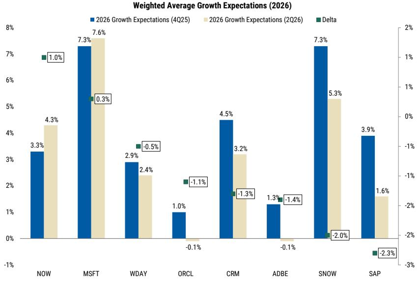  
Source: AlphaWise, MS. n= 60 (US and EU data).

Exhibit 2: Net Expectations (% Increase - % Decrease) on New Software Functionality Spending Over Time  
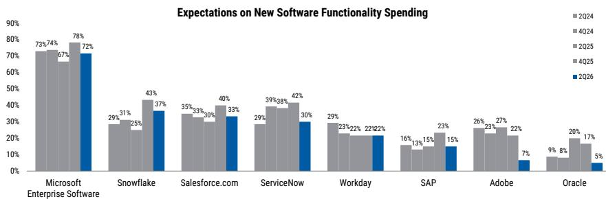  
Source: AlphaWise, MS. n= 58 (US and EU data).

As you shift workloads from on-premise to the cloud, which of these vendors do you expect to gain the largest incremental percentage of your IT budget in 2026? Which do you expect to be the largest gainer over the next three years?

Exhibit 3: Microsoft and Amazon Continue to Lead as the Top Incremental Share Gainers due to Cloud Shift in 2026...

% of Responses Expecting Vendor with Largest Gain or Loss of Incremental Share of IT Budget as a Result of Shift to Cloud in 2026

Exhibit 4: ... And in the Next Three Years  
% of Responses Expecting Vendor with Largest Gain or Loss of Incremental Share of IT Budget as a Result of Shift to Cloud in Next Three Years  
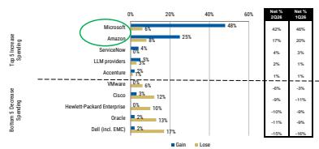

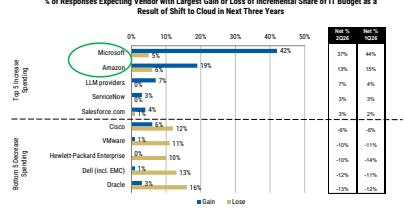  
Source: AlphaWise, MS. n=100 (US and EU data)  
Source: AlphaWise, MS. n=100 (US and EU data)

Exhibit 5: While Microsoft's Lead Over Amazon Remains Substantial on an Absolute Basis, Both MSFT and AMZN Ceded Budget Share to LLM Providers in our 2Q26 Survey on a 1-Year View...

As you shift workloads from on-premise to the cloud, which of these vendors do you expect to gain/lose the largest incremental percentage of your IT budget in the next year? (Overall)

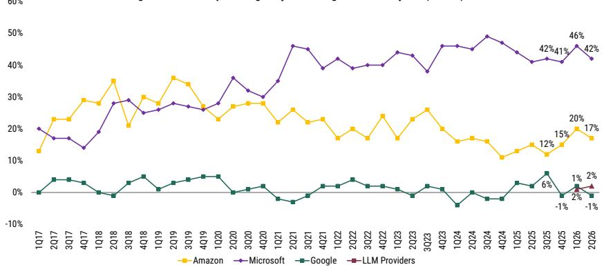  
Source: AlphaWise, MS. n=100 (US and EU data)

Exhibit 6: ...while on a Medium-Term View, MSFT's Lead Over Other Vendors Remains Sizeable, Yet Results Point to Budget Share Loss to LLM Providers

As you shift workloads from on-premise to the cloud, which of these vendors do you expect to gain/lose the largest incremental percentage of your IT budget in the next 3 years? (Overall)  
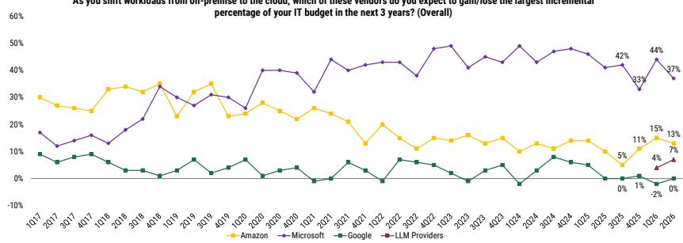  
Source: AlphaWise, MS. n=100 (US and EU data)

Exhibit 7: CIOs Indicate Expectations for Microsoft, LLM Providers, Amazon, and Salesforce to Gain the Largest Incremental Share of GenAI Spend in 2026...  
Vendors Gaining Largest Incremental Share of Gen AI Spend in 2026  
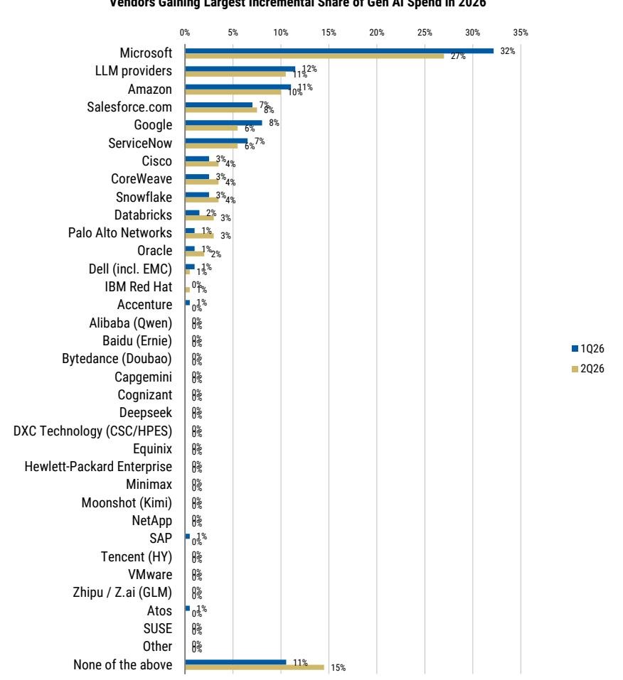  
Source: AlphaWise, MS. n=100 (US and EU data)

Exhibit 8: ...While Microsoft Expected to Remain Leading Share Gainer Over Next Three Years  
Vendors Gaining Largest Incremental Share of Gen AI Spend in Next Three Years  
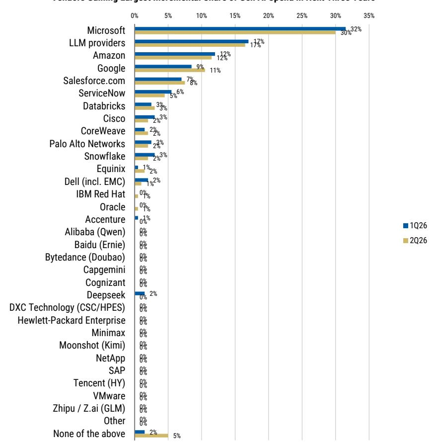  
Source: AlphaWise, MS. n=100 (US and EU data)

Which three vendors do you expect to gain the largest incremental share of Gen AI Spend at your company over the next three years? Please choose three of the below.

Exhibit 9: While Microsoft Retains Its Lead as Largest Increment Share Gainer of GenAI Spend Both Near-Term and Long-Term, LLM Providers Continue to Take Share in 2Q26

2Q26 Survey: Vendors Gaining Largest Incremental Share of Gen AI Spend in 2026 vs. Next 3 Years

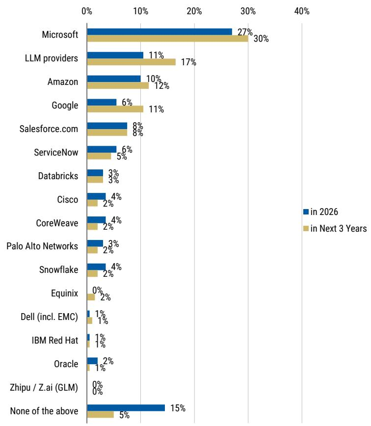  
Source: AlphaWise, MS. n= 100 (US and EU data)

Which of the below vendors are you most likely to use to fulfill your agentic automation initiatives?

Exhibit 10: Microsoft, Google, Amazon, and the LLM Providers Screen as Vendors Most Likely Used for Agentic Automation Initiatives  
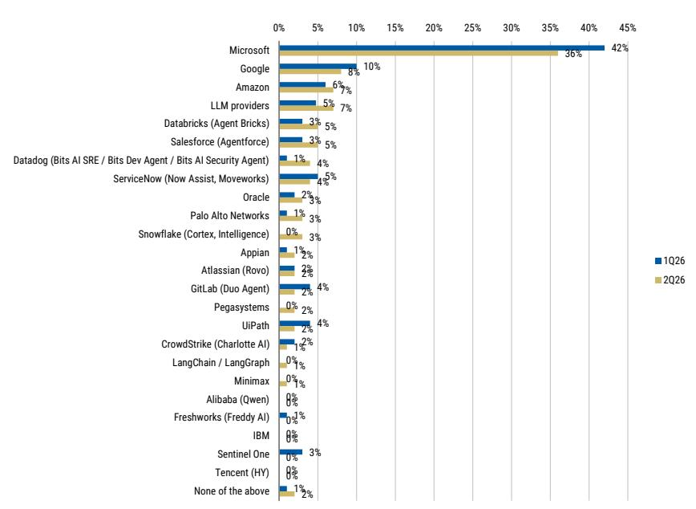  
Source: AlphaWise, MS. n= 200 (US and EU data)  
What is your preferred vendor for building custom AI applications today? Which vendor do you expect to use for building custom AI applications 3 years from now?

Exhibit 11: CIOs Point to Microsoft, LLM Providers, Google, and ServiceNow as Preferred Vendors for Building Custom AI Applications Today and 3 Years Out
2Q26: Preferred Vendors for Building Custom AI Applications: Today vs. 3 Years Out  
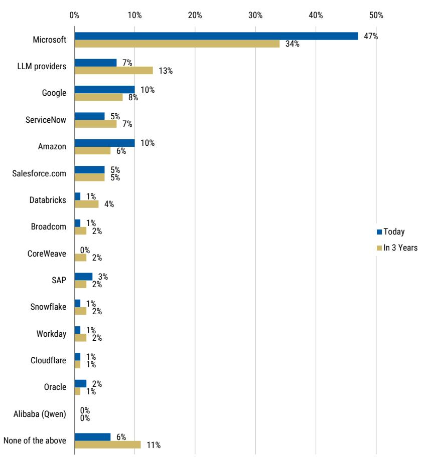  
Source: AlphaWise, MS. n=100 (US and EU data)

Exhibit 12: While CIOs Highlight Microsoft, Amazon, and Google as the Preferred Vendors To Build Custom AI Applications Today, They Point to Modest Share Loss From The Top Three Toward the LLM Providers on a One Year View

Preferred Vendors for Building Custom AI Applications - Today  
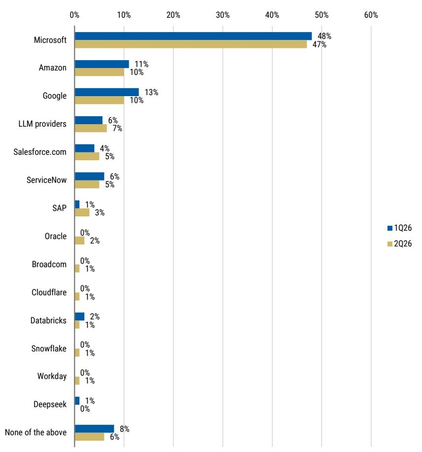  
Source: AlphaWise, MS. n=100 (US and EU data)

Exhibit 13: On a Three Year View, CIOs Re-Highlight Microsoft, the LLM Providers, Google, and ServiceNow as Preferred Vendors for Building Custom AI Applications
Preferred Vendors for Building Custom AI Applications: 3 Years Out  
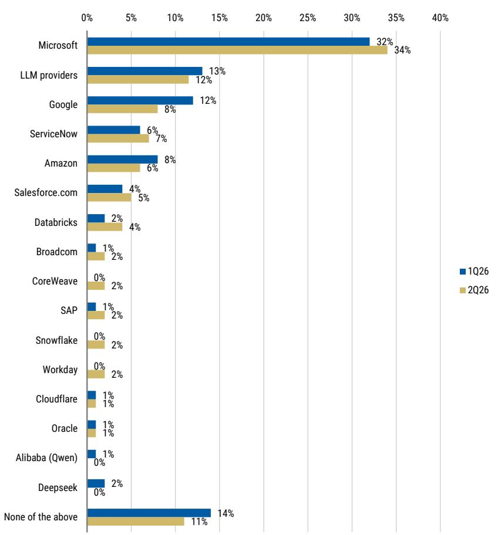  
Source: AlphaWise, MS. n=100 (US and EU data)

Which are your top 3 public cloud providers and what percentage of your application workloads reside in each of them today? What percentage do you expect your application workloads to reside in each of them in three years?

Exhibit 14: Azure and AWS Remain the Dominant Public Cloud Providers Today...  
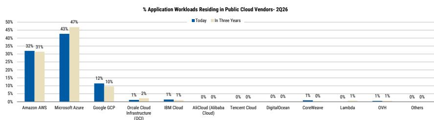  
Source: AlphaWise, MS. N= 60 (US and EU Data)

Exhibit 15: ... With Azure Expected to Remain Leading Share Gainer Over Next Three Years

2Q26 Survey: Usage of Microsoft Azure vs. Microsoft 365 / Office 365  
  
Source: AlphaWise, MS. N=60 (US and EU Data)

Exhibit 16: Weighted Average Growth Expectations Have Accelerated Over the Past Two Surveys and Continues to See the Highest Absolute Growth Expectations Across Vendors in Our Survey

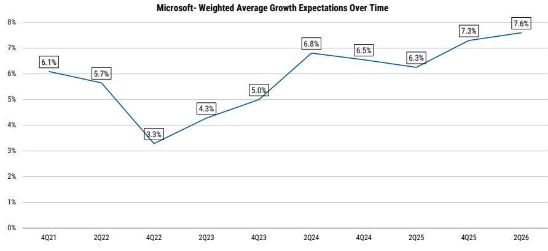  
Source: AlphaWise, MS. N= 60 (US and EU Data)

Are you currently using or planning to use Microsoft Azure or Microsoft 365 / Office 365 public cloud solutions?

Exhibit 17: A Majority of CIOs Indicate Leveraging Microsoft Azure and Office 365 Today and Plan to Increase Spend in The Next 12 Months

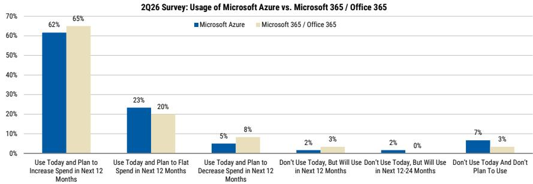  
Source: AlphaWise, MS. n=60 (US and EU data)

Usage of Microsoft Azure vs. Microsoft 365 / Office 365

Exhibit 18: CIOs Indicate Usage and Spending Intentions on Microsoft Azure and Microsoft 365 / Office 365 Continue to Remain Durable  
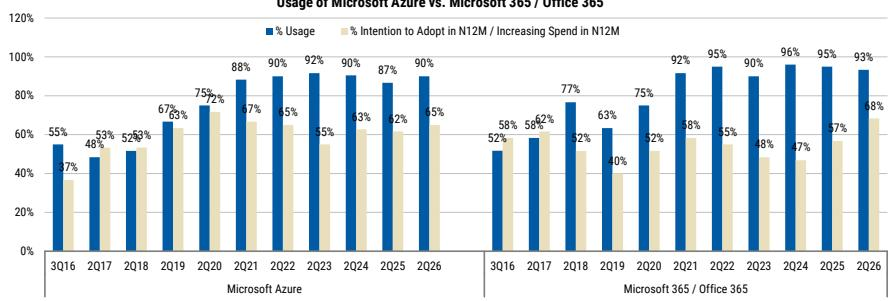  
Source: AlphaWise, MS. n=60 (US and EU data)

If you are currently using Microsoft 365 / Office 365, what subscription level (E1, E3, E5 or E7) are the majority of your employees using today? Do you have any plans to upgrade in the next year?

Exhibit 19: The Shift to Higher Subscription Levels Continues with 47% / 7% of CIOs Using E5 / E7 Licenses Currently...

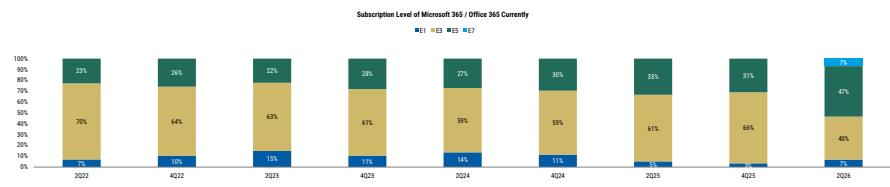  
Source: AlphaWise, MS. n=60 (US and EU data)

Exhibit 20: ...With Expectations for E5 / E7 License Subscriptions Reaching 50% / 21% in the Next Year, Further Supporting Better Copilot Adoption Over N12M  
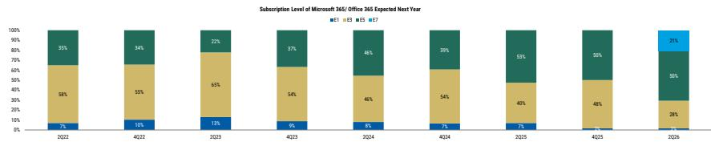  
Source: AlphaWise, MS. n=60 (US and EU data)

Which Microsoft 365 / Office 365 subscription level (E1, E3, E5, or E7) do you expect to use in 2 years?

Exhibit 21: The Shift to Higher Subscription Levels Continues with 45% of CIOs Planning to Use E5 in the Next 2 Years, Down Slightly From 50% in 2Q26, Though Offset by 24% of CIOs Planning to Use E7

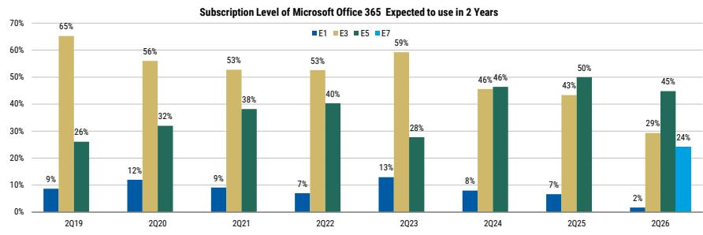  
Source: AlphaWise, MS. n=60 (US and EU data)

Which of the following products incorporating Generative Artificial Intelligence technology around Large Language Models (e.g. GPT 5) or Generative Design (e.g. Dall-e) do you plan to use from Microsoft in your organization in the next 12 months?

Exhibit 22: 88% of CIOs Expect to Use Microsoft 365 Copilot Over the Next 12 Months, up from 72% and 80% in Our Last Two CIO Surveys...

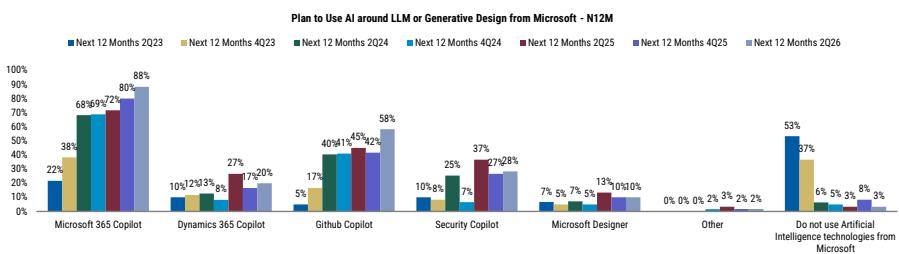  
Source: AlphaWise, MS. n=60 (US and EU data)

Exhibit 23: ...While M365 Copilot Also Continues to be the Most Sought-After Generative AI Product From Microsoft Over the Next 3 Years

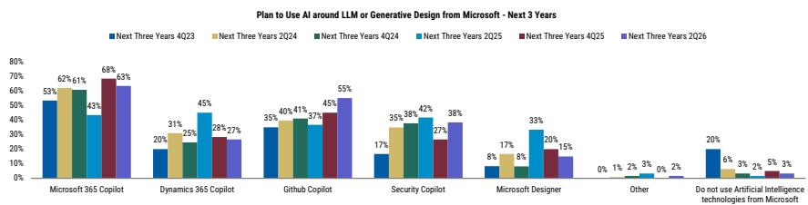  
Source: AlphaWise, MS. n=60 (US and EU data)

If you are planning to use Microsoft 365 Copilot within your organization, what % of your Office user base do you expect to deploy M365 Copilot to over the next 12 months and in 3 years?

Exhibit 24: Microsoft 365 Penetration Expectations Increased From our 4Q25 Survey on Both a Near-Term and Long-Term View  
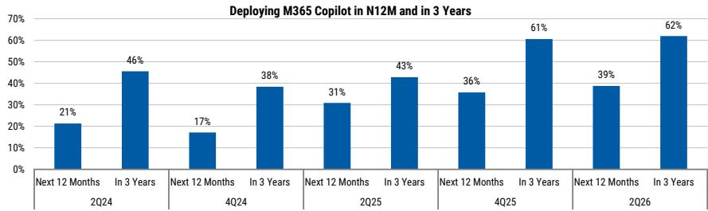  
Source: AlphaWise, MS. n= 60 (US and EU data)

How do you expect your spending on Microsoft On-Premise Server Related Products and Tools (Windows Server, Microsoft SQL Server, Visual Studio, System Center, GitHub and related server products – EXCLUDING Azure and cloud-based software) to change over the following time periods?

Exhibit 25: CIOs Indicate Negative Growth Expectations on On-Premise Related Products and Tools Over the Next 3 Years

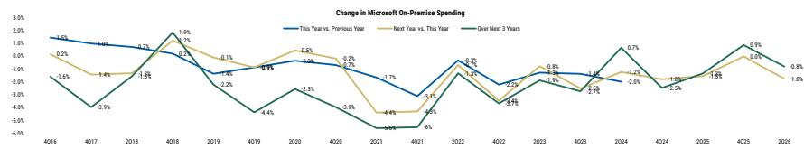  
Source: AlphaWise, MS. n=60 (US and EU data)

If you plan to leverage a cloud-based SaaS ERP and/or GL platform in your next upgrade, which of the following vendors do you expect to be primary?

Exhibit 26: SAP S/4HANA (22%), Microsoft Dynamics (19%), Workday (17%) Screen as the Cloud-Based SaaS Vendors Expected to Be Leveraged in Next ERP / GL Upgrades

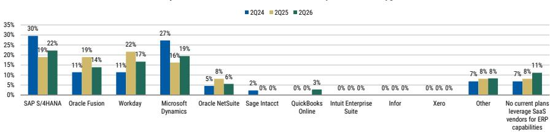  
Source: AlphaWise, MS. n=36 in 2Q25 (US and EU data)

## BROADER SOFTWARE TAKEAWAYS:

Exhibit 27: CIOs Expect ~29 bps of Acceleration in 2026 Software Spending Growth Relative to 2025 Growth In Our 2Q26 Survey...  
2Q26: Software Spending Growth Expectations  
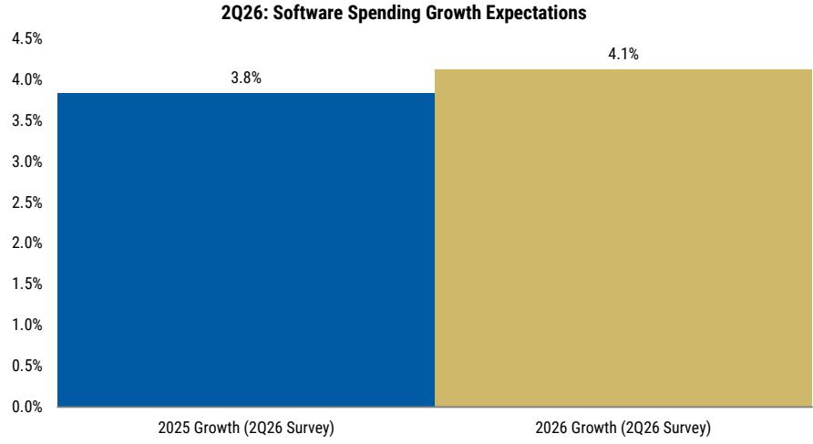  
Source: AlphaWise, MS, n=100 (US and EU data)  
Exhibit 28: ... And On a Sequential Basis, 2025 Software Spending Expectations Also Ticked Up +3 Bps

Software Spending Growth Expectations (2026 vs. 2025)  
  
Source: AlphaWise, MS, n=100 (US and EU data)

Exhibit 29: At 3.8%, CIOs Continue to Expect Modest Budget Growth Acceleration Year-over-Year (+14 bps from 3.7% in 2025)  
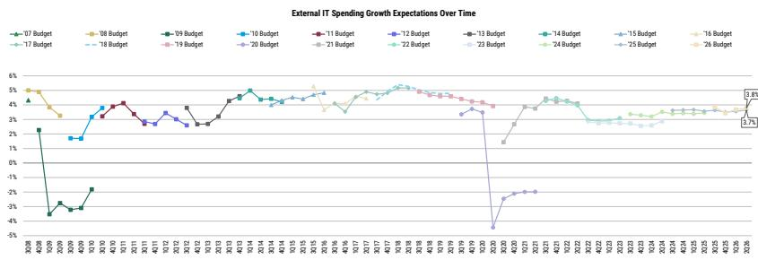  
Source: AlphaWise, MS. N=100 (US and EU data)

2Q26 Survey 1Q26 Survey

## Exhibit 30: Top CIO Priorities Remain Unchanged in 2Q26: AI/ML, Followed By Security Software and Digital Transformation

Projects with Largest Spend Increase in 2026 (% Total Responses)  
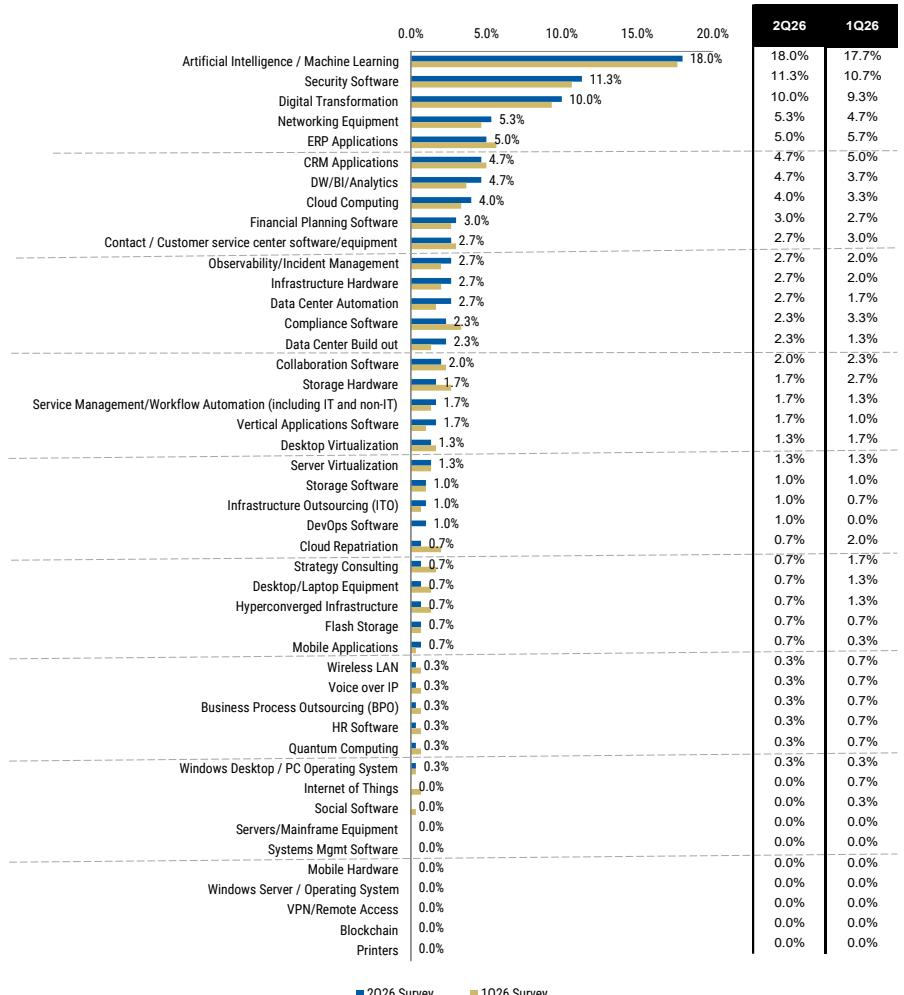  
Source: AlphaWise, MS. n=100 (US and EU data)

Exhibit 31: Security Software Remains The Most Defensive Area Of IT Spend By A Wide Margin, Followed by Digital Transformation and ERP Applications  
% IT Projects Most & Least Likely to Get Cut  
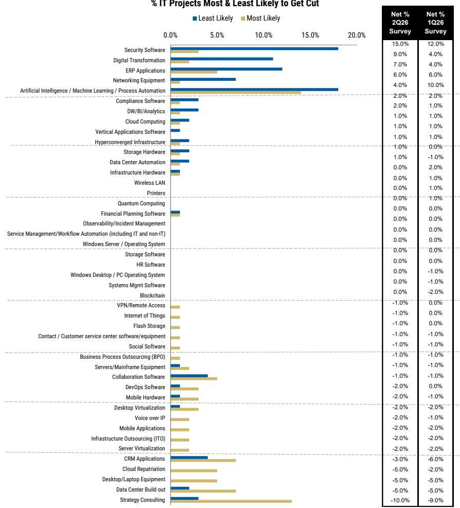  
Source: AlphaWise, MS. n=100 (US and EU data)

Exhibit 32: AI/ML Net Prioritization Hits Another All Time Survey High in 2Q26  
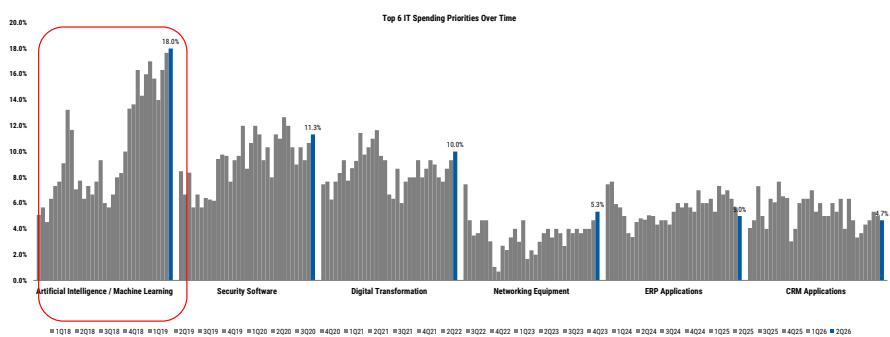  
Source: AlphaWise, MS. n=100 (US and EU data)

What percentage of your application workloads reside in each of the following four areas today? What percentage do you expect to reside in each of these four areas by the end of 2026 and 2028?

Exhibit 33: CIOs Estimate 48% of Application Workloads to Reside in the Public Cloud at the Time of the 2Q26 Survey

Location of Application Workloads (% of Total Workloads)

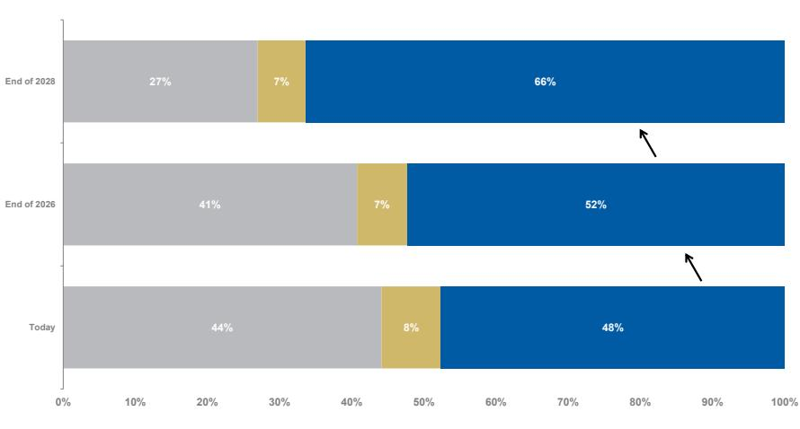  
Source: AlphaWise, MS. n=100 (US and EU data)  
Exhibit 34: CIOs Estimate 66% of Application Workloads to Reside in the Public Cloud by the End of 2028  
Location of Application Workloads (% of Total Workloads)

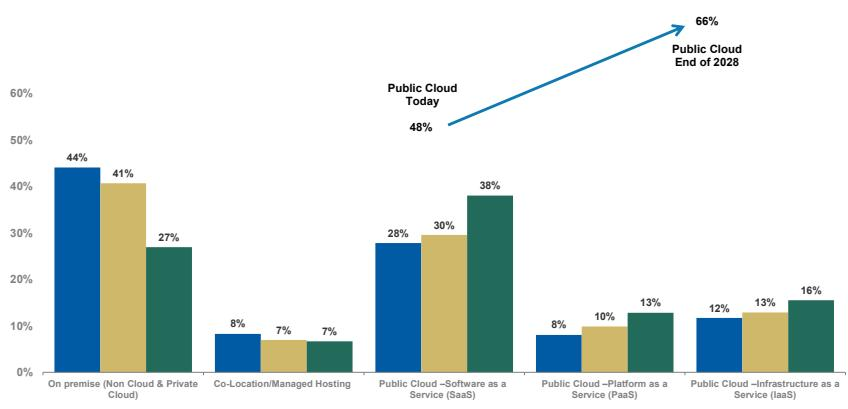  
Source: AlphaWise, MS. n=100 (US and EU data)

Exhibit 35: CIOs See 48% of Application Workloads Running in Public Cloud Today, +4 Points Year-over-Year; Current Migration Pace Remains Ahead of Historical Trends, Though 3-Year Expectations Edge Lower

CIOs' Expectations for % of Application Workloads Running in Public Cloud

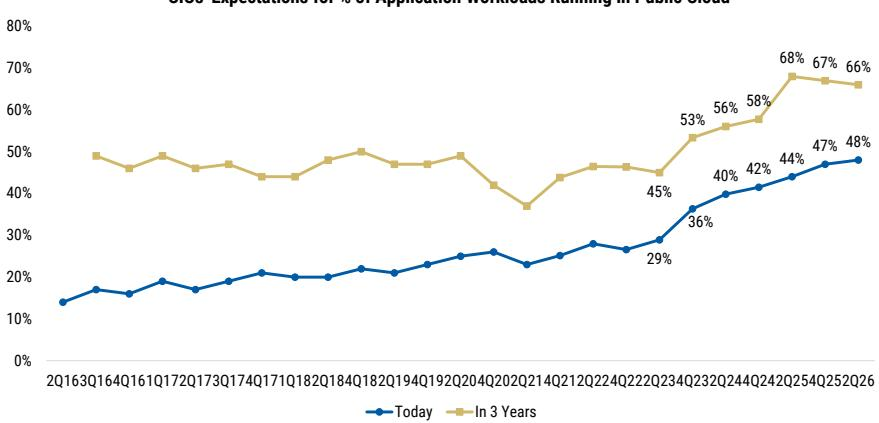  
Source: AlphaWise, MS. n=100 (US and EU data)
