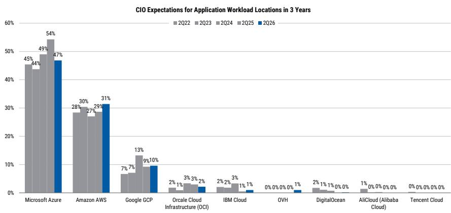
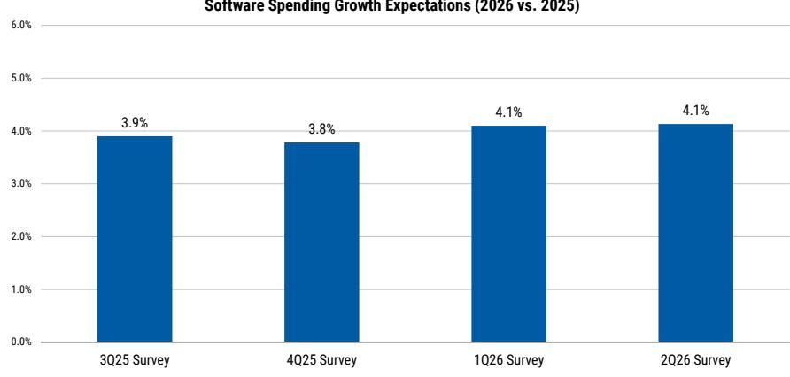

# MS：微软MSFT.US，2Q26CIO调查要点

这份报告的核心观察，并非微软的AI产品有多受欢迎，而是这种受欢迎程度，正在系统性地影响CIO的预算分配。MS2026年第二季度CIO调查显示，微软在软件支出增长预期、云迁移份额、GenAI支出增量三个维度上，均保持了对其他厂商的显著领先。更值得关注的是，这种领先并非来自单一吸引人的产品，而是来自一个正在自我强化的循环：Azure的云基础、M365的订阅升级、以及Copilot的渗透率提升，三者正在形成合力。

调查覆盖了100位美国和欧洲CIO。整体IT预算增长预期从2025年的+3.7%微升至2026年的+3.8%，虽仍低于2010-2019年均值+4.1%，但方向已转向积极。在这个背景下，微软是相对少见一个在2026年支出增长预期上实现加速的软件厂商——从+7.3%升至+7.6%。

## 1. 云迁移和GenAI支出，微软是相对少见同时受益于两条主线的厂商

报告将CIO的预算流向拆解为两个独立问题：云迁移带来的份额变化，以及GenAI带来的增量支出。在这两条线上，微软都位居首位。

在云迁移方面，42%的CIO认为微软将是2026年最大的增量预算受益者，亚马逊为17%。即便拉长到三年维度，微软仍以37%领先。一个值得注意的新变量是LLM提供商（如OpenAI）作为独立受益者出现，三年维度净得分为7%，但这并未影响微软的份额，而是从其他厂商处获取。

在GenAI支出增量方面，微软在2026年以27%的净得分领先，亚马逊和LLM提供商分别为10%和11%。三年维度，微软的领先优势进一步扩大至30%，而LLM提供商为17%。这意味着，CIO们并不认为LLM提供商会取代微软，而是将其视为补充。

> **KC评论：** 这两组数据放在一起看，结论更清晰：微软在“基础设施迁移”和“应用层创新”两个预算池中都占据了头部位置。LLM提供商的崛起，更多是分走了其他云厂商和传统软件厂商的蛋糕，而非微软的。

## 2. M365的升级路径正在被E7重新定义，这是比Copilot更确定的收入引擎

报告中最容易被忽视的细节，是E7订阅层级的首次纳入调查。此前，CIO的升级路径是从E3到E5。现在，E7的出现意味着微软在M365内部创造了一个新的溢价层。

数据上，当前已有7%的员工使用E7，而21%的CIO预计明年将采用E7。加上E5的50%采用率，明年将有71%的CIO使用E5或E7。这比单纯看Copilot渗透率更有意义，因为E7本身就是一个更高ARPU的订阅包，Copilot只是其组成部分之一。

与此同时，M365/O365的支出意愿也在显著提升：65%的CIO计划增加支出，而2025年同期仅为55%。这种改善并非来自用户数增长，而是来自订阅层级的向上迁移。

## 3. 应用软件领域并非全面受益，微软和ServiceNow是少数赢家

报告对应用软件板块的判断是克制的。虽然软件仍是IT支出中增长最快的类别（+4.1%），但CIO的支出意愿高度分化。在调查覆盖的所有厂商中，只有微软和ServiceNow的2026年增长预期是加速的。

背后的逻辑是：CIO并不想简单叠加一层新的AI点解决方案。他们更倾向于通过现有平台来整合AI能力，减少软件碎片化。报告用一个新问题验证了这一点：CIO在“AI原生软件采用”和“供应商整合倾向”两个维度上存在高度重叠。在协作/内容管理、营销应用、IT运维等领域，CIO既希望采用AI能力，又希望减少供应商数量。这指向了平台型厂商的机会，而非纯AI初创公司。

微软在Agentic自动化（36%）、自定义AI应用构建（47%）等新兴领域同样领先。这些数据共同指向一个结论：微软正在成为企业AI部署的默认平台层。

> **KC评论：** 这份报告最有价值的框架，是它将“AI采用”和“供应商整合”放在一起看。它提醒读者，不要只盯着Copilot的用户数增长，更要关注微软如何通过E7、Azure和Copilot的组合，把AI能力嵌入到现有的合同和预算结构中。这才是份额可持续增长的基础。

For informational purposes only. Portions may be generated,translated,summarized,or edited with AI assistance based on source materials and may contain omissions or errors. Please verify independently. This is not investment,legal,tax,accounting,or other professional advice.

For informational purposes only. Portions may be generated,translated,summarized,or edited with AI assistance based on source materials and may contain omissions or errors. Please verify independently. This is not investment,legal,tax,accounting,or other professional advice.

