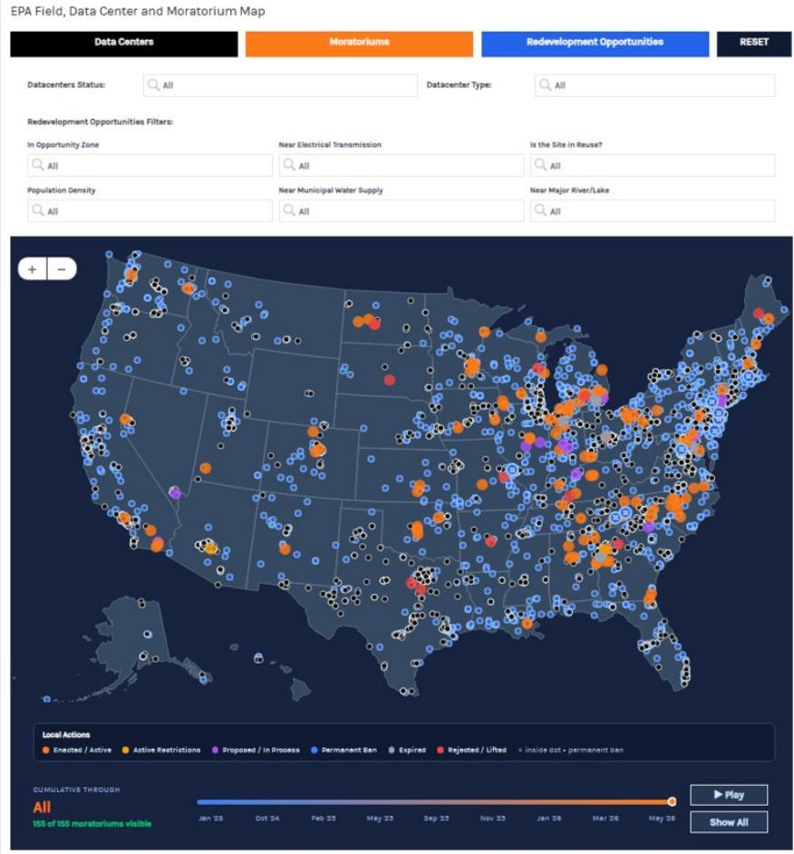
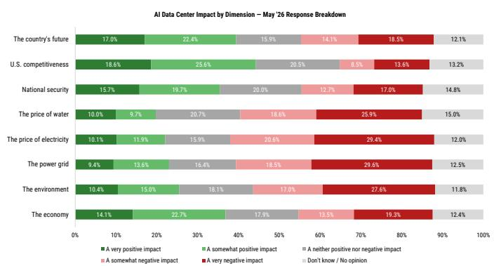
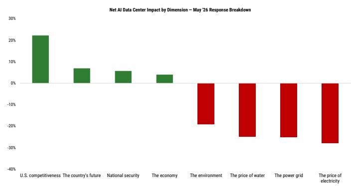
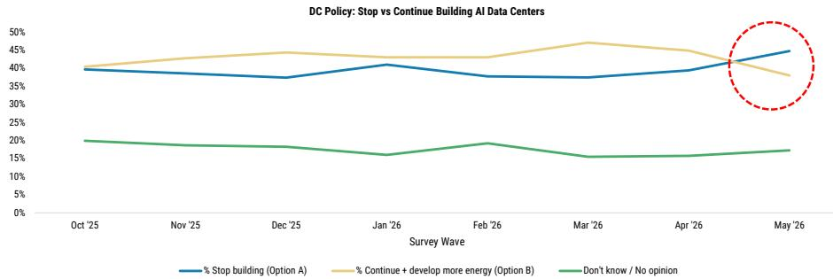
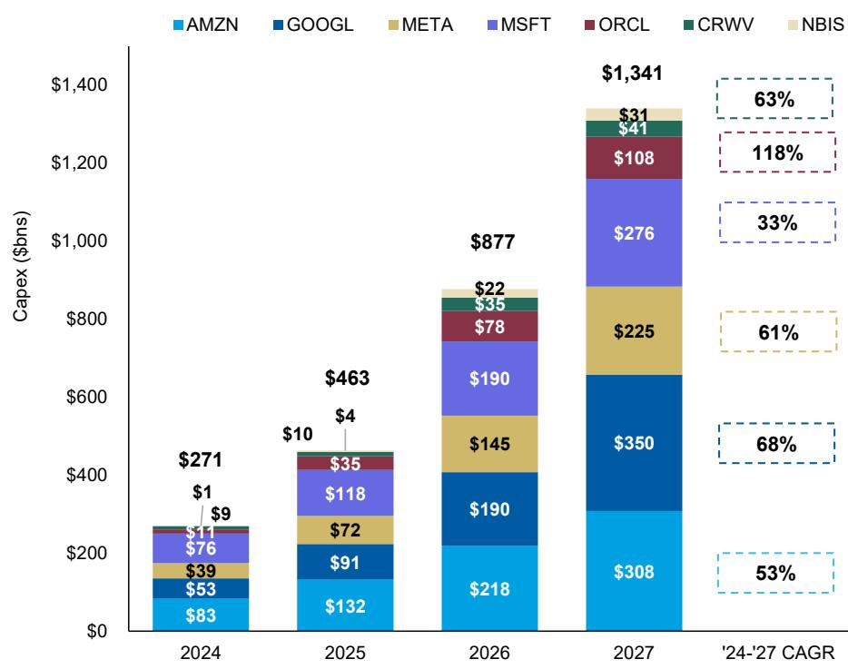
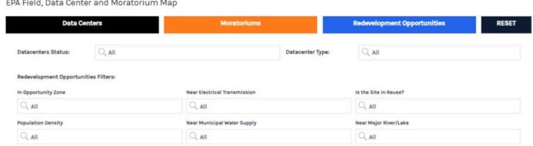
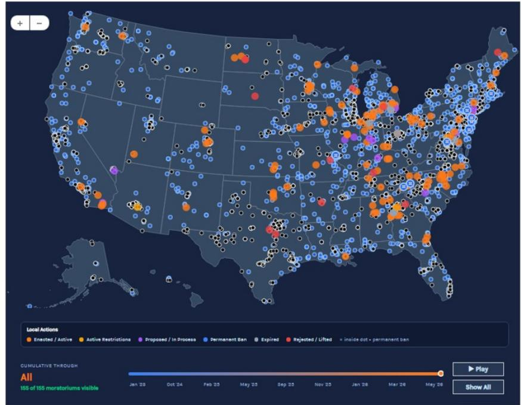

July 14, 2026 04:01 AM GMT

US Thematics | North America

# Power Struggle: AI, Data Centers & Local Backlash

Community pushback against data center construction has accelerated in 2026 as new moratoriums have been introduced, with the majority of the change happening at the local level. This puts pressure on costs and timelines and could alter the geographic distribution of data centers.

## Future of Energy

A MS Key Theme of 2026

A MS Key Theme of 2026

Do the politics of energy imperil the data center build-out? Readers will recall that we cited AI-related capex as a growth driver underpinning our economic outlook back in May; MS estimates AI capex at \$877 billion in 2026. We are seeing local communities push back — via legislation, moratoriums, etc. — on the data center build-out, which raises the question: Does this type of opposition limit the extent to which the US can build out its AI infrastructure? An estimated\~\$156 billion of projects were cancelled or delayed in 2025, and \$130 billion already in 1Q26.

Why are consumers and local communities pushing back against data center construction? Opposition largely falls into 3 main categories: (1) concern around potential impacts on power bills, (2) environmental concerns including water use and waste heat, and (3) local quality of life concerns around large construction projects including noise, dust, and traffic.

Moratoriums are spreading, but most are pauses, not bans. Most of the activity is occurring at the local level, though an increasing number of state level legislative proposals are emerging. Importantly, the vast majority of proposals are moratoriums rather than outright bans. The data center build-out has been occurring rapidly and the majority of communities are looking for more time to consider impacts rather than a permanent ban on activity.

The consequences here are myriad, and not only for the obvious sectors in scope — data center REITs as well as US power & utilities. Just as relevant are the implications for the financing ecosystem supporting these developments, and the implications for the US position in the AI race relative to other countries.

What Does this Mean for Markets? We believe opposition will put upward pressure on costs and timelines, contributing to project dispersion across the US, as the country remains the priority region for US developers. From an equity market standpoint, data centers are likely to increasingly adopt onsite generation, benefiting SEI, INIO, and BE, all rated OW, while publicly traded colocation data center REITs, including OW-rated EQIX and EW-rated DLR, should remain relatively insulated from political pushback given their smaller scale versus neoclouds or hyperscale owned AI training data centers and their role as society's critical infrastructure. From a macro standpoint, within credit, sustained data center pushback could ultimately extend the cycle and reduce future supply by lowering capex and financing needs, but near term capex front loading may worsen already-building issuance pressure, especially given the AI ecosystem has driven nearly all of this year's incremental corporate supply. Within securitized credit, existing ABS and CMBS transactions look relatively insulated from political challenges facing early-stage data centers, while any slowdown in new builds should be supportive by reducing oversupply risk ahead of key refinancing windows.

Executive Summary

Politics are becoming impossible to separate from the data center build-out: We highlighted "The Politics of Energy" as one of our 10 thematic predictions to watch heading in 2026, in particular the risk of rising backlash against data center growth becoming a key wedge issue ahead of the midterm elections. To be sure, this has played out so far: as the issue rises in salience with voters, third parties report an estimated value of \~\$156 billion of projects were cancelled or delayed in 2025, and \$130 billion already in 1Q26. These instances of local opposition have grown louder across state lines, as lawmakers at the federal level are now introducing legislation toward this end. If realized — or if local opposition continues to grow, even if contained at the state level — then we see a greater risk of actual AI capex falling short of our \$877 billion estimate for 2026, carrying a multitude of implications across equity sectors & the macro backdrop.

Data center moratoriums have precedent, and are expanding at the state and local level. To be sure, a growing number of localities have passed or proposed guardrails and restrictions on data center projects: guardrails introduced include infrastructure cost-sharing requirements, ratepayer protection initiatives, environmental disclosure rules and zoning changes. Restrictions have mostly been in the form of temporary moratoriums, impacting future projects or those lacking vested status. Further, although the explicit public opposition has tended to concentrate more in blue states and among Democratic-leaning voters, we're seeing state-wide data center moratorium proposals emerge roughly evenly in Democratic trifectas, Republican trifectas, and divided governments. Importantly, most efforts are aimed at slowing — not reversing — the build-out, as many of these policy initiatives are temporary.

Exhibit 1: Proposed State-Level AI Data Center Moratorium Bills & Political Breakdown

<table><tr><td>State</td><td>Bill(s)</td><td>Status</td><td>Description</td><td>Governor</td><td>Senate</td><td>House</td><td>Alignment</td></tr><tr><td>Delaware</td><td>SB 353</td><td>Introduced</td><td>Moratorium through Jan. 31, 2027 on applications and permits for data centers able to use 100 MW or more.</td><td>Matt Meyer (D)</td><td>D</td><td>D</td><td>Aligned</td></tr><tr><td>Georgia</td><td>HB 1059</td><td>Introduced</td><td>Forbids local governments from permitting data centers until Dec. 31, 2028.</td><td>Brian Kemp (R)</td><td>R</td><td>R</td><td>Aligned</td></tr><tr><td>Maine</td><td>LD 307 / HP 207</td><td>Vetoed</td><td>Creates Maine Data Center Coordination Council and temporarily limits certain data centers over 20 MW until Nov. 2027.</td><td>Janet Mills (D)</td><td>D</td><td>D</td><td>Aligned</td></tr><tr><td>Maryland</td><td>HB 120</td><td>Failed</td><td>Prohibits construction or permitting of new data centers under stated co-location/generation conditions.</td><td>Wes Moore (D)</td><td>D</td><td>D</td><td>Aligned</td></tr><tr><td>Michigan</td><td>HB 5594 / HB 5595</td><td>Introduced</td><td>Local governments and state agencies may not permit/approve certain new data centers until Apr. 1, 2027.</td><td>Gretchen Whitmer (D)</td><td>D</td><td>R</td><td>Divided</td></tr><tr><td>Minnesota</td><td>HF 4888 / SF 4298</td><td>Failed</td><td>Bans new data-center permits until a Public Utilities Commission report, no earlier than July 2027.</td><td>Tim Walz (D)</td><td>D</td><td>NP</td><td>Divided</td></tr><tr><td>New Hampshire</td><td>HB 1265</td><td>Failed</td><td>Establishes a one-year moratorium on data-center construction.</td><td>Kelly Ayotte (R)</td><td>R</td><td>R</td><td>Aligned</td></tr><tr><td>New York</td><td>A11560 / S10642</td><td>Passed Legislature</td><td>Places a one-year moratorium on large data-center permits and adds service-classification, energy-efficiency and host-community provisions.</td><td>Kathy Hochul (D)</td><td>D</td><td>D</td><td>Aligned</td></tr><tr><td>Oklahoma</td><td>SB 1488</td><td>Failed</td><td>Establishes a moratorium on data-center construction until Nov. 2029 and requires a study.</td><td>Kevin Stitt (R)</td><td>R</td><td>R</td><td>Aligned</td></tr><tr><td>Pennsylvania</td><td>SB 1359 / HB 2533</td><td>Introduced</td><td>Creates a statewide three-year moratorium on hyperscale data centers and impact studies, or authorizes municipal moratoriums.</td><td>Josh Shapiro (D)</td><td>R</td><td>D</td><td>Divided</td></tr><tr><td>South Carolina</td><td>H 5526</td><td>Introduced</td><td>Blocks state/local acceptance or action on data-center applications until a comprehensive oversight framework is enacted.</td><td>Henry McMaster (R)</td><td>R</td><td>R</td><td>Aligned</td></tr><tr><td>South Dakota</td><td>SB 232</td><td>Failed</td><td>Imposes a one-year moratorium on construction or expansion of hyperscale data centers.</td><td>Larry Rhoden (R)</td><td>R</td><td>R</td><td>Aligned</td></tr><tr><td>Vermont</td><td>S.205</td><td>Introduced</td><td>Creates a moratorium on AI data centers until 2030 and requires a report on impacts.</td><td>Phil Scott (R)</td><td>D</td><td>D</td><td>Divided</td></tr><tr><td>Virginia</td><td>HB 1515</td><td>Continued</td><td>Prohibits final local approval for a new data center until interconnection requests are fulfilled or July 1, 2028.</td><td>Abigail Spanberger (D)</td><td>D</td><td>D</td><td>Aligned</td></tr><tr><td>Wisconsin</td><td>SB 1061 / AB 1099</td><td>Failed</td><td>Prohibits data-center operation until 14 listed conditions are satisfied.</td><td>Tony Evers (D)</td><td>R</td><td>R</td><td>Divided</td></tr></table>

Source: NCSL, MultiState, MS

## Tracking Data Center Moratoriums

We track opposition efforts at the local, state, and federal levels in the text below and encourage readers to click through our interactive map below to get more detail on the opposition efforts.

  
Exhibit 2 Data Center Moratorium Interactive Map  
Source: AlphaWise Web Intelligence, MS, 451 Research, Interconnected Capital, EPA.

Consumer survey data reflects the idea that the public is broadly supportive of some limitation on data center construction. Roughly half of respondents in a recent Morning Consult survey believe AI data centers negatively affect electricity prices and the power grid, while concerns about water prices and the environment are close behind at around 45%. Since October 2025, a larger share of consumers now view AI data centers as having a negative impact across most dimensions, with the biggest increases in concern related to water prices and the environment. In May 2026, for the first time since October 2025, more respondents to Morning Consult's monthly survey favored halting data center construction (\~45%) over continuing to build while expanding energy supply (\~38%). The share selecting "don't know/no opinion" held roughly steady.

Exhibit 3: AI Data Center Impact by Dimension (May 2026)  
  
Source: Morning Consult, AlphaWise Web Intelligence

Exhibit 4: Net AI Data Center Impact by Dimension (May 2026)  
  
Source: Morning Consult, AlphaWise Web Intelligence

Exhibit 5:  
DC Policy: Stop vs Continue Building AI Data Centers  
  
Source: Morning Consult, AlphaWise Web Intelligence

Do these risks consequently imperil the US position in the global AI race? If the local policy efforts are either 1) made permanent and continue to expand and/or 2) reflected at the federal level, then we think the US risks keeping pace with other countries on the global AI competitive landscape. However, in our view, the geopolitical realities are hard to ignore, and therefore make it less likely that the federal government will meaningfully obstruct the US data center build-out. We think a conditional build-out is therefore a more likely outcome: given the integration of data centers into the physical layer of AI competition, we think projects may be heavily scrutinized, delayed, or contingent upon certain environmental or community-focused concessions.

In that vein, we see community benefits and local economic trade-offs as increasingly important, we think the three key levers to improve data center efficiency and address community concerns are:

1. Utilization: Improving utilization of existing data center capacity is one of the most immediate ways to increase efficiency, particularly as many facilities operate at only 30–40% utilization despite their high capital intensity. Better use of existing infrastructure can reduce the need for incremental capacity additions and improve the overall return on deployed capital.

2. Power: Data centers can address power constraints through on-site generation, demand response, and grid-support services. By combining renewables and storage, shifting non-critical workloads, and using UPS batteries to support grid frequency, operators can improve resilience, lower grid strain, and potentially create new revenue streams.

3. Water: Water efficiency is becoming a growing community and operational priority, with policy shifting from outright restrictions toward standards, disclosures, incentives, and performance benchmarks for data center water usage. This creates opportunities for enablers such as liquid cooling, water recycling, wastewater treatment, desalination, and ultra-pure water recovery technologies, all of which can reduce consumption and help operators meet tightening sustainability requirements.

## Economic & Market Implications

US Economic Implications: the risk from data center growth is not a sudden nationwide electricity-price shock, but a stickier and more regional electricity inflation impulse. National electricity CPI remains elevated relative to its pre-COVID trend, and we expect it to settle at 4–5% y/y over the medium term as data center demand adds to underlying pressure. The strongest evidence is regional: Data center–heavy markets, particularly the South Atlantic/Northern Virginia, are seeing faster residential electricity inflation and higher wholesale power prices. The consumer impact is likely to be uneven and regressive, with affordability pressure most acute in regions where data center load growth collides with already elevated electricity burdens, transmission constraints, and slower grid expansion.

Equity market implications: we see the elevated political risk environment shifting cost allocation toward large load customers and creating bottlenecks around interconnection and labor. With an estimated \~38GW potential shortfall in power through 2028, we see data centers trending toward onsite generation as an attractive solution to address long lead times (5+ years in certain regions), which should be positive for SEI, INIO, and BE (all OW). We think publicly traded colocation data center REITs (OW EQIX, EW DLR) are largely insulated from the political pushback, as they are much smaller than the hyperscale/AI training data centers & are considered critical infrastructure.

Fixed income implications: pushback can clearly weigh on the timing and intensity of the capex cycle, either drawing it out over a longer period of time, or curtailing total investment needs. The AI build-out has shaped the market narrative across multiple forms of credit (corporate, securitized, private) via several key vectors, including: 1) significant debt supply across different channels, 2) increased fundamental exposure to the AI story on the back of a growing data-center debt sector and hyperscaler concentration, and 3) AI disruption fears in vulnerable sectors, that has driven tiering in performance across different segments within credit (e.g., private vs. public). The extent to which the pushback delays or constrains the buildout will be meaningful across the below asset classes:

\- Credit: Drawing out the cycle & lower investment needs ultimately result in less supply. When we consider lower capex & associated financing needs in addition to the fact that almost the entire "delta" in corporate supply this year has come from the AI ecosystem, sustained pushback could mean a notable reversal in the issuance picture. Further, front-loading of capex could add to the already-building supply pressures in the market in the nearer term.

\- Securitized credit: The existing transactions are relatively insulated from the political challenges of data centers that are being planned or in their early stages of construction and power sourcing. We would view any obstacles that prevent or slow down the data center build as positive for ABS and CMBS, as it limits the risk over oversupply or overbuild, particularly before the refinancing window of many deals.

\- Munis: the pushback is credit positive; expect more supply. Pushback means more balanced tax incentive deals. That could drive billions in property tax revenue — a credit positive. Higher costs could encourage more developers to seek tax-exempt capital, and for more muni utilities to prepay energy needs. Altogether, that could drive \$100 billion in incremental muni supply.

\- With lower compute built out, the disruption timeline also gets pushed back, allowing companies and sponsors to have more runway to come up with refinancing solutions. As a result, actual defaults in this scenario might be lower than expected, and the YTD laggards like private credit/BDCs, loans might gain traction as an "anti AI" trade.

## Local backlash has delayed or canceled \~\$286B of data-center projects — with consequences across...

DATA CENTER REITS

POWER & UTILITIES

  
CREDIT & FINANCING

  
ECONOMIC GROWTH

  
US-CHINA AI RACE

## Why the pushback?

Opposition falls into 3 main categories:

Concern over impacts on power bills

Environmental concerns — water use & waste heat

Local quality of life — noise, dust & traffic

## Pauses, not bans.

Most activity is at the local level, though state-level proposals are rising. The build-out has moved fast and most communities want more time to weigh impacts — most efforts aim to slow, not reverse development.

## DATA CENTERS MEET THE TOWN HALL — KEY FIGURES

## \$156B

of projects canceled or delayed in 2025

## \$130B

already canceled or delayed in 1Q 2026

## \$877B

2026 AI capex estimate now at risk of falling short

states have proposed statewide moratoriums

say data centers hurt electricity prices & the grid

## NET CONSUMER SENTIMENT ON AI DATA CENTERS BY DIMENSION (%)

U.S. COMPETITIVENESS

COUNTRY'S FUTURE

NATIONAL SECURITY

THE ECONOMY

PRICE OF ELECTRICITY

# US Thematics: Weighing AI Data Center Politics

Michelle Weaver, Anna Feldman, Ariana Salvatore, Mark Schmidt

Data Centers Meet the Town Hall

Expanding legislation activity at all levels of government and rising local opposition presents a critical consideration for assessing the scale and pace of the data center build-out in the United States. According to Data Center Watch, which tracks local opposition to data center projects, an estimated value of \$156 billion of projects were cancelled or delayed in 2025, and \$130 billion in 1Q26 alone. While we continue to view power, memory and labor shortages as key bottle-necks for the AI infrastructure build-out, political push-back is increasingly cited as a concern for data center development. Bloom Energy's 2Q26 Mid-Year Pulse survey found that 28% of developers see community scrutiny worsening as a barrier to data center development, on par with cost of grid upgrades and second only to construction costs.

Our analysts continue to see upward bias to hyperscaler capex estimates, currently reflecting over \$870 billion in 2026 and over \$1.3 trillion in 2027. While the federal government continues to lean supportive, a growing number of localities have passed or proposed guardrails and restrictions on data center projects. Guardrails introduced include infrastructure cost-sharing requirements, ratepayer protection initiatives, environmental disclosure rules and zoning changes. Restrictions have mostly been in the form of temporary moratoriums, impacting future projects or those lacking vested status. Though state-wide moratoriums have not been enacted thus far, proposed plans could also impact projects with existing permitting, and even ongoing construction if signed by governors. Even without policy action, lawsuits have been enough to cause developers to withdraw from projects. On the other hand, some states have been increasing incentives to attract data centers.

We assess developments across the country to identify drivers of support and opposition, and evaluate their potential to pose risk to the AI data center build-out in the US. We believe opposition will put upward pressure on costs and timelines, contributing to project dispersion across the US, as the country remains the priority region for US developers. It is important to note that moratoriums are temporary measures, and longer-term approaches to regulating AI data centers will inform how the build-outs unfold.

Exhibit 6: Hyperscaler and Neocloud Capex Forecast  
  
Source: MS

As primary markets for data centers become increasingly concentrated and permitting timelines stretch, various sources indicate data center projects are expanding geographically.

\- Cushman & Wakefield's latest Global Data Center Market Comparison report ranks Dallas as the number one primary data center market in the world for the first time, followed by Atlanta and Virginia. Austin-San Antonio and West Texas are leading secondary and tertiary markets.

\- Pew Research reports that 67% of planned data centers are located in rural areas while 87% of current sides currently in urban regions. Over one third of data centers are planned in counties that do not have existing data centers (39%), and three quarters will be built in the South and Midwest.

This demonstrates increasing prioritization of time-to-power over latency concerns for a meaningful portion AI data center development, though core markets will likely remain in demand due to connectivity benefits, existing fiber ecosystems and proximity to population centers. Training sites can more easily prioritize land and power, though inference is also driving demand for regional and distributed data centers with low latency. Growing secondary and tertiary markets, such as West Texas, attract projects with abundant land and power resources, though these areas are also beginning to see opposition and introduction of guardrails.

## Tracking Data Center Moratoriums

We track opposition efforts at the local, state, and federal levels in the text below and encourage readers to click through our interactive map below to get more detail on the opposition efforts.

Exhibit 7 Data Center Moratorium Interactive Map  

Source: AlphaWise Web Intelligence, MS, 451 Research, Interconnected Capital, EPA.

The mapping tool provides an overview of the following datasets:

\- 451 Research Data Center Locations (as of 1Q26), including owner, operational status, and utility power usage (where available). This dataset can be toggled to differentiate between existing data centers and those still in the planning or construction phase. Given the rapid growth in the announced data center pipeline and evolving project disclosures, our analysis should be viewed as a point-in-time snapshot of the industry's geographic distribution, constrained by currently available data.

\- Interconnected Capital's Moratorium Tracker including status, length and scope (as of 6/26/26).

\- EPA's Superfund (and brownfield) Redevelopment Mapper including toggles for opportunity zone (existing tax incentives for redevelopment), proximity to electrical transmission and water sources, reuse status and population density.

Geographic expansion at scale implicates more communities and introduces new sources of opposition and support across party lines. Frictions between community, state and national priorities (and timelines) are now much broader than electricity price concerns (though these remain at the forefront, see more here). We outline common logic behind moratoriums for various stakeholders in the table below, and find that general strain on resources and large scale land-use changes are common community, local and state government concerns. Key factors to watch include expanding rural community concerns in addition to urban and suburban. In examples of support for data center projects, we find that economic development is a common denominator, strongest in localities dependent on industries no longer active (though not all such communities welcome data centers either). The federal government and the EPA have supported repurposing Superfund and brownfield sites (often former industrial sites) for data center development, have published guidelines and worked to speed up their cleanup and remediation process across the country. The EPA map and database (Exhibit 8) allows users to filter for sites with industrial zoning, roads, water, fiber, and energy infrastructure that also overlap with Opportunity Zone incentives that can aim to attract private capital to distressed communities. While data center developers have still largely targeted greenfields due to clean-up and remediation costs and timelines these sites require, they may become increasingly viable amid local opposition (especially to repurposing greenfields for industrial use).

Exhibit 8: Moratorium Logic for Different Stakeholders

<table><tr><td>Place type</td><td>Moratorium logic</td><td>Typical concern</td></tr><tr><td>Rural counties / small towns</td><td>“Pause before greenfield industrialization happens.”</td><td>Farmland, aquifers, wells, roads, fire service, grid capacity, landscape character.</td></tr><tr><td>Suburbs/ Semi-Rural</td><td>“Pause before an industrial-scale use lands near homes.”</td><td>Noise, lighting, property values, diesel backup generators, traffic, neighborhood fit.</td></tr><tr><td>Large cities</td><td>“Pause before utility, environmental-justice, and land-use systems are overwhelmed.”</td><td>Power demand, water use, ratepayer impacts, redevelopment priorities, neighborhood burden.</td></tr><tr><td>States</td><td>“Pause or regulate before large-load projects shift costs onto the statewide grid.”</td><td>Electricity planning, utility bills, emissions, water reporting, permitting, tax incentives, consumer protection.</td></tr><tr><td>Federal</td><td>“Pause or condition national AI/data-center buildout until national safeguards exist” — but current federal executive/regulatory policy also has a competing pro-buildout / speed-to-power posture.</td><td>AI safety, national competitiveness, grid reliability, ratepayer protection, labor displacement, civil liberties, environmental impacts, export controls, and whether local communities retain approval power.</td></tr></table>

Source: MS

## Policy Action: Local Governments

The data-center pushback has been primarily bottom up, with cities, counties, and townships enacting moratoriums, bans, and restrictions largely in reaction to nearby projects, though preemptive actions are growing. More than 300 moratoriums have passed since 2023 (one tracker counts 127 currently active), with proposals accelerating this year and restrictions now touching 40 states across all regions and political leanings. Michigan, North Carolina, and Georgia lead, and most actions occur at the city or county level. The top concerns cited are water and energy use, zoning and land use, and environmental and health impacts, and the tools extend well beyond pauses to include setbacks, noise limits, water-impact reviews, and public-hearing requirements. Importantly, the temporary nature of most actions reflects a need for time to study impacts and build capacity rather than fundamental opposition: a CSIS panel and Brookings both noted that localities—especially rural ones with limited planning staff—are being forced into fast, high-stakes decisions, while large cities like Seattle use moratoriums to assess long-term effects and hold parties accountable.

The specific measures vary widely in scope. Many moratoriums pause only the consideration and approval of new proposals, though some also cover expansion or construction, and definitions of "data center" range from AI facilities to email servicing and even battery storage. Larger cities tend toward targeted restrictions eg Atlanta barred data centers from its Beltline Overlay District and several jurisdictions have carved out projects already in progress, as when Boyd County, Kentucky and Tulsa, Oklahoma exempted specific developments. Michigan illustrates how opposition clusters around experience with particular projects: more than 50 communities there have acted, including Saline Township, where a moratorium followed a drawn out fight over a frontier lab site that ended in a settlement, yet the town's continued push to amend zoning signals that concerns persist. At the far end of the spectrum, permanent and indefinite bans have emerged, from Monterey Park, California (the first city to ban data centers by popular vote) to New Jersey, which leads in permanent bans partly because its Municipal Land Use Law caps moratoriums at six months, effectively pushing towns toward outright bans. Beyond resource strain and environmental concern, these communities also cite the preservation of rural character, scenery, and heritage.

Increasingly, local leaders are looking past their own borders for larger-scale solutions. Officials in New Jersey towns with bans have called for state wide moratoriums and regulation, arguing that projects are harming a growing number of communities. Others are joining international efforts: during London Climate Action Week in June, 40 mayors (half from U.S. cities including Seattle, Chicago, Phoenix, and Miami) signed a pact on urban data center development. Rather than prohibiting facilities, the pact offers a roadmap for a build-out that delivers cleaner energy, lower costs, and healthier communities, emphasizing sustainability, community engagement, and shared, scalable solutions across cities. Seattle's participation while maintaining its own moratorium captures the broader posture of much of this movement: an attempt to balance competing priorities rather than reject data centers outright.

## Policy Action: States

State actions thus far have focused on grid interconnection, cost allocation, utility tariffs, tax incentives, and permitting acceleration. However, 300 state data center bills were filed in the first six weeks of 2026, 15 states have proposed state-wide moratoriums, and others yet are adding tax incentives to attract data centers. Some bills aim to pause incentives and introduce guidelines, while moratoriums aim to completely pause new data center projects and/or delay existing ones. New York state is currently closest to enacting a statewide moratorium, pending Gov. Kathy Hochul's approval. Statewide data-center moratorium proposals do not appear to be primarily a product of one-party control, and have emerged roughly evenly in Democratic trifectas, Republican trifectas, and divided governments. Same-party control may improve the odds that a proposal advances procedurally, as seen in Maine and New York, but the current 15-state sample provides only weak evidence of a governance-alignment effect. The stronger explanation appears to be localized concern over energy, water, infrastructure, community impacts, and public subsidies. According to NCSL, 8 proposals are in "introduced", "passed legislature," or "continued" status (others failed or were vetoed in current format).

Local considerations superceded general political alignment in Maine's decision to veto a state-wide moratorium. The Democratic governor vetoed a proposed moratorium by Democratic-controlled legislature citing local economic conditions for a specific town, Jay, earlier this year. In Jay, a proposed data center (currently on hold indefinitely due to developer reasons) would be located at a former paper mill brownfield site, formerly a key employer for the town. Importantly, the governor generally agreed with the idea of a moratorium on data centers, as did other Maine towns, and was one exemption away from approving it.

Exhibit
