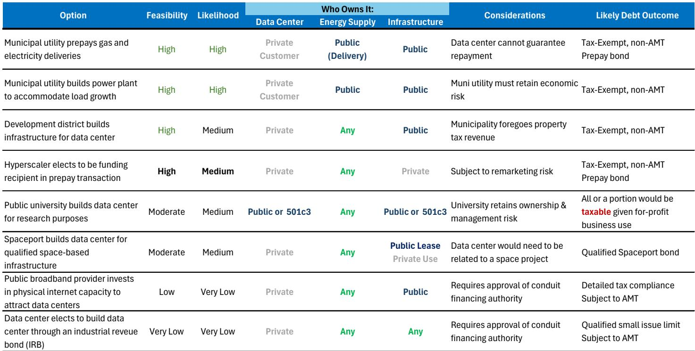
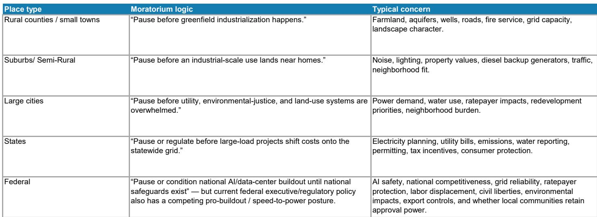
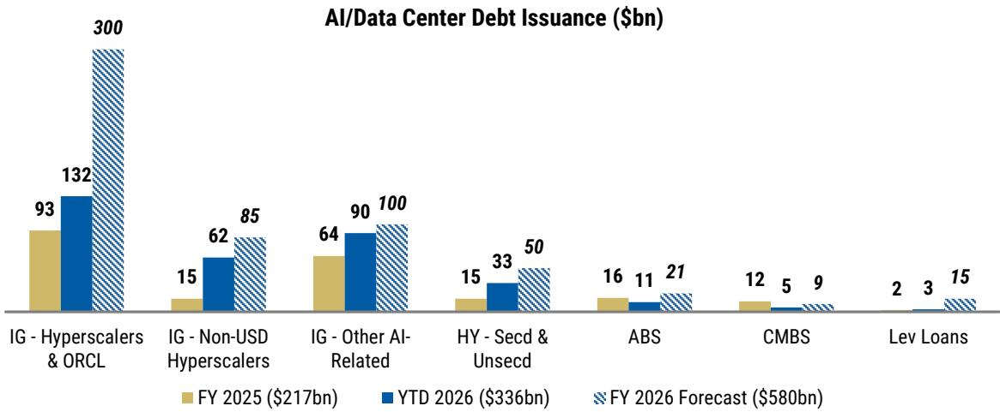

# 地方反对意见成为AI基础设施建设的主要风险，而非技术或资金问题

据估算，2025年约有1560亿美元的数据中心项目被取消或推迟。仅2026年第一季度，又有1300亿美元的项目加入这一名单。这些并非工程失败、资金短缺或AI需求意外下降所致，而是市场低估的一股力量的直接结果：有组织的州及地方层面对数据中心建设的政治反对。据一家全球性投资银行预测，2026年AI基础设施建设的资本支出将达到8770亿美元，如今这一建设进程必须经过市政厅、区划委员会和州立法机构的审议。问题已不再是美国能否建设人工智能基础设施，而是在哪里建设、以何种成本建设、以及按照谁的条件建设。

能源政治历来对大型基础设施项目至关重要。2026年的变化在于反对声浪的速度和广度。在政治格局各异的州——如民主党占相对优势的纽约州、共和党占相对优势的佐治亚州、以及两党分治的密歇根州和宾夕法尼亚州——都出现了暂停建设的提案。这种模式是跨党派的，而非意识形态驱动的。社区并非普遍反对数据中心，但它们在当前开发条件下越来越不愿意接受这些项目。对读者而言，风险并非全国性的数据中心禁令，而是逐个项目推进中的摩擦，这种摩擦会拉长时间线、推高成本，并重塑整个AI生态系统的地理和财务架构。

这并非暂时的监管波折。2026年5月的消费者情绪数据显示，自追踪以来首次出现更多美国人支持暂停数据中心建设（约45%），而非支持在扩大能源供应的同时继续建设（约38%）。约半数受访者认为AI数据中心对电价和电网产生了负面影响。对水价和环境影响担忧紧随其后，约为45%，且仍在上升。数据中心开发商在最初AI投资热潮中所享有的政治顺风正在转变为逆风，且转变速度之快超出了行业调整选址和许可策略的能力。

## 多数暂停是暂缓而非禁令，但暂缓对资本部署有复合效应

仔细审视立法格局会发现一个关键区别。绝大多数拟议的限制是临时暂停，而非永久禁令。特拉华州的SB 353提案建议对能够使用100兆瓦或以上的数据中心实施暂停至2027年1月。纽约州的A11560法案（已获立法机构通过）对大型数据中心许可证实施为期一年的暂停。弗吉尼亚州的HB 1515法案将禁止地方最终批准，直至并网请求得到满足或2028年7月。这些措施旨在为研究争取时间，而非彻底扼杀该行业。

然而，暂停对市场的影响并非由其法律期限来衡量，而是由其给多年期资本配置决策带来的不确定性来衡量。一个数据中心从概念到运营可能需要三到五年时间。在弗吉尼亚州这样的关键州——该州拥有全球最集中的数据中心容量——一年的暂停不仅仅是将项目推迟十二个月，它迫使开发商重新评估整个项目组合中的土地收购、购电协议、设备订单和融资结构。多个州级暂停（即使是临时性的）的复合效应，是整个行业资本成本的结构性上升。

这些暂停的政治地理分布与其时间安排同样重要。提案大致均匀地出现在民主党占相对优势、共和党占相对优势以及两党分治的州。这并非蓝州现象。南卡罗来纳州、俄克拉荷马州和南达科他州都曾出现暂停法案，有些虽未通过，但提案本身已表明支持无限制数据中心开发的政治联盟正在跨意识形态光谱上瓦解。开发商不能再假设亲商的共和党立法机构会不加审查地批准项目。这个问题已经地方化，而地方政治本质上比国家政策框架更难以预测。

## 居民电价担忧是最具政治影响力和经济倒退性的风险因素

反对数据中心建设的叙事常以环境问题为框架，水资源消耗和废热确实是值得关注的问题。但推动公众反对的较强大单一因素是认为数据中心推高了居民电费。这种看法有其区域经济现实基础。在数据中心密集的市场，特别是南大西洋地区和北弗吉尼亚州，居民电价上涨速度明显快于全国平均水平。批发电力价格更高，输电限制更紧。

宏观层面的影响并非全国性的电价突然飙升。报告预测全国居民消费价格指数中的电力部分中期内同比将稳定在4%至5%，相对于疫情前趋势有所上升，但并非灾难性的。危险更为隐蔽。电价承受力压力将是不均衡且具有倒退性的，集中在数据中心负荷增长最快、输电基础设施最难以吸收新需求的地区。这些地区的选民正是出现在区划听证会并联系州议员的人。政治反馈循环是直接的：数据中心推高当地电价，居民抗议，立法者提出暂停，开发商面临延误，进而进一步推高成本。

这种动态形成了一个自我强化的循环，行业无法仅通过提高效率或加快建设来打破。社区的担忧不仅关乎电价的相对水平，还关乎谁承担数据中心所需的电网升级成本。当一个超大规模设施需要500兆瓦的新容量时，电力公司必须建设输电线路、变电站和发电资源。这些成本被分摊到整个费率基础中。居民用户即使从未使用过一千瓦时用于AI训练，也会看到账单上涨。成本分配这一政治问题，而非电力可用性这一技术问题，正成为制约因素。

## 开发商将越来越多地转向现场发电，重塑电力设备供应商的竞争格局

围绕电网并网的政治和监管摩擦正推动数据中心获取电力的方式发生结构性转变。报告识别出到2028年约38吉瓦的潜在电力缺口。在某些地区，并网时间线已超过五年。对于面临暂停、社区反对和电网瓶颈的开发商而言，合理的应对措施是至少部分电力需求绕过电网。

现场发电并非小众解决方案。它正成为新建数据中心设计的核心组成部分，特别是对于无法等待输电升级的超大规模和AI训练设施。这一转变对相关公司有直接影响。提供燃料电池、天然气发电机以及用于表后应用的太阳能加储能解决方案的公司，有望随着数据中心运营商将电力供应内部化而受益。报告特别指出，一部分清洁技术和电力设备公司可能成为这一趋势的受益者。

对观察者而言，战略启示在于政治反弹并非均匀地损害所有与数据中心相关的公司。它在生态系统中创造了赢家和输家。拥有部署现场发电的资产负债表和技术能力的开发商，将比依赖公用事业规模并网的开发商具有竞争优势。公开交易的托管房地产投资信托基金（REITs）通常运营较小规模的设施，并为广泛的客户群提供关键基础设施，它们相对不受政治反弹的影响，因为其项目规模较小，且更融入现有的城市和郊区环境。而引发最多反对的超大规模AI训练园区，也最容易受到延误和成本超支的影响。

## 融资生态系统面临矛盾：短期发行压力与长期供应减少

数据中心反对意见对信贷市场的影响比权益市场更为微妙。短期内，AI生态系统推动了2026年几乎所有增量公司债券的供应。如果开发商为应对未来监管障碍而提前进行资本支出，发行压力在改善之前可能会进一步加剧。市场已经在吸收来自超大规模企业、数据中心REITs以及为电网升级筹集资金的电力公司的大量债务。

然而，从中长期来看，持续的政治反弹可能会减少总投资需求。如果项目被推迟或取消，相关的融资需求也会消失。这为信贷读者创造了一种反直觉的动态。数据中心建设放缓最终将减少公司债券市场的供应，这可能对利差形成支撑。但从当前高发行环境向低发行环境的过渡不会平稳，其特点是市场在定价中计入项目延迟可能性增加时的波动性。

对于证券化信贷而言，情况更为清晰。由运营中的数据中心支持的现有资产支持证券（ABS）和商业抵押贷款支持证券（CMBS）交易相对不受早期项目面临的政治挑战的影响。新建设放缓实际上可能通过降低关键再融资窗口前供应过剩的风险来支撑这些证券。数据中心债务领域增长迅速，随之而来的是对超大规模企业信用质量的集中敞口。任何减缓建设步伐、降低新发行速度的延迟，都可能被现有证券化债务的持有者视为利好，即使这会给更广泛的AI叙事带来逆风。

## 应对有条件建设的决策框架

最可能的结果既不是数据中心建设停止，也不是不受限制的扩张，而是有条件的建设：只有在开发商在社区利益、环境绩效和成本分摊方面做出有意义的让步后，项目才能推进。观察者需要一个框架来区分哪些项目和公司能够驾驭这种环境，哪些不能。

第一个筛选因素是项目规模和地点。在成熟市场中的较小规模托管设施，面临的反对少于在未开发地区的超大规模AI训练园区。政治风险溢价最高的是那些位于没有数据中心开发历史地区、规模超过100兆瓦的项目。应评估一家公司的项目管线是集中在高风险辖区，还是分散在政治动态各异的多个州。

第二个筛选因素是电力策略。已获得现场发电能力（无论是通过燃料电池、天然气还是太阳能加储能）的公司，相对于依赖公用事业并网的公司具有结构性优势。能够为相当一部分电力需求绕过电网，可以减少对监管延迟和社区因电价影响而反对的风险敞口。

第三个筛选因素是社区参与。报告强调，社区利益和地方经济权衡正变得越来越重要。主动提供社区协议、基础设施成本分摊和环境绩效承诺的开发商，比将反对视为诉讼问题的开发商更有可能获得许可。将社区关系作为核心运营能力（而非公关事后考虑）来投入的公司，将在项目执行中具有竞争优势。

第四个筛选因素是资产负债表灵活性。面临多年延迟的项目，要求开发商具备财务能力来吸收持有成本，而不会触发契约违约或再融资困境。高杠杆且项目管线集中的开发商最容易受到暂停和许可延迟的复合效应影响。

## 地缘政治支撑是真实的，但不应被高估

一个自然的问题是，美国在全球AI竞赛中的竞争地位是否会压倒地方反对。如果联邦政府将数据中心视为国家安全和经济竞争力的关键基础设施，它是否会介入以取代州和地方暂停？报告认为，这一地缘政治现实使得联邦政府不太可能实质性阻碍建设，但这并不能消除摩擦。

联邦政府可以激励、补贴和简化许可流程，但如果没有地方合作，它无法在私人土地上建设数据中心。国家AI雄心与地方生活质量关切之间的紧张关系并非美国独有，但美国的联邦制赋予了地方社区比更集权的政治体系更多的抵制工具。风险并非美国因联邦政策决定而落后于其他国家，而是数百个地方性延迟（每个单独看都是合理的）的累积效应，产生了一个比AI投资假设更慢、更昂贵的全国性结果。

这是对观察者而言的核心战略洞察。数据中心建设面临的不是一个单一的政治障碍，而是一个分布式、去中心化且高度响应的政治生态系统，这个系统学会说"不"的速度快于开发商学会适应的速度。2026年预计的8770亿美元AI资本支出并非板上钉钉，它取决于行业能否解决一个尚未完全承认、更不用说解决的政治问题。认识到这一现实并相应调整策略的公司和观察者，将比那些假设建设将按原轨迹进行的同行处于更有利的位置。

*仅供参考。部分内容可能基于源材料通过AI辅助生成、翻译、总结或编辑，可能存在遗漏或错误。请独立核实。本文不构成任何专业建议。*

仅供参考。部分内容可能基于源材料通过AI辅助生成、翻译、总结或编辑，可能存在遗漏或错误。请独立核实。本文不构成任何专业建议。

