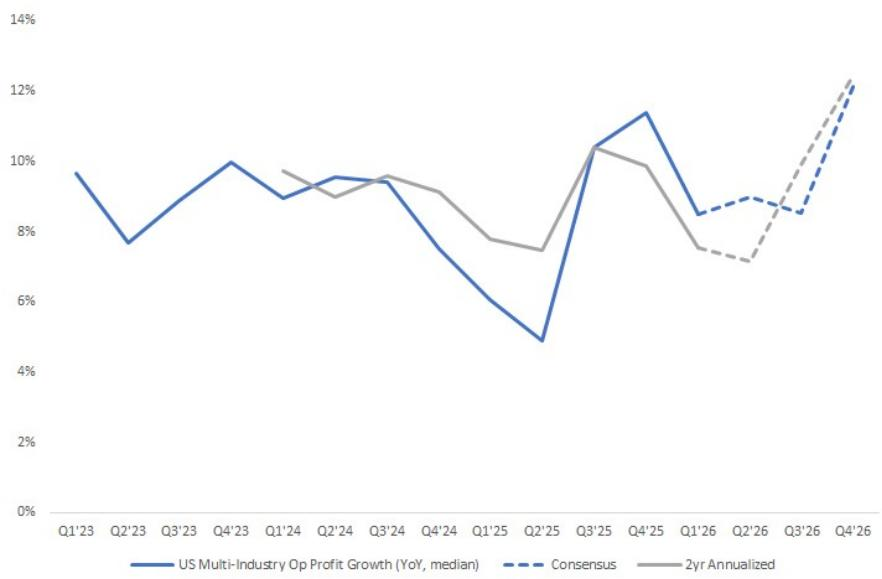
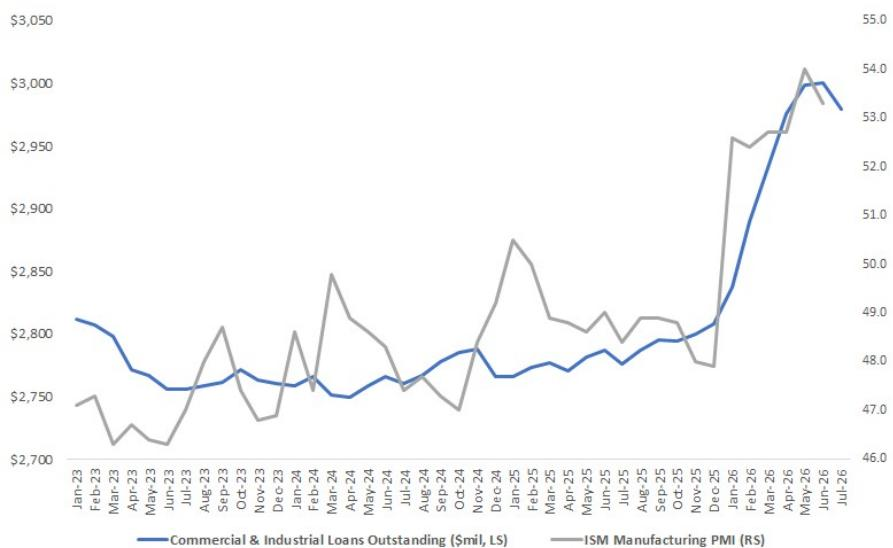
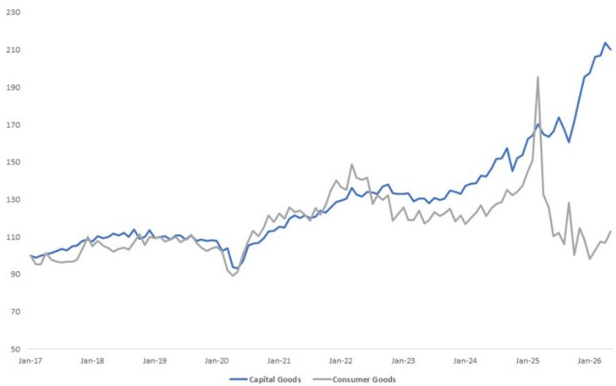

July 15, 2026 11:08 AM GMT

Multi-Industry | North America

# Q2'26 Preview: Following 2H Volumes into 2027

Note includes detailed write-ups and modeling on company-specific set-ups into Q2 EPS along with key macro debates. We connected with nearly all of our Corporates in June.

Exhibit 1: US multi-industry median operating profit growth: Chart highlights the conservative Q2 bar against an easy comp, but the bar gets more difficult into 2H. We think this will lead to bifurcating 2H revisions & thus equity performance – with US Industrials trading at historically high multiples, the equities need revisions to drive further upside

  
Source: MS, Visible Alpha

We continue to call for broad Q2 beats with Corps providing conservative quarterly guides into improving macro data (link) – but the market is now fully on board with this call, bidding US Industrials to a 2 SDEV premium vs history, which complicates the set-ups as revisions are now both anticipated by the market & required to drive further equity upside. For this reason, we view 2H guides as the KPI this EPS season. While a rising cyclical tide + potential channel build will lift all US Industrial equities above Q2 guidance, the bar gets tougher into 2H, and we see bifurcating volumes on channel dynamics – this is what drives our stock selection. We are most constructive on equities where we believe the market will exit Q2 EPS more confident on sustained strength into 2027: ROK, RAL, ETN, AME, TT, HUBB & PH. And as we always prefer equities where we see outsized EPS upside (GWW & WSO). We are cautious on those where we see 2H downside risk to EPS / organic (EMR, HON, OTIS, ALLE) and those where YTD multiple expansion is extended vs post Q2 revisions / changes in 2027 growth outlook (CARR, LII, SWK, DOV) or those tied to sluggish end markets in a world of ISM inflection (OTIS, ALLE). We

<table><tr><td colspan="2">MS &amp; CO. LLC</td></tr><tr><td colspan="2">Christopher Snyder, CFA</td></tr><tr><td colspan="2">Equity Analyst</td></tr><tr><td>Chris.Snyder@morganstanley.com</td><td>+1 212 761-4470</td></tr><tr><td colspan="2">Brandon Knutson</td></tr><tr><td colspan="2">Equity Analyst</td></tr><tr><td>Brandon.Knutson@morganstanley.com</td><td>+1 212 761-4168</td></tr><tr><td colspan="2">Toby Okwara</td></tr><tr><td colspan="2">Equity Analyst</td></tr><tr><td>Toby.Okwara@morganstanley.com</td><td>+1 212 761-1693</td></tr><tr><td colspan="2">Christine Yao</td><td></td></tr><tr><td colspan="2">Research Associate</td></tr><tr><td>Christine.Yao@morganstanley.com</td><td>+1 212 761-4193</td></tr></table>

## MULTI-INDUSTRY

North America
Industry View
Attractive

For analyst certification and other important disclosures, refer to the Disclosure Section, located at the end of this report.

discuss each equity in detail below.

Bifurcating short-cycle volumes into 2H: After turning constructive on US short-cycle in our 2026 outlook (Layering in Cyclical Torque), we continue to believe the NTM trajectory is higher w/ leading indicators holding firm (link) and US Reshoring tailwinds blustering (link). With that said, we do see risk that the rate of improvement moderates into Q3 on potential channel burn following signs of build in the spring (IEEPA rollback + Middle East conflict bringing supply-chain risk signaling higher price). While we would view this slowdown as a transitory speed bump rather than a shift in cycle trajectory, the challenge for US Industrial equities is that group is trading at historically high multiples and the bar to drive positive revisions gets tougher into 2H. To this point, US multi-industry median organic growth is modeled 5-6% in 2H above 3-4% in 1H despite tougher comps. We believe the equities will trade on 2H revisions and expect the market will be critical on those where the Q2 growth inflection is coming at the expense of 2H as this suggests the turn was driven by channel build rather than improve demand. Similarly, we see multiple compression risk on equities where Q2 is viewed as peak organic growth.

Exhibit 2: We view weekly US Commercial & Industrial lending as a real-time gauge of Industrial activity and the positive rate of change began to plateau in June before stepping back in the first week of July. While we believe the NTM trajectory is higher, we see scope for near-term slowdown in rate of improvement following signs of spring channel build

  
Source: MS, Visible Alpha, US Census Bureau

Still Industrial > Consumer: Within US short-cycle, we continue to call for a bifurcated recovery w/ a preference for Industrial > Consumer (link) – while both sides will show Q2 momentum / improvement, we are more confident in the duration of Industrial strength into 2H. While the sharp YTD price action is supporting the 2H pickup in organic growth + margin expansion for our Industrial coverage, this same inflation brings headwinds for the consumer, which ultimately comes at the expense of purchasing power. Given this backdrop, it is unclear why Consumer demand is materially better today vs 3-6mo ago; Disposable income

continues to decelerate, Savings rates have further declined to new historical lows and real wages have turned negative on the leading edge.

Exhibit 3: Something has Changed – Chart below tracks US imports of Capital Goods vs Consumer Goods (indexed), the leading-edge bifurcation is a big disconnect vs history and one that supports our call that US Reshoring has flipped the cycle. Higher consumption is no longer the driver of US Mfg capex spend, it is now tariff mitigation – a source of investment that is unique to the US market given its \$1.2T trade deficit

  
Source: MS, US Census Bureau

Price is Back: Our Q2'26 Industrial Distributor survey signaled that suppliers are pushing price at the fastest rate since 2022 and distributors are growing more confident that they can remain price / cost positive into the higher supplier asks. This matches the movement in ISM Price index & our June Corporate convos, which struck a more positive tone on price, likely a function of improved demand & expanding lead times. This not only supports the 2H organic ramp but also positioned for near-term upside surprise on margins + price / cost. Longer term, we view the price intake as a future profit pool with one-sided optionality (More Price, More Money). Even if the price actions are not profitable today, the revenue can turn to profits over time as tariff mitigation / commodity price normalization reduces the cost burden and companies hold price. And if commodities rise further, the companies will just push more price – that is one sided optionality.

Still Cautious on Middle East, Source of Downside Revisions: As published since mid-March (Wary of Middle East Cold Start), we are cautious on both the timing & magnitude of the Middle East recovery and think Corporates have embedded overly optimistic assumptions for the region in their 2026 guides – a call that proved correct into Q1 EPS, and we see a similar set-up into 2H with guides calling for recovery in a still highly uncertain environment (Still Wary of Middle East Turn). A risk into 2H for EMR, OTIS, HON, TT, JCI & IR.

Data Center: While we remain constructive on the data center equipment complex into Q2 and expect another strong order print, comps turn sharply more difficult into 2H. The market will closely scrutinize 2H orders due to both skittishness on data center capex duration but also uncertainty on content shifts w/ architecture changing rapidly. Best positioned are those with line of sight into cont'd backlog build and those with less debate on future content (VRT, ETN). While data center demand + capex remains firm, orders could compress over the NTM into more difficult comps on shifting lead times. Those where lead times are most extended are best positioned to sustain order strength through 2H (Electrical > Chiller). The urgency to lock up capacity is likely influenced by perceived compute ROI (both end user & capex spend) – questions remain on both and calculations can shift quickly, which can impact cadence of orders to equipment providers.

Resi HVAC: We remain negative on Resi HVAC into 2H (link) – while Q2 is poised for volume upside, we see EPS offsets on softer margins w/ LII + CARR modeled for outsized margin ramp into tariff / inflation cost headwinds. More importantly, we believe Q2 volume upside is due at least in part to channel build ahead of latest price increases, which could come at the expense of 2H volumes. While weather always remains the wild card, we struggle to find the underlying driver of demand improvement – consumer remains pressured, resi construction remains soft and the price of the unit has gone higher again. We also push back on the pent-up demand narrative; 2024-25 averaged 8.5M units, which comes in above the 2018-19 8.0M runrate. In addition, the market shipped closer to \~10M units in 2021-23 on Covid tailwinds, a potential pull forward that must be absorbed into 2H. WSO remains our preferred Resi HVAC exposure and model material EPS upside into Q2 - Q3 on both firmer gross margin & better volumes.

## Set-ups for the individual equities, more details within:

ALLE (=/-): Model Q2 operations just in line w/ slightly firmer Americas margins offset by Int'l downside on cont'd ERP headwinds. See Q3 downside on: 1) Americas margins which are modeled for an outsized sequential build into margin dilutive pricing; and 2) forecasted sharp Int'l recovery on both topline + margins into a more difficult comp. We think the market will exit Q2 concerned on F'27 downside, which is forecasted for volume recovery on unclear cycle drivers. The sluggish & slow-moving nature of non-res becomes relatively less attractive in an ISM recovery, and we do not think that narrative will change during Q2 EPS.

AME (+): See scope for organic upside in Q2 and a raise to 2H as strong orders begin to convert. While we would not count on another 20%+ order print for Q2, we expect sustained DD organic growth behind AME attractive end market exposure + cont'd short-cycle momentum. We believe strong 1H backlog adds positions AME to deliver HSD organic in 2H and think the market will exit Q2 EPS thinking HSD organic can be sustained into 2026. Margins screen for upside in Q2 with no sequential uplift despite higher volumes + cost synergies coming through on FARO. Anticipate upbeat commentary on Indicor EPS accretion, ability to drive cost synergies (10-15 PP margin uplift) and dry powder for cont'd M&A.

CARR (-): While Q2 positioned for topline beat on firmer Americas Resi + Light Commercial volumes, we see potential offset on softer Americas margins which are guided for a sharp ramp into cost inflation and think this could lead to an EPS print below buyside bogeys. The YTD re-rating in CARR shares + Investor convos signal an expectation of 2H positive revisions, but we think the magnitude of the raise could disappoint. We believe 1H Resi strength is driven by channel build, which becomes a headwind into 2H. While the market is excited about CARR Data Center opportunity and rightfully so, we see risk of margin headwinds tied to the ramp – both into 2H'26 on the topline ramp (\$0.5B in 1H vs \$1.0B in 2H) and lasting into 2027-28 on required investment (capacity, innovation, field techs).

DOV (=/-): Anticipate another strong order Q on short-cycle momentum + lead time extension for key Data Center exposure (brazed plate heat exchangers). While backlogs are extended vs history, orders have been strong since Q4'25 and would think these convert in Q2 – Q3, positioning DOV for HSD organic vs MSD forecasts. The concern is that mix + growth headwinds could mute the magnitude of both Q2 upside + 2H revision potential and the market is anticipating a raise. The business is already modeled for 5-6% organic and 35%+ incrementals for 2H – note Q3 has a tough margin comp while the organic comp turns more difficult in Q4. As the market shifts its gaze to 2027, we see concern on durability of strength + difficult 1H order comps.

ETN (+): See scope for an Q2 beat on firmer Americas organic, margins + Boyd contribution where we believe guidance set a conservative bar. The Q2 Americas sequential margin is not as difficult as it seems given strong March exit rate and for the first time in a year, see Americas beating on both organic growth & margins in the same Q. While we do see cont'd Americas margin risk into 2H, we think it will become clear to the market that there is no 2H EPS risk and that will allow market to shift its focus to 2027 and better appreciate the step change higher in ETN organic growth. We see DD pro forma organic growth in 2027 and beyond, a level that argues for a multiple over 30x. We see scope for Q3 organic in the low teens range – a mark that does not include growth accretive Boyd but does include growth dilutive Mobility – this should highlight the F'27 growth potential to the market. Between incremental price, an easier comp and volume unlock, we see Americas organic in the high-teens range for Q3.

EMR (-): While we do expect F2H organic to lift above the 1% mark generated in F1H, we continue to model downside vs the guide, which calls for a ramp to 5-6% in F2H. The high F2H bar will keep EMR in the revision laggard category – we model FQ3 in line as firmer margins offset the organic downside but model FQ4 EPS below. Typical seasonality calls for EMR margins to decline sequentially into FQ4 – F'25 is the outlier on tariff impact (FQ3) and recovery (FQ4) but FQ4'26 is modeled up \~40 bps Q/Q. We also see downside risk to FQ4 organic +6% as the comp turns more difficult and the guide calls for Middle East headwinds to ease, which may not be the case. Anticipate another Q of healthy \~MSD orders and while this could signal positive rate of change into F'27, F2H revisions remain a near-term overhang.

FPS (=/-): Model FQ4 EBITDA modestly above w/ firmer topline offsetting softer margins. While we do expect FQ4 to show nice sequential lift to \~25.0% w/ tailwinds from project mix, we see cont'd growth headwinds w/ FPS prioritizing speed + share gain. The focus will be on F'27 guidance, which we anticipate to be \~\$2.1B of topline and \~100 bps of margin expansion (\~24% EBITDA) which nets to EBITDA in line w/ Consensus modeling. The buyside will likely see upside to the guide on strong F'26 orders and FQ4 exit rate margins. The concern into the print is that the positive surprise being FQ4 orders has already been communicated while negative surprise is the margins and conversion of these orders which comes through in the F'27 guide.

FTV (=): Model screens for upside into both Q2 and 2H but lingering software concerns and muted to no growth 2026 organic exit rate will keep a lid on valuation, particularly in a world where Industrials are cycling up. Q2 topline modeled flat Q/Q screens conservative – while there is a \~150 bps days headwind, this should be more than offset by typical seasonality \~3% and Fluke cycle momentum. Into 2H, the model screens for upside on margins + buyback potential which is not currently in the guide. Firmer Q2 organic provides scope for a 2H organic raise and an improved exit rate could boost sentiment on 2027 prospects. With that said, we see less FTV revision potential compared to those with more cycle torque and think the market will prefer equities with clearer drivers of 2027 strength.

GTES (=/+): Positioned for sharply positive rate of change into Q2 – after Q1 registered a 3% organic decline, we see scope for Q2 organic in the \~4% range. The sharp ramp is a function of Q1 ERP + days headwind shifting into the rearview, an easier comp, firming industrial cycle and potential ERP catch-up. See scope for MSD organic in 2H w/ tailwinds from incremental price action. While MSD organic is an attractive mark vs GTES valuation, it does not drive upside vs the guide already modeling 4-5% for 2H. The reason to be constructive is that GTES could also see secular tailwinds layer on top of the cyclical lift, supporting sustained MSD growth into 2026 – secular tailwinds include Mobility + Data Center opportunity. While GTES multiple is low relative to broader short-cycle, the equity has re-rated sharply YTD (20%+), which signals an anticipation of revisions. We lean positive and are drawn to the sharply positive rate of change and low multiple vs peers, both of which highlight recovery torque.

GWW (+): Model another sizeable EPS beat for Q2 – similar to our calls into Q4 + Q1 EPS, we see upside led by firmer GM% but for Q2 we also think topline comes in ahead. Starting with GM – Q2 is modeled down \~100 bps Q/Q, 60 bps of which mgmt. attributed to typical seasonality. And while the long-term avg calls for a 60 bps GM decline into Q2, we see a more muted step down into Q2'26 simply because Q1'26 saw a more muted sequential increase for HTNA and the two are tied together (January ahead on price / cost, this is given back in Q2). GWW GM% could also benefit from mix after the company lowered price on the GM accretive private-label brands while raising the price of GM dilutive national accounts. We also see Q2 topline upside – April was north of 13% but Q2 is modeled for just 11-12% on unchanged May – June comps. We think the magnitude of Q2 upside will allow GWW to raise the FY'26 guide even against 2H Monotaro headwinds (1H inventory build on Middle East concerns, FX headwinds).

HON (=/-): While 2H is positioned for a pickup in organic growth vs the muted 1% generated in 1H (Middle East headwinds), we see a tough bar that is difficult to deliver revisions against w/ guide calling for a ramp to 3-5% in 2H. The ramp looks particularly difficult when accounting for HON outsized Middle East exposure where we see lingering 2H headwinds. Q3 margins of \~21% screen difficult but uncertainty remains on pace of stranded cost takeout + quarterly cadence of below-the-line modeling. The step up to 22% margins in Q4 screens less difficult following divesture of margin dilutive Warehouse + Scanners business lines. The 2H EPS bar

seems more achievable than organic growth but the cost side of the model is more clouded following the separation. 2027 positioned for strong EPS growth on cost stranded cost take-out but ability to achieve longer-term targets need to be proved out, specifically MSD organic growth (4-6% target, including 3-4% price). Relative under exposure to top Industrial mega themes (AI Data Center + US Reshoring / ISM recovery) will keep a lid on valuation.

HUBB (=/+): Model modest Q2 EPS upside on a topline beat along with better-than-feared sequential margin ramp. Between the organic momentum + addition of NSI Industries (20-25c EPS in 2H, MSe) – we expect a raise to FY'26 EPS guide and anticipate organic growth tracking closer to the high end of the 6-9% range. We think the positive surprise into Q2 EPS is that organic growth could accelerate sequentially into both Q2 and Q3 behind cycle momentum + incremental price action. With non-res starting to see green shoots, Aclara benefiting from easier comps and sustained strength in Transmission + Substation, we see HUBB positioned for 10-11% organic in Q2-Q3, which would signal upside vs-6% modeling for F'27. The concern on the model is margins with Q2 modeled for a \~400 bps sequential ramp into margin dilutive price action. We think Q2 margins could come in better than feared and suspect the incremental price could be driving price / cost recovery for the Electrical segment (vs holding price / cost neutral) – Electrical Q1 margins were down yoy on DD organic growth (sequentially OP down \$20M vs sales up \$10M).

IR (=/+): While we expect Q2 results just in line and do not anticipate a FY'26 raise, we think orders + commentary will highlight emerging short-cycle tailwinds and reduce concerns on the 2H organic ramp. Specifically, we see scope for Q2 orders in the 4-5% range – a sharply positive rate of change from the -3% posted in Q1 due to easier comp, cycle momentum and potential recovery on the \$40M Middle East orders deferred out of Q1. We think this will push the market to view 2H ramp as achievable rather than difficult, which should boost IR valuation off current historically low levels. With that said, a cont'd preference for US short-cycle exposure + larger growth numbers elsewhere should keep IR multiple below historical levels.

JCI (=/-): Expect another strong order Q led by Data Center momentum while Americas margins serves as source of upside in the model. Americas FQ3 OM is modeled up just \~50 bps Q/Q, below the typical \~200 bps step up on higher volumes (FQ3'25 the outlier on tariff headwinds). We do see modest sequential headwinds from Americas capacity ramp – a headwind that first emerged in FQ2 but positioned JCI for firmer incrementals into F'27. We model FQ3 downside for EMEA segment on cont'd Middle East headwinds (flat organic, 13.5% margin) – a headwind that likely remains in place for FQ4 and mutes positive revision potential. Debate into F'27 will be on the conversion of F'26 order strength w/ signs that lead times could be extending – Bulls see \~50% order rates as sign of upside vs Americas +HSD in F'27 while Bears view orders to be overstated on lead time extension w/ limited upside to drive revisions vs HSD organic target. JCI appears well positioned on Data Center content behind Air Handling + CDUs but we think the market will by hyper-sensitive on F2H orders into more difficult comps due to concerns on the outlook for chiller content. While JCI order comps turn difficult 1 Q later than others (Dec vs Sept), we would expect NTM volatility on ever expanding project size.

LII (-): While Q2 is positioned for organic beat w/ upside on both HCS (Resi) and BCS (Light Commercial) segments, we see offset on Q2 EPS via softer margins and model material EPS downside into Q3. With our US multi-industry coverage positioned to deliver broad Q2 upside and 2H volumes the KPI this EPS season, we see a negative set-up. For Q2, we see BCS at +13% organic (vs Cons +7%) and also see scope for HCS upside vs Cons -4% w/ communication that HCS volumes could turn positive at the end of Q2 or Q3 (vs MSD+ price / mix for Q2). This would imply a very significant seasonal beat for HCS (+53% Q/Q vs typical 40-45% ramp) and is likely aided by channel build ahead of well telegraphed + sizeable Q2 price action. This dynamic makes it very unlikely that HCS revenue grows sequentially into Q3 as currently forecasted by consensus – the only year HCS grew topline into Q3 was F'24 on the start of refrigerant pull forward. We also see risk of channel destock into Q3 on expectation of price give back following 232 step-down in June (came right after channel build on expectation of higher price). We see downside to both HCS + BCS margins into Q2, which call for outsized ramp into cost inflation. Which HCS margins could approach flattish in Q3 on better volumes, we see risk that BCS margins turn negative yoy vs difficult price / cost comp.

MMM (=/+): While Q2 organic upside is well appreciated by the market following mgmt. intra-quarter commentary, we think the under-appreciated source of upside in the model is margins. The upside in organic growth is being driven by firmer price realization, which signals better margins, particularly should Petrochem deflation show through into 2H. Incremental source of margin upside include better than feared Consumer Electronics sales (margin accretive) and return to positive volumes which should allow self-help initiatives to show through. We peg Q2 organic at 3.7% and expect 2H will remain north of 3% as Q2 order momentum supports Q3 organic, while 1H Data Center orders should convert in Q4. The negative angle is that Q2 is peak organic growth and the drivers of sustained improvement are unclear given outsized Consumer / Resi exposure. We view 3%+ to be a very healthy mark for MMM in the current backdrop and positions for positive rate of change into 2027 on potential consumer rebound / Data Center opportunity. Positioned for 2026 revisions on margins + contingency removal and supportive profit bridge into 2027 with PFAS wind down +Tariff headwinds shifting into rearview.

OTIS (-): While it is difficult to argue for further multiple compression following the sharp LTM de-rating, however, we see risk of negative revisions into 2H'26 – 2027. This is an outlier vs broader US Industrials and when combined with still sluggish non-res cycle momentum, we do not see catalyst for a near-term re-rating. We view Service margins as the source of risk in the model w/ the segment guided for sharp intra-year recovery to \~26% in Q4 vs just 23% in Q1. The rebound is primarily a function of price action – we see risk that price / cost initially steps back in Q2 with commodity / transport inflation leading OTIS price realization. Into 2H, we see risk on realization from the “micro pricing” strategy as this depends on renegotiating existing contracts, which brings risk on both realization & volume elasticity. We also see 2H risk on Middle East where we continue to expect a slower recovery, a slower resolving conflict risks \$5M+ of quarterly operating profit into 2H. We view Service margins as the KPI for OTIS into EPS and if 2H needs to be lowered, it is unlikely

OTIS sentiment improves over the near term.

PH (=/+): See a constructive set-up for PH into FQ4 EPS – while we think Aero organic upside is well appreciated, we see positive surprise for North America Industrial following FQ3 disappointment – and a firmer FQ4 exit rate will make it more easy for the market to call “conservative” on F'27 guidance, supporting incremental buyers post EPS. Our understanding is that NA Industrial would have done a \~26% margin in FQ3 ex weather headwinds, which supports outsized sequential ramp into FQ4 and signals upside vs Cons 26.8%. While NA Industrial orders did not improve sequentially in FQ3 vs FQ2, our understanding is that short-cycle orders did improve Q/Q, which signals better conversion into FQ4 and positions for upside vs Cons +3% (unchanged vs FQ3). While we see very slight downside to F'27 guide on lower Int'l organic, we think the market will see upside on M&A contribution which will be layered into numbers intra-year F'27 + catch-up in NA Industrial organic vs orders (NA Industrial LTM Organic +1.5% vs LTM orders +5%). Expect Industrial orders to hold HSD growth in FQ4 on NA cycle momentum + easier Int'l comp.

RAL (+): Positive set-up, positioned for Q2 beat and FY raise. Q2 screens conservative on topline w/ seasonality modeled below the typical ramp despite Q1 order inflection, which drove outsized book-to-bill for the Q (T&M 1.2x and leans short-cycle). The guide calls for a return to MSD organic in 2H'26 – 2027, we see sustained upside and think the market will exit Q2 results more constructive on the outlook into 2027. PacSci (Missiles, Munitions & Space) does not appear to be slowing any time soon and Qualitrol (Utility sensors) is positioned for NTM acceleration after Q1 posted just 1% organic despite record orders due to supply chain disruption in the Q. In addition, Semi T&M is positioned for NTM inflection on improving orders + easing comps – the category was down HSD in Q1 due to tough project comp (up mid teens ex comp), which goes away in Q4. Sensing & Safety margins are the biggest point of uncertainty in the model w/ mgmt. talking to “mid to high 20s” after posting 28.4% in Q1 – while the margin headwinds for the segment are real, we are not sure how much comes through in Q2. Relative growth between margin accretive Qualitrol and margin dilutive PacSci should narrow and while Pacsci margins will compress moderately over time (from \~20% to high-teens, MSe), this is a function of “Surge” demand programs, which did not come through in Q2. Longer term, these “Surge” margin headwinds (TINA) would only be accompanied by a pickup in PacSci volumes, which is not currently being modeled. While RAL shares are trading at a premium vs its own (short) history, we continue to find valuation attractive vs peers and think the YTD rerating is well warranted on end market strength.

ROK (+): Positioned for material FQ3 upside on firm momentum + conservative modeling, and we expect another strong order print, signaling upside into F'27 and supporting ROK sentiment / valuation. FQ3 is guided for just \~2% sequential organic growth, below the typical 3-4% ramp despite outsized FQ2 book-to-bill (north of 1.10x) that leaned toward short-cycle products. Our understanding is that ROK orders strengthened as FQ2 progressed, supporting better FQ3 conversion. ROK guided FQ3 sales flat Q/Q with the 2% sequential ramp offset by Sensia JV dissolution – the guide suggests this well net to flat operating profit Q/Q. Beyond

the conservatively guided organic ramp, there is sequential mix tailwinds supporting operating profit – organic sales are converting at a \~50% incremental, while Sensia JV runs at roughly zero operating profit. FQ2 orders came in at \$2.5B on our math, and we expect sequential improvement on typical seasonality + cycle tailwinds – a runrate that signals upside to Cons F'27 revenue of \$9.5B. ROK Data Center story remains under appreciated and should continue to support orders + organic growth each Q. We continue to see a significant pipeline of self-help / efficiency initiatives, supporting incremental margins above the \~35% core level.

SWK (=/-): Model Q2 in line w/ slightly softer topline offset by modestly firmer GM %. T&O is modeled for a HSD sequential ramp, in line with typical seasonality but we see risk given the elevated Q1 starting point (\~MSD seasonal beat), which benefited from strong Outdoor pre-season volumes, potentially at the expense of Q2. New Craftsman product launches for 2H'26 should provide tailwinds into the back half but unclear if load-in boosts Q2. We remain cautious on the forecasted 2H ramp w/ unclear recovery drivers within T&O and Engineered Fasteners losing its growth driver on the CAM divest. While there are clear drivers of improved 2H GM % vs 1H (mix, better absorption, productivity savings rolling through the P&L), the ramp is significant, and we see risk tied to volume + inflation assumption. As such, we see a more difficult revision path for SWK relative to broader multis and a source of potential disappointment following YTD multiple expansion. We see risk in growing price competition into 2H post IEEPA rollback – note SWK guide calls for higher 301 tariffs to be reinstated on July 31 (raise vs 122), a source of potential price give back risk should tariffs stay at the lower, existing levels.

TT (+): Positive set-up w/ Q2 upside on Americas + APAC and expect another strong order print, boosting sentiment on 2H organic ramp and ultimately prospects on elevated growth into 2027. See scope for Americas Q2 organic above 6.5% consensus modeling on sustained C-HVAC momentum, easy Resi comp and signs of cyclical momentum within Transport – we think Americas Q2 organic could approach closer to 10% and with comps getting easier and C-HVAC backlog poised to convert in 2H, the market should see material upside to Q4 Americas exit rate organic of 11%... a positive signal with Americas F'27 modeled for just HSD organic. We expect another strong orders for the Americas and model a mid 20% mark – we expect another strong CHVAC order print into a more difficult comp on cont'd Data Center strength and positive rate of change elsewhere. Expect improvement on Resi + Transport orders w/ easier comps + cycle momentum. Asia screens as a source of upside in the model while we expect EMEA 2H to be revised lower on cont'd Middle East headwinds. See scope for modest Americas Qs OM upside (20 bps) and see better seasonal performance into 2H on improved Resi price / cost + more level loaded production.

WSO (+): Model material EPS upside into Q2 – Q3, driven by both firmer GM% and also topline upside w/ WSO facing easier comps vs industry benchmarks (lost 1H'25 share on quicker 454B pivot). WSO always leads on price / cost, and we would expect that to remain the case in Q2 on the latest round of OEM price asks – while the sequential step-up will be below the \~120 bps year-ago ramp as the price ask is smaller, Cons is setting a low bar at just +30 bps. We model \~40 bps upside vs Cons and see continued upside into 2H w/ price / cost tailwinds stemming from potential

OEM price negotiations following June 232 rollback (savings accrue to large buyers like WSO). Also note, WSO added an outsized level of inventory in the early portion of this year, which also supports price / cost. While WSO SG&A will start growing on improved volumes + general cost inflation (transport / fuel), we model rest of year opex below Cons following 2H'25 cost-out actions. We see sustained topline upside in 2H on the Jackson Supply deal close, which is not currently in consensus modeling.

VRT (=): Americas margin remains the clearest source of near-term upside in the model, positioning both Q2 and 2H for beats. The challenge for VRT equity on the day of EPS print is that the company no longer provides orders and positive market commentary is almost table stakes at this point in the cycle. So to improve sentiment / drive multiple expansion, the market will need to get more constructive on the 2026 organic exit rate momentum and what that could mean for 2027 revisions. But given the uncertainty around project timing (particularly for Int'l exposure), we think it will be difficult for VRT to materially raise the Q4 exit rate guide as it is already guided for sharp intra-year acceleration (Q1 +23% vs Q4 +37%).

## Table of Contents

## • 2Q26 Earnings Preview

\- Allegion (ALLE)

\- Ametek (AME)

\- Carrier (CARR)

\- Dover (DOV)

\- Emerson (EMR)

\- Eaton (ETN)

\- Fastenal (FAST)

\- Fortive (FTV)

\- Gates (GTES)

• W.W. Grainger (GWW)

\- Honeywell (HON)

\- Hubbell (HUBB)

\- Ingersoll Rand (IR)

• Johnson Controls (JCI)

\- Lennox (LII)

• 3M (MMM)

\- Otis Worldwide (OTIS)

\- Parker Hannifin (PH)

\- QXO Inc (QXO)

\- Ralliant (RAL)

• Rockwell Automation (ROK)

• Stanley, Black
